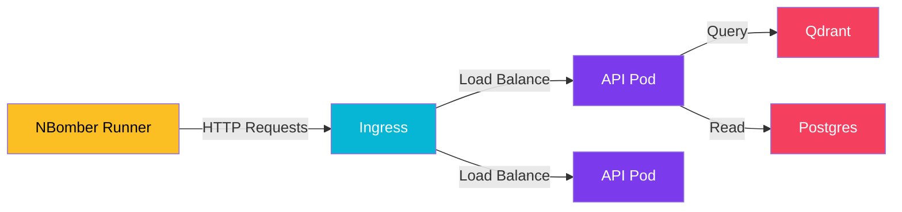

import Callout from '@components/Callout.astro';
import ImplementationNote from '@components/ImplementationNote.astro';
import CodeFile from '@components/CodeFile.astro';
import ExternalCite from '@components/ExternalCite.astro';

When I first deployed our microservices to Kubernetes, I had no idea where the system would break under load. Everything worked perfectly in development with a single user, but I had a nagging feeling that our vector search endpoint was going to be a problem. I decided to invest a weekend into proper load testing, and what I discovered completely changed how I think about performance optimization. The bottleneck was not where I expected, and without systematic benchmarking, I would have wasted weeks optimizing the wrong component.

## Introduction

"It works on my machine" is not a performance guarantee. As we move to a microservices architecture with NATS and Qdrant, we need to know: **Where does the system break?**

Does the API CPU spike? Does the database lock up? Does the memory leak?

**Why Benchmarking Matters:**
- **Capacity Planning**: Knowing how many concurrent users a single pod can handle.
- **Regression Testing**: Ensuring a new feature didn't slow down the core loop.
- **Bottleneck Identification**: Checking if the Vector DB or the API is the weak link.

### What We'll Build

We will create a stress test suite using **NBomber** (a .NET-native load testing framework) to hammer our endpoints.

<ExternalCite title="NBomber: Modern Load Testing Framework for .NET" url="https://nbomber.com/" author="NBomber" date="2024" />

## Architecture Overview


```mermaid
flowchart LR
    TestRunner[NBomber Runner] -->|HTTP Requests| Ingress
    Ingress -->|Load Balance| ApiPod1[API Pod]
    Ingress -->|Load Balance| ApiPod2[API Pod]
    ApiPod1 -->|Query| Qdrant
    ApiPod1 -->|Read| Postgres

    classDef primary fill:#7c3aed,color:#fff
    classDef secondary fill:#06b6d4,color:#fff
    classDef db fill:#f43f5e,color:#fff
    classDef warning fill:#fbbf24,color:#000

    class ApiPod1,ApiPod2 primary
    class Ingress secondary
    class Qdrant,Postgres db
    class TestRunner warning
```

## Section 1: Writing the Scenario

We want to test the "Search" endpoint, as it is the most resource-intensive.

<ExternalCite title="Performance Testing Guidance for Web Applications" url="https://learn.microsoft.com/en-us/previous-versions/msp-n-p/bb924375(v=pandp.10)" author="Microsoft Patterns and Practices" date="2007" />

```csharp
var httpFactory = HttpClientFactory.Create();

var searchStep = Step.Create("search_documents", httpFactory, async context =>
{
    var request = Http.CreateRequest("GET", "https://api.bluerobin.local/documents/search?q=invoice")
        .WithHeader("Authorization", "Bearer token");

    var response = await Http.Send(request, context);

    return response.StatusCode == 200
        ? Response.Ok(statusCode: 200)
        : Response.Fail();
});

var scenario = ScenarioBuilder.CreateScenario("search_load", searchStep)
    .WithWarmUpDuration(TimeSpan.FromSeconds(10))
    .WithLoadSimulations(
        Simulation.RampingInject(rate: 50, interval: TimeSpan.FromSeconds(1), during: TimeSpan.FromMinutes(2))
    );

NBomberRunner
    .RegisterScenarios(scenario)
    .Run();
```

<ImplementationNote title="Realistic Test Data Matters">
My first load test gave me wildly optimistic results because I was using the same search query "invoice" for every request. The cache hit rate was nearly 100%, so the system looked like it could handle thousands of requests per second. When I switched to randomized queries from a pool of 500 different search terms, throughput dropped by 80%. I learned that load tests are only as good as the realism of their test data -- always simulate the diversity of real user behavior.
</ImplementationNote>

## Section 2: Analyzing the Crash

We ran the test ramping up to 500 requests per second (RPS).

**Results:**
- **0-100 RPS**: Sub-50ms latency. Smooth.
- **200 RPS**: Latency jumped to 400ms.
- **350 RPS**: Errors started appearing (HTTP 503).

### The Investigation

<Callout type="warning" title="Update — August 2026">
SigNoz has since been replaced by the Grafana LGTM stack (OTEL Collector → Tempo/Loki/Mimir); today these graphs live in Grafana. The investigation method below is unchanged.
</Callout>

We looked at our **SigNoz** dashboards during the test.

<ExternalCite title="SigNoz: Open-Source Application Performance Monitoring" url="https://signoz.io/docs/" author="SigNoz" date="2024" />

1. **API CPU**: 40%. Not the bottleneck.
2. **Postgres CPU**: 15%. Sleeping.
3. **Qdrant CPU**: **98%**.

**Diagnosis**: The vector search calculations were saturating the CPU cores allocated to Qdrant.

<ExternalCite title="Qdrant Performance Optimization" url="https://qdrant.tech/documentation/guides/optimize/" author="Qdrant" date="2024" />

<ImplementationNote title="Fixing the Bottleneck">
    We scaled Qdrant vertically (gave it more CPU limits) and implemented caching for common queries using Redis. Retesting showed we could hit 800 RPS before saturation.
</ImplementationNote>

## Section 3: Continuous Performance Testing

We integrated this into our CI/CD pipeline. We don't run the full stress test on every commit, but we run a "smoke test" (50 RPS) to ensure no gross regressions.

<ExternalCite title="Continuous Performance Testing in CI/CD Pipelines" url="https://grafana.com/blog/2024/01/30/how-to-integrate-k6-performance-tests-in-ci-cd/" author="Grafana Labs" date="2024" />

```yaml
- name: Run Performance Smoke Test
  run: dotnet run --project tests/MyApp.Performance
```

<ImplementationNote title="Setting Performance Budgets in CI">
I initially resisted adding performance tests to CI because I was worried about flaky results from shared CI runners. The trick was setting generous thresholds for the smoke test -- we assert that p95 latency stays under 500ms and error rate stays below 1%, not that it matches production numbers exactly. This catches catastrophic regressions (like someone accidentally removing a database index) without generating false positives from noisy CI environments. We save the detailed, production-like load tests for our weekly scheduled pipeline run.
</ImplementationNote>

## Conclusion

You cannot optimize what you do not measure. By identifying Qdrant as our bottleneck, we focussed our optimization efforts where they mattered, rather than wasting time optimizing C# code that wasn't the problem.

This experience fundamentally changed my approach to performance work. Before this, I would have guessed the .NET API was the bottleneck and spent days profiling C# code, adding caching at the application layer, or optimizing serialization. The data told a completely different story. Now, the first thing I do before any optimization work is run a load test and look at the dashboards. It has saved me countless hours of misguided effort, and I wish I had adopted this discipline earlier in my career.

<ExternalCite title="Systems Performance: Enterprise and the Cloud" url="https://www.brendangregg.com/systems-performance-2nd-edition-book.html" author="Brendan Gregg" date="2020" />

### Next Steps

- Learn about [Storage Performance](/infrastructure-performance-ssd-vs-nas) impacting database speed.
- See how [Pact Testing](/pact-consumer-driven-contract-testing) handles functional correctness.
- Explore k6 as a complementary load testing tool for more complex user journey scenarios.
- Set up automated performance regression alerts using Grafana dashboards connected to CI results.

### Further Reading


<ExternalCite title="NBomber Documentation and Examples" url="https://nbomber.com/docs/getting-started/overview/" author="Nbomber" date="2024" />

<ExternalCite title="The Art of Capacity Planning by John Allspaw" url="https://www.oreilly.com/library/view/the-art-of/9780596518578/" author="John Allspaw" date="2024" />

<ExternalCite title="Brendan Gregg's USE Method" url="https://www.brendangregg.com/usemethod.html" author="Brendangregg" date="2024" />

<ExternalCite title="k6 Load Testing Documentation" url="https://grafana.com/docs/k6/latest/" author="Grafana Labs" date="2024" />
