import Callout from '@components/Callout.astro';
import ImplementationNote from '@components/ImplementationNote.astro';
import ExternalCite from '@components/ExternalCite.astro';

## Introduction

Modern applications store more than just database rows—they handle PDFs, images, videos, and documents of all kinds. Cloud providers make this easy with S3, but what about self-hosted environments? You need storage that's **scalable**, **secure**, and **tenant-aware**.

**Why Multi-Tenant Object Storage Matters:**

- **Data Isolation**: Each user's files are stored in separate buckets with independent access controls
- **Encryption at Rest**: Per-user encryption keys ensure that even storage admins can't read user data
- **Cost Control**: Self-hosted MinIO eliminates per-GB cloud storage fees
- **S3 Compatibility**: Your existing SDKs and tools just work

For BlueRobin, where users upload sensitive documents, multi-tenancy isn't a feature—it's a requirement. Each user gets their own encrypted bucket, managed by KES (Key Encryption Service), ensuring cryptographic isolation between tenants.

MinIO provides S3-compatible object storage that runs anywhere. This guide covers deploying MinIO on Kubernetes with multi-tenant isolation, per-user encryption keys, and integration with .NET applications.

## Architecture Overview

```mermaid
flowchart TB
    subgraph Cluster["🪣 MinIO Cluster"]
        subgraph KES["🔐 KES (Key Server)"]
            Keys["🔑 Per-User Encryption Keys"]
        end
        
        KES --> Nodes
        
        subgraph Nodes["💾 MinIO Nodes"]
            M0["MinIO-0"]
            M1["MinIO-1"]
            M2["MinIO-2"]
            M3["MinIO-3"]
        end
        
        Nodes --> Storage
        
        subgraph Storage["📁 Distributed Storage"]
            Staging["🧪 staging-userId/"]
            Prod["🚀 prod-userId/"]
            Staging --> Docs1["📄 documents/docId/"]
            Prod --> Docs2["📄 documents/docId/"]
            Docs1 --> Files1["original.pdf\ncontent.md"]
            Docs2 --> Files2["original.pdf\ncontent.md"]
        end
    end

    classDef primary fill:#7c3aed,color:#fff
    classDef secondary fill:#06b6d4,color:#fff
    classDef db fill:#f43f5e,color:#fff
    classDef warning fill:#fbbf24,color:#000

    class KES primary
    class Cluster,Nodes,Storage db
```



## Kubernetes Deployment

### Namespace and Secrets

```yaml
# infrastructure/data-layer/minio/namespace.yaml
apiVersion: v1
kind: Namespace
metadata:
  name: data-layer
---
# infrastructure/data-layer/minio/external-secret.yaml
apiVersion: external-secrets.io/v1beta1
kind: ExternalSecret
metadata:
  name: minio-credentials
  namespace: data-layer
spec:
  secretStoreRef:
    kind: ClusterSecretStore
    name: infisical-store
  target:
    name: minio-credentials
  data:
    - secretKey: root-user
      remoteRef:
        key: MINIO_ROOT_USER
    - secretKey: root-password
      remoteRef:
        key: MINIO_ROOT_PASSWORD
```

### StatefulSet

```yaml
# infrastructure/data-layer/minio/statefulset.yaml
apiVersion: apps/v1
kind: StatefulSet
metadata:
  name: minio
  namespace: data-layer
spec:
  serviceName: minio
  replicas: 4
  podManagementPolicy: Parallel
  selector:
    matchLabels:
      app: minio
  template:
    metadata:
      labels:
        app: minio
    spec:
      containers:
        - name: minio
          image: minio/minio:RELEASE.2024-01-18T22-51-28Z
          args:
            - server
            - --console-address
            - ":9001"
            - http://minio-{0...3}.minio.data-layer.svc.cluster.local/data
          ports:
            - containerPort: 9000
              name: api
            - containerPort: 9001
              name: console
          env:
            - name: MINIO_ROOT_USER
              valueFrom:
                secretKeyRef:
                  name: minio-credentials
                  key: root-user
            - name: MINIO_ROOT_PASSWORD
              valueFrom:
                secretKeyRef:
                  name: minio-credentials
                  key: root-password
            # KES integration for encryption
            - name: MINIO_KMS_KES_ENDPOINT
              value: https://kes.data-layer.svc.cluster.local:7373
            - name: MINIO_KMS_KES_KEY_FILE
              value: /etc/minio/certs/client.key
            - name: MINIO_KMS_KES_CERT_FILE
              value: /etc/minio/certs/client.crt
            - name: MINIO_KMS_KES_CAPATH
              value: /etc/minio/certs/ca.crt
            - name: MINIO_KMS_KES_KEY_NAME
              value: minio-default-key
          volumeMounts:
            - name: data
              mountPath: /data
            - name: kes-certs
              mountPath: /etc/minio/certs
              readOnly: true
          resources:
            requests:
              memory: "512Mi"
              cpu: "250m"
            limits:
              memory: "2Gi"
              cpu: "2000m"
          readinessProbe:
            httpGet:
              path: /minio/health/ready
              port: 9000
            initialDelaySeconds: 10
            periodSeconds: 10
          livenessProbe:
            httpGet:
              path: /minio/health/live
              port: 9000
            initialDelaySeconds: 30
            periodSeconds: 30
      volumes:
        - name: kes-certs
          secret:
            secretName: minio-kes-certs
  volumeClaimTemplates:
    - metadata:
        name: data
      spec:
        accessModes: ["ReadWriteOnce"]
        storageClassName: local-path
        resources:
          requests:
            storage: 50Gi
```

### Services

```yaml
# infrastructure/data-layer/minio/service.yaml
apiVersion: v1
kind: Service
metadata:
  name: minio
  namespace: data-layer
spec:
  selector:
    app: minio
  ports:
    - name: api
      port: 9000
      targetPort: 9000
    - name: console
      port: 9001
      targetPort: 9001
  clusterIP: None  # Headless for StatefulSet
---
apiVersion: v1
kind: Service
metadata:
  name: minio-api
  namespace: data-layer
spec:
  selector:
    app: minio
  ports:
    - name: api
      port: 9000
      targetPort: 9000
  type: ClusterIP
```

## Per-User Bucket Management

### Storage Service Interface

```csharp
// Application/Interfaces/IStorageService.cs
public interface IStorageService
{
    Task EnsureBucketExistsAsync(
        BlueRobinId userId,
        CancellationToken ct = default);
    
    Task<string> UploadAsync(
        BlueRobinId documentId,
        BlueRobinId userId,
        Stream content,
        string contentType,
        CancellationToken ct = default);
    
    Task<Stream> DownloadAsync(
        BlueRobinId documentId,
        BlueRobinId userId,
        CancellationToken ct = default);
    
    Task DeleteAsync(
        BlueRobinId documentId,
        BlueRobinId userId,
        CancellationToken ct = default);
    
    Task<string> GetPresignedUrlAsync(
        BlueRobinId documentId,
        BlueRobinId userId,
        TimeSpan expiry,
        CancellationToken ct = default);
}
```

### MinIO Storage Implementation

```csharp
// Infrastructure/Storage/MinioStorageService.cs
public sealed class MinioStorageService : IStorageService
{
    private readonly IMinioClient _minio;
    private readonly IConfiguration _config;
    private readonly ILogger<MinioStorageService> _logger;
    
    public MinioStorageService(
        IMinioClient minio,
        IConfiguration config,
        ILogger<MinioStorageService> logger)
    {
        _minio = minio;
        _config = config;
        _logger = logger;
    }
    
    public async Task EnsureBucketExistsAsync(
        BlueRobinId userId,
        CancellationToken ct = default)
    {
        var bucketName = GetBucketName(userId);
        
        var exists = await _minio.BucketExistsAsync(
            new BucketExistsArgs().WithBucket(bucketName),
            ct);
        
        if (exists) return;
        
        // Create bucket
        await _minio.MakeBucketAsync(
            new MakeBucketArgs().WithBucket(bucketName),
            ct);
        
        // Enable encryption with per-user key
        var encryptionKey = $"key-{userId.Value}";
        await _minio.SetBucketEncryptionAsync(
            new SetBucketEncryptionArgs()
                .WithBucket(bucketName)
                .WithEncryptionConfig(new ServerSideEncryptionConfiguration
                {
                    Rule = new ServerSideEncryptionRule
                    {
                        Apply = new ServerSideEncryptionByDefault
                        {
                            SSEAlgorithm = "aws:kms",
                            KMSMasterKeyId = encryptionKey
                        }
                    }
                }),
            ct);
        
        // Set lifecycle policy to clean up incomplete uploads
        await _minio.SetBucketLifecycleAsync(
            new SetBucketLifecycleArgs()
                .WithBucket(bucketName)
                .WithLifecycleConfiguration(new LifecycleConfiguration
                {
                    Rules = 
                    [
                        new LifecycleRule
                        {
                            Id = "cleanup-incomplete-uploads",
                            Status = "Enabled",
                            AbortIncompleteMultipartUpload = new AbortIncompleteMultipartUpload
                            {
                                DaysAfterInitiation = 7
                            }
                        }
                    ]
                }),
            ct);
        
        _logger.LogInformation(
            "Created bucket {Bucket} for user {UserId}",
            bucketName,
            userId);
    }
    
    public async Task<string> UploadAsync(
        BlueRobinId documentId,
        BlueRobinId userId,
        Stream content,
        string contentType,
        CancellationToken ct = default)
    {
        var bucketName = GetBucketName(userId);
        var objectKey = GetObjectKey(documentId);
        
        await _minio.PutObjectAsync(
            new PutObjectArgs()
                .WithBucket(bucketName)
                .WithObject(objectKey)
                .WithStreamData(content)
                .WithObjectSize(content.Length)
                .WithContentType(contentType),
            ct);
        
        _logger.LogInformation(
            "Uploaded {ObjectKey} to {Bucket} ({Size} bytes)",
            objectKey,
            bucketName,
            content.Length);
        
        return objectKey;
    }
    
    public async Task<Stream> DownloadAsync(
        BlueRobinId documentId,
        BlueRobinId userId,
        CancellationToken ct = default)
    {
        var bucketName = GetBucketName(userId);
        var objectKey = GetObjectKey(documentId);
        
        var memoryStream = new MemoryStream();
        
        await _minio.GetObjectAsync(
            new GetObjectArgs()
                .WithBucket(bucketName)
                .WithObject(objectKey)
                .WithCallbackStream(stream => stream.CopyTo(memoryStream)),
            ct);
        
        memoryStream.Position = 0;
        return memoryStream;
    }
    
    public async Task DeleteAsync(
        BlueRobinId documentId,
        BlueRobinId userId,
        CancellationToken ct = default)
    {
        var bucketName = GetBucketName(userId);
        var prefix = $"documents/{documentId.Value}/";
        
        // List and delete all objects with the document prefix
        var objects = new List<string>();
        var listArgs = new ListObjectsArgs()
            .WithBucket(bucketName)
            .WithPrefix(prefix)
            .WithRecursive(true);
        
        await foreach (var obj in _minio.ListObjectsEnumAsync(listArgs, ct))
        {
            objects.Add(obj.Key);
        }
        
        if (objects.Count > 0)
        {
            await _minio.RemoveObjectsAsync(
                new RemoveObjectsArgs()
                    .WithBucket(bucketName)
                    .WithObjects(objects),
                ct);
        }
        
        _logger.LogInformation(
            "Deleted {Count} objects for document {DocumentId}",
            objects.Count,
            documentId);
    }
    
    public async Task<string> GetPresignedUrlAsync(
        BlueRobinId documentId,
        BlueRobinId userId,
        TimeSpan expiry,
        CancellationToken ct = default)
    {
        var bucketName = GetBucketName(userId);
        var objectKey = GetObjectKey(documentId);
        
        return await _minio.PresignedGetObjectAsync(
            new PresignedGetObjectArgs()
                .WithBucket(bucketName)
                .WithObject(objectKey)
                .WithExpiry((int)expiry.TotalSeconds));
    }
    
    private string GetBucketName(BlueRobinId userId)
    {
        var env = _config["Environment"] ?? "dev";
        return $"{env}-{userId.Value}";
    }
    
    private static string GetObjectKey(BlueRobinId documentId)
    {
        return $"documents/{documentId.Value}/original";
    }
}
```

<ImplementationNote>
Each user gets their own bucket with a dedicated encryption key. This provides strong tenant isolation and simplifies data deletion for GDPR compliance.
</ImplementationNote>

## Processing Content Storage

```csharp
// Infrastructure/Storage/ProcessedContentStorage.cs
public sealed class ProcessedContentStorage : IProcessedContentStorage
{
    private readonly IMinioClient _minio;
    private readonly IConfiguration _config;
    
    public async Task SaveOcrContentAsync(
        BlueRobinId documentId,
        BlueRobinId userId,
        string content,
        CancellationToken ct = default)
    {
        var bucketName = GetBucketName(userId);
        var objectKey = $"processed/{documentId.Value}/content.md";
        
        using var stream = new MemoryStream(Encoding.UTF8.GetBytes(content));
        
        await _minio.PutObjectAsync(
            new PutObjectArgs()
                .WithBucket(bucketName)
                .WithObject(objectKey)
                .WithStreamData(stream)
                .WithObjectSize(stream.Length)
                .WithContentType("text/markdown"),
            ct);
    }
    
    public async Task<string?> GetOcrContentAsync(
        BlueRobinId documentId,
        BlueRobinId userId,
        CancellationToken ct = default)
    {
        var bucketName = GetBucketName(userId);
        var objectKey = $"processed/{documentId.Value}/content.md";
        
        try
        {
            using var stream = new MemoryStream();
            
            await _minio.GetObjectAsync(
                new GetObjectArgs()
                    .WithBucket(bucketName)
                    .WithObject(objectKey)
                    .WithCallbackStream(s => s.CopyTo(stream)),
                ct);
            
            stream.Position = 0;
            using var reader = new StreamReader(stream);
            return await reader.ReadToEndAsync(ct);
        }
        catch (ObjectNotFoundException)
        {
            return null;
        }
    }
    
    private string GetBucketName(BlueRobinId userId)
    {
        var env = _config["Environment"] ?? "dev";
        return $"{env}-{userId.Value}";
    }
}
```

## DI Registration

```csharp
// Infrastructure/DependencyInjection.cs
public static IServiceCollection AddStorageServices(
    this IServiceCollection services,
    IConfiguration configuration)
{
    services.AddSingleton<IMinioClient>(sp =>
    {
        var endpoint = configuration["MinIO:Endpoint"] ?? "minio-api.data-layer.svc.cluster.local:9000";
        var accessKey = configuration["MinIO:AccessKey"];
        var secretKey = configuration["MinIO:SecretKey"];
        
        return new MinioClient()
            .WithEndpoint(endpoint)
            .WithCredentials(accessKey, secretKey)
            .WithSSL(false) // Internal cluster traffic
            .Build();
    });
    
    services.AddScoped<IStorageService, MinioStorageService>();
    services.AddScoped<IProcessedContentStorage, ProcessedContentStorage>();
    
    return services;
}
```

<Callout type="tip">
For local development, connect to MinIO via the NodePort service (port 30900) or port-forward:
```bash
kubectl port-forward svc/minio-api -n data-layer 9000:9000
```
</Callout>

## Summary

MinIO provides S3-compatible storage with:

| Feature | Implementation |
|---------|----------------|
| Multi-tenancy | Per-user buckets |
| Encryption | KES with per-user keys |
| Lifecycle | Auto-cleanup of incomplete uploads |
| High availability | 4-node erasure coding |
| Integration | AWS SDK compatible |

This architecture ensures data isolation while maintaining operational simplicity.

<ExternalCite 
  title="MinIO Documentation" 
  url="https://min.io/docs/minio/kubernetes/upstream/"
  author="MinIO, Inc."
/>
