import Callout from '@components/Callout.astro';
import ImplementationNote from '@components/ImplementationNote.astro';
import ExternalCite from '@components/ExternalCite.astro';

## Introduction

In Kubernetes-native architectures, handling file uploads and document storage requires a system that is resilient, scalable, and easy to manage. While cloud providers offer S3, running on-premise or in hybrid clouds demands a self-hosted equivalent. **MinIO** is the de facto standard for high-performance, S3-compatible object storage on Kubernetes.

**Why MinIO Matters:**

- **S3 Compatibility**: Your application code speaks "AWS S3", making it portable between local dev, on-prem, and public cloud.
- **Performance**: Optimized for high throughput using SIMD instructions, capable of saturating 100Gbps networks.
- **Kubernetes Native**: Designed to run as a microservice, managed via Operator or Helm, just like your apps.
- **Data Protection**: Built-in support for erasure coding (raid-like protection) and Server-Side Encryption (SSE).

### What We'll Build

In this guide, we will deploy a production-ready storage layer. You will learn how to:

1.  **Deploy MinIO**: Use Helm and Flux CD to deploy a standalone instance backed by persistent storage.
2.  **Configure Persistence**: Connect MinIO to Longhorn volumes for data durability.
3.  **Implement the Client**: Create a robust .NET client with Polly retries and proper IClientConfiguration.
4.  **Enforce Tenancy**: Implement a "Bucket-Per-User" strategy for strict data isolation.

## Architecture Overview

MinIO acts as the persistence layer for unstructured data (documents, images, OCR results).

```mermaid
flowchart TB
    subgraph K8s["☸️ Kubernetes Cluster"]
        Client["📱 Web/API Clients"] --> Ingress["🌐 Ingress"]
        Ingress --> MinIO_Svc["LoadBalancer\nMinIO Service"]
        
        subgraph Storage["📦 MinIO Tenant"]
            Node1["Pod: MinIO-0"]
            Node2["Pod: MinIO-1"]
            Node3["Pod: MinIO-2"]
        end
        
        MinIO_Svc --> Storage
        
        Storage --> PVC1["💾 PV (Longhorn)"]
        Storage --> PVC2["💾 PV (Longhorn)"]
        Storage --> PVC3["💾 PV (Longhorn)"]
    end

    classDef primary fill:#7c3aed,color:#fff
    classDef secondary fill:#06b6d4,color:#fff
    classDef db fill:#f43f5e,color:#fff
    classDef warning fill:#fbbf24,color:#000

    class Ingress,MinIO_Svc secondary
    class Storage,PVC1,PVC2,PVC3,Node1,Node2,Node3 db
    class Client warning
```



## Section 1: Deploying MinIO with Helm

We use the official Helm chart managed via Flux CD. This ensures our storage configuration is versioned.

### HelmRelease Configuration

```yaml
# infrastructure/data-layer/minio/helm-release.yaml
apiVersion: helm.toolkit.fluxcd.io/v2
kind: HelmRelease
metadata:
  name: minio
  namespace: data-layer
spec:
  interval: 30m
  chart:
    spec:
      chart: minio
      version: "5.2.x"
      sourceRef:
        kind: HelmRepository
        name: minio
        namespace: flux-system
  values:
    mode: standalone
    replicas: 1 # For prod, use 4+ for Erasure Code
    
    # GitOps: Secrets via env vars
    rootUser: minio
    rootPassword: ${MINIO_ROOT_PASSWORD}
    
    persistence:
      enabled: true
      storageClass: longhorn-ha
      size: 100Gi
      accessMode: ReadWriteOnce
    
    resources:
      requests:
        memory: 1Gi
        cpu: 500m
      limits:
        memory: 2Gi
        cpu: 1000m
        
    # Expose S3 API internally and Console externally
    service:
      type: ClusterIP
      port: 9000
    consoleService:
      type: ClusterIP
      port: 9001
    
    ingress:
      enabled: true
      ingressClassName: traefik
      hosts:
        - console.minio.bluerobin.local
```

<Callout type="warning">
    For production environments, **Erasure Coding** (Distributed Mode) is mandatory. It requires at least 4 drives/replicas to tolerate disk failures. The config above is for a started/dev setup.
</Callout>

## Section 2: .NET Integration Pattern

We don't want to use the raw AWS SDK everywhere. We create a wrapper service to enforce our architectural decisions (like bucket naming policies).

### 1. Configuration

```csharp
public class ObjectStorageOptions
{
    public const string SectionName = "ObjectStorage";
    
    public string Endpoint { get; set; } = string.Empty;
    public string AccessKey { get; set; } = string.Empty;
    public string SecretKey { get; set; } = string.Empty;
    public bool UseSSL { get; set; } = true;
    public string Region { get; set; } = "us-east-1";
}
```

### 2. The Dependency Injection

```csharp
public static IServiceCollection AddMinioStorage(this IServiceCollection services, IConfiguration config)
{
    var options = config.GetSection(ObjectStorageOptions.SectionName).Get<ObjectStorageOptions>();

    services.AddSingleton<IAmazonS3>(sp =>
    {
        var config = new AmazonS3Config
        {
            ServiceURL = options.Endpoint,
            ForcePathStyle = true, // Crucial for MinIO!
            UseHttp = !options.UseSSL,
            AuthenticationRegion = options.Region
        };

        return new AmazonS3Client(options.AccessKey, options.SecretKey, config);
    });

    return services;
}
```

<ImplementationNote>
    **ForcePathStyle = true** is critical. AWS S3 defaults to virtual-hosted style (bucket.s3.amazonaws.com), but MinIO often runs on internal domains where DNS wildcards aren't available, requiring path style (s3.local/bucket).
</ImplementationNote>

## Section 3: The Bucket-Per-User Strategy

Isolation is key. Instead of one giant bucket with folders, we give each user or tenant their own bucket. This allows us to granularly control quotas, encryption keys, and lifecycle policies.

```csharp
public class MinioStorageService : IObjectStorageService
{
    // ... constructor ...

    public async Task UploadDocumentAsync(BlueRobinId userId, string documentId, Stream content)
    {
        var bucketName = GetBucketName(userId);
        
        await EnsureBucketExists(bucketName);
        
        var request = new PutObjectRequest
        {
            BucketName = bucketName,
            Key = $"documents/{documentId}/original.pdf",
            InputStream = content,
            AutoCloseStream = false
        };

        // Add metadata for tracking
        request.Metadata.Add("owner-id", userId.Value);
        request.Metadata.Add("uploaded-at", DateTime.UtcNow.ToString("O"));

        // ENCRYPTION: SSE-KMS with Per-User Key
        request.ServerSideEncryptionMethod = ServerSideEncryptionMethod.AWSKMS;
        request.ServerSideEncryptionKeyManagementServiceKeyId = $"key-{userId.Value}";

        await _s3Client.PutObjectAsync(request);
    }

    private string GetBucketName(BlueRobinId userId) => $"user-{userId.Value.ToLower()}";
}
```

## Section 4: Per-User Encryption Data Flow

In BlueRobin, we take security seriously. We don't just encrypt at rest with a single disk key; we use **SSE-KMS** (Server-Side Encryption with Key Management Service) to ensure each user's data is encrypted with a unique cryptographic key.

### How it Works (MinIO + KES + Vault/Infisical)

1.  **KES (Key Encryption Service)**: MinIO doesn't manage keys itself. It talks to KES.
2.  **Key Generation**: When a user registers, we trigger a KES API call to generate a specific key: `key-{BlueRobinId}`.
3.  **Upload**: When uploading, the .NET client requests `ServerSideEncryptionMethod.AWSKMS` and specifies the user's Key ID.
4.  **MinIO Action**: MinIO asks KES for the data encryption key (DEK) associated with `key-{BlueRobinId}`, encrypts the object, and stores the encrypted bytes on disk.


<ImplementationNote>
    To enable this, you must deploy the **MinIO KES** sidecar or service and connect it to a root KMS like Vault, Azure KeyVault, or a simple FileStore for homelabs. In our setup, we use a KES instance backed by a secure identity.
</ImplementationNote>

## Section 5: Lifecycle Management

Documents shouldn't live forever in hot storage if they aren't used. MinIO supports S3 Lifecycle policies.

```yaml
apiVersion: job.batch/v1
kind: CronJob
metadata:
  name: minio-lifecycle-policy-enforcer
spec:
  schedule: "0 2 * * *" # Run at 2 AM
  jobTemplate:
    spec:
      template:
        spec:
          containers:
          - name: mc
            image: minio/mc
            command: ["/bin/sh", "-c"]
            args:
            - |
              mc config host add myminio http://minio.data-layer:9000 $MINIO_KEY $MINIO_SECRET;
              # Set retention of 30 days for temp folder
              mc ilm rule add myminio/user-* --expire-days 30 --prefix "temp/";
```

## Conclusion

We have deployed a robust, S3-compatible storage layer within our cluster. By wrapping the AWS SDK, we've abstracted the storage complexity from our business logic and enforced a strong tenancy model.

**Next Steps**:
- Connect MinIO events to [NATS JetStream](/blog/nats-advanced-patterns-kv-objectstore) to trigger processing upon upload.
- Implement [Docling OCR](/blog/docling-ocr-dotnet-integration) to extract text from these stored documents.
