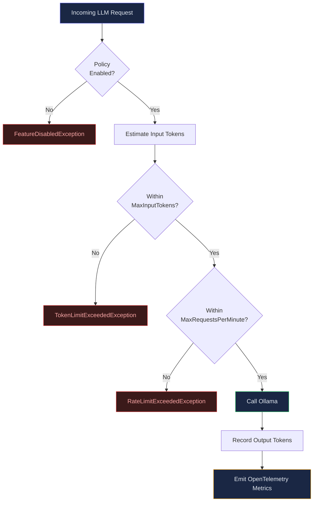

import Callout from "@components/Callout.astro";
import ImplementationNote from '@components/ImplementationNote.astro';
import CodeFile from "@components/CodeFile.astro";
import ExternalCite from '@components/ExternalCite.astro';

When I first integrated LLM capabilities into our platform, I treated token usage the way most developers treat logging -- something I would worry about later. That "later" came sooner than expected when a misbehaving summarization loop burned through an entire month's API budget in a single weekend. The experience was a wake-up call: without governance guardrails, AI features are a financial liability hiding behind a cool demo. This article captures the policy enforcement and token accounting system I built to make sure it never happens again.

As you add more LLM-powered features — summarization, entity extraction, embeddings, RAG queries — token consumption grows unpredictably. Without governance, a single runaway feature can exhaust your model quota or blow your budget. This article shows how to implement model policies and token accounting.

## The Problem

Without governance:
- No visibility into which feature consumes the most tokens
- No per-user or per-feature limits
- A misbehaving agent can loop indefinitely, consuming thousands of tokens
- Cost allocation across teams or features is impossible



<ExternalCite title="OpenAI API Rate Limits and Usage Tiers" url="https://platform.openai.com/docs/guides/rate-limits" author="OpenAI" date="2024" />

## Model Policy Configuration

Define policies that specify which model each feature uses and its token limits:

<ExternalCite title="The Options Pattern in ASP.NET Core" url="https://learn.microsoft.com/en-us/aspnet/core/fundamentals/configuration/options" author="Microsoft" date="2024" />

<CodeFile filename="ModelPolicyOptions.cs">
```csharp
public class ModelPolicyOptions
{
    public Dictionary<string, ModelPolicy> Policies { get; set; } = new();
}

public class ModelPolicy
{
    public string ModelName { get; set; } = "llama3.2";
    public int MaxInputTokens { get; set; } = 4096;
    public int MaxOutputTokens { get; set; } = 2048;
    public int MaxRequestsPerMinute { get; set; } = 60;
    public bool Enabled { get; set; } = true;
}
```
</CodeFile>

```json
{
  "ModelPolicies": {
    "Policies": {
      "summarization": {
        "ModelName": "llama3.2",
        "MaxInputTokens": 8192,
        "MaxOutputTokens": 1024,
        "MaxRequestsPerMinute": 30,
        "Enabled": true
      },
      "entity-extraction": {
        "ModelName": "llama3.2",
        "MaxInputTokens": 4096,
        "MaxOutputTokens": 512,
        "MaxRequestsPerMinute": 60,
        "Enabled": true
      },
      "rag-query": {
        "ModelName": "llama3.2",
        "MaxInputTokens": 16384,
        "MaxOutputTokens": 4096,
        "MaxRequestsPerMinute": 20,
        "Enabled": true
      }
    }
  }
}
```

## Policy Enforcement

A middleware checks the policy before every LLM call:

<ExternalCite title="Decorator Pattern in C#" url="https://refactoring.guru/design-patterns/decorator/csharp/example" author="Refactoring Guru" date="2024" />

<CodeFile filename="PolicyEnforcingLlmService.cs">
```csharp
public class PolicyEnforcingLlmService : ILlmService
{
    private readonly ILlmService _inner;
    private readonly ModelPolicyOptions _policies;
    private readonly ITokenCounter _tokenCounter;

    public async Task<string> GenerateAsync(
        string feature, string prompt, CancellationToken ct)
    {
        var policy = _policies.Policies.GetValueOrDefault(feature)
            ?? throw new InvalidOperationException(
                $"No model policy defined for feature '{feature}'");

        if (!policy.Enabled)
            throw new FeatureDisabledException(feature);

        // Check input token limit
        var inputTokens = EstimateTokenCount(prompt);
        if (inputTokens > policy.MaxInputTokens)
            throw new TokenLimitExceededException(
                feature, inputTokens, policy.MaxInputTokens);

        // Check rate limit
        if (!await _tokenCounter.TryConsumeAsync(
            feature, 1, policy.MaxRequestsPerMinute, ct))
            throw new RateLimitExceededException(feature);

        var result = await _inner.GenerateAsync(
            feature, prompt, ct);

        // Record actual usage
        var outputTokens = EstimateTokenCount(result);
        await _tokenCounter.RecordUsageAsync(
            feature, inputTokens, outputTokens, ct);

        return result;
    }
}
```
</CodeFile>

<ImplementationNote title="Rate Limiting Race Conditions">
When I first deployed the policy enforcement layer, I used an in-memory dictionary to track request counts per minute. This worked fine on a single instance, but as soon as we scaled to two API replicas behind a load balancer, the rate limits were effectively doubled because each instance maintained its own counter. I solved this by moving the rate-limit state to Redis using a sliding window counter pattern. The lesson: any shared state in a policy enforcement layer must be externalized if you run more than one instance.
</ImplementationNote>

## Token Accounting

Track cumulative token usage per feature for cost allocation and monitoring:

<ExternalCite title="Ollama API Documentation" url="https://github.com/ollama/ollama/blob/main/docs/api.md" author="Ollama" date="2024" />

<CodeFile filename="TokenUsageRecord.cs">
```csharp
public class TokenUsageRecord
{
    public string Feature { get; init; } = "";
    public string Model { get; init; } = "";
    public int InputTokens { get; init; }
    public int OutputTokens { get; init; }
    public DateTime Timestamp { get; init; }
    public string? UserId { get; init; }
}
```
</CodeFile>

<Callout type="tip" title="Approximate token counting">
For local models (Ollama), use a simple heuristic: tokens is approximately characters divided by 4. For OpenAI-compatible APIs, use the tiktoken library or parse the usage field from API responses.
</Callout>

## Dashboard Metrics

Expose token usage as OpenTelemetry metrics:

<ExternalCite title="OpenTelemetry .NET Metrics" url="https://learn.microsoft.com/en-us/dotnet/core/diagnostics/metrics" author="Microsoft" date="2024" />

```csharp
var meter = new Meter("ai.token-usage");
var inputCounter = meter.CreateCounter<long>("ai.tokens.input");
var outputCounter = meter.CreateCounter<long>("ai.tokens.output");
var requestCounter = meter.CreateCounter<long>("ai.requests");

// After each LLM call
inputCounter.Add(inputTokens,
    new("feature", feature), new("model", model));
outputCounter.Add(outputTokens,
    new("feature", feature), new("model", model));
requestCounter.Add(1,
    new("feature", feature), new("model", model));
```

<ImplementationNote title="Token Estimation Accuracy">
I initially used the simple "characters divided by 4" heuristic for all models, which worked well enough for English text. But when our platform started processing multilingual documents, the estimates were off by as much as 40% for languages like Japanese and Korean, where a single character can map to multiple tokens. I ended up maintaining a per-model correction factor table and falling back to the actual `usage` field from API responses whenever available. For Ollama, I parse the `eval_count` and `prompt_eval_count` fields from the response JSON, which gives exact numbers.
</ImplementationNote>

<ImplementationNote title="The Kill Switch That Saved Us">
The `Enabled: false` kill switch in our policy configuration proved its worth on a Friday evening. We had deployed a new entity extraction feature that was accidentally calling the LLM in a tight loop for every document chunk instead of batching them. Within minutes, the token counter dashboard showed a spike that was ten times the normal rate. Because the policy configuration was loaded from a JSON file watched by the Options Monitor, I was able to set `"Enabled": false` for that feature, and the change propagated to all running instances within seconds -- no redeployment needed. That single boolean saved us from a potentially expensive weekend.
</ImplementationNote>

## Key Takeaways

- Define **per-feature model policies** -- different features need different limits
- **Enforce policies** before every LLM call with a decorator/middleware
- **Track token usage** with OpenTelemetry for cost visibility
- Use a **kill switch** (`Enabled: false`) to disable runaway features instantly
- Estimate tokens with **characters / 4** for local models

Building this governance layer was not glamorous work, but it is the kind of infrastructure that separates a prototype from a production system. Before I had it in place, every new AI feature felt like a gamble. Now, I can onboard new features with confidence because I know exactly how much each one costs, who is using it, and I can shut it down in seconds if something goes wrong. If you are building anything with LLMs beyond a weekend project, invest in governance early -- your future self (and your finance team) will thank you.

### Next Steps

- Implement **per-user token budgets** with monthly reset cycles to enable fair usage across tenants in a multi-tenant system.
- Add **alerting thresholds** to your OpenTelemetry metrics so you get notified before hitting hard limits, not after.
- Explore **token-aware request batching** to reduce overhead by grouping small requests into a single LLM call.
- Build a **cost dashboard** that maps token usage to actual dollar amounts using your provider's pricing tiers.

### Further Reading

<ExternalCite title="OpenTelemetry .NET Metrics" url="https://learn.microsoft.com/en-us/dotnet/core/diagnostics/metrics" author="Microsoft" date="2024" />

<ExternalCite title="Ollama API Reference" url="https://github.com/ollama/ollama/blob/main/docs/api.md" author="Ollama" date="2024" />

<ExternalCite title="OpenAI Tokenizer" url="https://platform.openai.com/tokenizer" author="OpenAI" date="2024" />

<ExternalCite title="Rate Limiting with Redis" url="https://redis.io/glossary/rate-limiting/" author="Redis" date="2024" />
