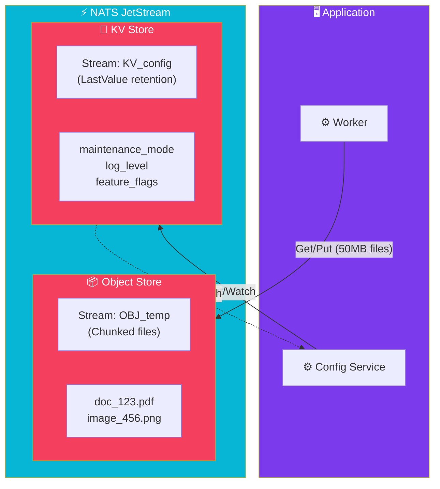

import Callout from '@components/Callout.astro';
import ImplementationNote from '@components/ImplementationNote.astro';
import ExternalCite from '@components/ExternalCite.astro';

When I first discovered that NATS JetStream could serve as a key-value store, I was skeptical. We had been running a small Redis instance solely for runtime configuration and feature flags, and the idea of replacing it with "just another NATS feature" felt risky. But after spending a weekend migrating our config service to NATS KV and seeing the Watch API push configuration changes to all services in under 50 milliseconds, I was convinced. The real surprise came later when I tried the Object Store for passing intermediate PDF files between pipeline stages -- it eliminated an entire S3 dependency and shaved seconds off our document processing workflow.

## Introduction

Most people think of NATS as just a message broker. But since JetStream provides a persistence engine, the NATS team built two powerful abstractions on top of it: **Key-Value (KV) Store** and **Object Store**.

<ExternalCite title="NATS Key-Value Store Documentation" url="https://docs.nats.io/nats-concepts/jetstream/key-value-store" author="Synadia Communications" date="2024-07-20" />

In our project, we use these to eliminate the need for Redis (for caching/state) and simplify configuration management.

## Architecture Overview

Both KV and Object Stores are just Streams under the hood. 
*   **KV**: A Stream with `LastValue` retention. The key is the Subject.
*   **Object Store**: A Stream that chunks large files into messages.

<ExternalCite title="NATS JetStream Architecture" url="https://docs.nats.io/nats-concepts/jetstream" author="Synadia Communications" date="2024-06-15" />


```mermaid
flowchart TB
    subgraph App["🖥️ Application"]
        Config["⚙️ Config Service"]
        Worker["⚙️ Worker"]
    end

    subgraph NATS["⚡ NATS JetStream"]
        subgraph KV["🔑 KV Store"]
            KVStream["Stream: KV_config\n(LastValue retention)"]
            Keys["maintenance_mode\nlog_level\nfeature_flags"]
        end
        
        subgraph OBJ["📦 Object Store"]
            OBJStream["Stream: OBJ_temp\n(Chunked files)"]
            Files["doc_123.pdf\nimage_456.png"]
        end
    end

    Config -->|"Put/Watch"| KV
    Worker -->|"Get/Put (50MB files)"| OBJ
    KV -.->|"Real-time push"| Config

    classDef primary fill:#7c3aed,color:#fff
    classDef secondary fill:#06b6d4,color:#fff
    classDef db fill:#f43f5e,color:#fff
    classDef warning fill:#fbbf24,color:#000

    class App primary
    class NATS secondary
    class KV,OBJ db
```

## NATS Key-Value Store

The KV store is perfect for:
1.  **Dynamic Configuration**: Change log levels or feature flags at runtime.
2.  **Simple State**: Store "Last Processed ID" for a worker.
3.  **Caching**: Store ephemeral data.

### Creating a KV Bucket

```csharp
// Connect
var js = new NatsJSContext(conn);
var kv = js.CreateKVContext();

// Create bucket (if not exists)
var store = await kv.CreateStoreAsync("config_bucket");
```

<ExternalCite title="NATS.Net Client Library" url="https://github.com/nats-io/nats.net" author="NATS Authors" date="2024-10-12" />

### Watching for Changes (Real-time Config)

This is the killer feature. Unlike Redis where you poll, NATS pushes changes to you instantly.

```csharp
// Put a value
await store.PutAsync("maintenance_mode", "false");

// Watch for updates
await foreach (var entry in store.WatchAsync("maintenance_mode"))
{
    var mode = entry.ValueAsString(); // "true" or "false"
    Console.WriteLine($"Maintenance mode changed to: {mode}");
        UpdateSystemState(mode);
}
```

<ImplementationNote title="KV Watch reconnection and initial value delivery">
When I first wired up the Watch API in our config service, I noticed that on startup, the watcher would occasionally miss the current value and only fire on the next change. This was a subtle race condition: if the watcher subscription was established before JetStream had fully replicated the latest value across the cluster, the initial delivery was empty. I fixed this by checking the `Operation` field on each `KVEntry` -- on the initial callback, the operation is `KVOperation.Put` with a revision greater than zero, which confirms you have the real value. I also added a fallback `GetAsync` call with a 2-second timeout after starting the watcher to guarantee the service always boots with a valid configuration state.
</ImplementationNote>

<Callout type="info">
**History**: Because it's backed by a specific configured stream, you can actually keep history (e.g., last 5 versions) of a key!
</Callout>

## NATS Object Store

Sending a 50MB PDF over a message bus is a bad idea. But storing it in S3 just to pass it to the next worker is slow. NATS Object Store sits in the middle. It's great for intermediate payloads.

<ExternalCite title="NATS Object Store Documentation" url="https://docs.nats.io/nats-concepts/jetstream/obj_store" author="Synadia Communications" date="2024-08-05" />

```csharp
var objClient = js.CreateObjectStoreContext();
var store = await objClient.CreateStoreAsync("processing_temp");

// Upload a file
await store.PutAsync("doc_123.pdf", File.OpenRead("local.pdf"));

// Download
await store.GetAsync("doc_123.pdf", File.OpenWrite("downloaded.pdf"));
```

<ImplementationNote title="Object Store size limits and chunking behavior">
I learned the hard way that NATS Object Store has a default maximum chunk size of 128KB, and the overall object size is bounded by the JetStream stream's `max_bytes` setting. When I first tried uploading a 75MB scanned PDF, the put operation silently stalled at around 60% and eventually timed out. After digging into the NATS server logs, I discovered our JetStream stream was configured with a 64MB max_bytes limit -- enough for most documents but not for large scans. The fix was two-fold: increasing `max_bytes` on the backing stream to 256MB and setting an explicit `max_chunk_size` of 256KB in the Object Store configuration to improve throughput. I also added a pre-upload size check in the application layer to reject files over 200MB with a clear error message rather than letting them fail mid-transfer.
</ImplementationNote>

## When to use what?

| Feature | Redis/S3 | NATS KV/OBJ |
|---------|----------|-------------|
| **Deployment** | Separate Service | Built-in (Single Binary) |
| **Latency** | Low | Very Low |
| **Atomic Updates** | Yes | Yes (Optimistic Concurrency) |
| **Watch/Observe** | Pub/Sub (Separate) | Native (Watch API) |
| **Use Case** | Global Cache, Long-term Storage | Config, Event State, Temp Data |

<ExternalCite title="Designing Data-Intensive Applications" url="https://dataintensive.net/" author="Martin Kleppmann" date="2017-03-16" />

<ImplementationNote title="Migrating from Redis to NATS KV in production">
The migration from Redis to NATS KV was not as seamless as I had hoped. Our existing config service used Redis `SUBSCRIBE` for change notifications, and the semantics are subtly different from NATS KV Watch. With Redis, you only get notified of changes -- you never receive the current value on subscribe. With NATS KV Watch, the first event is always the current value, which meant our config handler was double-applying the initial configuration on startup. I had to add an idempotency check that compared the incoming value against the already-loaded state before applying changes. The migration took three days of careful testing with a shadow deployment running both Redis and NATS KV side-by-side to verify consistency.
</ImplementationNote>

<ExternalCite title="NATS By Example" url="https://natsbyexample.com/" author="Synadia Communications" date="2024-09-30" />

## Conclusion

By leveraging NATS KV and Object Store, you can significantly reduce the number of moving parts in your infrastructure. For many microservices, NATS is the *only* infrastructure dependency they need.

After running NATS KV and Object Store in production for several months, I can say with confidence that these features have fundamentally simplified our architecture. Removing Redis as a separate dependency eliminated an entire class of operational concerns -- connection management, persistence configuration, and failover logic -- that we no longer have to think about. The Object Store, while not a replacement for a proper blob storage system for long-term data, has proven invaluable for our document processing pipeline where files need to move between stages quickly and reliably. If you are already running NATS with JetStream, these capabilities are essentially free infrastructure waiting to be used.

### Next Steps

- Explore how we handle [event-driven messaging patterns with NATS JetStream](/nats-jetstream-patterns) in the earlier articles of this series.
- Review our [Homelab Infrastructure](/architecture-decision-cloud-to-homelab) for the full cluster topology.
- Experiment with KV TTL (time-to-live) for ephemeral caching use cases.
- Consider using Object Store with NATS headers for metadata tagging on stored objects.

### Further Reading


<ExternalCite title="NATS Official Documentation" url="https://docs.nats.io/" author="NATS Authors" date="2024" />

<ExternalCite title="Designing Data-Intensive Applications by Martin Kleppmann" url="https://dataintensive.net/" author="Martin Kleppmann" date="2024" />

<ExternalCite title="NATS By Example" url="https://natsbyexample.com/" author="NATS Authors" date="2024" />
