import Callout from '@components/Callout.astro';
import ImplementationNote from '@components/ImplementationNote.astro';

## Introduction

Most people think of NATS as just a message broker. But since JetStream provides a persistence engine, the NATS team built two powerful abstractions on top of it: **Key-Value (KV) Store** and **Object Store**.

In BlueRobin, we use these to eliminate the need for Redis (for caching/state) and simplify configuration management.

## Architecture Overview

Both KV and Object Stores are just Streams under the hood. 
*   **KV**: A Stream with `LastValue` retention. The key is the Subject.
*   **Object Store**: A Stream that chunks large files into messages.

```mermaid
flowchart TB
    subgraph App["🖥️ Application"]
        Config["⚙️ Config Service"]
        Worker["⚙️ Worker"]
    end

    subgraph NATS["⚡ NATS JetStream"]
        subgraph KV["🔑 KV Store"]
            KVStream["Stream: KV_config\n(LastValue retention)"]
            Keys["maintenance_mode\nlog_level\nfeature_flags"]
        end
        
        subgraph OBJ["📦 Object Store"]
            OBJStream["Stream: OBJ_temp\n(Chunked files)"]
            Files["doc_123.pdf\nimage_456.png"]
        end
    end

    Config -->|"Put/Watch"| KV
    Worker -->|"Get/Put (50MB files)"| OBJ
    KV -.->|"Real-time push"| Config

    classDef primary fill:#7c3aed,color:#fff
    classDef secondary fill:#06b6d4,color:#fff
    classDef db fill:#f43f5e,color:#fff
    classDef warning fill:#fbbf24,color:#000

    class App primary
    class NATS secondary
    class KV,OBJ db
```



## NATS Key-Value Store

The KV store is perfect for:
1.  **Dynamic Configuration**: Change log levels or feature flags at runtime.
2.  **Simple State**: Store "Last Processed ID" for a worker.
3.  **Caching**: Store ephemeral data.

### Creating a KV Bucket

```csharp
// Connect
var js = new NatsJSContext(conn);
var kv = js.CreateKVContext();

// Create bucket (if not exists)
var store = await kv.CreateStoreAsync("config_bucket");
```

### Watching for Changes (Real-time Config)

This is the killer feature. Unlike Redis where you poll, NATS pushes changes to you instantly.

```csharp
// Put a value
await store.PutAsync("maintenance_mode", "false");

// Watch for updates
await foreach (var entry in store.WatchAsync("maintenance_mode"))
{
    var mode = entry.ValueAsString(); // "true" or "false"
    Console.WriteLine($"Maintenance mode changed to: {mode}");
        UpdateSystemState(mode);
}
```

<Callout type="info">
**History**: Because it's backed by a specific configured stream, you can actually keep history (e.g., last 5 versions) of a key!
</Callout>

## NATS Object Store

Sending a 50MB PDF over a message bus is a bad idea. But storing it in S3 just to pass it to the next worker is slow. NATS Object Store sits in the middle. It's great for intermediate payloads.

```csharp
var objClient = js.CreateObjectStoreContext();
var store = await objClient.CreateStoreAsync("processing_temp");

// Upload a file
await store.PutAsync("doc_123.pdf", File.OpenRead("local.pdf"));

// Download
await store.GetAsync("doc_123.pdf", File.OpenWrite("downloaded.pdf"));
```

## When to use what?

| Feature | Redis/S3 | NATS KV/OBJ |
|---------|----------|-------------|
| **Deployment** | Separate Service | Built-in (Single Binary) |
| **Latency** | Low | Very Low |
| **Atomic Updates** | Yes | Yes (Optimistic Concurrency) |
| **Watch/Observe** | Pub/Sub (Separate) | Native (Watch API) |
| **Use Case** | Global Cache, Long-term Storage | Config, Event State, Temp Data |

## Conclusion

By leveraging NATS KV and Object Store, you can significantly reduce the number of moving parts in your infrastructure. For many microservices, NATS is the *only* infrastructure dependency they need.
