import Callout from '@components/Callout.astro';
import ImplementationNote from '@components/ImplementationNote.astro';
import ExternalCite from '@components/ExternalCite.astro';

Beyond publish-subscribe, NATS provides powerful patterns for building distributed systems: request-reply for synchronous communication, key-value stores for shared state, and object stores for large files.

## Request-Reply Pattern

Request-reply enables synchronous communication over an asynchronous message bus.

```mermaid
sequenceDiagram
    participant Client as 💻 Client
    participant NATS as ⚡ NATS
    participant Service as ⚙️ Service

    Client->>NATS: 📤 Request (subject: services.embedding)
    NATS->>Service: 📨 Deliver request
    Service->>Service: 🧠 Process embedding
    Service->>NATS: 📤 Reply (to inbox)
    NATS->>Client: 📨 Deliver response
```



### Service Implementation

```csharp
// Infrastructure/Messaging/Handlers/EmbeddingServiceHandler.cs
public sealed class EmbeddingServiceHandler : BackgroundService
{
    private readonly INatsConnection _nats;
    private readonly IEmbeddingService _embeddingService;
    private readonly ILogger<EmbeddingServiceHandler> _logger;
    private readonly string _subject;
    
    public EmbeddingServiceHandler(
        INatsConnection nats,
        IEmbeddingService embeddingService,
        IConfiguration config,
        ILogger<EmbeddingServiceHandler> logger)
    {
        _nats = nats;
        _embeddingService = embeddingService;
        _logger = logger;
        
        var env = config["Environment"] ?? "dev";
        _subject = $"{env}.services.embedding.generate";
    }
    
    protected override async Task ExecuteAsync(CancellationToken stoppingToken)
    {
        _logger.LogInformation("Starting embedding service on {Subject}", _subject);
        
        await foreach (var msg in _nats.SubscribeAsync<EmbeddingRequest>(
            _subject, 
            cancellationToken: stoppingToken))
        {
            try
            {
                var request = msg.Data;
                
                if (request is null)
                {
                    await msg.ReplyAsync(new EmbeddingResponse 
                    { 
                        Success = false, 
                        Error = "Invalid request" 
                    }, cancellationToken: stoppingToken);
                    continue;
                }
                
                _logger.LogDebug(
                    "Processing embedding request for {Count} texts",
                    request.Texts.Count);
                
                var embeddings = await _embeddingService.GenerateEmbeddingsAsync(
                    request.Texts,
                    stoppingToken);
                
                await msg.ReplyAsync(new EmbeddingResponse
                {
                    Success = true,
                    Embeddings = embeddings
                }, cancellationToken: stoppingToken);
            }
            catch (Exception ex)
            {
                _logger.LogError(ex, "Failed to process embedding request");
                
                await msg.ReplyAsync(new EmbeddingResponse
                {
                    Success = false,
                    Error = ex.Message
                }, cancellationToken: stoppingToken);
            }
        }
    }
}

// Contracts
public sealed record EmbeddingRequest
{
    public required IReadOnlyList<string> Texts { get; init; }
    public string Model { get; init; } = "nomic-embed-text";
}

public sealed record EmbeddingResponse
{
    public required bool Success { get; init; }
    public IReadOnlyList<float[]>? Embeddings { get; init; }
    public string? Error { get; init; }
}
```

### Client Implementation

```csharp
// Infrastructure/Messaging/Clients/EmbeddingClient.cs
public sealed class NatsEmbeddingClient : IEmbeddingClient
{
    private readonly INatsConnection _nats;
    private readonly string _subject;
    private readonly TimeSpan _timeout;
    
    public NatsEmbeddingClient(
        INatsConnection nats,
        IConfiguration config)
    {
        _nats = nats;
        
        var env = config["Environment"] ?? "dev";
        _subject = $"{env}.services.embedding.generate";
        _timeout = TimeSpan.FromSeconds(30);
    }
    
    public async Task<IReadOnlyList<float[]>> GenerateEmbeddingsAsync(
        IReadOnlyList<string> texts,
        CancellationToken ct = default)
    {
        var request = new EmbeddingRequest { Texts = texts };
        
        using var cts = CancellationTokenSource.CreateLinkedTokenSource(ct);
        cts.CancelAfter(_timeout);
        
        var response = await _nats.RequestAsync<EmbeddingRequest, EmbeddingResponse>(
            _subject,
            request,
            cancellationToken: cts.Token);
        
        if (!response.Data!.Success)
        {
            throw new EmbeddingException(response.Data.Error ?? "Unknown error");
        }
        
        return response.Data.Embeddings!;
    }
}
```

<ImplementationNote>
Always set timeouts on request-reply operations. Without them, a crashed service will cause the client to hang indefinitely.
</ImplementationNote>

### Service Discovery with Queue Groups

Scale services horizontally with automatic load balancing:

```csharp
// Multiple instances subscribe to the same queue group
await foreach (var msg in _nats.SubscribeAsync<EmbeddingRequest>(
    _subject, 
    queueGroup: "embedding-workers",  // Queue group for load balancing
    cancellationToken: stoppingToken))
{
    // Only one worker in the group receives each request
}
```

## Key-Value Store

NATS KV provides a distributed key-value store with history, TTL, and watch capabilities.

### Creating a KV Store

```csharp
// Infrastructure/Messaging/Services/NatsKvService.cs
public sealed class NatsKvService : INatsKvService
{
    private readonly INatsConnection _nats;
    private readonly ILogger<NatsKvService> _logger;
    
    public async Task<INatsKVStore> GetOrCreateBucketAsync(
        string bucketName,
        NatsKVConfig? config = null,
        CancellationToken ct = default)
    {
        var js = _nats.CreateJetStreamContext();
        var kv = js.CreateKeyValueStoreContext();
        
        config ??= new NatsKVConfig(bucketName)
        {
            History = 5,
            MaxBytes = 100 * 1024 * 1024,  // 100MB
            Storage = NatsKVStorageType.File
        };
        
        try
        {
            return await kv.CreateStoreAsync(config, ct);
        }
        catch (NatsJSApiException ex) when (ex.Error.Code == 400)
        {
            // Bucket already exists
            return await kv.GetStoreAsync(bucketName, ct);
        }
    }
}
```

### Configuration Store

Store application configuration in NATS KV:

```csharp
// Infrastructure/Configuration/NatsConfigurationProvider.cs
public sealed class NatsConfigurationProvider : IConfigurationProvider
{
    private readonly INatsKVStore _store;
    private readonly ILogger<NatsConfigurationProvider> _logger;
    
    public NatsConfigurationProvider(
        INatsKVStore store,
        ILogger<NatsConfigurationProvider> logger)
    {
        _store = store;
        _logger = logger;
    }
    
    public async Task<T?> GetAsync<T>(string key, CancellationToken ct = default)
        where T : class
    {
        try
        {
            var entry = await _store.GetEntryAsync<T>(key, cancellationToken: ct);
            return entry.Value;
        }
        catch (NatsKVKeyNotFoundException)
        {
            return null;
        }
    }
    
    public async Task SetAsync<T>(
        string key, 
        T value, 
        CancellationToken ct = default)
        where T : class
    {
        await _store.PutAsync(key, value, cancellationToken: ct);
        
        _logger.LogInformation("Updated configuration key: {Key}", key);
    }
    
    public async Task DeleteAsync(string key, CancellationToken ct = default)
    {
        await _store.DeleteAsync(key, cancellationToken: ct);
    }
    
    public async Task<IReadOnlyList<string>> GetKeysAsync(
        string prefix = "",
        CancellationToken ct = default)
    {
        var keys = new List<string>();
        
        await foreach (var key in _store.GetKeysAsync(cancellationToken: ct))
        {
            if (string.IsNullOrEmpty(prefix) || key.StartsWith(prefix))
            {
                keys.Add(key);
            }
        }
        
        return keys;
    }
}

// Usage example
public class FeatureFlagService
{
    private readonly NatsConfigurationProvider _config;
    
    public async Task<bool> IsEnabledAsync(string feature, CancellationToken ct)
    {
        var flag = await _config.GetAsync<FeatureFlag>($"features.{feature}", ct);
        return flag?.Enabled ?? false;
    }
}

public sealed record FeatureFlag
{
    public required bool Enabled { get; init; }
    public double? RolloutPercentage { get; init; }
    public IReadOnlyList<string>? AllowedUsers { get; init; }
}
```

### Watch for Changes

React to configuration changes in real-time:

```csharp
// Infrastructure/Configuration/ConfigurationWatcher.cs
public sealed class ConfigurationWatcher : BackgroundService
{
    private readonly INatsKVStore _store;
    private readonly IServiceProvider _services;
    private readonly ILogger<ConfigurationWatcher> _logger;
    
    protected override async Task ExecuteAsync(CancellationToken stoppingToken)
    {
        _logger.LogInformation("Starting configuration watcher");
        
        await foreach (var entry in _store.WatchAsync<object>(
            cancellationToken: stoppingToken))
        {
            try
            {
                _logger.LogInformation(
                    "Configuration changed: {Key} (revision {Revision})",
                    entry.Key,
                    entry.Revision);
                
                // Notify interested services
                await NotifyConfigurationChangeAsync(entry.Key, stoppingToken);
            }
            catch (Exception ex)
            {
                _logger.LogError(ex, "Failed to handle config change for {Key}", entry.Key);
            }
        }
    }
    
    private async Task NotifyConfigurationChangeAsync(string key, CancellationToken ct)
    {
        using var scope = _services.CreateScope();
        var handlers = scope.ServiceProvider.GetServices<IConfigurationChangeHandler>();
        
        foreach (var handler in handlers)
        {
            if (handler.CanHandle(key))
            {
                await handler.HandleChangeAsync(key, ct);
            }
        }
    }
}

public interface IConfigurationChangeHandler
{
    bool CanHandle(string key);
    Task HandleChangeAsync(string key, CancellationToken ct);
}
```

## Object Store

NATS Object Store handles large binary objects with chunking and resumable uploads.

### Creating an Object Store

```csharp
// Infrastructure/Storage/NatsObjectStore.cs
public sealed class NatsObjectStore : INatsObjectStore
{
    private readonly INatsConnection _nats;
    private readonly ILogger<NatsObjectStore> _logger;
    
    public async Task<INatsObjStore> GetOrCreateBucketAsync(
        string bucketName,
        NatsObjConfig? config = null,
        CancellationToken ct = default)
    {
        var js = _nats.CreateJetStreamContext();
        var obj = js.CreateObjectStoreContext();
        
        config ??= new NatsObjConfig(bucketName)
        {
            MaxBytes = 10L * 1024 * 1024 * 1024,  // 10GB
            Storage = NatsObjStorageType.File
        };
        
        try
        {
            return await obj.CreateStoreAsync(config, ct);
        }
        catch (NatsJSApiException ex) when (ex.Error.Code == 400)
        {
            return await obj.GetStoreAsync(bucketName, ct);
        }
    }
}
```

### Storing Documents

```csharp
// Infrastructure/Storage/DocumentObjectStore.cs
public sealed class DocumentObjectStore : IDocumentObjectStore
{
    private readonly INatsObjStore _store;
    private readonly ILogger<DocumentObjectStore> _logger;
    
    public async Task<ObjectMetadata> UploadAsync(
        string objectName,
        Stream content,
        string contentType,
        IDictionary<string, string>? metadata = null,
        CancellationToken ct = default)
    {
        var meta = new ObjectMeta
        {
            Name = objectName,
            Headers = new NatsHeaders
            {
                ["Content-Type"] = contentType
            }
        };
        
        // Add custom metadata
        if (metadata is not null)
        {
            foreach (var (key, value) in metadata)
            {
                meta.Headers[$"X-Meta-{key}"] = value;
            }
        }
        
        var info = await _store.PutAsync(meta, content, ct);
        
        _logger.LogInformation(
            "Uploaded object {Name} ({Size} bytes, {Chunks} chunks)",
            objectName,
            info.Size,
            info.Chunks);
        
        return new ObjectMetadata
        {
            Name = info.Name,
            Size = info.Size,
            Digest = info.Digest,
            ModifiedAt = info.ModTime
        };
    }
    
    public async Task<Stream> DownloadAsync(
        string objectName,
        CancellationToken ct = default)
    {
        var stream = new MemoryStream();
        await _store.GetAsync(objectName, stream, ct);
        stream.Position = 0;
        return stream;
    }
    
    public async Task<ObjectInfo?> GetInfoAsync(
        string objectName,
        CancellationToken ct = default)
    {
        try
        {
            return await _store.GetInfoAsync(objectName, ct);
        }
        catch (NatsObjNotFoundException)
        {
            return null;
        }
    }
    
    public async Task DeleteAsync(string objectName, CancellationToken ct = default)
    {
        await _store.DeleteAsync(objectName, ct);
    }
    
    public async IAsyncEnumerable<ObjectInfo> ListAsync(
        [EnumeratorCancellation] CancellationToken ct = default)
    {
        await foreach (var info in _store.ListAsync(ct))
        {
            yield return info;
        }
    }
}

public sealed record ObjectMetadata
{
    public required string Name { get; init; }
    public required long Size { get; init; }
    public required string Digest { get; init; }
    public required DateTimeOffset ModifiedAt { get; init; }
}
```

<Callout type="tip">
Use Object Store for temporary processing files (OCR results, embeddings) and MinIO for permanent document storage. This keeps NATS lightweight.
</Callout>

### Streaming Large Files

For very large files, stream directly without loading into memory:

```csharp
public async Task ProcessLargeFileAsync(
    string objectName,
    Func<Stream, Task> processor,
    CancellationToken ct = default)
{
    // Create a pipe for streaming
    var pipe = new Pipe();
    
    // Start download in background
    var downloadTask = Task.Run(async () =>
    {
        await using var writer = pipe.Writer.AsStream();
        await _store.GetAsync(objectName, writer, ct);
    }, ct);
    
    // Process while downloading
    await using var reader = pipe.Reader.AsStream();
    await processor(reader);
    
    await downloadTask;
}
```

## Distributed Locking

Use KV store for distributed locks:

```csharp
// Infrastructure/Messaging/Services/NatsDistributedLock.cs
public sealed class NatsDistributedLock : IDistributedLock
{
    private readonly INatsKVStore _store;
    private readonly string _lockKey;
    private readonly string _lockId;
    private readonly TimeSpan _expiry;
    
    public NatsDistributedLock(
        INatsKVStore store,
        string lockKey,
        TimeSpan? expiry = null)
    {
        _store = store;
        _lockKey = $"locks.{lockKey}";
        _lockId = Guid.NewGuid().ToString("N");
        _expiry = expiry ?? TimeSpan.FromMinutes(1);
    }
    
    public async Task<IAsyncDisposable?> TryAcquireAsync(
        TimeSpan timeout,
        CancellationToken ct = default)
    {
        var deadline = DateTimeOffset.UtcNow.Add(timeout);
        
        while (DateTimeOffset.UtcNow < deadline)
        {
            try
            {
                // Try to create the lock key
                var lockValue = new LockValue
                {
                    LockId = _lockId,
                    AcquiredAt = DateTimeOffset.UtcNow,
                    ExpiresAt = DateTimeOffset.UtcNow.Add(_expiry)
                };
                
                await _store.CreateAsync(_lockKey, lockValue, cancellationToken: ct);
                
                return new LockHandle(this);
            }
            catch (NatsKVCreateException)
            {
                // Key exists - check if expired
                var existing = await _store.GetEntryAsync<LockValue>(_lockKey, cancellationToken: ct);
                
                if (existing.Value?.ExpiresAt < DateTimeOffset.UtcNow)
                {
                    // Lock expired, try to take over
                    await _store.DeleteAsync(_lockKey, cancellationToken: ct);
                    continue;
                }
            }
            
            await Task.Delay(100, ct);
        }
        
        return null;  // Timeout
    }
    
    private async Task ReleaseAsync(CancellationToken ct)
    {
        try
        {
            var entry = await _store.GetEntryAsync<LockValue>(_lockKey, cancellationToken: ct);
            
            if (entry.Value?.LockId == _lockId)
            {
                await _store.DeleteAsync(_lockKey, cancellationToken: ct);
            }
        }
        catch (NatsKVKeyNotFoundException)
        {
            // Already released
        }
    }
    
    private sealed record LockValue
    {
        public required string LockId { get; init; }
        public required DateTimeOffset AcquiredAt { get; init; }
        public required DateTimeOffset ExpiresAt { get; init; }
    }
    
    private sealed class LockHandle : IAsyncDisposable
    {
        private readonly NatsDistributedLock _lock;
        
        public LockHandle(NatsDistributedLock @lock) => _lock = @lock;
        
        public async ValueTask DisposeAsync()
        {
            await _lock.ReleaseAsync(CancellationToken.None);
        }
    }
}

// Usage
public async Task ProcessWithLockAsync(string resourceId, CancellationToken ct)
{
    var lockStore = await _kvService.GetOrCreateBucketAsync("distributed-locks", ct: ct);
    var @lock = new NatsDistributedLock(lockStore, resourceId);
    
    await using var handle = await @lock.TryAcquireAsync(TimeSpan.FromSeconds(30), ct);
    
    if (handle is null)
    {
        throw new LockTimeoutException($"Could not acquire lock for {resourceId}");
    }
    
    // Critical section - only one worker at a time
    await DoCriticalWorkAsync(resourceId, ct);
}
```

## Circuit Breaker Pattern

Protect services from cascading failures:

```csharp
// Infrastructure/Messaging/Resilience/CircuitBreakerClient.cs
public sealed class CircuitBreakerClient<TRequest, TResponse>
    where TRequest : class
    where TResponse : class
{
    private readonly INatsConnection _nats;
    private readonly string _subject;
    private readonly CircuitBreakerPolicy _circuitBreaker;
    
    public CircuitBreakerClient(
        INatsConnection nats,
        string subject,
        ILogger logger)
    {
        _nats = nats;
        _subject = subject;
        
        _circuitBreaker = Policy
            .Handle<Exception>()
            .CircuitBreakerAsync(
                exceptionsAllowedBeforeBreaking: 5,
                durationOfBreak: TimeSpan.FromSeconds(30),
                onBreak: (ex, duration) =>
                {
                    logger.LogWarning(
                        "Circuit breaker opened for {Subject}. Duration: {Duration}s",
                        subject,
                        duration.TotalSeconds);
                },
                onReset: () =>
                {
                    logger.LogInformation(
                        "Circuit breaker reset for {Subject}",
                        subject);
                });
    }
    
    public async Task<TResponse> RequestAsync(
        TRequest request,
        TimeSpan timeout,
        CancellationToken ct = default)
    {
        return await _circuitBreaker.ExecuteAsync(async () =>
        {
            using var cts = CancellationTokenSource.CreateLinkedTokenSource(ct);
            cts.CancelAfter(timeout);
            
            var response = await _nats.RequestAsync<TRequest, TResponse>(
                _subject,
                request,
                cancellationToken: cts.Token);
            
            return response.Data!;
        });
    }
}
```

## Summary

NATS provides powerful primitives for distributed systems:

| Pattern | Use Case | NATS Feature |
|---------|----------|--------------|
| Request-Reply | Synchronous RPC | Core NATS |
| Key-Value | Configuration, Caching | JetStream KV |
| Object Store | Large files, Blobs | JetStream Object |
| Distributed Lock | Coordination | KV Store |
| Queue Groups | Load balancing | Core NATS |

These patterns, combined with JetStream's durability, give you everything needed to build resilient distributed systems.

<ExternalCite 
  title="NATS Documentation" 
  url="https://docs.nats.io/"
  author="NATS Authors"
/>
