import Callout from "@components/Callout.astro";
import CodeFile from "@components/CodeFile.astro";
import ImplementationNote from '@components/ImplementationNote.astro';
import ExternalCite from '@components/ExternalCite.astro';

When I first attempted to rename a NATS subject in our document processing pipeline, I learned firsthand why implicit contracts are so dangerous. I pushed a config change that moved `documents.ocr.completed` to a new namespace, and within minutes our notification service went silent — no errors in logs, no exceptions thrown, just complete silence. It took me an embarrassing amount of time to realize what had happened: the consumer was still listening on the old subject, happily waiting for messages that would never arrive. That incident convinced me to build a proper migration strategy with transition windows, and I have not lost a message to a contract change since.

Event-driven architectures rely on implicit contracts: producers publish to a subject, consumers subscribe to it, and the payload schema connects them. When you need to rename subjects, restructure payloads, or consolidate event streams, you face a distributed coordination problem. This article presents a safe migration strategy using transition windows and subject resolution.

## Why Event Contracts Break

Unlike REST APIs with versioned URLs, messaging contracts are often implicit. A producer publishes to `documents.ocr.completed` and a consumer subscribes to the same subject. Rename the subject, and the consumer silently stops receiving messages — no compile error, no 404, just silence.

<ExternalCite title="The Tolerant Reader Pattern" url="https://martinfowler.com/bliki/TolerantReader.html" author="Martin Fowler" date="2011-05-09" />

Common triggers for contract changes:

- Reorganizing subject namespaces (`documents.*` to `archives.documents.*`)
- Splitting a catch-all subject into granular ones
- Changing payload shapes (adding/removing fields)
- Consolidating multiple subjects into one with a discriminator field

## The Transition Window Pattern

Instead of a hard cutover, run **parallel subjects** during a transition window:

```mermaid
sequenceDiagram
    participant P as Producer
    participant OLD as Old Subject
    participant NEW as New Subject
    participant CA as Consumer A
    participant CB as Consumer B

    rect rgb(30, 40, 68)
    note over P,CB: Phase 1 — Dual Publish
    P->>OLD: publish(v1)
    P->>NEW: publish(v2)
    CA->>OLD: consume(v1)
    CB->>OLD: consume(v1)
    end

    rect rgb(30, 50, 58)
    note over P,CB: Phase 2 — Consumer Migration
    P->>OLD: publish(v1)
    P->>NEW: publish(v2)
    CA->>NEW: consume(v2)
    CB->>OLD: consume(v1)
    end

    rect rgb(40, 50, 38)
    note over P,CB: Phase 3 — Stop Old
    P->>NEW: publish(v2)
    CA->>NEW: consume(v2)
    CB->>NEW: consume(v2)
    end

    rect rgb(50, 40, 38)
    note over P,CB: Phase 4 — Cleanup
    note over OLD: Subject removed
    end
```



This is the distributed equivalent of a database migration with zero downtime.

<ExternalCite title="Parallel Change (Expand and Contract)" url="https://martinfowler.com/bliki/ParallelChange.html" author="Martin Fowler" date="2014-05-13" />

<ImplementationNote>
Implementing the transition window pattern taught me that the hardest phase is not the technical dual-publish — it is coordinating the human side. During our first migration, I kept phase 1 running for two weeks because I could not confirm whether all consumers had migrated. I eventually added a monitoring query that checked NATS consumer info on the old subject: if no active consumers remained for 48 hours, it was safe to proceed to phase 3. That visibility turned a nerve-wracking guessing game into a data-driven decision.
</ImplementationNote>

## Subject Resolution Service

Centralize subject names behind a resolution service so consumers don't hardcode strings:

<CodeFile filename="NatsSubjectResolver.cs">
```csharp
public interface INatsSubjectResolver
{
    string Resolve(string logicalName);
}

public class NatsSubjectResolver : INatsSubjectResolver
{
    private readonly Dictionary<string, string> _mappings;

    public NatsSubjectResolver(IConfiguration config)
    {
        _mappings = config.GetSection("Nats:SubjectMappings")
            .Get<Dictionary<string, string>>() ?? new();
    }

    public string Resolve(string logicalName)
    {
        return _mappings.TryGetValue(logicalName, out var mapped)
            ? mapped
            : logicalName; // Fallback to logical name
    }
}
```
</CodeFile>

Configuration drives the mapping:

```json
{
  "Nats": {
    "SubjectMappings": {
      "ocr.completed": "archives.documents.ocr.completed",
      "analysis.completed": "archives.documents.analysis.completed"
    }
  }
}
```

<ExternalCite title="NATS Subject-Based Messaging" url="https://docs.nats.io/nats-concepts/subjects" author="NATS Authors" date="2024-03-20" />

## Dual-Publish During Transition

During phase 1, the producer writes to both old and new subjects:

<CodeFile filename="DualPublishEventPublisher.cs">
```csharp
public class DualPublishEventPublisher : IEventPublisher
{
    private readonly INatsConnection _nats;
    private readonly INatsSubjectResolver _resolver;
    private readonly TransitionConfig _config;

    public async Task PublishAsync<T>(
        string logicalSubject, T payload, CancellationToken ct)
    {
        var newSubject = _resolver.Resolve(logicalSubject);

        // Always publish to new subject
        await _nats.PublishAsync(newSubject, payload, ct);

        // During transition, also publish to legacy subject
        if (_config.IsInTransition(logicalSubject))
        {
            await _nats.PublishAsync(logicalSubject, payload, ct);
        }
    }
}
```
</CodeFile>

<Callout type="tip" title="Feature flag the transition">
Use a configuration flag per subject to control which phase you're in. This lets you migrate subjects independently rather than all at once.
</Callout>

<ImplementationNote>
One subtle issue I encountered during dual-publish was message ordering. When the producer writes to both old and new subjects, consumers on the new subject might process a message before the consumer on the old subject sees it. For our use case — document processing events — ordering between subjects did not matter because each consumer was idempotent. But if your consumers depend on strict cross-subject ordering, you need to factor that into your transition plan. I ended up adding a sequence number in the event envelope so downstream services could detect and handle out-of-order deliveries.
</ImplementationNote>

## Contract Testing

Add contract tests that verify both producer and consumer agree on the payload shape:

<CodeFile filename="EventContractTests.cs">
```csharp
public class EventContractTests
{
    [Fact]
    public void OcrCompleted_contract_matches()
    {
        var payload = new OcrCompletedEvent
        {
            DocumentId = "doc-123",
            ObjectKey = "uploads/file.pdf",
            ExtractedText = "Sample text",
            PageCount = 5,
            CompletedAt = DateTime.UtcNow,
        };

        var json = JsonSerializer.Serialize(payload);
        var deserialized = JsonSerializer
            .Deserialize<OcrCompletedEvent>(json);

        Assert.NotNull(deserialized);
        Assert.Equal(payload.DocumentId, deserialized.DocumentId);
        Assert.Equal(payload.PageCount, deserialized.PageCount);
    }

    [Fact]
    public void OcrCompleted_tolerates_extra_fields()
    {
        // Simulates a producer adding a new field
        var json = @"{
            ""DocumentId"": ""doc-123"",
            ""ObjectKey"": ""uploads/file.pdf"",
            ""ExtractedText"": ""text"",
            ""PageCount"": 5,
            ""NewField"": ""ignored"",
            ""CompletedAt"": ""2025-01-01T00:00:00Z""
        }";

        var deserialized = JsonSerializer
            .Deserialize<OcrCompletedEvent>(json);

        Assert.NotNull(deserialized);
        Assert.Equal("doc-123", deserialized.DocumentId);
    }
}
```
</CodeFile>

<ExternalCite title="Consumer-Driven Contract Testing" url="https://pact.io/getting_started" author="Pact Foundation" date="2024-01-15" />

## Payload Evolution Rules

To maintain backward compatibility during transitions:

1. **Additive only**: New fields are optional with defaults
2. **Never rename**: Add a new field, deprecate the old one
3. **Tolerant reader**: Consumers ignore unknown fields
4. **Envelope pattern**: Wrap payloads with metadata (version, timestamp, source)

```csharp
public record EventEnvelope<T>(
    string Version,
    string Source,
    DateTime Timestamp,
    T Payload);
```

<ExternalCite title="Schema Evolution and Compatibility" url="https://docs.confluent.io/platform/current/schema-registry/fundamentals/schema-evolution.html" author="Confluent" date="2024-06-01" />

<ImplementationNote>
Adopting the envelope pattern was one of those changes that felt like over-engineering at first but paid for itself within weeks. The `Version` field let us route messages to different deserialization logic during a payload migration, and the `Source` field was invaluable for debugging when we had three different producers publishing to the same subject. The `Timestamp` from the producer (as opposed to the NATS server timestamp) also saved us during a clock skew investigation on one of our k3s nodes.
</ImplementationNote>

## Migration Checklist

1. **Add new subject to resolver** — consumers reference logical names, not raw strings
2. **Enable dual-publish** — producer writes to both old and new subjects
3. **Migrate consumers one by one** — update subscriptions to new subject
4. **Verify all consumers migrated** — check NATS consumer info for old subject
5. **Disable dual-publish** — stop writing to old subject
6. **Remove old subject config** — clean up resolver mappings

<ExternalCite title="Versioning in an Event Driven System" url="https://leanpub.com/esversioning/read" author="Greg Young" date="2023-03-01" />

## Key Takeaways

- Never do hard subject renames — use a **transition window** with dual publishing
- Centralize subject names behind a **resolver** so changes are configuration-driven
- Write **contract tests** that verify payload compatibility bidirectionally
- Follow **additive-only** schema evolution to maintain backward compatibility

Reflecting on the migrations I have run over the past year, the most important lesson is that silent failures are the real enemy in event-driven systems. A broken REST endpoint gives you a 500 error immediately; a broken event contract gives you silence. Building the subject resolver, transition window pattern, and contract tests into our standard workflow transformed what used to be a high-risk operation into a routine, predictable process.

## Next Steps

- Integrate contract tests into your CI/CD pipeline so payload incompatibilities are caught before deployment
- Build a migration dashboard that tracks active consumers on old vs new subjects during transition windows
- Explore NATS subject mapping rules as a server-side alternative to application-level dual publishing
- Add automated phase progression that advances the migration state when old-subject consumer counts reach zero

### Further Reading


<ExternalCite title="NATS Subject Naming Best Practices" url="https://docs.nats.io/nats-concepts/subjects" author="NATS Authors" date="2024" />

<ExternalCite title="Tolerant Reader Pattern" url="https://martinfowler.com/bliki/TolerantReader.html" author="Martin Fowler" date="2024" />

<ExternalCite title="Parallel Change (Expand and Contract)" url="https://martinfowler.com/bliki/ParallelChange.html" author="Martin Fowler" date="2024" />

<ExternalCite title="Pact Contract Testing" url="https://pact.io/" author="Pact Foundation" date="2024" />

<ExternalCite title="Confluent Schema Evolution Guide" url="https://docs.confluent.io/platform/current/schema-registry/fundamentals/schema-evolution.html" author="Docs" date="2024" />
