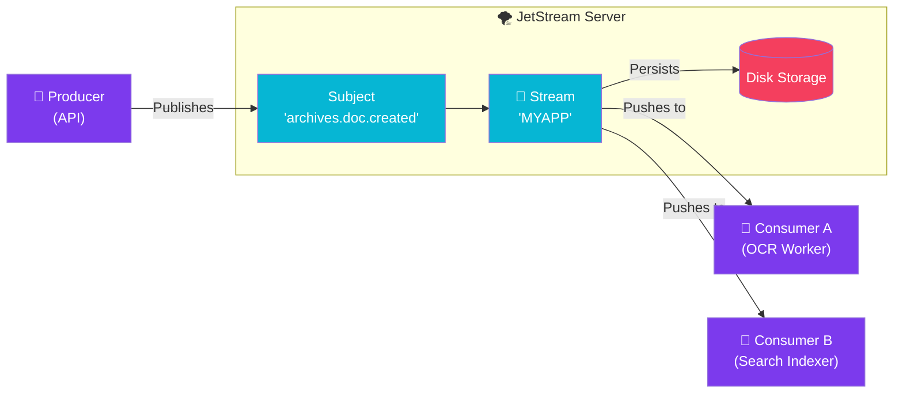

import Callout from '@components/Callout.astro';
import ImplementationNote from '@components/ImplementationNote.astro';
import ExternalCite from '@components/ExternalCite.astro';

## Introduction

I evaluated three messaging systems for BlueRobin: RabbitMQ, Apache Kafka, and NATS. RabbitMQ felt heavyweight for a homelab—Erlang runtime, management plugins, clustering complexity. Kafka was overkill—Zookeeper coordination, partition management, and a minimum 3-broker cluster just to get started. NATS won me over with its simplicity: a single Go binary that starts in milliseconds, with JetStream providing persistence, key-value storage, and object storage built in. <ExternalCite title="NATS Documentation" url="https://docs.nats.io/" author="Synadia Communications" date="2024" />

Message brokers are the nervous system of modern distributed architectures. While RabbitMQ and Kafka effectively rule the market, **NATS JetStream** has emerged as a compelling alternative that combines the simplicity of RabbitMQ with the persistence and replayability of Kafka—all in a single binary. <ExternalCite title="NATS JetStream Overview" url="https://docs.nats.io/nats-concepts/jetstream" author="Synadia Communications" date="2024" />

In our ecosystem, NATS is the backbone. We use it for everything: reliable job queues, real-time UI updates, and Key-Value configuration.

## Why NATS JetStream?

1.  **Unified Platform**: It handles Pub/Sub, Request/Reply, KV Store, and Persistent Streams. <ExternalCite title="Enterprise Integration Patterns" url="https://www.enterpriseintegrationpatterns.com/" author="Gregor Hohpe & Bobby Woolf" date="2003" />
2.  **Performance**: It is written in Go and is incredibly lightweight and fast.
3.  **Subject-Based Routing**: Unlike RabbitMQ's complex Exchanges/Queues, NATS uses wildcard subjects (`orders.*.created`).
4.  **DevOps Simplicity**: A single Docker container (30MB) gives you a clustered, high-availability platform.

## Architecture Overview

JetStream adds a persistence layer (Stream) on top of Core NATS. Messages are published to subjects, captured by streams, and then consumed by durable consumers.


```mermaid
flowchart LR
    Producer["📢 Producer\n(API)"] -->|Publishes| Subject["Subject\n'archives.doc.created'"]
    
    subgraph JetStream["🌪️ JetStream Server"]
        Subject --> Stream["💾 Stream\n'MYAPP'"]
        Stream -->|Persists| Disk[(Disk Storage)]
    end
    
    Stream -->|Pushes to| ConsumerA["👷 Consumer A\n(OCR Worker)"]
    Stream -->|Pushes to| ConsumerB["🔎 Consumer B\n(Search Indexer)"]

    classDef primary fill:#7c3aed,color:#fff
    classDef secondary fill:#06b6d4,color:#fff
    classDef db fill:#f43f5e,color:#fff

    class Producer,ConsumerA,ConsumerB primary
    class Subject,Stream secondary
    class Disk db
```

## Step 1: Connecting to NATS

We use the official `NATS.Client.Core` and `NATS.Client.JetStream` libraries. <ExternalCite title="NATS.Net - Official .NET Client" url="https://github.com/nats-io/nats.net" author="NATS.io" date="2024" />

```csharp
// Program.cs
using NATS.Client.Core;
using NATS.Client.JetStream;

var opts = NatsOpts.Default with { Url = "nats://localhost:4222" };

// 1. Connect to Core NATS
await using var nats = new NatsConnection(opts);

// 2. Access JetStream Context
var js = new NatsJSContext(nats);

Console.WriteLine("Connected to JetStream!");
```

## Step 2: Defining the Stream

Before we can persist messages, we must define a **Stream**. The stream binds to specific subjects. <ExternalCite title="JetStream Model Deep Dive" url="https://docs.nats.io/nats-concepts/jetstream/streams" author="Synadia Communications" date="2024" />

```csharp
// Usage: CreateStream(js).Wait();

public static async Task CreateStream(INatsJSContext js)
{
    // Define a stream 'MYAPP' that listens to 'archives.>'
    var config = new StreamConfig(
        name: "MYAPP", 
        subjects: new[] { "archives.>" })
    {
        Retention = StreamConfigRetention.WorkQueue, // Messages removed when acked
        Storage = StreamConfigStorage.File
    };

    await js.CreateStreamAsync(config);
    Console.WriteLine("Stream 'MYAPP' created/updated.");
}
```

<ImplementationNote>
**Retention Policy**:
*   `WorkQueue`: Like a traditional queue. Once *one* consumer Acks a message, it is deleted. Good for job processing.
*   `Limits` (Default): Messages are kept until age/size limits. Good for event sourcing or multiple independent consumers (Fan-out).
</ImplementationNote>

<ImplementationNote>
When I first configured JetStream streams, I made the mistake of using a single monolithic stream for all document events. As the system grew, I needed different retention policies for different event types—OCR events could be discarded after 24 hours, but audit events needed to persist indefinitely. Splitting into purpose-specific streams (e.g., `ARCHIVES_DOCUMENTS`, `ARCHIVES_AI`, `ARCHIVES_AUDIT`) with individual retention policies was a painful migration but vastly improved operational flexibility.
</ImplementationNote>

## Step 3: Publishing Messages

Publishing to JetStream is identical to publishing to Core NATS, but the broker guarantees persistence (it sends back an Ack).

```csharp
public record DocumentCreated(string Id, string Title, DateTime CreatedAt);

// Publish
var evt = new DocumentCreated("doc_123", "Specs.pdf", DateTime.UtcNow);

// The connection handles serialization (JSON by default)
var ack = await js.PublishAsync(
    subject: "archives.documents.created", 
    data: evt
);

// Ensure persistence was successful
ack.EnsureSuccess();

Console.WriteLine($"Published msg seq: {ack.Seq}");
```

<ImplementationNote>
I use environment-prefixed subjects (e.g., `staging.archives.documents.ocr.requested`) to isolate dev, staging, and production on the same NATS cluster. This was simpler than running three separate NATS instances on a resource-constrained homelab. The downside is that a misconfigured environment prefix can cause events to leak between environments—I learned this the hard way when staging workers started processing production documents.
</ImplementationNote>

## Step 4: Consuming Messages

The modern way to consume in .NET is using the `ConsumeAsync` iterator.

```csharp
var consumer = await js.CreateOrUpdateConsumerAsync("MYAPP", new ConsumerConfig("ocr_processor")
{
    FilterSubject = "archives.documents.created",
    AckPolicy = ConsumerConfigAckPolicy.Explicit
});

Console.WriteLine("Waiting for messages...");

await foreach (var msg in consumer.ConsumeAsync<DocumentCreated>())
{
    try 
    {
        Console.WriteLine($"Processing '{msg.Data.Title}'...");
        
        // Simulate work
        await Task.Delay(100);
        
        // Acknowledge implies "Work Done"
        await msg.AckAsync();
    }
    catch (Exception ex)
    {
        // Negative Ack tells NATS to redeliver connection
        await msg.NakAsync();
    }
}
```

<ImplementationNote>
One of the most confusing issues I encountered was "consumer not found" errors that appeared randomly. The root cause was a race condition during startup—the worker pods would try to bind to JetStream consumers before the streams were created. I solved this by adding a `JetStreamInitializerService` that runs as a hosted service with retry logic and exponential backoff. All consumer services now call `await _initializer.WaitForInitializationAsync()` before attempting to subscribe.
</ImplementationNote>

## Conclusion

NATS JetStream radically simplifies messaging infrastructure. By collapsing the broker, queue, and key-value store into one, it reduces operational complexity while providing best-in-class performance for .NET applications. <ExternalCite title="Designing Event-Driven Systems" url="https://www.oreilly.com/library/view/designing-event-driven-systems/9781492038252/" author="Ben Stopford" date="2018" />

After running NATS in production for over a year on my homelab, I can confidently say it has been one of the most reliable pieces of infrastructure in the stack. The upgrade path has been smooth, the operational overhead is minimal, and the .NET client library continues to improve with each release.

### Next Steps

This is the first article in the **Event-Driven Architecture with NATS** series. In upcoming posts, we will cover:

- **NATS Key-Value Store in .NET** -- Using JetStream's built-in KV capabilities for distributed configuration and feature flags.
- **Building Reliable Workers with NATS Consumers** -- Implementing idempotent message handlers, dead letter queues, and graceful shutdown patterns.
- **NATS in Kubernetes** -- Deploying NATS on a homelab K3s cluster with Helm, TLS, and monitoring via Prometheus and Grafana.

### Further Reading

- <ExternalCite title="NATS Documentation" url="https://docs.nats.io/" author="Synadia Communications" date="2024" /> -- The official docs are excellent and cover everything from core concepts to advanced deployment topologies.
- <ExternalCite title="Designing Event-Driven Systems" url="https://www.oreilly.com/library/view/designing-event-driven-systems/9781492038252/" author="Ben Stopford" date="2018" /> -- A free O'Reilly book that provides solid theoretical grounding for event-driven architectures.
- <ExternalCite title="Enterprise Integration Patterns" url="https://www.enterpriseintegrationpatterns.com/" author="Gregor Hohpe & Bobby Woolf" date="2003" /> -- The classic reference for messaging patterns that apply regardless of which broker you choose.
- <ExternalCite title="NATS.Net - Official .NET Client" url="https://github.com/nats-io/nats.net" author="NATS.io" date="2024" /> -- The GitHub repository for the .NET client, with examples and API documentation.
