import Callout from '@components/Callout.astro';
import ImplementationNote from '@components/ImplementationNote.astro';

## Introduction

Message brokers are the nervous system of modern distributed architectures. While RabbitMQ and Kafka effectively rule the market, **NATS JetStream** has emerged as a compelling alternative that combines the simplicity of RabbitMQ with the persistence and replayability of Kafka—all in a single binary.

In the BlueRobin ecosystem, NATS is the backbone. We use it for everything: reliable job queues, real-time UI updates, and Key-Value configuration.

## Why NATS JetStream?

1.  **Unified Platform**: It handles Pub/Sub, Request/Reply, KV Store, and Persistent Streams.
2.  **Performance**: It is written in Go and is incredibly lightweight and fast.
3.  **Subject-Based Routing**: Unlike RabbitMQ's complex Exchanges/Queues, NATS uses wildcard subjects (`orders.*.created`).
4.  **DevOps Simplicity**: A single Docker container (30MB) gives you a clustered, high-availability platform.

## Architecture Overview

JetStream adds a persistence layer (Stream) on top of Core NATS. Messages are published to subjects, captured by streams, and then consumed by durable consumers.

```mermaid
flowchart LR
    Producer["📢 Producer\n(API)"] -->|Publishes| Subject["Subject\n'archives.doc.created'"]
    
    subgraph JetStream["🌪️ JetStream Server"]
        Subject --> Stream["💾 Stream\n'ARCHIVES'"]
        Stream -->|Persists| Disk[(Disk Storage)]
    end
    
    Stream -->|Pushes to| ConsumerA["👷 Consumer A\n(OCR Worker)"]
    Stream -->|Pushes to| ConsumerB["🔎 Consumer B\n(Search Indexer)"]

    classDef primary fill:#7c3aed,color:#fff
    classDef secondary fill:#06b6d4,color:#fff
    classDef db fill:#f43f5e,color:#fff

    class Producer,ConsumerA,ConsumerB primary
    class Subject,Stream secondary
    class Disk db
```



## Step 1: Connecting to NATS

We use the official `NATS.Client.Core` and `NATS.Client.JetStream` libraries.

```csharp
// Program.cs
using NATS.Client.Core;
using NATS.Client.JetStream;

var opts = NatsOpts.Default with { Url = "nats://localhost:4222" };

// 1. Connect to Core NATS
await using var nats = new NatsConnection(opts);

// 2. Access JetStream Context
var js = new NatsJSContext(nats);

Console.WriteLine("Connected to JetStream!");
```

## Step 2: Defining the Stream

Before we can persist messages, we must define a **Stream**. The stream binds to specific subjects.

```csharp
// Usage: CreateStream(js).Wait();

public static async Task CreateStream(INatsJSContext js)
{
    // Define a stream 'ARCHIVES' that listens to 'archives.>'
    var config = new StreamConfig(
        name: "ARCHIVES", 
        subjects: new[] { "archives.>" })
    {
        Retention = StreamConfigRetention.WorkQueue, // Messages removed when acked
        Storage = StreamConfigStorage.File
    };

    await js.CreateStreamAsync(config);
    Console.WriteLine("Stream 'ARCHIVES' created/updated.");
}
```

<ImplementationNote>
**Retention Policy**:
*   `WorkQueue`: Like a traditional queue. Once *one* consumer Acks a message, it is deleted. Good for job processing.
*   `Limits` (Default): Messages are kept until age/size limits. Good for event sourcing or multiple independent consumers (Fan-out).
</ImplementationNote>

## Step 3: Publishing Messages

Publishing to JetStream is identical to publishing to Core NATS, but the broker guarantees persistence (it sends back an Ack).

```csharp
public record DocumentCreated(string Id, string Title, DateTime CreatedAt);

// Publish
var evt = new DocumentCreated("doc_123", "Specs.pdf", DateTime.UtcNow);

// The connection handles serialization (JSON by default)
var ack = await js.PublishAsync(
    subject: "archives.documents.created", 
    data: evt
);

// Ensure persistence was successful
ack.EnsureSuccess();

Console.WriteLine($"Published msg seq: {ack.Seq}");
```

## Step 4: Consuming Messages

The modern way to consume in .NET is using the `ConsumeAsync` iterator.

```csharp
var consumer = await js.CreateOrUpdateConsumerAsync("ARCHIVES", new ConsumerConfig("ocr_processor")
{
    FilterSubject = "archives.documents.created",
    AckPolicy = ConsumerConfigAckPolicy.Explicit
});

Console.WriteLine("Waiting for messages...");

await foreach (var msg in consumer.ConsumeAsync<DocumentCreated>())
{
    try 
    {
        Console.WriteLine($"Processing '{msg.Data.Title}'...");
        
        // Simulate work
        await Task.Delay(100);
        
        // Acknowledge implies "Work Done"
        await msg.AckAsync();
    }
    catch (Exception ex)
    {
        // Negative Ack tells NATS to redeliver connection
        await msg.NakAsync();
    }
}
```

## Conclusion

NATS JetStream radically simplifies messaging infrastructure. By collapsing the broker, queue, and key-value store into one, it reduces operational complexity while providing best-in-class performance for .NET applications.
