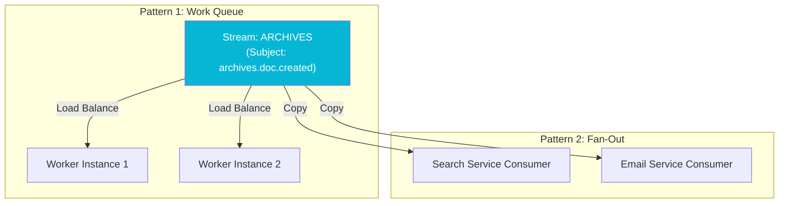

import Callout from '@components/Callout.astro';
import ImplementationNote from '@components/ImplementationNote.astro';

## Introduction

In distributed systems, we generally communicate in two ways:

1.  **"Do this work" (Commands)**: We want *one* service to handle the request. If we have 5 workers, we want to load balance.
2.  **"Something happened" (Events)**: We want *everyone* interested to know. If we have a Search Indexer and an Email Notifier, *both* must get the message.

NATS JetStream handles both using **Consumers**. A consumer is effectively a "View" into a Stream.

## Architecture Overview

The following diagram illustrates the two primary patterns.

**Scenario A: Work Queue (Load Balancing)**
Multiple workers bind to the *same* durable consumer name. NATS distributes messages round-robin.

**Scenario B: Fan-Out (Pub/Sub)**
Different services create *different* consumer names. Each consumer gets a full copy of the message stream.



## Pattern 1: Load Balanced Work Queue

This is ideal for expensive tasks like OCR or Video Transcoding. You can scale from 1 to 50 workers instantly just by starting more instances. The key is that they all share the **same durable name**.

```csharp
// All workers share this config
var consumerConfig = new ConsumerConfig("ocr_processor_group")
{
    // Filter only what we need
    FilterSubject = "archives.documents.uploaded",
    
    // Explicit Ack is MANDATORY for work queues
    AckPolicy = ConsumerConfigAckPolicy.Explicit,
    
    // How many messages to keep 'checked out' but un-acked?
    MaxAckPending = 10, 
    
    // If worker crashes, redeliver after 30s
    AckWait = TimeSpan.FromSeconds(30)
};

var consumer = await js.CreateOrUpdateConsumerAsync("ARCHIVES", consumerConfig);

// Process loop
await foreach (var msg in consumer.ConsumeAsync<DocUploadedEvent>())
{
    // If I process this, Worker 2 will NOT see it.
    Process(msg.Data);
    await msg.AckAsync();
}
```

<ImplementationNote>
For true Work Queue behavior (message deleted after processing), set the **Stream's** retention policy to `WorkQueue`. If the Stream is `Limits` (default), the message remains on disk even after Ack, but the Consumer cursor moves forward.
</ImplementationNote>

## Pattern 2: Interactive Fan-Out

In this pattern, we want to update the UI via SignalR/Blazor *and* update the Search Index. These are independent concerns.

Each service creates its **own consumer**.

```csharp
// Service A: Search Indexer
var searchConfig = new ConsumerConfig("search_indexer") { /*...*/ };

// Service B: Notification Service
var notifyConfig = new ConsumerConfig("notifications") { /*...*/ };
```

NATS guarantees that *every* active consumer gets a copy of the message pointer. They can process at different speeds. If the search indexer is down for maintenance, it will resume where it left off (because it's a Durable consumer).

## Ephemeral Consumers (Real-time UI)

For a Blazor UI showing a progress bar, we don't need persistence if the user closes the tab. We use **Ephemeral Consumers**.

```csharp
// No 'DurableName' provided = Ephemeral
// Consumer is deleted when connection closes
var consumer = await js.CreateConsumerAsync("ARCHIVES", new ConsumerConfig
{
    FilterSubject = "archives.documents.*",
    AckPolicy = ConsumerConfigAckPolicy.None, // Fire and Forget
    DeliverPolicy = ConsumerConfigDeliverPolicy.New // Only new messages
});

await foreach (var msg in consumer.ConsumeAsync<object>()) { /* Update UI */ }
```

## Handling Failures (Dead Letter Queues)

What if a message crashes the worker every time? We don't want an infinite loop.

```csharp
var config = new ConsumerConfig("processor")
{
    // Retry 3 times
    MaxDeliver = 3
};

// ... in loop ...
if (msg.Metadata.NumDelivered > 3)
{
    // Terminate: Tell NATS to stop sending this to me
    // Usually you'd publish to a DLQ subject first
    await msg.TermAsync(); 
}
```

## Conclusion

Understanding the distinction between Stream Retention and Consumer Configuration is the key to mastering JetStream. By manipulating the `DurableName` and `DeliverGroup`, you can switch between Competing Consumers (Queue) and Pub/Sub (Topic) patterns instantly without changing infrastructure.
