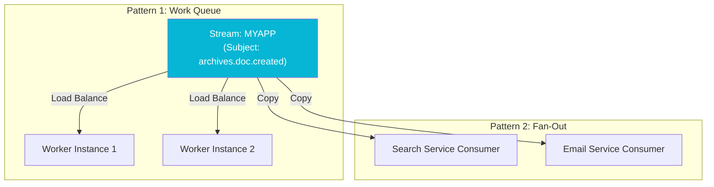

import Callout from '@components/Callout.astro';
import ImplementationNote from '@components/ImplementationNote.astro';
import ExternalCite from '@components/ExternalCite.astro';

When I first started building consumers for our NATS JetStream deployment on k3s, I made the classic mistake of giving every worker instance its own unique durable consumer name. The result was pure chaos: every message was delivered to every worker, and our OCR pipeline processed the same document five times in parallel. It took me a frustrating afternoon of reading the NATS documentation to understand that the durable name is the grouping mechanism — shared name means load balancing, unique name means fan-out. Once that distinction clicked, the rest of the consumer configuration fell into place.

## Introduction

In distributed systems, we generally communicate in two ways:

1.  **"Do this work" (Commands)**: We want *one* service to handle the request. If we have 5 workers, we want to load balance.
2.  **"Something happened" (Events)**: We want *everyone* interested to know. If we have a Search Indexer and an Email Notifier, *both* must get the message.

NATS JetStream handles both using **Consumers**. A consumer is effectively a "View" into a Stream.

<ExternalCite title="JetStream Consumers" url="https://docs.nats.io/nats-concepts/jetstream/consumers" author="NATS Authors" date="2024-03-20" />

## Architecture Overview

The following diagram illustrates the two primary patterns.

**Scenario A: Work Queue (Load Balancing)**
Multiple workers bind to the *same* durable consumer name. NATS distributes messages round-robin.

**Scenario B: Fan-Out (Pub/Sub)**
Different services create *different* consumer names. Each consumer gets a full copy of the message stream.


```mermaid
flowchart TD
    Stream["Stream: MYAPP\n(Subject: archives.doc.created)"]

    subgraph WorkQueue["Pattern 1: Work Queue"]
        Stream -->|Load Balance| Worker1["Worker Instance 1"]
        Stream -->|Load Balance| Worker2["Worker Instance 2"]
    end

    subgraph FanOut["Pattern 2: Fan-Out"]
        Stream -->|Copy| Search["Search Service Consumer"]
        Stream -->|Copy| Email["Email Service Consumer"]
    end

    classDef primary fill:#7c3aed,color:#fff
    classDef secondary fill:#06b6d4,color:#fff
    classDef db fill:#f43f5e,color:#fff
    classDef warning fill:#fbbf24,color:#000
    class Stream secondary
```

## Pattern 1: Load Balanced Work Queue

This is ideal for expensive tasks like OCR or Video Transcoding. You can scale from 1 to 50 workers instantly just by starting more instances. The key is that they all share the **same durable name**.

```csharp
// All workers share this config
var consumerConfig = new ConsumerConfig("ocr_processor_group")
{
    // Filter only what we need
    FilterSubject = "archives.documents.ocr.requested",

    // Explicit Ack is MANDATORY for work queues
    AckPolicy = ConsumerConfigAckPolicy.Explicit,

    // How many messages to keep 'checked out' but un-acked?
    MaxAckPending = 10,

    // If worker crashes, redeliver after 30s
    AckWait = TimeSpan.FromSeconds(30)
};

var consumer = await js.CreateOrUpdateConsumerAsync("MYAPP", consumerConfig);

// Process loop
await foreach (var msg in consumer.ConsumeAsync<DocUploadedEvent>())
{
    // If I process this, Worker 2 will NOT see it.
    Process(msg.Data);
    await msg.AckAsync();
}
```

<ExternalCite title="NATS Queue Groups" url="https://docs.nats.io/nats-concepts/core-nats/queue" author="NATS Authors" date="2024-03-20" />

<ImplementationNote>
For true Work Queue behavior (message deleted after processing), set the **Stream's** retention policy to `WorkQueue`. If the Stream is `Limits` (default), the message remains on disk even after Ack, but the Consumer cursor moves forward.
</ImplementationNote>

## Pattern 2: Interactive Fan-Out

In this pattern, we want to update the UI via SignalR/Blazor *and* update the Search Index. These are independent concerns.

Each service creates its **own consumer**.

```csharp
// Service A: Search Indexer
var searchConfig = new ConsumerConfig("search_indexer") { /*...*/ };

// Service B: Notification Service
var notifyConfig = new ConsumerConfig("notifications") { /*...*/ };
```

NATS guarantees that *every* active consumer gets a copy of the message pointer. They can process at different speeds. If the search indexer is down for maintenance, it will resume where it left off (because it's a Durable consumer).

<ExternalCite title="Enterprise Integration Patterns: Publish-Subscribe Channel" url="https://www.enterpriseintegrationpatterns.com/patterns/messaging/PublishSubscribeChannel.html" author="Gregor Hohpe" date="2023-11-01" />

<ImplementationNote>
I ran into a subtle issue with fan-out when one of our consumers — the search indexer — fell significantly behind the others during a bulk import. Because the stream had a `MaxMsgs` limit, older messages were being purged before the slow consumer could process them. The fix was to set the stream retention window appropriately and increase the storage limits, but the real lesson was that fan-out consumers with vastly different processing speeds need careful capacity planning. I now monitor consumer lag per durable name in Grafana and alert when any single consumer falls more than 500 messages behind.
</ImplementationNote>

## Ephemeral Consumers (Real-time UI)

For a Blazor UI showing a progress bar, we don't need persistence if the user closes the tab. We use **Ephemeral Consumers**.

```csharp
// No 'DurableName' provided = Ephemeral
// Consumer is deleted when connection closes
var consumer = await js.CreateConsumerAsync("MYAPP", new ConsumerConfig
{
    FilterSubject = "archives.documents.*",
    AckPolicy = ConsumerConfigAckPolicy.None, // Fire and Forget
    DeliverPolicy = ConsumerConfigDeliverPolicy.New // Only new messages
});

await foreach (var msg in consumer.ConsumeAsync<object>()) { /* Update UI */ }
```

<ExternalCite title="JetStream Model Deep Dive" url="https://nats.io/blog/jetstream-java-client-03-consume/" author="NATS Authors" date="2023-08-15" />

## Handling Failures (Dead Letter Queues)

What if a message crashes the worker every time? We don't want an infinite loop.

```csharp
var config = new ConsumerConfig("processor")
{
    // Retry 3 times
    MaxDeliver = 3
};

// ... in loop ...
if (msg.Metadata.NumDelivered > 3)
{
    // Terminate: Tell NATS to stop sending this to me
    // Usually you'd publish to a DLQ subject first
    await msg.TermAsync();
}
```

<ImplementationNote>
Redelivery loops were one of the most painful debugging experiences I had with JetStream. A malformed PDF caused our OCR worker to throw on every attempt, and with `MaxDeliver` initially set to the default (unlimited), the same poison message was redelivered thousands of times before I noticed. The worker appeared busy — CPU was high, logs showed activity — but no actual work was being done. Setting `MaxDeliver` to 3 and routing terminated messages to a dead letter subject gave me both protection against poison messages and a queue to inspect and replay them after fixing the underlying issue.
</ImplementationNote>

<ExternalCite title="Dead Letter Queue Pattern" url="https://www.enterpriseintegrationpatterns.com/patterns/messaging/DeadLetterChannel.html" author="Gregor Hohpe" date="2023-11-01" />

## Conclusion

Understanding the distinction between Stream Retention and Consumer Configuration is the key to mastering JetStream. By manipulating the `DurableName` and `DeliverGroup`, you can switch between Competing Consumers (Queue) and Pub/Sub (Topic) patterns instantly without changing infrastructure.

Looking back at the consumer patterns I have built over the past year, the most important takeaway is that consumer configuration is where correctness lives. The stream stores data, but the consumer determines how that data is delivered, acknowledged, and retried. Getting `MaxAckPending`, `AckWait`, and `MaxDeliver` right for each workload was the difference between a system that handled failures gracefully and one that spiraled into redelivery storms.

<ExternalCite title="Competing Consumers Pattern" url="https://www.enterpriseintegrationpatterns.com/patterns/messaging/CompetingConsumers.html" author="Gregor Hohpe" date="2023-11-01" />

## Next Steps

- Implement consumer-level rate limiting with `MaxAckPending` to prevent fast consumers from starving slower ones
- Build a dead letter queue processor that retries failed messages with exponential backoff
- Add consumer lag monitoring to Grafana and set up alerts for when any consumer falls behind
- Experiment with pull-based consumers for batch processing workloads where latency is less critical

## Further Reading

- [NATS JetStream Consumers Documentation](https://docs.nats.io/nats-concepts/jetstream/consumers)
- [Enterprise Integration Patterns: Competing Consumers](https://www.enterpriseintegrationpatterns.com/patterns/messaging/CompetingConsumers.html)
- [Enterprise Integration Patterns: Dead Letter Channel](https://www.enterpriseintegrationpatterns.com/patterns/messaging/DeadLetterChannel.html)
- [NATS .NET Client Library](https://github.com/nats-io/nats.net)
