import Callout from '@components/Callout.astro';
import ImplementationNote from '@components/ImplementationNote.astro';
import ExternalCite from '@components/ExternalCite.astro';

## Introduction

Your messaging system is the nervous system of your application. When NATS has problems—slow consumers, stream lag, connection storms—your entire platform feels the pain. But unlike a web server that simply returns errors, messaging failures often manifest as subtle symptoms: delayed notifications, missing events, or mysteriously stale data.

**Why NATS Observability Matters:**

- **Stream Health**: Know when JetStream consumers fall behind before users notice
- **Capacity Planning**: Track message rates and storage growth to scale proactively
- **Incident Response**: Correlate application issues with messaging metrics
- **SLA Compliance**: Measure and alert on end-to-end message latency

Production messaging systems require comprehensive monitoring. In this guide, we'll set up observability for NATS JetStream using Prometheus metrics, Grafana dashboards, and alerting rules.

## Architecture Overview

```mermaid
flowchart LR
    subgraph NATS["⚡ NATS Server"]
        N1["📊 :8222"]
        N2["/varz, /jsz<br/>/connz, /routez"]
    end

    subgraph Metrics["📈 Prometheus"]
        P1["🔄 Scrape"]
        P2["💾 Time-series storage"]
    end

    subgraph Visualization["📊 Grafana"]
        G1["🔍 Query"]
        G2["📉 Dashboards & Alerts"]
    end

    N1 -->|scrape| P1
    N2 -.-> N1
    P1 --> P2
    P2 -->|query| G1
    G1 --> G2

    classDef primary fill:#7c3aed,color:#fff
    classDef secondary fill:#06b6d4,color:#fff
    classDef db fill:#f43f5e,color:#fff
    classDef warning fill:#fbbf24,color:#000
    class NATS,Metrics secondary
    class Visualization db
```



## Enabling NATS Metrics

### Server Configuration

```yaml
# infrastructure/data-layer/nats/configmap.yaml
apiVersion: v1
kind: ConfigMap
metadata:
  name: nats-config
  namespace: data-layer
data:
  nats.conf: |
    # Server identification
    server_name: nats-0
    
    # Client connections
    port: 4222
    
    # HTTP monitoring
    http_port: 8222
    
    # JetStream configuration
    jetstream {
      store_dir: /data
      max_memory_store: 1Gi
      max_file_store: 10Gi
    }
    
    # Cluster configuration
    cluster {
      name: bluerobin-nats
      port: 6222
      routes: [
        nats://nats-0.nats.data-layer.svc.cluster.local:6222
        nats://nats-1.nats.data-layer.svc.cluster.local:6222
        nats://nats-2.nats.data-layer.svc.cluster.local:6222
      ]
    }
    
    # Logging
    debug: false
    trace: false
    logtime: true
    log_file: /var/log/nats/nats.log
```

### Prometheus Exporter Sidecar

```yaml
# infrastructure/data-layer/nats/statefulset.yaml
apiVersion: apps/v1
kind: StatefulSet
metadata:
  name: nats
  namespace: data-layer
spec:
  replicas: 3
  selector:
    matchLabels:
      app: nats
  template:
    spec:
      containers:
        - name: nats
          image: nats:2.10-alpine
          ports:
            - containerPort: 4222
              name: client
            - containerPort: 6222
              name: cluster
            - containerPort: 8222
              name: monitoring
          volumeMounts:
            - name: config
              mountPath: /etc/nats
            - name: data
              mountPath: /data
          resources:
            requests:
              memory: "512Mi"
              cpu: "200m"
            limits:
              memory: "1Gi"
              cpu: "1000m"
        
        # Prometheus exporter sidecar
        - name: prometheus-exporter
          image: natsio/prometheus-nats-exporter:0.14.0
          args:
            - -connz
            - -routez
            - -subz
            - -varz
            - -jsz=all
            - -channelz
            - http://localhost:8222
          ports:
            - containerPort: 7777
              name: metrics
          resources:
            requests:
              memory: "32Mi"
              cpu: "10m"
            limits:
              memory: "64Mi"
              cpu: "100m"
```

### ServiceMonitor for Prometheus

```yaml
# infrastructure/data-layer/nats/servicemonitor.yaml
apiVersion: monitoring.coreos.com/v1
kind: ServiceMonitor
metadata:
  name: nats
  namespace: data-layer
  labels:
    app: nats
spec:
  selector:
    matchLabels:
      app: nats
  endpoints:
    - port: metrics
      interval: 15s
      path: /metrics
  namespaceSelector:
    matchNames:
      - data-layer
---
apiVersion: v1
kind: Service
metadata:
  name: nats-metrics
  namespace: data-layer
  labels:
    app: nats
spec:
  selector:
    app: nats
  ports:
    - name: metrics
      port: 7777
      targetPort: metrics
```

## Key Metrics to Monitor

### Server Metrics

| Metric | Description | Alert Threshold |
|--------|-------------|-----------------|
| `gnatsd_varz_connections` | Active client connections | > 1000 |
| `gnatsd_varz_subscriptions` | Total subscriptions | > 10000 |
| `gnatsd_varz_in_msgs` | Messages received/sec | Baseline + 50% |
| `gnatsd_varz_out_msgs` | Messages sent/sec | Baseline + 50% |
| `gnatsd_varz_in_bytes` | Bytes received/sec | > 100MB/s |
| `gnatsd_varz_out_bytes` | Bytes sent/sec | > 100MB/s |
| `gnatsd_varz_slow_consumers` | Slow consumer count | > 0 |

### JetStream Metrics

| Metric | Description | Alert Threshold |
|--------|-------------|-----------------|
| `gnatsd_jsz_streams` | Number of streams | Monitor growth |
| `gnatsd_jsz_consumers` | Total consumers | Monitor growth |
| `gnatsd_jsz_messages` | Total messages | Storage capacity |
| `gnatsd_jsz_bytes` | Total storage used | > 80% of limit |
| `gnatsd_jsz_memory` | Memory used | > 80% of limit |

### Stream-Specific Metrics

```yaml
# These come from /jsz endpoint
gnatsd_jsz_stream_messages{stream="staging.archives.documents"}
gnatsd_jsz_stream_bytes{stream="staging.archives.documents"}
gnatsd_jsz_stream_consumer_count{stream="staging.archives.documents"}
gnatsd_jsz_stream_first_seq{stream="staging.archives.documents"}
gnatsd_jsz_stream_last_seq{stream="staging.archives.documents"}
```

## Grafana Dashboard

### Dashboard JSON

```json
{
  "title": "NATS JetStream",
  "uid": "nats-jetstream",
  "panels": [
    {
      "title": "Messages Per Second",
      "type": "timeseries",
      "gridPos": { "x": 0, "y": 0, "w": 12, "h": 8 },
      "targets": [
        {
          "expr": "rate(gnatsd_varz_in_msgs[1m])",
          "legendFormat": "In - {{pod}}"
        },
        {
          "expr": "rate(gnatsd_varz_out_msgs[1m])",
          "legendFormat": "Out - {{pod}}"
        }
      ]
    },
    {
      "title": "Active Connections",
      "type": "stat",
      "gridPos": { "x": 12, "y": 0, "w": 6, "h": 4 },
      "targets": [
        {
          "expr": "sum(gnatsd_varz_connections)",
          "legendFormat": "Connections"
        }
      ]
    },
    {
      "title": "Slow Consumers",
      "type": "stat",
      "gridPos": { "x": 18, "y": 0, "w": 6, "h": 4 },
      "targets": [
        {
          "expr": "sum(gnatsd_varz_slow_consumers)",
          "legendFormat": "Slow Consumers"
        }
      ],
      "fieldConfig": {
        "defaults": {
          "thresholds": {
            "steps": [
              { "value": 0, "color": "green" },
              { "value": 1, "color": "red" }
            ]
          }
        }
      }
    },
    {
      "title": "JetStream Storage",
      "type": "gauge",
      "gridPos": { "x": 12, "y": 4, "w": 12, "h": 4 },
      "targets": [
        {
          "expr": "sum(gnatsd_jsz_bytes) / sum(gnatsd_jsz_config_max_bytes) * 100",
          "legendFormat": "Storage Used %"
        }
      ],
      "fieldConfig": {
        "defaults": {
          "max": 100,
          "thresholds": {
            "steps": [
              { "value": 0, "color": "green" },
              { "value": 70, "color": "yellow" },
              { "value": 90, "color": "red" }
            ]
          }
        }
      }
    },
    {
      "title": "Stream Messages by Environment",
      "type": "timeseries",
      "gridPos": { "x": 0, "y": 8, "w": 24, "h": 8 },
      "targets": [
        {
          "expr": "gnatsd_jsz_stream_messages{stream=~\".*archives.*\"}",
          "legendFormat": "{{stream}}"
        }
      ]
    },
    {
      "title": "Consumer Lag",
      "type": "timeseries",
      "gridPos": { "x": 0, "y": 16, "w": 24, "h": 8 },
      "targets": [
        {
          "expr": "gnatsd_jsz_stream_last_seq - gnatsd_jsz_consumer_delivered_consumer_seq",
          "legendFormat": "{{consumer}} on {{stream}}"
        }
      ]
    }
  ]
}
```

<ImplementationNote>
Import this dashboard using Grafana's JSON model import feature, or create it as a ConfigMap for GitOps deployment.
</ImplementationNote>

## Alerting Rules

### PrometheusRule for NATS

```yaml
# infrastructure/platform/monitoring/nats-alerts.yaml
apiVersion: monitoring.coreos.com/v1
kind: PrometheusRule
metadata:
  name: nats-alerts
  namespace: monitoring
spec:
  groups:
    - name: nats.rules
      rules:
        # Slow consumers detected
        - alert: NATSSlowConsumers
          expr: gnatsd_varz_slow_consumers > 0
          for: 2m
          labels:
            severity: warning
          annotations:
            summary: "NATS slow consumers detected"
            description: "{{ $value }} slow consumers on {{ $labels.pod }}"
        
        # High message rate
        - alert: NATSHighMessageRate
          expr: rate(gnatsd_varz_in_msgs[5m]) > 10000
          for: 5m
          labels:
            severity: info
          annotations:
            summary: "High NATS message rate"
            description: "{{ $value | humanize }} msgs/sec on {{ $labels.pod }}"
        
        # JetStream storage nearly full
        - alert: NATSJetStreamStorageFull
          expr: |
            sum(gnatsd_jsz_bytes) / sum(gnatsd_jsz_config_max_bytes) * 100 > 80
          for: 5m
          labels:
            severity: warning
          annotations:
            summary: "JetStream storage > 80%"
            description: "Storage at {{ $value | humanize }}%"
        
        # JetStream storage critical
        - alert: NATSJetStreamStorageCritical
          expr: |
            sum(gnatsd_jsz_bytes) / sum(gnatsd_jsz_config_max_bytes) * 100 > 95
          for: 1m
          labels:
            severity: critical
          annotations:
            summary: "JetStream storage > 95%"
            description: "Storage at {{ $value | humanize }}%. Immediate action required."
        
        # Consumer lag building up
        - alert: NATSConsumerLag
          expr: |
            (gnatsd_jsz_stream_last_seq - gnatsd_jsz_consumer_delivered_consumer_seq) > 1000
          for: 5m
          labels:
            severity: warning
          annotations:
            summary: "NATS consumer lag detected"
            description: "Consumer {{ $labels.consumer }} has {{ $value }} messages behind"
        
        # Server not responding
        - alert: NATSServerDown
          expr: up{job="nats"} == 0
          for: 1m
          labels:
            severity: critical
          annotations:
            summary: "NATS server down"
            description: "NATS server {{ $labels.pod }} is not responding"
```

## Application-Level Metrics

### Custom Metrics in .NET

```csharp
// Infrastructure/Messaging/Metrics/NatsMetrics.cs
public static class NatsMetrics
{
    private static readonly Counter<long> MessagesPublished = 
        Meter.CreateCounter<long>(
            "nats.messages.published",
            "messages",
            "Number of messages published");
    
    private static readonly Counter<long> MessagesReceived = 
        Meter.CreateCounter<long>(
            "nats.messages.received",
            "messages",
            "Number of messages received");
    
    private static readonly Histogram<double> PublishDuration = 
        Meter.CreateHistogram<double>(
            "nats.publish.duration",
            "ms",
            "Time to publish message");
    
    private static readonly Histogram<double> ProcessingDuration = 
        Meter.CreateHistogram<double>(
            "nats.processing.duration",
            "ms",
            "Time to process message");
    
    private static readonly Meter Meter = new("BlueRobin.Nats", "1.0.0");
    
    public static void RecordPublish(string subject, long durationMs)
    {
        MessagesPublished.Add(1, new KeyValuePair<string, object?>("subject", subject));
        PublishDuration.Record(durationMs, new KeyValuePair<string, object?>("subject", subject));
    }
    
    public static void RecordReceive(string subject)
    {
        MessagesReceived.Add(1, new KeyValuePair<string, object?>("subject", subject));
    }
    
    public static void RecordProcessing(string subject, long durationMs, bool success)
    {
        ProcessingDuration.Record(
            durationMs,
            new KeyValuePair<string, object?>("subject", subject),
            new KeyValuePair<string, object?>("success", success));
    }
}
```

### Instrumented Publisher

```csharp
// Infrastructure/Messaging/InstrumentedNatsPublisher.cs
public sealed class InstrumentedNatsPublisher : INatsPublisher
{
    private readonly INatsConnection _nats;
    private readonly ILogger<InstrumentedNatsPublisher> _logger;
    
    public async Task PublishAsync<T>(
        string subject,
        T data,
        CancellationToken ct = default)
    {
        var sw = Stopwatch.StartNew();
        
        try
        {
            await _nats.PublishAsync(subject, data, cancellationToken: ct);
            
            sw.Stop();
            NatsMetrics.RecordPublish(subject, sw.ElapsedMilliseconds);
        }
        catch (Exception ex)
        {
            sw.Stop();
            _logger.LogError(ex, "Failed to publish to {Subject}", subject);
            throw;
        }
    }
}
```

## Health Checks

```csharp
// Infrastructure/HealthChecks/NatsHealthCheck.cs
public sealed class NatsHealthCheck : IHealthCheck
{
    private readonly INatsConnection _nats;
    
    public NatsHealthCheck(INatsConnection nats)
    {
        _nats = nats;
    }
    
    public async Task<HealthCheckResult> CheckHealthAsync(
        HealthCheckContext context,
        CancellationToken cancellationToken = default)
    {
        try
        {
            // Check connection state
            if (_nats.ConnectionState != NatsConnectionState.Open)
            {
                return HealthCheckResult.Unhealthy(
                    $"NATS connection state: {_nats.ConnectionState}");
            }
            
            // Ping test
            await _nats.PingAsync(cancellationToken);
            
            return HealthCheckResult.Healthy("NATS connection is healthy");
        }
        catch (Exception ex)
        {
            return HealthCheckResult.Unhealthy(
                "NATS health check failed",
                exception: ex);
        }
    }
}

// Registration
builder.Services.AddHealthChecks()
    .AddCheck<NatsHealthCheck>("nats", tags: ["ready", "messaging"]);
```

## CLI Monitoring

### NATS CLI Commands

```bash
# Install NATS CLI
brew install nats-io/nats-tools/nats

# Check server info
nats server info --server nats://192.168.0.6:30422

# List streams
nats stream ls --server nats://192.168.0.6:30422

# Stream details
nats stream info staging.archives.documents

# Consumer status
nats consumer info staging.archives.documents ocr-worker

# Watch messages in real-time
nats sub "staging.archives.documents.>" --server nats://192.168.0.6:30422

# Check JetStream account
nats account info
```

<Callout type="tip">
Create a `nats` context for your cluster to avoid repeating connection strings:
```bash
nats context add bluerobin --server nats://192.168.0.6:30422
nats context select bluerobin
```
</Callout>

## Summary

Effective NATS monitoring requires:

| Layer | Tools | Purpose |
|-------|-------|---------|
| Infrastructure | Prometheus Exporter | Collect metrics |
| Visualization | Grafana | Dashboards |
| Alerting | PrometheusRule | Proactive alerts |
| Application | .NET Meters | Custom metrics |
| Health | Health Checks | Readiness probes |
| CLI | nats-cli | Ad-hoc debugging |

With this observability stack, you'll have full visibility into your messaging infrastructure and can respond quickly to issues.

<ExternalCite 
  title="NATS Server Monitoring" 
  url="https://docs.nats.io/running-a-nats-service/nats_admin/monitoring"
  author="NATS Authors"
/>
