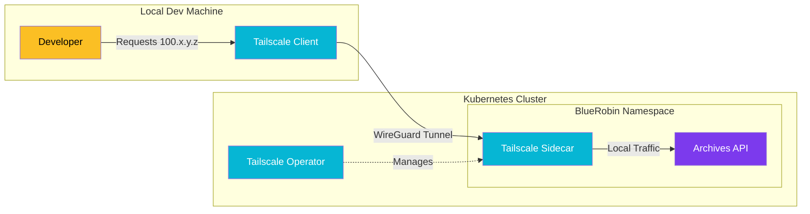

import Callout from '@components/Callout.astro';
import ImplementationNote from '@components/ImplementationNote.astro';
import CodeFile from '@components/CodeFile.astro';
import ExternalCite from '@components/ExternalCite.astro';

## Introduction

In a distributed homelab environment, secure and convenient access to internal services is paramount. Traditional methods involving port forwarding or complex VPN setups can be security risks or maintenance headaches. Tailscale offers a zero-config VPN based on WireGuard that simplifies this dramatically.

**Why Tailscale for Homelabs Matters:**

- **Zero Trust Security**: Services are not exposed to the public internet; only authenticated devices on your Tailnet can access them.
- **Ease of Access**: Access your K8s API, databases, and dashboards from anywhere without fiddling with router ports.
- **Seamless Integration**: Works beautifully with Kubernetes via sidecars or operators.

### What We'll Build

In this guide, we will implement a secure networking layer for our BlueRobin cluster. You will learn how to:

1. **Deploy Tailscale Operator**: Manage Tailscale resources directly from Kubernetes.
2. **Expose Services**: Securely expose the BlueRobin API and MinIO.
3. **Connect Locally**: Verify connectivity from a development machine.

## Architecture Overview

We utilize the Tailscale Kubernetes Operator to expose services. This allows us to define `Ingress` or `Service` resources that automatically get assigned IP addresses on our Tailnet.



## Implementation

### 1. Installing the Tailscale Operator

We use Helm to deploy the operator. Ensure you have your specific OAuth client credentials from the Tailscale admin console.

<CodeFile filename="helm-install.sh" language="bash">
```bash
helm repo add tailscale https://pkgs.tailscale.com/helmcharts
helm repo update

helm upgrade --install tailscale-operator tailscale/tailscale-operator \
  --namespace tailscale \
  --create-namespace \
  --set oauth.clientId=$TAILSCALE_CLIENT_ID \
  --set oauth.clientSecret=$TAILSCALE_CLIENT_SECRET \
  --wait
```
</CodeFile>

<Callout type="warning">
  Store your OAuth secrets securely! We use Infisical to inject these values during our GitOps pipeline runs.
</Callout>

### 2. Exposing the BlueRobin API

Instead of a standard `NodePort` or `LoadBalancer`, we annotate a Service to tell the Tailscale operator to expose it.

<CodeFile filename="archives-api-tailscale.yaml" language="yaml">
```yaml
apiVersion: v1
kind: Service
metadata:
  name: archives-api-ts
  namespace: archives
  annotations:
    tailscale.com/expose: "true"
    tailscale.com/hostname: "bluerobin-api"
spec:
  selector:
    app: archives-api
  ports:
    - protocol: TCP
      port: 80
      targetPort: 8080
```
</CodeFile>

Applying this manifest triggers the operator to create a proxy pod that joins your Tailnet with the hostname `bluerobin-api`.

### 3. Verifying Connectivity

Once the proxy pod is running, you can check your Tailscale admin console or simply try to ping the hostname from your local machine.

<ImplementationNote title="DNS Resolution">
  Ensure your local machine is using Tailscale's MagicDNS. This allows you to resolve `bluerobin-api` directly without needing to remember the 100.x.y.z IP address.
</ImplementationNote>

```bash
# From your local machine on the tailnet
curl http://bluerobin-api/health
# Output: Healthy
```

## Conclusion

By leveraging Tailscale, we've secured our BlueRobin infrastructure without sacrificing accessibility. We can now run database migrations, inspect Qdrant vectors, or debug the API from a coffee shop as securely as if we were sitting next to the server rack. This setup is foundational for a robust homelab DevOps lifecycle.
