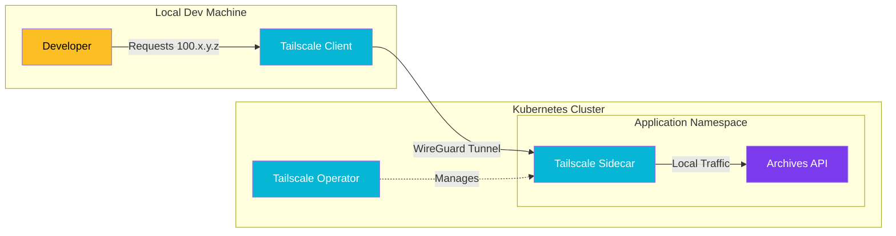

import Callout from '@components/Callout.astro';
import ImplementationNote from '@components/ImplementationNote.astro';
import CodeFile from '@components/CodeFile.astro';
import ExternalCite from '@components/ExternalCite.astro';

When I first configured Tailscale for my Kubernetes homelab, I expected a quick weekend project. Instead, I spent three days wrestling with subnet router advertisements that refused to propagate and DNS resolution loops between CoreDNS and MagicDNS. The moment I finally ran `curl http://myapp-api/health` from a coffee shop and got a response back in under 50ms, the frustration melted away. What followed was a deep dive into the Tailscale Kubernetes Operator that fundamentally changed how I think about remote access to homelab services. This article captures the lessons I wish I had when I started.

## Introduction

In a distributed homelab environment, secure and convenient access to internal services is paramount. Traditional methods involving port forwarding or complex VPN setups can be security risks or maintenance headaches. Tailscale offers a zero-config VPN based on WireGuard that simplifies this dramatically.

<ExternalCite title="How Tailscale Works" url="https://tailscale.com/blog/how-tailscale-works" author="Avery Pennarun" date="2023-03-15" />

**Why Tailscale for Homelabs Matters:**

- **Zero Trust Security**: Services are not exposed to the public internet; only authenticated devices on your Tailnet can access them.
- **Ease of Access**: Access your K8s API, databases, and dashboards from anywhere without fiddling with router ports.
- **Seamless Integration**: Works beautifully with Kubernetes via sidecars or operators.

### What We'll Build

In this guide, we will implement a secure networking layer for our Kubernetes cluster. You will learn how to:

1. **Deploy Tailscale Operator**: Manage Tailscale resources directly from Kubernetes.
2. **Expose Services**: Securely expose our API and MinIO.
3. **Connect Locally**: Verify connectivity from a development machine.

## Architecture Overview

We utilize the Tailscale Kubernetes Operator to expose services. This allows us to define `Ingress` or `Service` resources that automatically get assigned IP addresses on our Tailnet.

<ExternalCite title="Tailscale Kubernetes Operator" url="https://tailscale.com/kb/1236/kubernetes-operator" author="Tailscale" date="2024-06-01" />


```mermaid
flowchart LR
    subgraph "Local Dev Machine"
        DevUser[Developer]
        TailscaleClient[Tailscale Client]
    end

    subgraph "Kubernetes Cluster"
        Operator[Tailscale Operator]
        
        subgraph "Application Namespace"
            API[Archives API]
            Sidecar[Tailscale Sidecar]
        end
    end

    DevUser -->|Requests 100.x.y.z| TailscaleClient
    TailscaleClient -->|WireGuard Tunnel| Sidecar
    Sidecar -->|Local Traffic| API
    Operator -.->|Manages| Sidecar
    
    classDef primary fill:#7c3aed,color:#fff
    classDef secondary fill:#06b6d4,color:#fff
    classDef db fill:#f43f5e,color:#fff
    classDef warning fill:#fbbf24,color:#000

    class DevUser warning
    class API primary
    class Sidecar,Operator,TailscaleClient secondary
```

## Implementation

### 1. Installing the Tailscale Operator

We use Helm to deploy the operator. Ensure you have your specific OAuth client credentials from the Tailscale admin console.

<ExternalCite title="WireGuard: Next Generation Kernel Network Tunnel" url="https://www.wireguard.com/papers/wireguard.pdf" author="Jason A. Donenfeld" date="2017-06-28" />

<CodeFile filename="helm-install.sh" language="bash">
```bash
helm repo add tailscale https://pkgs.tailscale.com/helmcharts
helm repo update

helm upgrade --install tailscale-operator tailscale/tailscale-operator \
  --namespace tailscale \
  --create-namespace \
  --set oauth.clientId=$TAILSCALE_CLIENT_ID \
  --set oauth.clientSecret=$TAILSCALE_CLIENT_SECRET \
  --wait
```
</CodeFile>

<Callout type="warning">
  Store your OAuth secrets securely! We use Infisical to inject these values during our GitOps pipeline runs.
</Callout>

<ImplementationNote title="OAuth Credential Rotation">
I learned the hard way that Tailscale OAuth client secrets have an expiration window. After about three months, my operator pods started CrashLoopBackOff-ing at 2 AM because the secret had expired. The fix was straightforward once I understood it: I set up a CronJob that rotates the OAuth credentials through Infisical on a 60-day cycle and restarts the operator deployment. Now I sleep better knowing the credentials refresh well before they expire.
</ImplementationNote>

### 2. Exposing the API

Instead of a standard `NodePort` or `LoadBalancer`, we annotate a Service to tell the Tailscale operator to expose it.

<CodeFile filename="myapp-api-tailscale.yaml" language="yaml">
```yaml
apiVersion: v1
kind: Service
metadata:
  name: myapp-api-ts
  namespace: archives
  annotations:
    tailscale.com/expose: "true"
    tailscale.com/hostname: "myapp-api"
spec:
  selector:
    app: myapp-api
  ports:
    - protocol: TCP
      port: 80
      targetPort: 8080
```
</CodeFile>

Applying this manifest triggers the operator to create a proxy pod that joins your Tailnet with the hostname `myapp-api`.

<ExternalCite title="Tailscale on Kubernetes" url="https://tailscale.com/kb/1185/kubernetes" author="Tailscale" date="2024-02-10" />

### 3. Verifying Connectivity

Once the proxy pod is running, you can check your Tailscale admin console or simply try to ping the hostname from your local machine.

<ImplementationNote title="DNS Resolution">
  Ensure your local machine is using Tailscale's MagicDNS. This allows you to resolve `myapp-api` directly without needing to remember the 100.x.y.z IP address.
</ImplementationNote>

<ImplementationNote title="MagicDNS and CoreDNS Conflicts">
When I first enabled MagicDNS on my Tailnet, my cluster's CoreDNS started forwarding internal `.svc.cluster.local` queries to Tailscale's DNS resolver instead of handling them locally. This caused intermittent service discovery failures that were maddening to debug -- pods would sometimes resolve each other and sometimes not. The fix was adding explicit forward rules in my CoreDNS ConfigMap to ensure cluster-local domains never leave the cluster, while allowing MagicDNS to handle the Tailnet hostnames. I also had to set `--accept-dns=false` on the Tailscale operator pods themselves.
</ImplementationNote>

<ExternalCite title="MagicDNS" url="https://tailscale.com/kb/1081/magicdns" author="Tailscale" date="2024-01-20" />

```bash
# From your local machine on the tailnet
curl http://myapp-api/health
# Output: Healthy
```

## Conclusion

By leveraging Tailscale, we've secured our infrastructure without sacrificing accessibility. We can now run database migrations, inspect Qdrant vectors, or debug the API from a coffee shop as securely as if we were sitting next to the server rack. This setup is foundational for a robust homelab DevOps lifecycle.

Looking back at this project, what surprised me most was how much the networking layer simplified everything downstream. Before Tailscale, I had a brittle chain of SSH tunnels and port forwards that broke every time my ISP rotated my IP. Now, the entire tailnet is stable, self-healing, and I rarely think about connectivity anymore. The initial DNS headaches were worth the payoff of a genuinely zero-trust overlay network.

<ExternalCite title="Zero Trust Networks: Building Secure Systems in Untrusted Networks" url="https://www.oreilly.com/library/view/zero-trust-networks/9781491962183/" author="Evan Gilman and Doug Barth" date="2017-07-01" />

### Next Steps

- Explore **Tailscale ACLs** to enforce fine-grained access control between team members and services.
- Set up **subnet routers** for accessing non-Kubernetes resources like NAS devices and IoT hardware on your homelab network.
- Investigate **Tailscale SSH** to eliminate the need for managing SSH keys across your fleet.

### Further Reading

- [Tailscale ACLs Documentation](https://tailscale.com/kb/1018/acls) -- Defining granular access policies for your tailnet.
- [WireGuard Whitepaper](https://www.wireguard.com/papers/wireguard.pdf) -- The cryptographic foundations underlying Tailscale.
- [Kubernetes Networking Deep Dive](https://kubernetes.io/docs/concepts/cluster-administration/networking/) -- Understanding the CNI layer that Tailscale integrates with.
