import Callout from '@components/Callout.astro';
import ImplementationNote from '@components/ImplementationNote.astro';
import CodeFile from '@components/CodeFile.astro';
import ExternalCite from '@components/ExternalCite.astro';

## Introduction

At the start of the BlueRobin project, we wanted "production-grade" observability. We reached for SigNoz, an excellent open-source alternative to Datadog. It offers traces, metrics, and logs in a single pane of glass. However, after six months of running it in our homelab, we made the difficult decision to rip it out.

**Why Observability Matters:**

- **MTTR (Mean Time To Recovery)**: You can't fix what you can't see.
- **Performance Tuning**: Traces are essential for finding slow database queries.

### The Problem: The "Sidecar" Was Heavier Than the Car

SigNoz relies on ClickHouse for storage and the OpenTelemetry Collector for ingestion. While efficient at scale, the baseline resource footprint for a small cluster with idle periods was too high.

1.  **RAM Usage**: The `clickhouse` and `query-service` pods comfortably consumed 4-6GB of RAM just to stay alive.
2.  **Disk I/O**: Constant writing of small batches kept our drives busy.
3.  **Complexity**: Managing the internal health of the observability stack became a job in itself.

## Architecture Overview

The shift from SigNoz to a lightweight stack fundamentally changed our resource footprint:

```mermaid
flowchart TB
    subgraph Before["❌ Heavy Stack (SigNoz)"]
        direction TB
        B_Apps["🔌 .NET Apps"] -->|"OTLP"| B_Collector["📡 OTel Collector"]
        B_Collector --> B_Click["💾 ClickHouse\n4-6GB RAM"]
        B_Collector --> B_Query["🔍 Query Service\n1GB RAM"]
        B_Query --> B_UI["🖼️ SigNoz UI"]
    end

    subgraph After["✅ Light Stack"]
        direction TB
        A_Apps["🔌 .NET Apps"] -->|"stdout"| A_Fluent["📥 Fluent Bit\n64MB RAM"]
        A_Fluent --> A_Loki["📋 Loki\n256MB RAM"]
        A_Apps -->|"scrape"| A_Prom["📊 Prometheus\n256MB RAM"]
        A_Loki --> A_Grafana["📈 Grafana"]
        A_Prom --> A_Grafana
    end

    classDef primary fill:#7c3aed,color:#fff
    classDef secondary fill:#06b6d4,color:#fff
    classDef db fill:#f43f5e,color:#fff
    classDef warning fill:#fbbf24,color:#000
    class Before db
    class After secondary
```



**Resource Comparison**:
| Component | SigNoz Stack | Lightweight Stack |
|-----------|-------------|------------------|
| **Logs** | ClickHouse (4GB) | Loki (256MB) |
| **Metrics** | ClickHouse (shared) | Prometheus (256MB) |
| **Traces** | ClickHouse + Query | *On-demand Jaeger* |
| **Total Idle RAM** | ~6GB | ~600MB |

## Architecture Change

We simplified. We kept OpenTelemetry in our application code (instrumentation) but changed where we sent the data.

```mermaid
flowchart TD
    subgraph Apps
        API[.NET API]
        Workers[.NET Workers]
    end

    subgraph "Old Stack (SigNoz)"
        API -.->|OTLP| OTelCollector
        OTelCollector --> ClickHouse
        OTelCollector --> QueryService
    end

    subgraph "New Stack (Lightweight)"
        API -->|Stdout| FluentBit
        FluentBit -->|Logs| Loki
        API -->|Scrape| Prometheus
        Prometheus -->|Metrics| Grafana
    end
    
    classDef primary fill:#7c3aed,color:#fff
    classDef secondary fill:#06b6d4,color:#fff
    classDef db fill:#f43f5e,color:#fff
    classDef warning fill:#fbbf24,color:#000
    class "Old Stack (SigNoz)" db
    class "New Stack (Lightweight)" secondary
```

## Section 1: Embracing Structured Logs

Instead of relying on heavy distributed tracing for every request, we leaned into **Serilog**. By logging structured JSON to stdout, we could let Kubernetes handle the collection.

<Callout type="info" title="Correlation IDs">
    We still generate a `TraceId` for every request and inject it into the logging context. This allows us to grep for a single ID across all service logs without needing a full tracing backend.
</Callout>

```csharp
// Program.cs configuration
Log.Logger = new LoggerConfiguration()
    .WriteTo.Console(new JsonFormatter())
    .Enrich.FromLogContext()
    .CreateLogger();
```

## Section 2: Metrics Are Cheap

We kept Prometheus. It is incredibly efficient. We run a small instance that scrapes our .NET endpoints (via `prometheus-net`) and stores weeks of data in just a few hundred megabytes.

This answers the "Is it up?" and "Is it slow?" questions perfectly well for a homelab environment.

## Section 3: When Do You Need Tracing?

We discovered that we rarely looked at traces unless we were actively debugging performance. For this, we can run a temporary Jaeger instance efficiently, or simply use the development environment for deep profiling. In production (homelab), valid log patterns usually point to the culprit (e.g., "TimeoutException connects to Postgres").

## Conclusion

SigNoz is a fantastic tool for teams that need full-blown APM and have the infrastructure budget to support it. But for a homelab or small-scale startup, the operational overhead can outweigh the benefits. Moving to Loki (for logs) and Prometheus (for metrics) reduced our idle RAM usage by over 5GB—resources we promptly reallocated to running better AI models.

**Next Steps**:
- See the [hardware](/blog/homelab-setup-truenas-server-guide) where we reclaimed those resources.
- Read about our [architectural journey](/blog/architecture-decision-cloud-to-homelab).
