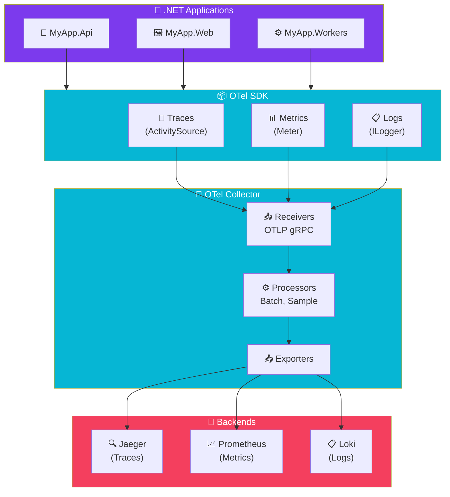

import Callout from '@components/Callout.astro';
import ImplementationNote from '@components/ImplementationNote.astro';
import CodeFile from '@components/CodeFile.astro';
import ExternalCite from '@components/ExternalCite.astro';

When I first tackled observability for our distributed system, I made the classic mistake of reaching for application logs and hoping they would tell me what was going wrong. Spoiler: they did not. It was not until I invested properly in OpenTelemetry that I could actually trace a request from the API gateway through NATS messaging, into the OCR worker, and back to the database. The clarity it provided was transformative, and I genuinely cannot imagine running a microservices system without it now. This guide captures every lesson I learned setting up comprehensive instrumentation in .NET.

## Introduction

When a user reports "the app is slow," where do you start looking? In a distributed system with APIs, workers, databases, and external services, the problem could be anywhere. Without proper instrumentation, you're debugging in the dark.

<ExternalCite title="OpenTelemetry Specification" url="https://opentelemetry.io/docs/specs/otel/" author="OpenTelemetry" date="2024" />

**Why OpenTelemetry Matters:**

- **Vendor Neutral**: One instrumentation works with any backend (Jaeger, Zipkin, SigNoz, Datadog)
- **Complete Picture**: Traces, metrics, and logs with correlated context
- **Automatic Instrumentation**: HTTP clients, EF Core, and ASP.NET Core instrumented out-of-the-box
- **Custom Spans**: Add business-specific tracing without framework coupling

OpenTelemetry has become the industry standard for observability instrumentation. By adopting it in our project, we can switch backends without rewriting code, and our traces follow requests across every service boundary.

## Architecture Overview

OpenTelemetry instruments your application and exports telemetry to a collector, which routes it to your observability backend:


```mermaid
flowchart TB
    subgraph Apps["🔌 .NET Applications"]
        API["📡 MyApp.Api"]
        Web["🖼️ MyApp.Web"]
        Workers["⚙️ MyApp.Workers"]
    end

    subgraph SDK["📦 OTel SDK"]
        Traces["📍 Traces\n(ActivitySource)"]
        Metrics["📊 Metrics\n(Meter)"]
        Logs["📋 Logs\n(ILogger)"]
    end

    subgraph Collector["📡 OTel Collector"]
        Recv["📥 Receivers\nOTLP gRPC"]
        Proc["⚙️ Processors\nBatch, Sample"]
        Exp["📤 Exporters"]
    end

    subgraph Backends["💾 Backends"]
        Jaeger["🔍 Jaeger\n(Traces)"]
        Prom["📈 Prometheus\n(Metrics)"]
        Loki["📋 Loki\n(Logs)"]
    end

    API --> SDK
    Web --> SDK
    Workers --> SDK

    Traces --> Recv
    Metrics --> Recv
    Logs --> Recv

    Recv --> Proc --> Exp
    Exp --> Jaeger
    Exp --> Prom
    Exp --> Loki

    classDef primary fill:#7c3aed,color:#fff
    classDef secondary fill:#06b6d4,color:#fff
    classDef db fill:#f43f5e,color:#fff
    classDef warning fill:#fbbf24,color:#000
    class Apps primary
    class SDK,Collector secondary
    class Backends db
```

**Data Flow**:
1. **SDK**: Captures spans, metrics, and logs from your application code
2. **Exporter**: Sends telemetry via OTLP (OpenTelemetry Protocol)
3. **Collector**: Batches, samples, and routes to multiple backends
4. **Backends**: Store and visualize your observability data

OpenTelemetry provides vendor-neutral observability instrumentation. This guide covers implementing comprehensive tracing, metrics, and logging in .NET applications.

## Package Installation

```xml
<!-- MyApp.Api.csproj -->
<PackageReference Include="OpenTelemetry.Extensions.Hosting" Version="1.9.0" />
<PackageReference Include="OpenTelemetry.Instrumentation.AspNetCore" Version="1.9.0" />
<PackageReference Include="OpenTelemetry.Instrumentation.Http" Version="1.9.0" />
<PackageReference Include="OpenTelemetry.Instrumentation.EntityFrameworkCore" Version="1.0.0-beta.12" />
<PackageReference Include="OpenTelemetry.Exporter.OpenTelemetryProtocol" Version="1.9.0" />
```

<ExternalCite title="OpenTelemetry .NET Getting Started" url="https://opentelemetry.io/docs/languages/net/getting-started/" author="OpenTelemetry" date="2024" />

## Tracing Configuration

### Basic Setup

```csharp
// Program.cs
builder.Services.AddOpenTelemetry()
    .ConfigureResource(resource => resource
        .AddService(
            serviceName: "myapp-api",
            serviceVersion: Assembly.GetExecutingAssembly().GetName().Version?.ToString() ?? "1.0.0",
            serviceInstanceId: Environment.MachineName)
        .AddAttributes(new[]
        {
            new KeyValuePair<string, object>("deployment.environment",
                builder.Environment.EnvironmentName.ToLowerInvariant())
        }))
    .WithTracing(tracing => tracing
        .AddSource(ActivitySources.Api.Name)
        .AddSource(ActivitySources.Infrastructure.Name)
        .AddAspNetCoreInstrumentation(options =>
        {
            options.Filter = ctx => !ctx.Request.Path.StartsWithSegments("/health");
            options.RecordException = true;
            options.EnrichWithHttpRequest = (activity, request) =>
            {
                activity.SetTag("http.request.header.x-request-id",
                    request.Headers["X-Request-Id"].FirstOrDefault());
            };
        })
        .AddHttpClientInstrumentation(options =>
        {
            options.RecordException = true;
            options.FilterHttpRequestMessage = msg =>
                msg.RequestUri?.Host != "localhost";
        })
        .AddEntityFrameworkCoreInstrumentation(options =>
        {
            options.SetDbStatementForText = true;
            options.SetDbStatementForStoredProcedure = true;
        })
        .AddOtlpExporter(options =>
        {
            options.Endpoint = new Uri(builder.Configuration["Otlp:Endpoint"]!);
            options.Protocol = OtlpExportProtocol.Grpc;
        }));
```

<ImplementationNote title="Filtering Health Check Noise">
When I first enabled ASP.NET Core automatic instrumentation, I was overwhelmed by the volume of traces. Kubernetes health probes were hitting our `/health` endpoint every 10 seconds across multiple pods, generating thousands of useless spans per hour. Adding the `Filter` option to exclude health check paths was one of the first things I did, and it immediately made the trace data useful. I also learned to filter out localhost calls from HttpClient instrumentation, since inter-service calls through the sidecar proxy were cluttering the trace view.
</ImplementationNote>

### Activity Sources

```csharp
// Infrastructure/Telemetry/ActivitySources.cs
public static class ActivitySources
{
    public static readonly ActivitySource Api = new("MyApp.Api", "1.0.0");
    public static readonly ActivitySource Infrastructure = new("MyApp.Infrastructure", "1.0.0");
    public static readonly ActivitySource Workers = new("MyApp.Workers", "1.0.0");
}
```

## Custom Instrumentation

### Service Tracing

```csharp
// Application/Services/DocumentService.cs
public sealed class DocumentService : IDocumentService
{
    private readonly IDocumentRepository _repository;
    private readonly IEmbeddingService _embeddings;
    private readonly ILogger<DocumentService> _logger;

    public async Task<Document> ProcessDocumentAsync(
        DocumentId documentId,
        CancellationToken ct = default)
    {
        using var activity = ActivitySources.Api.StartActivity("ProcessDocument");
        activity?.SetTag("document.id", documentId.Value);

        try
        {
            // Add event for document retrieval
            activity?.AddEvent(new ActivityEvent("FetchingDocument"));
            var document = await _repository.GetByIdAsync(documentId, ct);

            if (document is null)
            {
                activity?.SetStatus(ActivityStatusCode.Error, "Document not found");
                throw new DocumentNotFoundException(documentId);
            }

            activity?.SetTag("document.name", document.Name);
            activity?.SetTag("document.size", document.Size);

            // Generate embeddings with child span
            using (var embeddingActivity = ActivitySources.Api.StartActivity("GenerateEmbeddings"))
            {
                embeddingActivity?.SetTag("content.length", document.Content?.Length ?? 0);

                var embeddings = await _embeddings.GenerateAsync(document.Content!, ct);

                embeddingActivity?.SetTag("embeddings.count", embeddings.Length);
                document.SetEmbeddings(embeddings);
            }

            await _repository.UpdateAsync(document, ct);

            activity?.SetStatus(ActivityStatusCode.Ok);
            return document;
        }
        catch (Exception ex)
        {
            activity?.SetStatus(ActivityStatusCode.Error, ex.Message);
            activity?.RecordException(ex);
            throw;
        }
    }
}
```

<ImplementationNote>
Use `using var activity = ActivitySource.StartActivity()` to automatically end the span when the scope exits. The null-conditional operator handles cases where sampling decides not to record the span.
</ImplementationNote>

## Metrics Configuration

### Metrics Setup

```csharp
// Program.cs
builder.Services.AddOpenTelemetry()
    .WithMetrics(metrics => metrics
        .AddMeter("MyApp.Api")
        .AddMeter("MyApp.Documents")
        .AddAspNetCoreInstrumentation()
        .AddHttpClientInstrumentation()
        .AddRuntimeInstrumentation()
        .AddProcessInstrumentation()
        .AddView("http.server.request.duration", new ExplicitBucketHistogramConfiguration
        {
            Boundaries = new[] { 0.005, 0.01, 0.025, 0.05, 0.1, 0.25, 0.5, 1, 2.5, 5, 10 }
        })
        .AddOtlpExporter(options =>
        {
            options.Endpoint = new Uri(builder.Configuration["Otlp:Endpoint"]!);
        }));
```

<ExternalCite title="OpenTelemetry Metrics API for .NET" url="https://opentelemetry.io/docs/languages/net/instrumentation/#metrics" author="OpenTelemetry" date="2024" />

### Custom Metrics

```csharp
// Infrastructure/Telemetry/DocumentMetrics.cs
public sealed class DocumentMetrics : IDisposable
{
    private readonly Meter _meter;
    private readonly Counter<long> _documentsProcessed;
    private readonly Counter<long> _processingErrors;
    private readonly Histogram<double> _processingDuration;
    private readonly ObservableGauge<int> _pendingDocuments;

    private int _pendingCount;

    public DocumentMetrics()
    {
        _meter = new Meter("MyApp.Documents", "1.0.0");

        _documentsProcessed = _meter.CreateCounter<long>(
            "documents.processed",
            unit: "{document}",
            description: "Number of documents processed");

        _processingErrors = _meter.CreateCounter<long>(
            "documents.processing.errors",
            unit: "{error}",
            description: "Number of document processing errors");

        _processingDuration = _meter.CreateHistogram<double>(
            "documents.processing.duration",
            unit: "ms",
            description: "Document processing duration");

        _pendingDocuments = _meter.CreateObservableGauge(
            "documents.pending",
            () => _pendingCount,
            unit: "{document}",
            description: "Number of documents pending processing");
    }

    public void RecordProcessed(string documentType)
    {
        _documentsProcessed.Add(1,
            new KeyValuePair<string, object?>("document.type", documentType));
    }

    public void RecordError(string errorType)
    {
        _processingErrors.Add(1,
            new KeyValuePair<string, object?>("error.type", errorType));
    }

    public void RecordDuration(double milliseconds, string documentType)
    {
        _processingDuration.Record(milliseconds,
            new KeyValuePair<string, object?>("document.type", documentType));
    }

    public void SetPendingCount(int count) => _pendingCount = count;

    public void Dispose() => _meter.Dispose();
}
```

### Using Metrics

```csharp
// Application/Services/DocumentProcessingService.cs
public sealed class DocumentProcessingService : IDocumentProcessingService
{
    private readonly DocumentMetrics _metrics;
    private readonly ILogger<DocumentProcessingService> _logger;

    public async Task ProcessAsync(Document document, CancellationToken ct)
    {
        var sw = Stopwatch.StartNew();

        try
        {
            await ProcessInternalAsync(document, ct);

            sw.Stop();
            _metrics.RecordProcessed(document.Type);
            _metrics.RecordDuration(sw.Elapsed.TotalMilliseconds, document.Type);
        }
        catch (Exception ex)
        {
            _metrics.RecordError(ex.GetType().Name);
            throw;
        }
    }
}
```

## Logging Integration

### Structured Logging Setup

```csharp
// Program.cs
builder.Logging.ClearProviders();
builder.Logging.AddOpenTelemetry(options =>
{
    options.IncludeFormattedMessage = true;
    options.IncludeScopes = true;
    options.ParseStateValues = true;
    options.AddOtlpExporter(otlpOptions =>
    {
        otlpOptions.Endpoint = new Uri(builder.Configuration["Otlp:Endpoint"]!);
    });
});
```

### Contextual Logging

```csharp
// Application/Services/DocumentService.cs
public async Task<Document> GetByIdAsync(DocumentId id, CancellationToken ct)
{
    using var scope = _logger.BeginScope(new Dictionary<string, object>
    {
        ["DocumentId"] = id.Value,
        ["Operation"] = "GetDocument"
    });

    _logger.LogInformation("Fetching document {DocumentId}", id.Value);

    var document = await _repository.GetByIdAsync(id, ct);

    if (document is null)
    {
        _logger.LogWarning("Document {DocumentId} not found", id.Value);
        return null;
    }

    _logger.LogDebug("Document {DocumentId} retrieved, size: {Size} bytes",
        id.Value, document.Size);

    return document;
}
```

<Callout type="tip">
Use `BeginScope` to add contextual information that appears in all log entries within the scope. This is automatically correlated with traces through the trace ID.
</Callout>

## Baggage and Context Propagation

### Custom Context

```csharp
// Api/Middleware/BaggageMiddleware.cs
public sealed class BaggageMiddleware
{
    private readonly RequestDelegate _next;

    public BaggageMiddleware(RequestDelegate next) => _next = next;

    public async Task InvokeAsync(HttpContext context)
    {
        // Extract user info and add to baggage
        if (context.User.Identity?.IsAuthenticated == true)
        {
            var userId = context.User.FindFirst("app_user_id")?.Value;
            if (userId is not null)
            {
                Baggage.SetBaggage("user.id", userId);
                Activity.Current?.SetTag("user.id", userId);
            }
        }

        // Add request ID
        var requestId = context.Request.Headers["X-Request-Id"].FirstOrDefault()
            ?? Guid.NewGuid().ToString("N");
        Baggage.SetBaggage("request.id", requestId);
        context.Response.Headers["X-Request-Id"] = requestId;

        await _next(context);
    }
}
```

<ExternalCite title="W3C Trace Context Specification" url="https://www.w3.org/TR/trace-context/" author="W3C" date="2024" />

## Sampling Configuration

### Adaptive Sampling

```csharp
// Program.cs
builder.Services.AddOpenTelemetry()
    .WithTracing(tracing => tracing
        .SetSampler(new ParentBasedSampler(new TraceIdRatioBasedSampler(0.1))) // 10% sampling
        // Or use adaptive sampling
        .SetSampler(new AlwaysOnSampler()) // In development
    );

// Custom sampler for specific conditions
public sealed class DocumentProcessingSampler : Sampler
{
    public override SamplingResult ShouldSample(in SamplingParameters parameters)
    {
        // Always sample errors
        if (parameters.Tags?.Any(t => t.Key == "error" && (bool)t.Value!) == true)
        {
            return new SamplingResult(SamplingDecision.RecordAndSample);
        }

        // Sample 10% of normal requests
        return Random.Shared.NextDouble() < 0.1
            ? new SamplingResult(SamplingDecision.RecordAndSample)
            : new SamplingResult(SamplingDecision.Drop);
    }
}
```

<ImplementationNote title="Getting Sampling Right in Production">
I initially deployed with `AlwaysOnSampler` in production because I wanted complete visibility. Within hours, our collector was overwhelmed and started dropping spans. The storage costs were also alarming. Switching to 10% ratio-based sampling felt like flying blind at first, but I quickly realized that for identifying patterns and anomalies, 10% of high-traffic data is more than sufficient. The key insight was configuring the custom sampler to always capture error traces at 100% -- that way, we never miss a failure even when sampling aggressively.
</ImplementationNote>

## Configuration Summary

```csharp
// Infrastructure/Extensions/TelemetryExtensions.cs
public static class TelemetryExtensions
{
    public static IServiceCollection AddAppTelemetry(
        this IServiceCollection services,
        IConfiguration configuration,
        string serviceName)
    {
        services.AddSingleton<DocumentMetrics>();

        services.AddOpenTelemetry()
            .ConfigureResource(resource => resource
                .AddService(serviceName)
                .AddAttributes(new[]
                {
                    new KeyValuePair<string, object>("deployment.environment",
                        configuration["Environment"] ?? "development")
                }))
            .WithTracing(tracing => tracing
                .AddSource("MyApp.*")
                .AddAspNetCoreInstrumentation(o => o.RecordException = true)
                .AddHttpClientInstrumentation(o => o.RecordException = true)
                .AddEntityFrameworkCoreInstrumentation()
                .AddOtlpExporter(o => o.Endpoint = new Uri(configuration["Otlp:Endpoint"]!)))
            .WithMetrics(metrics => metrics
                .AddMeter("MyApp.*")
                .AddAspNetCoreInstrumentation()
                .AddRuntimeInstrumentation()
                .AddOtlpExporter(o => o.Endpoint = new Uri(configuration["Otlp:Endpoint"]!)));

        return services;
    }
}
```

## Summary

| Signal | Purpose | Key Instruments |
|--------|---------|-----------------|
| Traces | Request flow | Activities, Spans |
| Metrics | Aggregates | Counters, Histograms, Gauges |
| Logs | Events | Structured logs with trace correlation |

OpenTelemetry provides unified observability that integrates seamlessly with SigNoz, Jaeger, Prometheus, and other backends.

Implementing OpenTelemetry was one of those investments that paid for itself almost immediately. The first time I used a distributed trace to pinpoint a slow database query that was hidden behind three layers of service calls, I knew there was no going back. If you are running any kind of distributed system, I cannot recommend strongly enough that you invest in proper instrumentation from day one. The debugging time it saves is enormous, and the confidence it gives you when deploying changes to production is invaluable.

<ExternalCite title="OpenTelemetry .NET Documentation" url="https://opentelemetry.io/docs/languages/net/" author="OpenTelemetry" date="2024" />

### Next Steps

- Integrate OpenTelemetry traces with [Benchmarking and Stress Testing](/microservices-benchmarking-and-stress-testing) to correlate load patterns with trace data.
- Add custom metrics for business-level KPIs like document processing throughput and error rates by category.
- Configure the OpenTelemetry Collector with tail-based sampling for smarter trace retention in high-traffic environments.
- Explore building custom Grafana dashboards that combine traces, metrics, and logs into a single pane of glass.

### Further Reading


<ExternalCite title="OpenTelemetry .NET Documentation" url="https://opentelemetry.io/docs/languages/net/" author="OpenTelemetry Authors" date="2024" />

<ExternalCite title="Distributed Tracing in Practice by Austin Parker et al." url="https://www.oreilly.com/library/view/distributed-tracing-in/9781492056621/" author="Austin Parker" date="2024" />

<ExternalCite title="SigNoz Documentation" url="https://signoz.io/docs/" author="Signoz" date="2024" />

<ExternalCite title="OpenTelemetry Collector Configuration" url="https://opentelemetry.io/docs/collector/configuration/" author="OpenTelemetry Authors" date="2024" />
