import Callout from '@components/Callout.astro';
import ImplementationNote from '@components/ImplementationNote.astro';
import ExternalCite from '@components/ExternalCite.astro';

## Introduction

When a user reports "the app is slow," where do you start looking? In a distributed system with APIs, workers, databases, and external services, the problem could be anywhere. Without proper instrumentation, you're debugging in the dark.

**Why OpenTelemetry Matters:**

- **Vendor Neutral**: One instrumentation works with any backend (Jaeger, Zipkin, SigNoz, Datadog)
- **Complete Picture**: Traces, metrics, and logs with correlated context
- **Automatic Instrumentation**: HTTP clients, EF Core, and ASP.NET Core instrumented out-of-the-box
- **Custom Spans**: Add business-specific tracing without framework coupling

OpenTelemetry has become the industry standard for observability instrumentation. By adopting it in BlueRobin, we can switch backends without rewriting code, and our traces follow requests across every service boundary.

## Architecture Overview

OpenTelemetry instruments your application and exports telemetry to a collector, which routes it to your observability backend:

```mermaid
flowchart TB
    subgraph Apps["🔌 .NET Applications"]
        API["📡 Archives.Api"]
        Web["🖼️ Archives.Web"]
        Workers["⚙️ Archives.Workers"]
    end

    subgraph SDK["📦 OTel SDK"]
        Traces["📍 Traces\n(ActivitySource)"]
        Metrics["📊 Metrics\n(Meter)"]
        Logs["📋 Logs\n(ILogger)"]
    end

    subgraph Collector["📡 OTel Collector"]
        Recv["📥 Receivers\nOTLP gRPC"]
        Proc["⚙️ Processors\nBatch, Sample"]
        Exp["📤 Exporters"]
    end

    subgraph Backends["💾 Backends"]
        Jaeger["🔍 Jaeger\n(Traces)"]
        Prom["📈 Prometheus\n(Metrics)"]
        Loki["📋 Loki\n(Logs)"]
    end

    API --> SDK
    Web --> SDK
    Workers --> SDK
    
    Traces --> Recv
    Metrics --> Recv
    Logs --> Recv
    
    Recv --> Proc --> Exp
    Exp --> Jaeger
    Exp --> Prom
    Exp --> Loki

    classDef primary fill:#7c3aed,color:#fff
    classDef secondary fill:#06b6d4,color:#fff
    classDef db fill:#f43f5e,color:#fff
    classDef warning fill:#fbbf24,color:#000
    class Apps primary
    class SDK,Collector secondary
    class Backends db
```



**Data Flow**:
1. **SDK**: Captures spans, metrics, and logs from your application code
2. **Exporter**: Sends telemetry via OTLP (OpenTelemetry Protocol)
3. **Collector**: Batches, samples, and routes to multiple backends
4. **Backends**: Store and visualize your observability data

OpenTelemetry provides vendor-neutral observability instrumentation. This guide covers implementing comprehensive tracing, metrics, and logging in .NET applications.

## Package Installation

```xml
<!-- Archives.Api.csproj -->
<PackageReference Include="OpenTelemetry.Extensions.Hosting" Version="1.9.0" />
<PackageReference Include="OpenTelemetry.Instrumentation.AspNetCore" Version="1.9.0" />
<PackageReference Include="OpenTelemetry.Instrumentation.Http" Version="1.9.0" />
<PackageReference Include="OpenTelemetry.Instrumentation.EntityFrameworkCore" Version="1.0.0-beta.12" />
<PackageReference Include="OpenTelemetry.Exporter.OpenTelemetryProtocol" Version="1.9.0" />
```

## Tracing Configuration

### Basic Setup

```csharp
// Program.cs
builder.Services.AddOpenTelemetry()
    .ConfigureResource(resource => resource
        .AddService(
            serviceName: "archives-api",
            serviceVersion: Assembly.GetExecutingAssembly().GetName().Version?.ToString() ?? "1.0.0",
            serviceInstanceId: Environment.MachineName)
        .AddAttributes(new[]
        {
            new KeyValuePair<string, object>("deployment.environment", 
                builder.Environment.EnvironmentName.ToLowerInvariant())
        }))
    .WithTracing(tracing => tracing
        .AddSource(ActivitySources.Api.Name)
        .AddSource(ActivitySources.Infrastructure.Name)
        .AddAspNetCoreInstrumentation(options =>
        {
            options.Filter = ctx => !ctx.Request.Path.StartsWithSegments("/health");
            options.RecordException = true;
            options.EnrichWithHttpRequest = (activity, request) =>
            {
                activity.SetTag("http.request.header.x-request-id", 
                    request.Headers["X-Request-Id"].FirstOrDefault());
            };
        })
        .AddHttpClientInstrumentation(options =>
        {
            options.RecordException = true;
            options.FilterHttpRequestMessage = msg => 
                msg.RequestUri?.Host != "localhost";
        })
        .AddEntityFrameworkCoreInstrumentation(options =>
        {
            options.SetDbStatementForText = true;
            options.SetDbStatementForStoredProcedure = true;
        })
        .AddOtlpExporter(options =>
        {
            options.Endpoint = new Uri(builder.Configuration["Otlp:Endpoint"]!);
            options.Protocol = OtlpExportProtocol.Grpc;
        }));
```

### Activity Sources

```csharp
// Infrastructure/Telemetry/ActivitySources.cs
public static class ActivitySources
{
    public static readonly ActivitySource Api = new("BlueRobin.Api", "1.0.0");
    public static readonly ActivitySource Infrastructure = new("BlueRobin.Infrastructure", "1.0.0");
    public static readonly ActivitySource Workers = new("BlueRobin.Workers", "1.0.0");
}
```

## Custom Instrumentation

### Service Tracing

```csharp
// Application/Services/DocumentService.cs
public sealed class DocumentService : IDocumentService
{
    private readonly IDocumentRepository _repository;
    private readonly IEmbeddingService _embeddings;
    private readonly ILogger<DocumentService> _logger;

    public async Task<Document> ProcessDocumentAsync(
        DocumentId documentId, 
        CancellationToken ct = default)
    {
        using var activity = ActivitySources.Api.StartActivity("ProcessDocument");
        activity?.SetTag("document.id", documentId.Value);

        try
        {
            // Add event for document retrieval
            activity?.AddEvent(new ActivityEvent("FetchingDocument"));
            var document = await _repository.GetByIdAsync(documentId, ct);
            
            if (document is null)
            {
                activity?.SetStatus(ActivityStatusCode.Error, "Document not found");
                throw new DocumentNotFoundException(documentId);
            }

            activity?.SetTag("document.name", document.Name);
            activity?.SetTag("document.size", document.Size);

            // Generate embeddings with child span
            using (var embeddingActivity = ActivitySources.Api.StartActivity("GenerateEmbeddings"))
            {
                embeddingActivity?.SetTag("content.length", document.Content?.Length ?? 0);
                
                var embeddings = await _embeddings.GenerateAsync(document.Content!, ct);
                
                embeddingActivity?.SetTag("embeddings.count", embeddings.Length);
                document.SetEmbeddings(embeddings);
            }

            await _repository.UpdateAsync(document, ct);
            
            activity?.SetStatus(ActivityStatusCode.Ok);
            return document;
        }
        catch (Exception ex)
        {
            activity?.SetStatus(ActivityStatusCode.Error, ex.Message);
            activity?.RecordException(ex);
            throw;
        }
    }
}
```

<ImplementationNote>
Use `using var activity = ActivitySource.StartActivity()` to automatically end the span when the scope exits. The null-conditional operator handles cases where sampling decides not to record the span.
</ImplementationNote>

## Metrics Configuration

### Metrics Setup

```csharp
// Program.cs
builder.Services.AddOpenTelemetry()
    .WithMetrics(metrics => metrics
        .AddMeter("BlueRobin.Api")
        .AddMeter("BlueRobin.Documents")
        .AddAspNetCoreInstrumentation()
        .AddHttpClientInstrumentation()
        .AddRuntimeInstrumentation()
        .AddProcessInstrumentation()
        .AddView("http.server.request.duration", new ExplicitBucketHistogramConfiguration
        {
            Boundaries = new[] { 0.005, 0.01, 0.025, 0.05, 0.1, 0.25, 0.5, 1, 2.5, 5, 10 }
        })
        .AddOtlpExporter(options =>
        {
            options.Endpoint = new Uri(builder.Configuration["Otlp:Endpoint"]!);
        }));
```

### Custom Metrics

```csharp
// Infrastructure/Telemetry/DocumentMetrics.cs
public sealed class DocumentMetrics : IDisposable
{
    private readonly Meter _meter;
    private readonly Counter<long> _documentsProcessed;
    private readonly Counter<long> _processingErrors;
    private readonly Histogram<double> _processingDuration;
    private readonly ObservableGauge<int> _pendingDocuments;
    
    private int _pendingCount;

    public DocumentMetrics()
    {
        _meter = new Meter("BlueRobin.Documents", "1.0.0");
        
        _documentsProcessed = _meter.CreateCounter<long>(
            "documents.processed",
            unit: "{document}",
            description: "Number of documents processed");
        
        _processingErrors = _meter.CreateCounter<long>(
            "documents.processing.errors",
            unit: "{error}",
            description: "Number of document processing errors");
        
        _processingDuration = _meter.CreateHistogram<double>(
            "documents.processing.duration",
            unit: "ms",
            description: "Document processing duration");
        
        _pendingDocuments = _meter.CreateObservableGauge(
            "documents.pending",
            () => _pendingCount,
            unit: "{document}",
            description: "Number of documents pending processing");
    }

    public void RecordProcessed(string documentType)
    {
        _documentsProcessed.Add(1, 
            new KeyValuePair<string, object?>("document.type", documentType));
    }

    public void RecordError(string errorType)
    {
        _processingErrors.Add(1,
            new KeyValuePair<string, object?>("error.type", errorType));
    }

    public void RecordDuration(double milliseconds, string documentType)
    {
        _processingDuration.Record(milliseconds,
            new KeyValuePair<string, object?>("document.type", documentType));
    }

    public void SetPendingCount(int count) => _pendingCount = count;

    public void Dispose() => _meter.Dispose();
}
```

### Using Metrics

```csharp
// Application/Services/DocumentProcessingService.cs
public sealed class DocumentProcessingService : IDocumentProcessingService
{
    private readonly DocumentMetrics _metrics;
    private readonly ILogger<DocumentProcessingService> _logger;

    public async Task ProcessAsync(Document document, CancellationToken ct)
    {
        var sw = Stopwatch.StartNew();
        
        try
        {
            await ProcessInternalAsync(document, ct);
            
            sw.Stop();
            _metrics.RecordProcessed(document.Type);
            _metrics.RecordDuration(sw.Elapsed.TotalMilliseconds, document.Type);
        }
        catch (Exception ex)
        {
            _metrics.RecordError(ex.GetType().Name);
            throw;
        }
    }
}
```

## Logging Integration

### Structured Logging Setup

```csharp
// Program.cs
builder.Logging.ClearProviders();
builder.Logging.AddOpenTelemetry(options =>
{
    options.IncludeFormattedMessage = true;
    options.IncludeScopes = true;
    options.ParseStateValues = true;
    options.AddOtlpExporter(otlpOptions =>
    {
        otlpOptions.Endpoint = new Uri(builder.Configuration["Otlp:Endpoint"]!);
    });
});
```

### Contextual Logging

```csharp
// Application/Services/DocumentService.cs
public async Task<Document> GetByIdAsync(DocumentId id, CancellationToken ct)
{
    using var scope = _logger.BeginScope(new Dictionary<string, object>
    {
        ["DocumentId"] = id.Value,
        ["Operation"] = "GetDocument"
    });

    _logger.LogInformation("Fetching document {DocumentId}", id.Value);
    
    var document = await _repository.GetByIdAsync(id, ct);
    
    if (document is null)
    {
        _logger.LogWarning("Document {DocumentId} not found", id.Value);
        return null;
    }

    _logger.LogDebug("Document {DocumentId} retrieved, size: {Size} bytes", 
        id.Value, document.Size);
    
    return document;
}
```

<Callout type="tip">
Use `BeginScope` to add contextual information that appears in all log entries within the scope. This is automatically correlated with traces through the trace ID.
</Callout>

## Baggage and Context Propagation

### Custom Context

```csharp
// Api/Middleware/BaggageMiddleware.cs
public sealed class BaggageMiddleware
{
    private readonly RequestDelegate _next;

    public BaggageMiddleware(RequestDelegate next) => _next = next;

    public async Task InvokeAsync(HttpContext context)
    {
        // Extract user info and add to baggage
        if (context.User.Identity?.IsAuthenticated == true)
        {
            var userId = context.User.FindFirst("bluerobin_id")?.Value;
            if (userId is not null)
            {
                Baggage.SetBaggage("user.id", userId);
                Activity.Current?.SetTag("user.id", userId);
            }
        }

        // Add request ID
        var requestId = context.Request.Headers["X-Request-Id"].FirstOrDefault() 
            ?? Guid.NewGuid().ToString("N");
        Baggage.SetBaggage("request.id", requestId);
        context.Response.Headers["X-Request-Id"] = requestId;

        await _next(context);
    }
}
```

## Sampling Configuration

### Adaptive Sampling

```csharp
// Program.cs
builder.Services.AddOpenTelemetry()
    .WithTracing(tracing => tracing
        .SetSampler(new ParentBasedSampler(new TraceIdRatioBasedSampler(0.1))) // 10% sampling
        // Or use adaptive sampling
        .SetSampler(new AlwaysOnSampler()) // In development
    );

// Custom sampler for specific conditions
public sealed class DocumentProcessingSampler : Sampler
{
    public override SamplingResult ShouldSample(in SamplingParameters parameters)
    {
        // Always sample errors
        if (parameters.Tags?.Any(t => t.Key == "error" && (bool)t.Value!) == true)
        {
            return new SamplingResult(SamplingDecision.RecordAndSample);
        }

        // Sample 10% of normal requests
        return Random.Shared.NextDouble() < 0.1
            ? new SamplingResult(SamplingDecision.RecordAndSample)
            : new SamplingResult(SamplingDecision.Drop);
    }
}
```

## Configuration Summary

```csharp
// Infrastructure/Extensions/TelemetryExtensions.cs
public static class TelemetryExtensions
{
    public static IServiceCollection AddBlueRobinTelemetry(
        this IServiceCollection services,
        IConfiguration configuration,
        string serviceName)
    {
        services.AddSingleton<DocumentMetrics>();
        
        services.AddOpenTelemetry()
            .ConfigureResource(resource => resource
                .AddService(serviceName)
                .AddAttributes(new[]
                {
                    new KeyValuePair<string, object>("deployment.environment", 
                        configuration["Environment"] ?? "development")
                }))
            .WithTracing(tracing => tracing
                .AddSource("BlueRobin.*")
                .AddAspNetCoreInstrumentation(o => o.RecordException = true)
                .AddHttpClientInstrumentation(o => o.RecordException = true)
                .AddEntityFrameworkCoreInstrumentation()
                .AddOtlpExporter(o => o.Endpoint = new Uri(configuration["Otlp:Endpoint"]!)))
            .WithMetrics(metrics => metrics
                .AddMeter("BlueRobin.*")
                .AddAspNetCoreInstrumentation()
                .AddRuntimeInstrumentation()
                .AddOtlpExporter(o => o.Endpoint = new Uri(configuration["Otlp:Endpoint"]!)));

        return services;
    }
}
```

## Summary

| Signal | Purpose | Key Instruments |
|--------|---------|-----------------|
| Traces | Request flow | Activities, Spans |
| Metrics | Aggregates | Counters, Histograms, Gauges |
| Logs | Events | Structured logs with trace correlation |

OpenTelemetry provides unified observability that integrates seamlessly with SigNoz, Jaeger, Prometheus, and other backends.

<ExternalCite 
  title="OpenTelemetry .NET Documentation" 
  url="https://opentelemetry.io/docs/languages/net/"
  author="OpenTelemetry"
/>
