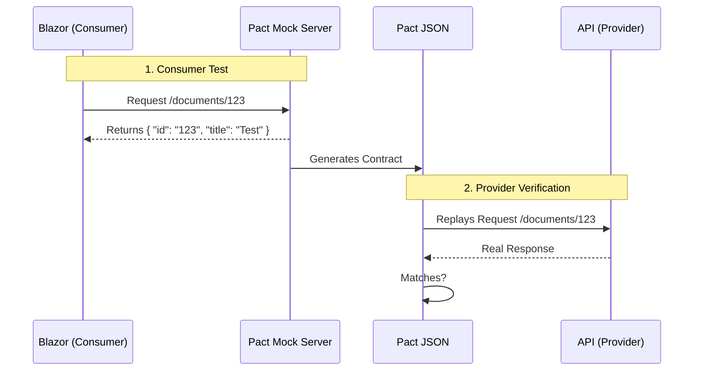

import Callout from '@components/Callout.astro';
import ImplementationNote from '@components/ImplementationNote.astro';
import CodeFile from '@components/CodeFile.astro';
import ExternalCite from '@components/ExternalCite.astro';

## Introduction

In a distributed system, integration testing is painful. You have to spin up the Database, the API, the Identity Provider, and the event bus just to check if the Frontend can successfully call `GET /documents`.

**Consumer-Driven Contract Testing (CDCT)** solves this by flipping the model. The **Consumer** (Blazor App) defines what it needs, and the **Provider** (FastEndpoints API) verifies it can fulfill that need.

**Why Pact Matters:**

- **Faster Feedback**: No need to deploy to test.
- **Decoupling**: Teams can move independently as long as the contract holds.
- **Documentation**: The contract (Pact file) serves as live API documentation.

### What We'll Build

1. **Define the Consumer Test**: Blazor checks if it can parse the specific response it expects.
2. **Generate the Pact File**: A JSON file describing the request/response pairs.
3. **Verify the Provider**: The API runs a test suite that replays these requests against itself.

## Architecture Overview



## Section 1: The Consumer Test (Blazor)

We use `PactNet`. In our Blazor unit test project, we set up a mock server.

```csharp
[Fact]
public async Task GetDocument_ReturnsCorrectData()
{
    // Arrange
    var pact = Pact.V3("BlueRobin.Web", "BlueRobin.Api", Config);
    
    await pact.UponReceiving("A valid request for a document")
        .Given("Document 123 exists")
        .WithRequest(HttpMethod.Get, "/api/documents/123")
        .WillRespond()
        .WithStatus(HttpStatusCode.OK)
        .WithJsonBody(new { id = "123", title = Match.Type("Contract.pdf") });

    // Act
    await pact.VerifyAsync(async ctx =>
    {
        var client = new DocumentClient(ctx.MockServerUri);
        var result = await client.GetDocumentAsync("123");
        
        Assert.Equal("123", result.Id);
    });
}
```

This acts as a unit test for our HTTP Client code, but it also outputs a `pact.json` file.

## Section 2: The Provider Verification (API)

On the backend side, we don't write new tests. We simply tell Pact to verify the generated file against our running API (or an in-memory test server).

<Callout type="info" title="State Management">
    The `.Given("Document 123 exists")` clause maps to a "Provider State". We must inject data into the test database to ensure ID 123 actually exists during verification.
</Callout>

```csharp
public class ApiContractTests : IClassFixture<WebApplicationFactory<Program>>
{
    [Fact]
    public void EnsureApiHonorsPact()
    {
        var config = new PactVerifierConfig();
        
        IPactVerifier verifier = new PactVerifier(config);
        
        verifier
            .ServiceProvider("BlueRobin.Api", _factory.Server.BaseAddress)
            .HonoursPactWith("BlueRobin.Web")
            .PactUri("path/to/pact.json") // Or from Pact Broker
            .Verify();
    }
}
```

## Conclusion

With Pact, we catch breaking changes at build time. If the backend developer renames `title` to `documentTitle`, the Provider Verification step fails immediately, well before deployment.

**Next Steps**:
- After verification, run [Microservices Stress Testing](/blog/microservices-benchmarking-and-stress-testing) to ensure performance.
- Learn how we optimize the deployment in [Optimizing Kubernetes Images](/blog/kubernetes-image-optimization-small-pods).
