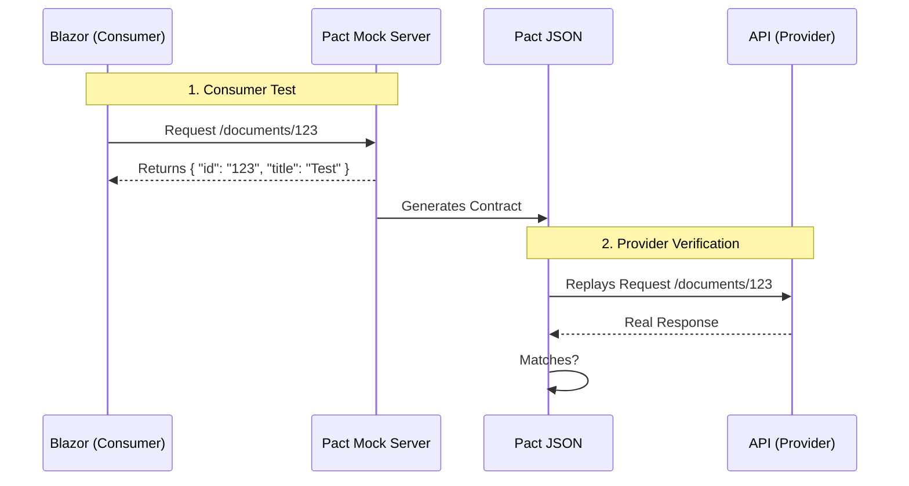

import Callout from '@components/Callout.astro';
import ImplementationNote from '@components/ImplementationNote.astro';
import CodeFile from '@components/CodeFile.astro';
import ExternalCite from '@components/ExternalCite.astro';

When I first started building our Blazor frontend against the FastEndpoints API, deployments were a recurring source of anxiety. More than once, a seemingly innocent backend change -- renaming a JSON property or changing a date format -- broke the frontend in production. Traditional integration tests caught some issues, but they required spinning up the entire infrastructure stack and were painfully slow. Discovering consumer-driven contract testing with Pact was a turning point that gave me confidence to ship independently without fear of breaking the contract between services.

## Introduction

In a distributed system, integration testing is painful. You have to spin up the Database, the API, the Identity Provider, and the event bus just to check if the Frontend can successfully call `GET /documents`.

**Consumer-Driven Contract Testing (CDCT)** solves this by flipping the model. The **Consumer** (Blazor App) defines what it needs, and the **Provider** (FastEndpoints API) verifies it can fulfill that need.

<ExternalCite title="Consumer-Driven Contracts: A Service Evolution Pattern" url="https://martinfowler.com/articles/consumerDrivenContracts.html" author="Ian Robinson" date="2006" />

**Why Pact Matters:**

- **Faster Feedback**: No need to deploy to test.
- **Decoupling**: Teams can move independently as long as the contract holds.
- **Documentation**: The contract (Pact file) serves as live API documentation.

### What We'll Build

1. **Define the Consumer Test**: Blazor checks if it can parse the specific response it expects.
2. **Generate the Pact File**: A JSON file describing the request/response pairs.
3. **Verify the Provider**: The API runs a test suite that replays these requests against itself.

## Architecture Overview


```mermaid
sequenceDiagram
    participant Blazor as Blazor (Consumer)
    participant Mock as Pact Mock Server
    participant PactFile as Pact JSON
    participant API as API (Provider)

    Note over Blazor, Mock: 1. Consumer Test
    Blazor->>Mock: Request /documents/123
    Mock-->>Blazor: Returns { "id": "123", "title": "Test" }
    Mock->>PactFile: Generates Contract

    Note over PactFile, API: 2. Provider Verification
    PactFile->>API: Replays Request /documents/123
    API-->>PactFile: Real Response
    PactFile->>PactFile: Matches?
```

<ExternalCite title="Pact Documentation: How Pact Works" url="https://docs.pact.io/getting_started/how_pact_works" author="Pact Foundation" date="2024" />

## Section 1: The Consumer Test (Blazor)

We use `PactNet`. In our Blazor unit test project, we set up a mock server.

<ExternalCite title="PactNet: .NET Implementation of Pact" url="https://github.com/pact-foundation/pact-net" author="Pact Foundation" date="2024" />

```csharp
[Fact]
public async Task GetDocument_ReturnsCorrectData()
{
    // Arrange
    var pact = Pact.V3("MyApp.Web", "MyApp.Api", Config);

    await pact.UponReceiving("A valid request for a document")
        .Given("Document 123 exists")
        .WithRequest(HttpMethod.Get, "/api/documents/123")
        .WillRespond()
        .WithStatus(HttpStatusCode.OK)
        .WithJsonBody(new { id = "123", title = Match.Type("Contract.pdf") });

    // Act
    await pact.VerifyAsync(async ctx =>
    {
        var client = new DocumentClient(ctx.MockServerUri);
        var result = await client.GetDocumentAsync("123");

        Assert.Equal("123", result.Id);
    });
}
```

This acts as a unit test for our HTTP Client code, but it also outputs a `pact.json` file.

<ImplementationNote title="Choosing the Right Level of Contract Strictness">
When I wrote my first consumer tests, I made contracts far too strict -- I was matching exact field values instead of types. Every time the backend team changed a test fixture's title from "Contract.pdf" to "Invoice.pdf", the contract broke even though the actual schema was unchanged. I had to learn to use `Match.Type()` for values I care about structurally and only use exact matching for fields that are truly invariant, like status codes and error types. Finding that balance between too loose (missing real breaks) and too strict (constant false failures) took several iterations.
</ImplementationNote>

## Section 2: The Provider Verification (API)

On the backend side, we don't write new tests. We simply tell Pact to verify the generated file against our running API (or an in-memory test server).

<Callout type="info" title="State Management">
    The `.Given("Document 123 exists")` clause maps to a "Provider State". We must inject data into the test database to ensure ID 123 actually exists during verification.
</Callout>

```csharp
public class ApiContractTests : IClassFixture<WebApplicationFactory<Program>>
{
    [Fact]
    public void EnsureApiHonorsPact()
    {
        var config = new PactVerifierConfig();

        IPactVerifier verifier = new PactVerifier(config);

        verifier
            .ServiceProvider("MyApp.Api", _factory.Server.BaseAddress)
            .HonoursPactWith("MyApp.Web")
            .PactUri("path/to/pact.json") // Or from Pact Broker
            .Verify();
    }
}
```

<ExternalCite title="Contract Testing vs Integration Testing" url="https://pactflow.io/blog/contract-testing-vs-integration-testing/" author="PactFlow" date="2023" />

<ImplementationNote title="Provider State Setup Was Harder Than Expected">
The provider verification side turned out to be trickier than the consumer side. Each `.Given()` clause in the consumer tests requires a corresponding provider state handler that sets up the right data. For "Document 123 exists," I had to seed the test database with that specific document. As contracts grew, managing dozens of provider states became messy. I ended up building a small state management framework that reads state names and dispatches to setup methods automatically, which drastically reduced the boilerplate and made adding new states a one-line change.
</ImplementationNote>

<ImplementationNote title="Integrating Pact Broker into CI/CD">
I initially shared Pact JSON files by committing them to a shared git repository, which quickly became unmanageable as we added more consumer-provider pairs. Moving to a Pact Broker was a game changer -- it gave us versioned contracts, a visual dependency graph, and the ability to use "can-i-deploy" checks in our CI pipeline. The "can-i-deploy" command alone saved us from multiple production incidents by blocking deployments when contracts were not verified against the latest provider version.
</ImplementationNote>

<ExternalCite title="Pact Broker: Contract Management" url="https://docs.pact.io/pact_broker" author="Pact Foundation" date="2024" />

## Conclusion

With Pact, we catch breaking changes at build time. If the backend developer renames `title` to `documentTitle`, the Provider Verification step fails immediately, well before deployment.

Adopting contract testing fundamentally changed how our team collaborates. Before Pact, frontend and backend developers had to synchronize deployments and cross their fingers that nothing would break at the integration boundary. Now, each team ships independently with a confidence that comes from knowing the contract is verified on every build. The initial investment in setting up PactNet and the Pact Broker was modest compared to the hours of debugging and emergency hotfixes it has prevented. If you work in a system with multiple services communicating over HTTP, contract testing should be a non-negotiable part of your testing strategy.

### Next Steps

- After verification, run [Microservices Stress Testing](/microservices-benchmarking-and-stress-testing) to ensure performance under load.
- Learn how we optimize the deployment in [Optimizing Kubernetes Images](/kubernetes-image-optimization-small-pods).
- Extend contract testing to cover asynchronous messaging contracts (NATS events) using Pact's message interaction support.
- Set up "can-i-deploy" gates in your CI/CD pipeline to prevent deploying incompatible service versions.

### Further Reading

- [Pact Documentation: Getting Started](https://docs.pact.io/) -- Comprehensive guide to contract testing concepts and implementation across languages.
- [Contract Testing in Microservices by Sam Newman](https://samnewman.io/patterns/deployment/contract-testing/) -- Context from the author of "Building Microservices" on where contract tests fit in the testing pyramid.
- [PactFlow: Enterprise Contract Testing Platform](https://pactflow.io/) -- Managed Pact Broker with additional features for teams at scale.
- [Testing Microservices with Consumer-Driven Contracts (ThoughtWorks)](https://www.thoughtworks.com/insights/articles/consumer-driven-contracts-pattern) -- Practical guide with real-world examples of implementing CDCT.
