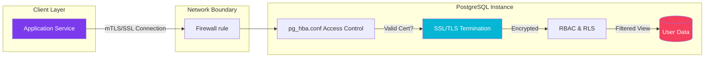

import Callout from '@components/Callout.astro';
import ImplementationNote from '@components/ImplementationNote.astro';
import CodeFile from '@components/CodeFile.astro';
import ExternalCite from '@components/ExternalCite.astro';

## Introduction

In a data-intensive architecture like BlueRobin, the database is often the "crown jewel" target for attackers. Default PostgreSQL configurations prioritize compatibility over security, leaving gaps that can be exploited in a distributed system. "High Assurance" means going beyond basic passwords—it means Defense in Depth.

**Why Database Security Matters:**

- **Data Sovereignty**: Preventing unauthorized access, even from internal compromised services.
- **Compliance**: Meeting strict regulatory requirements for data encryption in transit and at rest.
- **Least Privilege**: Ensuring services can only touch the specific data they own.

### What We'll Build

In this guide, we will implement a hardened PostgreSQL security model. You will learn how to:

1. **Lock Down the Network**: Configure `pg_hba.conf` to reject non-SSL connections.
2. **Design RBAC**: Implement a Role-Based Access Control system that separates schema owners from application users.
3. **Enforce RLS**: Use Row-Level Security to segregate tenant data at the database engine level.
4. **Manage Secrets**: Rotate and inject credentials using Infisical.

## Architecture Overview

We rely on a layered approach where security controls exist at the network, transport, and data levels.



## Section 1: Network & Transport Security

The first line of defense is ensuring that *connection attempts* themselves are strictly controlled and encrypted.

### Configuring `pg_hba.conf`

The `pg_hba.conf` (Host-Based Authentication) file controls client authentication. We want to explicitly deny unencrypted connections and require strong authentication methods.

<Callout type="warning" title="Security Risk">
    Never use `trust` authentication in non-local environments. It allows any user to connect without a password.
</Callout>

```bash
# TYPE  DATABASE        USER            ADDRESS                 METHOD

# 1. Localhost is safe for maintenance
local   all             all                                     scram-sha-256

# 2. REJECT non-SSL connections from outside
hostnossl all           all             0.0.0.0/0               reject

# 3. REQUIRE SSL for all remote connections
hostssl all             all             0.0.0.0/0               scram-sha-256
```

### Forcing SSL/TLS

Merely allowing SSL isn't enough; we must enforce it. Additionally, we use `scram-sha-256` for password hashing, which prevents replay attacks and is significantly stronger than `md5`.

```sql
-- Check if SSL is currently active
SELECT ssl_is_used();

-- Enforce SSL 
ALTER SYSTEM SET ssl = 'on';
ALTER SYSTEM SET password_encryption = 'scram-sha-256';
```

## Section 2: Role-Based Access Control (RBAC)

We separate users into three categories: **Owners** (Schema management), **Writers** (App logic), and **Readers** (Reporting/Backup).

### The Hierarchy

```sql
-- 1. Create a group role for the application (No login)
CREATE ROLE app_readwrite NOLOGIN;

-- 2. Create the actual application user
CREATE USER bluerobin_api WITH PASSWORD '...';

-- 3. Grant the group to the user
GRANT app_readwrite TO bluerobin_api;
```

This ensures we manage permissions on the *group*, not individual users.

## Section 3: Row-Level Security (RLS)

RLS allows us to define policies on tables that restrict which rows are returned based on the current user's context. This is critical for multi-tenant applications.

<ImplementationNote title="Performance Impact">
    RLS adds a check to every query. Ensure your policy columns (e.g., `owner_id`) are indexed.
</ImplementationNote>

### Enabling RLS

```sql
-- Enable RLS on the table
ALTER TABLE documents ENABLE ROW LEVEL SECURITY;

-- Create a policy that restricts access to the owner
CREATE POLICY owner_access_policy ON documents
    FOR ALL
    TO app_readwrite
    USING (owner_id = current_setting('app.current_user_id')::uuid);
```

In the application (C#), we set the context variable before executing queries:

```csharp
await using var cleanConnection = _dataSource.CreateConnection();
await cleanConnection.OpenAsync();

// Set the session variable for RLS
using var command = cleanConnection.CreateCommand();
command.CommandText = $"SET app.current_user_id = '{userId}';";
await command.ExecuteNonQueryAsync();

// Now perform queries safely
```

## Section 4: Credential Management with Infisical

Hardcoding connection strings is a vulnerability. We use Infisical to inject secrets at runtime.

1. **Store the Password**: Save `ARCHIVES_DB_PASSWORD` in Infisical.
2. **Inject in CI/CD**:
   
```yaml
- name: Inject Secrets
  uses: Infisical/secrets-action@v1
  with:
    env-slug: "prod"
    secret-ids: "ARCHIVES_DB_PASSWORD"
```

3. **Runtime**: The application reads the environment variable, constructing the connection string dynamically.

## Conclusion

By implementing strict `pg_hba.conf` rules, a hierarchical RBAC model, and RLS, we turn PostgreSQL from a simple data store into a security enforcer.

**Next Steps**:
- [Architecture Overview](/architecture/bluerobin-system-overview)
- [Building a Private PKI](/blog/building-private-pki-root-ca-certificates)
