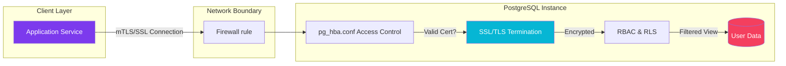

import Callout from '@components/Callout.astro';
import ImplementationNote from '@components/ImplementationNote.astro';
import CodeFile from '@components/CodeFile.astro';
import ExternalCite from '@components/ExternalCite.astro';

## Introduction

Security was an afterthought in my first version of BlueRobin's database. I had a single PostgreSQL user with full superuser privileges, no connection encryption, and row-level security was something I had only read about. When I started storing real personal documents, I realized the database was the weakest link in the entire security chain. This article documents the hardening journey—from a wide-open database to a defense-in-depth PostgreSQL deployment.

In a data-intensive architecture like ours, the database is often the "crown jewel" target for attackers. Default PostgreSQL configurations prioritize compatibility over security, leaving gaps that can be exploited in a distributed system. "High Assurance" means going beyond basic passwords—it means Defense in Depth. <ExternalCite title="OWASP Database Security Cheat Sheet" url="https://cheatsheetseries.owasp.org/cheatsheets/Database_Security_Cheat_Sheet.html" author="OWASP Foundation" date="2023" />

**Why Database Security Matters:**

- **Data Sovereignty**: Preventing unauthorized access, even from internal compromised services.
- **Compliance**: Meeting strict regulatory requirements for data encryption in transit and at rest.
- **Least Privilege**: Ensuring services can only touch the specific data they own.

### What We'll Build

In this guide, we will implement a hardened PostgreSQL security model. You will learn how to:

1. **Lock Down the Network**: Configure `pg_hba.conf` to reject non-SSL connections.
2. **Design RBAC**: Implement a Role-Based Access Control system that separates schema owners from application users.
3. **Enforce RLS**: Use Row-Level Security to segregate tenant data at the database engine level.
4. **Manage Secrets**: Rotate and inject credentials using Infisical.

Our hardening approach aligns closely with industry-standard benchmarks. <ExternalCite title="CIS PostgreSQL Benchmark" url="https://www.cisecurity.org/benchmark/postgresql" author="Center for Internet Security" date="2023" />

## Architecture Overview

We rely on a layered approach where security controls exist at the network, transport, and data levels.


```mermaid
flowchart LR
    subgraph Client ["Client Layer"]
        App["Application Service"]
    end

    subgraph Network ["Network Boundary"]
        FW["Firewall rule"]
    end

    subgraph Postgres ["PostgreSQL Instance"]
        HBA["pg_hba.conf Access Control"]
        SSL["SSL/TLS Termination"]
        RBAC["RBAC & RLS"]
        Data[("User Data")]
    end

    App -->|mTLS/SSL Connection| FW
    FW --> HBA
    HBA -->|Valid Cert?| SSL
    SSL -->|Encrypted| RBAC
    RBAC -->|Filtered View| Data

    classDef primary fill:#7c3aed,color:#fff
    classDef secondary fill:#06b6d4,color:#fff
    classDef db fill:#f43f5e,color:#fff
    classDef warning fill:#fbbf24,color:#000
    class App primary
    class Data db
    class SSL secondary
```

## Section 1: Network & Transport Security

The first line of defense is ensuring that *connection attempts* themselves are strictly controlled and encrypted.

### Configuring `pg_hba.conf`

The `pg_hba.conf` (Host-Based Authentication) file controls client authentication. We want to explicitly deny unencrypted connections and require strong authentication methods. <ExternalCite title="PostgreSQL Documentation - Security" url="https://www.postgresql.org/docs/current/admin.html" author="PostgreSQL Global Development Group" date="2024" />

<Callout type="warning" title="Security Risk">
    Never use `trust` authentication in non-local environments. It allows any user to connect without a password.
</Callout>

```bash
# TYPE  DATABASE        USER            ADDRESS                 METHOD

# 1. Localhost is safe for maintenance
local   all             all                                     scram-sha-256

# 2. REJECT non-SSL connections from outside
hostnossl all           all             0.0.0.0/0               reject

# 3. REQUIRE SSL for all remote connections
hostssl all             all             0.0.0.0/0               scram-sha-256
```

### Forcing SSL/TLS

Merely allowing SSL isn't enough; we must enforce it. Additionally, we use `scram-sha-256` for password hashing, which prevents replay attacks and is significantly stronger than `md5`. In Kubernetes environments, CloudNativePG handles certificate generation and rotation automatically. <ExternalCite title="CloudNativePG Documentation" url="https://cloudnative-pg.io/documentation/" author="CloudNativePG Contributors" date="2024" />

```sql
-- Check if SSL is currently active
SELECT ssl_is_used();

-- Enforce SSL 
ALTER SYSTEM SET ssl = 'on';
ALTER SYSTEM SET password_encryption = 'scram-sha-256';
```

<ImplementationNote>
    Enabling TLS between the application and PostgreSQL on Kubernetes was deceptively tricky. CNPG generates certificates automatically, but the .NET Npgsql driver requires the CA certificate to be available as a file on disk. Since our pods use read-only root filesystems, I had to mount the CA certificate from a Kubernetes Secret as a volume—a small detail that took hours to debug because the error message just said "SSL handshake failed."
</ImplementationNote>

## Section 2: Role-Based Access Control (RBAC)

We separate users into three categories: **Owners** (Schema management), **Writers** (App logic), and **Readers** (Reporting/Backup).

### The Hierarchy

```sql
-- 1. Create a group role for the application (No login)
CREATE ROLE app_readwrite NOLOGIN;

-- 2. Create the actual application user
CREATE USER myapp_api WITH PASSWORD '...';

-- 3. Grant the group to the user
GRANT app_readwrite TO myapp_api;
```

This ensures we manage permissions on the *group*, not individual users.

## Section 3: Row-Level Security (RLS)

RLS allows us to define policies on tables that restrict which rows are returned based on the current user's context. This is critical for multi-tenant applications. <ExternalCite title="PostgreSQL Row-Level Security" url="https://www.postgresql.org/docs/current/ddl-rowsecurity.html" author="PostgreSQL Global Development Group" date="2024" />

<ImplementationNote title="Performance Impact">
    RLS adds a check to every query. Ensure your policy columns (e.g., `owner_id`) are indexed.
</ImplementationNote>

### Enabling RLS

```sql
-- Enable RLS on the table
ALTER TABLE documents ENABLE ROW LEVEL SECURITY;

-- Create a policy that restricts access to the owner
CREATE POLICY owner_access_policy ON documents
    FOR ALL
    TO app_readwrite
    USING (owner_id = current_setting('app.current_user_id')::uuid);
```

In the application (C#), we set the context variable before executing queries:

```csharp
await using var cleanConnection = _dataSource.CreateConnection();
await cleanConnection.OpenAsync();

// Set the session variable for RLS
using var command = cleanConnection.CreateCommand();
command.CommandText = $"SET app.current_user_id = '{userId}';";
await command.ExecuteNonQueryAsync();

// Now perform queries safely
```

When using a connection pooler like PgBouncer in front of PostgreSQL, extra care is needed to ensure session-level settings don't leak between pooled connections. <ExternalCite title="PgBouncer - Lightweight PostgreSQL Connection Pooler" url="https://www.pgbouncer.org/" author="PgBouncer Contributors" date="2024" />

<ImplementationNote>
    Running PgBouncer in transaction mode solved our connection exhaustion issues but introduced a subtle bug: session-level settings like `SET search_path` would leak between transactions from different users. The fix was switching to per-transaction SET commands and ensuring our EF Core connection interceptor resets the search path at the start of each transaction.
</ImplementationNote>

## Section 4: Credential Management with Infisical

Hardcoding connection strings is a vulnerability. We use Infisical to inject secrets at runtime.

1. **Store the Password**: Save `APP_DB_PASSWORD` in Infisical.
2. **Inject in CI/CD**:
   
```yaml
- name: Inject Secrets
  uses: Infisical/secrets-action@v1
  with:
    env-slug: "prod"
    secret-ids: "APP_DB_PASSWORD"
```

3. **Runtime**: The application reads the environment variable, constructing the connection string dynamically.

## Conclusion

By implementing strict `pg_hba.conf` rules, a hierarchical RBAC model, and RLS, we turn PostgreSQL from a simple data store into a security enforcer.

Looking back at this hardening journey, the biggest lesson was that database security is not a one-time configuration task—it is an ongoing discipline. Every new feature, every new microservice that connects to the database, and every schema migration is an opportunity for security to regress. The approach I have settled on is to treat the database security configuration as code: version-controlled, peer-reviewed, and tested in CI just like application logic. The initial investment in RBAC roles, RLS policies, and TLS enforcement has paid for itself many times over—not just in preventing incidents, but in the confidence it gives me when deploying changes to a system that handles real personal documents.

If you are starting from a default PostgreSQL installation, do not try to implement everything at once. Start with enforcing SSL and eliminating superuser access from your application. Then layer on RBAC. Finally, add RLS where multi-tenancy requires it. Each step meaningfully reduces your attack surface.

### Further Reading

- <ExternalCite title="PostgreSQL Documentation - Security" url="https://www.postgresql.org/docs/current/admin.html" author="PostgreSQL Global Development Group" date="2024" /> — The authoritative reference for all PostgreSQL security configuration options.
- <ExternalCite title="OWASP Database Security Cheat Sheet" url="https://cheatsheetseries.owasp.org/cheatsheets/Database_Security_Cheat_Sheet.html" author="OWASP Foundation" date="2023" /> — A practical checklist for hardening any database deployment.
- <ExternalCite title="CIS PostgreSQL Benchmark" url="https://www.cisecurity.org/benchmark/postgresql" author="Center for Internet Security" date="2023" /> — Industry-standard benchmarks for PostgreSQL security posture assessment.

**Next Steps**:
- [Architecture Overview](/architecture/system-overview)
- [Building a Private PKI](/building-private-pki-root-ca-certificates)
