import Callout from '@components/Callout.astro';
import ImplementationNote from '@components/ImplementationNote.astro';
import ExternalCite from '@components/ExternalCite.astro';

## Introduction

Qdrant is a high-performance vector database written in Rust, designed for the next generation of AI applications. Unlike traditional search engines that rely on keywords, Qdrant enables **semantic search**—finding documents based on *meaning* rather than exact text matches.

**Why Vector Databases Matter:**

- **Semantic Understanding**: Find "vacation policy" when the user searches "time off rules"
- **AI-Native**: Store embeddings from LLMs like OpenAI, Ollama, or sentence-transformers
- **Hybrid Search**: Combine vector similarity with metadata filters for precise results
- **Scale**: Handle millions of vectors with sub-millisecond query latency

For BlueRobin's document intelligence features, Qdrant is the backbone of our search. Users can ask natural language questions and find relevant documents even when the exact words don't match.

**Why Qdrant Matters:**

- **Performance**: Built in Rust, it offers incredibly low latency even with millions of vectors.
- **Filtering**: First-class support for "Payload Filtering", allowing you to combine semantic search with strict conditions (e.g., "Find similar docs *owned by User X*").
- **Kubernetes Ready**: Cloud-native architecture that scales horizontally.

### What We'll Build

In this guide, we will set up the search engine for our document platform. You will learn how to:

1.  **Deploy Qdrant**: Configure a StatefulSet with persistent storage in Kubernetes.
2.  **Manage Collections**: Define optimized vector schemas (Distance metrics, Dimensions).
3.  **Integrate .NET client**: Perform hybrid search (Metadata filters + Vector similarity).

## Deployment Architecture

```mermaid
flowchart TB
    subgraph Cluster["🔮 Qdrant Cluster"]
        subgraph Nodes["⚡ Qdrant Nodes"]
            Q0["👑 Qdrant-0\n(Leader)"]
            Q1["🔄 Qdrant-1\n(Replica)"]
            Q2["🔄 Qdrant-2\n(Replica)"]
            Q0 <--> Q1
            Q1 <--> Q2
            Q0 <--> Q2
        end
        
        Nodes --> Storage
        
        subgraph Storage["💾 Collections"]
            direction LR
            C1["🧪 dev-documents\n(384 dims)"]
            C2["🎭 staging-documents\n(384 dims)"]
            C3["🚀 prod-documents\n(384 dims)"]
        end
    end

    classDef primary fill:#7c3aed,color:#fff
    classDef secondary fill:#06b6d4,color:#fff
    classDef db fill:#f43f5e,color:#fff
    classDef warning fill:#fbbf24,color:#000
    class Cluster,Nodes,Storage db
```



## Kubernetes Manifests

### StatefulSet

```yaml
# infrastructure/data-layer/qdrant/statefulset.yaml
apiVersion: apps/v1
kind: StatefulSet
metadata:
  name: qdrant
  namespace: data-layer
spec:
  serviceName: qdrant
  replicas: 3
  podManagementPolicy: Parallel
  selector:
    matchLabels:
      app: qdrant
  template:
    metadata:
      labels:
        app: qdrant
    spec:
      containers:
        - name: qdrant
          image: qdrant/qdrant:v1.7.4
          ports:
            - containerPort: 6333
              name: http
            - containerPort: 6334
              name: grpc
            - containerPort: 6335
              name: cluster
          env:
            - name: QDRANT__CLUSTER__ENABLED
              value: "true"
            - name: QDRANT__CLUSTER__P2P__PORT
              value: "6335"
            - name: QDRANT__SERVICE__GRPC_PORT
              value: "6334"
          volumeMounts:
            - name: data
              mountPath: /qdrant/storage
            - name: config
              mountPath: /qdrant/config/production.yaml
              subPath: production.yaml
          resources:
            requests:
              memory: "512Mi"
              cpu: "200m"
            limits:
              memory: "2Gi"
              cpu: "2000m"
          readinessProbe:
            httpGet:
              path: /healthz
              port: 6333
            initialDelaySeconds: 5
            periodSeconds: 10
          livenessProbe:
            httpGet:
              path: /healthz
              port: 6333
            initialDelaySeconds: 30
            periodSeconds: 30
      volumes:
        - name: config
          configMap:
            name: qdrant-config
  volumeClaimTemplates:
    - metadata:
        name: data
      spec:
        accessModes: ["ReadWriteOnce"]
        storageClassName: local-path
        resources:
          requests:
            storage: 20Gi
```

### Configuration

```yaml
# infrastructure/data-layer/qdrant/configmap.yaml
apiVersion: v1
kind: ConfigMap
metadata:
  name: qdrant-config
  namespace: data-layer
data:
  production.yaml: |
    log_level: INFO
    
    storage:
      storage_path: /qdrant/storage
      snapshots_path: /qdrant/snapshots
      on_disk_payload: true
      
      performance:
        max_search_threads: 0  # Auto-detect
        max_optimization_threads: 2
        
      optimizers:
        deleted_threshold: 0.2
        vacuum_min_vector_number: 1000
        default_segment_number: 4
        max_segment_size_kb: 200000
        memmap_threshold_kb: 50000
        indexing_threshold_kb: 20000
    
    service:
      max_request_size_mb: 32
      enable_tls: false
      
    cluster:
      enabled: true
      p2p:
        port: 6335
      consensus:
        tick_period_ms: 100
```

### Services

```yaml
# infrastructure/data-layer/qdrant/service.yaml
apiVersion: v1
kind: Service
metadata:
  name: qdrant
  namespace: data-layer
spec:
  selector:
    app: qdrant
  ports:
    - name: http
      port: 6333
      targetPort: 6333
    - name: grpc
      port: 6334
      targetPort: 6334
  clusterIP: None
---
apiVersion: v1
kind: Service
metadata:
  name: qdrant-api
  namespace: data-layer
spec:
  selector:
    app: qdrant
  ports:
    - name: http
      port: 6333
      targetPort: 6333
    - name: grpc
      port: 6334
      targetPort: 6334
  type: ClusterIP
```

## .NET Integration

### Qdrant Client Setup

```csharp
// Infrastructure/DependencyInjection.cs
public static IServiceCollection AddQdrantServices(
    this IServiceCollection services,
    IConfiguration configuration)
{
    services.AddSingleton(sp =>
    {
        var host = configuration["Qdrant:Host"] ?? "qdrant-api.data-layer.svc.cluster.local";
        var port = configuration.GetValue<int>("Qdrant:Port", 6334);
        
        return new QdrantClient(host, port);
    });
    
    services.AddScoped<IVectorStore, QdrantVectorStore>();
    services.AddScoped<ICollectionManager, QdrantCollectionManager>();
    
    return services;
}
```

### Collection Manager

```csharp
// Infrastructure/VectorDb/QdrantCollectionManager.cs
public sealed class QdrantCollectionManager : ICollectionManager
{
    private readonly QdrantClient _client;
    private readonly IConfiguration _config;
    private readonly ILogger<QdrantCollectionManager> _logger;
    
    private const int VectorDimension = 384; // nomic-embed-text
    
    public QdrantCollectionManager(
        QdrantClient client,
        IConfiguration config,
        ILogger<QdrantCollectionManager> logger)
    {
        _client = client;
        _config = config;
        _logger = logger;
    }
    
    public async Task EnsureCollectionExistsAsync(CancellationToken ct = default)
    {
        var collectionName = GetCollectionName();
        
        try
        {
            await _client.GetCollectionInfoAsync(collectionName, ct);
            _logger.LogDebug("Collection {Collection} already exists", collectionName);
            return;
        }
        catch (QdrantException ex) when (ex.Message.Contains("doesn't exist"))
        {
            // Collection doesn't exist, create it
        }
        
        await _client.CreateCollectionAsync(
            collectionName,
            new VectorParams
            {
                Size = VectorDimension,
                Distance = Distance.Cosine,
                OnDisk = true
            },
            cancellationToken: ct);
        
        // Create payload indexes for filtering
        await _client.CreatePayloadIndexAsync(
            collectionName,
            "owner_id",
            PayloadSchemaType.Keyword,
            cancellationToken: ct);
        
        await _client.CreatePayloadIndexAsync(
            collectionName,
            "document_id",
            PayloadSchemaType.Keyword,
            cancellationToken: ct);
        
        await _client.CreatePayloadIndexAsync(
            collectionName,
            "tags",
            PayloadSchemaType.Keyword,
            cancellationToken: ct);
        
        await _client.CreatePayloadIndexAsync(
            collectionName,
            "created_at",
            PayloadSchemaType.Datetime,
            cancellationToken: ct);
        
        _logger.LogInformation(
            "Created collection {Collection} with {Dimension} dimensions",
            collectionName,
            VectorDimension);
    }
    
    public async Task<CollectionInfo> GetCollectionInfoAsync(CancellationToken ct = default)
    {
        var collectionName = GetCollectionName();
        var info = await _client.GetCollectionInfoAsync(collectionName, ct);
        
        return new CollectionInfo
        {
            Name = collectionName,
            VectorCount = (long)info.PointsCount,
            Status = info.Status.ToString()
        };
    }
    
    private string GetCollectionName()
    {
        var env = _config["Environment"] ?? "dev";
        return $"{env}-documents";
    }
}

public sealed record CollectionInfo
{
    public required string Name { get; init; }
    public required long VectorCount { get; init; }
    public required string Status { get; init; }
}
```

### Vector Store

```csharp
// Infrastructure/VectorDb/QdrantVectorStore.cs
public sealed class QdrantVectorStore : IVectorStore
{
    private readonly QdrantClient _client;
    private readonly IConfiguration _config;
    private readonly ILogger<QdrantVectorStore> _logger;
    
    public QdrantVectorStore(
        QdrantClient client,
        IConfiguration config,
        ILogger<QdrantVectorStore> logger)
    {
        _client = client;
        _config = config;
        _logger = logger;
    }
    
    public async Task UpsertAsync(
        IReadOnlyList<VectorPoint> points,
        CancellationToken ct = default)
    {
        if (points.Count == 0) return;
        
        var collectionName = GetCollectionName();
        
        var qdrantPoints = points.Select(p => new PointStruct
        {
            Id = new PointId { Uuid = p.Id.ToString() },
            Vectors = p.Vector,
            Payload = 
            {
                ["owner_id"] = p.OwnerId,
                ["document_id"] = p.DocumentId,
                ["chunk_index"] = p.ChunkIndex,
                ["content"] = p.Content,
                ["tags"] = p.Tags ?? [],
                ["created_at"] = p.CreatedAt.ToString("O")
            }
        }).ToList();
        
        await _client.UpsertAsync(
            collectionName,
            qdrantPoints,
            cancellationToken: ct);
        
        _logger.LogDebug(
            "Upserted {Count} points to {Collection}",
            points.Count,
            collectionName);
    }
    
    public async Task<IReadOnlyList<SearchResult>> SearchAsync(
        float[] queryVector,
        BlueRobinId ownerId,
        int limit = 10,
        float scoreThreshold = 0.5f,
        SearchFilters? filters = null,
        CancellationToken ct = default)
    {
        var collectionName = GetCollectionName();
        
        // Build filter
        var mustConditions = new List<Condition>
        {
            new()
            {
                Field = new FieldCondition
                {
                    Key = "owner_id",
                    Match = new Match { Keyword = ownerId.Value }
                }
            }
        };
        
        if (filters?.DocumentIds?.Count > 0)
        {
            mustConditions.Add(new Condition
            {
                Field = new FieldCondition
                {
                    Key = "document_id",
                    Match = new Match
                    {
                        Any = new RepeatedStrings
                        {
                            Strings = { filters.DocumentIds.Select(d => d.Value) }
                        }
                    }
                }
            });
        }
        
        if (filters?.Tags?.Count > 0)
        {
            mustConditions.Add(new Condition
            {
                Field = new FieldCondition
                {
                    Key = "tags",
                    Match = new Match
                    {
                        Any = new RepeatedStrings
                        {
                            Strings = { filters.Tags }
                        }
                    }
                }
            });
        }
        
        var results = await _client.SearchAsync(
            collectionName,
            queryVector,
            filter: new Filter { Must = { mustConditions } },
            limit: (ulong)limit,
            scoreThreshold: scoreThreshold,
            cancellationToken: ct);
        
        return results.Select(r => new SearchResult
        {
            Id = r.Id.Uuid,
            DocumentId = BlueRobinId.From(r.Payload["document_id"].StringValue),
            ChunkIndex = (int)r.Payload["chunk_index"].IntegerValue,
            Content = r.Payload["content"].StringValue,
            Score = r.Score
        }).ToList();
    }
    
    public async Task DeleteByDocumentAsync(
        BlueRobinId documentId,
        BlueRobinId ownerId,
        CancellationToken ct = default)
    {
        var collectionName = GetCollectionName();
        
        await _client.DeleteAsync(
            collectionName,
            new Filter
            {
                Must =
                {
                    new Condition
                    {
                        Field = new FieldCondition
                        {
                            Key = "owner_id",
                            Match = new Match { Keyword = ownerId.Value }
                        }
                    },
                    new Condition
                    {
                        Field = new FieldCondition
                        {
                            Key = "document_id",
                            Match = new Match { Keyword = documentId.Value }
                        }
                    }
                }
            },
            cancellationToken: ct);
        
        _logger.LogInformation(
            "Deleted vectors for document {DocumentId}",
            documentId);
    }
    
    public async Task<long> CountByOwnerAsync(
        BlueRobinId ownerId,
        CancellationToken ct = default)
    {
        var collectionName = GetCollectionName();
        
        var result = await _client.CountAsync(
            collectionName,
            filter: new Filter
            {
                Must =
                {
                    new Condition
                    {
                        Field = new FieldCondition
                        {
                            Key = "owner_id",
                            Match = new Match { Keyword = ownerId.Value }
                        }
                    }
                }
            },
            cancellationToken: ct);
        
        return (long)result;
    }
    
    private string GetCollectionName()
    {
        var env = _config["Environment"] ?? "dev";
        return $"{env}-documents";
    }
}

public sealed record VectorPoint
{
    public required Guid Id { get; init; }
    public required string OwnerId { get; init; }
    public required string DocumentId { get; init; }
    public required int ChunkIndex { get; init; }
    public required string Content { get; init; }
    public required float[] Vector { get; init; }
    public IReadOnlyList<string>? Tags { get; init; }
    public DateTimeOffset CreatedAt { get; init; } = DateTimeOffset.UtcNow;
}

public sealed record SearchFilters
{
    public IReadOnlyList<BlueRobinId>? DocumentIds { get; init; }
    public IReadOnlyList<string>? Tags { get; init; }
    public DateTimeOffset? CreatedAfter { get; init; }
    public DateTimeOffset? CreatedBefore { get; init; }
}

public sealed record SearchResult
{
    public required string Id { get; init; }
    public required BlueRobinId DocumentId { get; init; }
    public required int ChunkIndex { get; init; }
    public required string Content { get; init; }
    public required float Score { get; init; }
}
```

<ImplementationNote>
Payload indexes on `owner_id` and `document_id` are crucial for efficient filtering. Without them, every search would scan all vectors.
</ImplementationNote>

## Health Checks

```csharp
// Infrastructure/HealthChecks/QdrantHealthCheck.cs
public sealed class QdrantHealthCheck : IHealthCheck
{
    private readonly QdrantClient _client;
    private readonly ICollectionManager _collections;
    
    public QdrantHealthCheck(
        QdrantClient client,
        ICollectionManager collections)
    {
        _client = client;
        _collections = collections;
    }
    
    public async Task<HealthCheckResult> CheckHealthAsync(
        HealthCheckContext context,
        CancellationToken cancellationToken = default)
    {
        try
        {
            var info = await _collections.GetCollectionInfoAsync(cancellationToken);
            
            return HealthCheckResult.Healthy(
                $"Qdrant healthy: {info.VectorCount} vectors in {info.Name}");
        }
        catch (Exception ex)
        {
            return HealthCheckResult.Unhealthy(
                "Qdrant health check failed",
                exception: ex);
        }
    }
}
```

<Callout type="tip">
For local development, port-forward the Qdrant gRPC port:
```bash
kubectl port-forward svc/qdrant-api -n data-layer 6334:6334
```
</Callout>

## Summary

Qdrant provides fast vector search with:

| Feature | Configuration |
|---------|---------------|
| Storage | On-disk payload for memory efficiency |
| Filtering | Payload indexes on owner_id, document_id |
| Clustering | 3-node cluster for HA |
| Distance | Cosine similarity for semantic search |

Combined with proper collection management and filtering, Qdrant enables efficient multi-tenant semantic search at scale.

<ExternalCite 
  title="Qdrant Documentation" 
  url="https://qdrant.tech/documentation/"
  author="Qdrant"
/>
