import Callout from '@components/Callout.astro';
import ImplementationNote from '@components/ImplementationNote.astro';
import ExternalCite from '@components/ExternalCite.astro';

## Introduction

Large Language Models are impressive, but they have a critical limitation: they only know what they were trained on. Ask ChatGPT about your company's vacation policy, and it will confidently hallucinate an answer. **RAG (Retrieval-Augmented Generation)** solves this by grounding LLM responses in your actual documents.

**Why RAG Architecture Matters:**

- **Accuracy**: Answers are based on your documents, not model hallucinations
- **Currency**: No retraining needed—just update your document corpus
- **Attribution**: Cite specific sources for every answer
- **Privacy**: Run entirely on-premise with Ollama—your data never leaves your infrastructure

In BlueRobin, RAG powers our document Q&A feature. Users upload contracts, policies, and reports, then ask natural language questions like "What's the termination clause in the Smith contract?" The system retrieves relevant chunks, feeds them to an LLM, and returns an accurate, cited answer.

## Architecture Overview

Retrieval-Augmented Generation (RAG) combines the knowledge stored in your documents with the reasoning capabilities of large language models. This guide builds a complete RAG pipeline using Ollama for local inference and Qdrant for vector retrieval.

## RAG Architecture

```mermaid
flowchart TB
    subgraph Input["� User Question"]
        Q["What are our GDPR obligations?"]
    end

    subgraph QueryProcessing["1️⃣ Query Processing"]
        QP1[🔄 Query expansion]
        QP2[🧠 Generate query embedding]
        QP3[🏷️ Extract filters]
    end

    subgraph Retrieval["2️⃣ Retrieval"]
        R1[("🔮 Qdrant<br/>Semantic")]
        R2[("🐘 PostgreSQL<br/>Keyword")]
        R3["⚖️ Reranker<br/>Cross-Encoder"]
        R1 & R2 --> R3
    end

    subgraph Context["3️⃣ Context Building"]
        C1[📊 Select top-k chunks]
        C2[🔗 Deduplicate]
        C3[📝 Format with metadata]
        C1 --> C2 --> C3
    end

    subgraph Generation["4️⃣ Generation"]
        G1["🦙 Ollama (llama3:8b)"]
        G2["📋 System: Answer based on documents..."]
        G3["📑 Context: Retrieved chunks"]
    end

    subgraph Response["5️⃣ Response"]
        RS1[💡 Answer with citations]
        RS2[📈 Confidence score]
        RS3[❓ Follow-up suggestions]
    end

    Q --> QP1
    QP1 --> QP2 --> QP3
    QP3 --> R1 & R2
    R3 --> C1
    C3 --> G1
    G1 --> RS1

    classDef primary fill:#7c3aed,color:#fff
    classDef secondary fill:#06b6d4,color:#fff
    classDef db fill:#f43f5e,color:#fff
    classDef warning fill:#fbbf24,color:#000
    class Input warning
    class QueryProcessing,Context,Generation,Response primary
    class Retrieval db
```



## Core Components

### RAG Service Interface

```csharp
// Application/Interfaces/IRagService.cs
public interface IRagService
{
    Task<RagResponse> AskAsync(
        BlueRobinId userId,
        string question,
        RagOptions? options = null,
        CancellationToken ct = default);
    
    IAsyncEnumerable<RagStreamChunk> AskStreamingAsync(
        BlueRobinId userId,
        string question,
        RagOptions? options = null,
        CancellationToken ct = default);
}

public sealed record RagOptions
{
    public int TopK { get; init; } = 5;
    public float MinRelevanceScore { get; init; } = 0.5f;
    public string Model { get; init; } = "llama3:8b";
    public float Temperature { get; init; } = 0.1f;
    public int MaxTokens { get; init; } = 1024;
    public bool IncludeSources { get; init; } = true;
    public IReadOnlyList<string>? FilterTags { get; init; }
    public IReadOnlyList<BlueRobinId>? FilterDocuments { get; init; }
}

public sealed record RagResponse
{
    public required string Answer { get; init; }
    public required IReadOnlyList<SourceReference> Sources { get; init; }
    public required float Confidence { get; init; }
    public required RagMetrics Metrics { get; init; }
    public IReadOnlyList<string>? SuggestedFollowUps { get; init; }
}

public sealed record SourceReference
{
    public required BlueRobinId DocumentId { get; init; }
    public required string DocumentTitle { get; init; }
    public required string Excerpt { get; init; }
    public required int ChunkIndex { get; init; }
    public required float RelevanceScore { get; init; }
}

public sealed record RagMetrics
{
    public required int ChunksRetrieved { get; init; }
    public required int ChunksUsed { get; init; }
    public required long RetrievalTimeMs { get; init; }
    public required long GenerationTimeMs { get; init; }
    public required int InputTokens { get; init; }
    public required int OutputTokens { get; init; }
}
```

### RAG Service Implementation

```csharp
// Infrastructure/AI/RagService.cs
public sealed class RagService : IRagService
{
    private readonly IHybridSearchService _search;
    private readonly IOllamaClient _ollama;
    private readonly IDocumentRepository _documents;
    private readonly ILogger<RagService> _logger;
    
    private const string SystemPrompt = """
        You are a helpful assistant that answers questions based on the provided documents.
        
        Guidelines:
        - Only use information from the provided context to answer questions
        - If the context doesn't contain relevant information, say so clearly
        - Cite sources using [Source N] notation when referencing specific information
        - Be concise but thorough
        - If you're uncertain, express that uncertainty
        
        Context documents are provided below, each marked with a source number.
        """;
    
    public RagService(
        IHybridSearchService search,
        IOllamaClient ollama,
        IDocumentRepository documents,
        ILogger<RagService> logger)
    {
        _search = search;
        _ollama = ollama;
        _documents = documents;
        _logger = logger;
    }
    
    public async Task<RagResponse> AskAsync(
        BlueRobinId userId,
        string question,
        RagOptions? options = null,
        CancellationToken ct = default)
    {
        options ??= new RagOptions();
        var sw = Stopwatch.StartNew();
        
        // Step 1: Retrieve relevant chunks
        var retrievalStart = sw.ElapsedMilliseconds;
        var searchOptions = new HybridSearchOptions
        {
            Limit = options.TopK * 2, // Retrieve more than needed for reranking
            SemanticThreshold = options.MinRelevanceScore,
            FilterTags = options.FilterTags
        };
        
        var searchResults = await _search.SearchAsync(
            userId, 
            question, 
            searchOptions, 
            ct);
        
        var retrievalTime = sw.ElapsedMilliseconds - retrievalStart;
        
        if (searchResults.Results.Count == 0)
        {
            return CreateNoContextResponse(sw.ElapsedMilliseconds);
        }
        
        // Step 2: Build context from top chunks
        var chunks = await BuildContextAsync(
            searchResults.Results, 
            options.TopK, 
            ct);
        
        var context = FormatContext(chunks);
        
        // Step 3: Generate answer
        var generationStart = sw.ElapsedMilliseconds;
        var prompt = BuildPrompt(context, question);
        
        var generationResult = await _ollama.GenerateAsync(new OllamaRequest
        {
            Model = options.Model,
            System = SystemPrompt,
            Prompt = prompt,
            Options = new OllamaOptions
            {
                Temperature = options.Temperature,
                NumPredict = options.MaxTokens
            }
        }, ct);
        
        var generationTime = sw.ElapsedMilliseconds - generationStart;
        
        // Step 4: Build response with sources
        var sources = chunks.Select((c, i) => new SourceReference
        {
            DocumentId = c.DocumentId,
            DocumentTitle = c.DocumentTitle,
            Excerpt = TruncateExcerpt(c.Content, 200),
            ChunkIndex = c.ChunkIndex,
            RelevanceScore = c.Score
        }).ToList();
        
        var confidence = CalculateConfidence(chunks, generationResult.Response);
        
        sw.Stop();
        
        _logger.LogInformation(
            "RAG query completed in {TotalMs}ms (retrieval: {RetrievalMs}ms, generation: {GenerationMs}ms)",
            sw.ElapsedMilliseconds,
            retrievalTime,
            generationTime);
        
        return new RagResponse
        {
            Answer = generationResult.Response,
            Sources = sources,
            Confidence = confidence,
            Metrics = new RagMetrics
            {
                ChunksRetrieved = searchResults.Results.Count,
                ChunksUsed = chunks.Count,
                RetrievalTimeMs = retrievalTime,
                GenerationTimeMs = generationTime,
                InputTokens = generationResult.PromptEvalCount,
                OutputTokens = generationResult.EvalCount
            },
            SuggestedFollowUps = GenerateFollowUpSuggestions(question, generationResult.Response)
        };
    }
    
    public async IAsyncEnumerable<RagStreamChunk> AskStreamingAsync(
        BlueRobinId userId,
        string question,
        RagOptions? options = null,
        [EnumeratorCancellation] CancellationToken ct = default)
    {
        options ??= new RagOptions();
        
        // Retrieve context (non-streaming)
        var searchResults = await _search.SearchAsync(
            userId, 
            question, 
            new HybridSearchOptions { Limit = options.TopK * 2 }, 
            ct);
        
        var chunks = await BuildContextAsync(searchResults.Results, options.TopK, ct);
        var context = FormatContext(chunks);
        var prompt = BuildPrompt(context, question);
        
        // Yield sources first
        yield return new RagStreamChunk
        {
            Type = RagChunkType.Sources,
            Sources = chunks.Select((c, i) => new SourceReference
            {
                DocumentId = c.DocumentId,
                DocumentTitle = c.DocumentTitle,
                Excerpt = TruncateExcerpt(c.Content, 200),
                ChunkIndex = c.ChunkIndex,
                RelevanceScore = c.Score
            }).ToList()
        };
        
        // Stream the answer
        await foreach (var token in _ollama.GenerateStreamingAsync(new OllamaRequest
        {
            Model = options.Model,
            System = SystemPrompt,
            Prompt = prompt,
            Options = new OllamaOptions
            {
                Temperature = options.Temperature,
                NumPredict = options.MaxTokens
            }
        }, ct))
        {
            yield return new RagStreamChunk
            {
                Type = RagChunkType.Token,
                Token = token
            };
        }
        
        yield return new RagStreamChunk
        {
            Type = RagChunkType.Complete
        };
    }
    
    private async Task<List<RetrievedChunk>> BuildContextAsync(
        IReadOnlyList<HybridSearchResult> results,
        int topK,
        CancellationToken ct)
    {
        var chunks = new List<RetrievedChunk>();
        var seenDocuments = new HashSet<BlueRobinId>();
        
        foreach (var result in results.Take(topK * 2))
        {
            // Get document details if not cached
            var document = result.Document ?? 
                await _documents.GetByIdAsync(result.DocumentId, ct);
            
            if (document is null) continue;
            
            // Add matched chunks
            if (result.MatchedChunks is not null)
            {
                foreach (var chunk in result.MatchedChunks)
                {
                    chunks.Add(new RetrievedChunk
                    {
                        DocumentId = result.DocumentId,
                        DocumentTitle = document.Title.Value,
                        Content = chunk.Content,
                        ChunkIndex = chunk.ChunkIndex,
                        Score = result.Score
                    });
                }
            }
            
            seenDocuments.Add(result.DocumentId);
            
            if (chunks.Count >= topK) break;
        }
        
        // Sort by score and take top-k
        return chunks
            .OrderByDescending(c => c.Score)
            .Take(topK)
            .ToList();
    }
    
    private static string FormatContext(List<RetrievedChunk> chunks)
    {
        var sb = new StringBuilder();
        
        for (int i = 0; i < chunks.Count; i++)
        {
            var chunk = chunks[i];
            sb.AppendLine($"[Source {i + 1}] Document: {chunk.DocumentTitle}");
            sb.AppendLine(chunk.Content);
            sb.AppendLine();
        }
        
        return sb.ToString();
    }
    
    private static string BuildPrompt(string context, string question)
    {
        return $"""
            Based on the following documents, please answer the question.
            
            DOCUMENTS:
            {context}
            
            QUESTION: {question}
            
            ANSWER:
            """;
    }
    
    private static float CalculateConfidence(
        List<RetrievedChunk> chunks,
        string answer)
    {
        if (chunks.Count == 0) return 0;
        
        // Base confidence on retrieval scores
        var avgRetrievalScore = chunks.Average(c => c.Score);
        
        // Penalize very short answers
        var lengthFactor = Math.Min(1.0f, answer.Length / 100f);
        
        // Penalize if answer contains uncertainty phrases
        var uncertaintyPhrases = new[] 
        { 
            "i don't know", 
            "not sure", 
            "cannot determine",
            "no information",
            "unclear"
        };
        
        var uncertaintyPenalty = uncertaintyPhrases
            .Any(p => answer.Contains(p, StringComparison.OrdinalIgnoreCase))
            ? 0.3f
            : 0;
        
        return Math.Max(0, Math.Min(1, avgRetrievalScore * lengthFactor - uncertaintyPenalty));
    }
    
    private static RagResponse CreateNoContextResponse(long elapsedMs)
    {
        return new RagResponse
        {
            Answer = "I couldn't find any relevant documents to answer your question. " +
                     "Please try rephrasing your question or ensure relevant documents are uploaded.",
            Sources = [],
            Confidence = 0,
            Metrics = new RagMetrics
            {
                ChunksRetrieved = 0,
                ChunksUsed = 0,
                RetrievalTimeMs = elapsedMs,
                GenerationTimeMs = 0,
                InputTokens = 0,
                OutputTokens = 0
            }
        };
    }
    
    private static string TruncateExcerpt(string content, int maxLength)
    {
        if (content.Length <= maxLength) return content;
        return content[..(maxLength - 3)] + "...";
    }
    
    private static IReadOnlyList<string>? GenerateFollowUpSuggestions(
        string question,
        string answer)
    {
        // Simple heuristic - in production, use LLM to generate these
        var suggestions = new List<string>();
        
        if (answer.Contains("GDPR", StringComparison.OrdinalIgnoreCase))
        {
            suggestions.Add("What are the penalties for GDPR non-compliance?");
            suggestions.Add("How do we handle data subject access requests?");
        }
        
        return suggestions.Count > 0 ? suggestions : null;
    }
    
    private sealed record RetrievedChunk
    {
        public BlueRobinId DocumentId { get; init; }
        public required string DocumentTitle { get; init; }
        public required string Content { get; init; }
        public required int ChunkIndex { get; init; }
        public required float Score { get; init; }
    }
}

public sealed record RagStreamChunk
{
    public required RagChunkType Type { get; init; }
    public string? Token { get; init; }
    public IReadOnlyList<SourceReference>? Sources { get; init; }
}

public enum RagChunkType
{
    Sources,
    Token,
    Complete
}
```

<ImplementationNote>
The streaming API allows the UI to show results progressively. Sources are sent first so users can see where the information comes from while the answer generates.
</ImplementationNote>

## Ollama Client

```csharp
// Infrastructure/AI/OllamaClient.cs
public sealed class OllamaClient : IOllamaClient
{
    private readonly HttpClient _httpClient;
    private readonly ILogger<OllamaClient> _logger;
    
    public OllamaClient(
        HttpClient httpClient,
        ILogger<OllamaClient> logger)
    {
        _httpClient = httpClient;
        _logger = logger;
    }
    
    public async Task<OllamaResponse> GenerateAsync(
        OllamaRequest request,
        CancellationToken ct = default)
    {
        var response = await _httpClient.PostAsJsonAsync(
            "/api/generate",
            new
            {
                model = request.Model,
                system = request.System,
                prompt = request.Prompt,
                stream = false,
                options = request.Options != null ? new
                {
                    temperature = request.Options.Temperature,
                    num_predict = request.Options.NumPredict,
                    top_k = request.Options.TopK,
                    top_p = request.Options.TopP
                } : null
            },
            ct);
        
        response.EnsureSuccessStatusCode();
        
        var result = await response.Content.ReadFromJsonAsync<OllamaApiResponse>(ct);
        
        return new OllamaResponse
        {
            Response = result!.Response,
            PromptEvalCount = result.PromptEvalCount,
            EvalCount = result.EvalCount,
            TotalDuration = result.TotalDuration
        };
    }
    
    public async IAsyncEnumerable<string> GenerateStreamingAsync(
        OllamaRequest request,
        [EnumeratorCancellation] CancellationToken ct = default)
    {
        var httpRequest = new HttpRequestMessage(HttpMethod.Post, "/api/generate")
        {
            Content = JsonContent.Create(new
            {
                model = request.Model,
                system = request.System,
                prompt = request.Prompt,
                stream = true,
                options = request.Options != null ? new
                {
                    temperature = request.Options.Temperature,
                    num_predict = request.Options.NumPredict
                } : null
            })
        };
        
        using var response = await _httpClient.SendAsync(
            httpRequest,
            HttpCompletionOption.ResponseHeadersRead,
            ct);
        
        response.EnsureSuccessStatusCode();
        
        await using var stream = await response.Content.ReadAsStreamAsync(ct);
        using var reader = new StreamReader(stream);
        
        while (!reader.EndOfStream)
        {
            var line = await reader.ReadLineAsync(ct);
            if (string.IsNullOrEmpty(line)) continue;
            
            var chunk = JsonSerializer.Deserialize<OllamaStreamChunk>(line);
            if (chunk?.Response is not null)
            {
                yield return chunk.Response;
            }
            
            if (chunk?.Done == true) break;
        }
    }
    
    private sealed record OllamaApiResponse
    {
        [JsonPropertyName("response")]
        public string Response { get; init; } = string.Empty;
        
        [JsonPropertyName("prompt_eval_count")]
        public int PromptEvalCount { get; init; }
        
        [JsonPropertyName("eval_count")]
        public int EvalCount { get; init; }
        
        [JsonPropertyName("total_duration")]
        public long TotalDuration { get; init; }
    }
    
    private sealed record OllamaStreamChunk
    {
        [JsonPropertyName("response")]
        public string? Response { get; init; }
        
        [JsonPropertyName("done")]
        public bool Done { get; init; }
    }
}
```

## Blazor Chat Component

```razor
@* Components/Chat/RagChat.razor *@
@inject IRagService RagService
@implements IAsyncDisposable

<div class="flex flex-col h-full">
    @* Messages *@
    <div class="flex-1 overflow-y-auto p-4 space-y-4" @ref="_messagesContainer">
        @foreach (var message in _messages)
        {
            <ChatMessage Message="message" />
        }
        
        @if (_isLoading)
        {
            <div class="flex items-center gap-2 text-gray-400">
                <div class="animate-pulse">●</div>
                <span>Thinking...</span>
            </div>
        }
    </div>
    
    @* Input *@
    <div class="border-t border-white/10 p-4">
        <form @onsubmit="HandleSubmit" class="flex gap-2">
            <GlassInput
                @bind-Value="_input"
                Placeholder="Ask a question about your documents..."
                Disabled="_isLoading"
                class="flex-1" />
            
            <GlassButton
                Type="submit"
                Disabled="_isLoading || string.IsNullOrWhiteSpace(_input)">
                <svg class="w-5 h-5" fill="none" stroke="currentColor" viewBox="0 0 24 24">
                    <path stroke-linecap="round" stroke-linejoin="round" stroke-width="2" 
                          d="M12 19l9 2-9-18-9 18 9-2zm0 0v-8"/>
                </svg>
            </GlassButton>
        </form>
    </div>
</div>

@code {
    [CascadingParameter] private Task<AuthenticationState>? AuthState { get; set; }
    
    private readonly List<ChatMessageModel> _messages = [];
    private string _input = string.Empty;
    private bool _isLoading;
    private ElementReference _messagesContainer;
    private CancellationTokenSource? _cts;
    
    private async Task HandleSubmit()
    {
        if (string.IsNullOrWhiteSpace(_input) || _isLoading) return;
        
        var question = _input;
        _input = string.Empty;
        _isLoading = true;
        
        // Add user message
        _messages.Add(new ChatMessageModel
        {
            Role = "user",
            Content = question,
            Timestamp = DateTimeOffset.UtcNow
        });
        
        // Add placeholder for assistant
        var assistantMessage = new ChatMessageModel
        {
            Role = "assistant",
            Content = string.Empty,
            Timestamp = DateTimeOffset.UtcNow
        };
        _messages.Add(assistantMessage);
        
        await ScrollToBottom();
        
        try
        {
            var authState = await AuthState!;
            var userId = authState.User.GetBlueRobinId();
            
            _cts = new CancellationTokenSource();
            
            // Stream the response
            await foreach (var chunk in RagService.AskStreamingAsync(
                userId, 
                question, 
                cancellationToken: _cts.Token))
            {
                switch (chunk.Type)
                {
                    case RagChunkType.Sources:
                        assistantMessage.Sources = chunk.Sources;
                        break;
                    
                    case RagChunkType.Token:
                        assistantMessage.Content += chunk.Token;
                        StateHasChanged();
                        break;
                    
                    case RagChunkType.Complete:
                        break;
                }
            }
        }
        catch (OperationCanceledException)
        {
            assistantMessage.Content += " [Cancelled]";
        }
        catch (Exception ex)
        {
            assistantMessage.Content = $"Error: {ex.Message}";
            assistantMessage.IsError = true;
        }
        finally
        {
            _isLoading = false;
            _cts?.Dispose();
            _cts = null;
            await ScrollToBottom();
        }
    }
    
    private async Task ScrollToBottom()
    {
        await Task.Yield();
        // JS interop to scroll would go here
    }
    
    public async ValueTask DisposeAsync()
    {
        _cts?.Cancel();
        _cts?.Dispose();
    }
}

public sealed class ChatMessageModel
{
    public required string Role { get; init; }
    public string Content { get; set; } = string.Empty;
    public required DateTimeOffset Timestamp { get; init; }
    public IReadOnlyList<SourceReference>? Sources { get; set; }
    public bool IsError { get; set; }
}
```

## Summary

A production RAG pipeline requires:

| Component | Purpose |
|-----------|---------|
| Hybrid Retrieval | Find relevant chunks |
| Context Building | Format for LLM |
| Prompt Engineering | Guide LLM behavior |
| Streaming | Better UX |
| Source Attribution | Transparency |
| Confidence Scoring | Reliability indicator |

This foundation can be extended with reranking, query expansion, and conversation memory for even more sophisticated applications.

<ExternalCite 
  title="Retrieval-Augmented Generation" 
  url="https://arxiv.org/abs/2005.11401"
  author="Lewis et al."
/>
