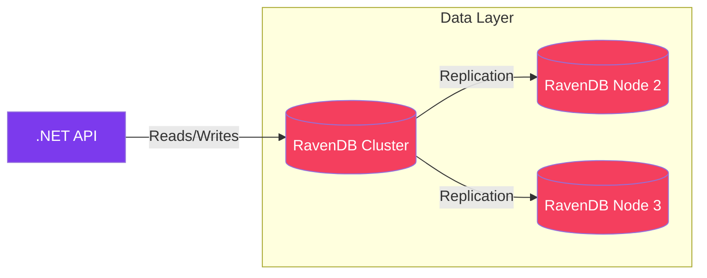

import Callout from '@components/Callout.astro';
import ImplementationNote from '@components/ImplementationNote.astro';
import CodeFile from '@components/CodeFile.astro';
import ExternalCite from '@components/ExternalCite.astro';

## Introduction

In a world dominated by PostgreSQL and SQL Server, choosing a NoSQL document store as a primary database is a bold move. Choosing **RavenDB** specifically often raises eyebrows. "Why not MongoDB? Why not CosmosDB?"

At BlueRobin, our data model is inherently hierarchical. Documents belong to Folders, which belong to Projects, which belong to Organizations. Force-fitting this into normalized SQL tables often leads to complex JOINs and ORM friction. RavenDB promised us a way to store data exactly as we use it in our code. 

Three years later, the verdict is in. We have some scars, but mostly, we have a highly performant system that developers love to work with.

**Why RavenDB Matters:**

- **Productivity**: Storing POCOs (Plain Old CLR Objects) without mapping layers speeds up development.
- **Operations**: The built-in Studio is arguably the best database management UI in the industry.
- **ACID**: Unlike many NoSQL stores, RavenDB offers transaction guarantees that let us sleep at night.

### What We'll Cover

In this retrospective, we will share our honest experience running RavenDB in production. You will learn about:

1. **The Wins**: The Document Model, the Studio, and Indexes.
2. **The Challenges**: Hosting complexities, the learning curve of RQL, and ecosystem size.
3. **The Conclusion**: Is it worth it for your next .NET project?

## Architecture Overview

RavenDB acts as the "Source of Truth" for our unstructured metadata, sitting alongside Qdrant (Vector Search) and MinIO (Blob Storage).



## The Benefits: Why We Stick With It

### The Document Model Wins

In C#, we work with objects. In SQL, we work with rows. The "Object-Relational Impedance Mismatch" is the source of endless accidental complexity.

With RavenDB, if you have a `User` class with a list of `Addresses`, you just store it.

```csharp
var user = new User 
{
    Name = "Victor",
    Addresses = new List<Address> { new Address { City = "Paris" } }
};

// No migrations. No mapping. Just save.
await session.StoreAsync(user);
await session.SaveChangesAsync();
```

This alignment with our domain model cut our feature development time by approx. 30%. We spend less time fighting Entity Framework and more time building value.

### The Studio (GUI)

The RavenDB Management Studio is a masterpiece. It's not just an admin tool; it's a development tool.
- You can visualize the replication graph.
- You can profile queries visually.
- You can edit documents as JSON with validation.

It makes the "black box" of the database transparent. When a query is slow, the Studio tells us exactly which index is lagging or why a scan is happening.

## The Challenges: It's Not All Sunshine

### The Ecosystem Size

This is the biggest drawback. If you have a problem with PostgreSQL, StackOverflow has 500,000 answers. If you have a problem with RavenDB, you might find 50.

The documentation is good, and the community forum is active (and the developers are very responsive!), but you don't have the vast ocean of third-party tools, integrations, and "google-ability" that major SQL engines have. You are relying on a smaller, tighter circle of expertise.

### Specialized Hosting

You can run RavenDB in a container, but for high availability, it prefers its own dedicated cluster or the specific RavenDB Cloud offering. It's not as simple as "spin up an RDS instance".

Managing certificates and secure communication between nodes in a custom Kubernetes deployment (stateful sets) took us significant effort to get right. It's not "plug and play" in the generic cloud ecosystem unless you pay for their managed service.

### RQL (Raven Query Language)

While similar to SQL, RQL requires a mindset shift.

- **Bad**: `Load<User>(id).Orders.Where(...)` (Client-side filtering)
- **Good**: `from Orders where Employee = 'users/1'`

Deep pagination and complex aggregations require understanding **Map-Reduce indexes**. Writing a Map-Reduce index in C# (LINQ) is powerful but has a steep learning curve compared to a `GROUP BY` statement.

<Callout type="warning" title="Gotcha">
    RavenDB is "Safe by Default". It limits the number of results returned to prevent you from accidentally pulling 1M rows. Coming from SQL, this "128 item limit" surprises every new developer on the team.
</Callout>

## Conclusion: A High-Performance Specialist

RavenDB is not a general-purpose choice for every team. If specific SQL reporting tools or massive ecosystem support are your priorities, stick with Postgres.

However, for a **.NET-centric team** building a complex domain-driven application, the synergy creates a "1+1=3" effect. The ability to model your data exactly as you think about it—without the friction of tables and joins—is a competitive advantage we aren't willing to give up.

**Next Steps:**
- Read the [RavenDB Book](https://ravendb.net/learn/inside-ravendb-book/reader/4.0) (It's free and excellent).
- Try the [Live Demo](https://demo.ravendb.net) to see the Studio in action.
