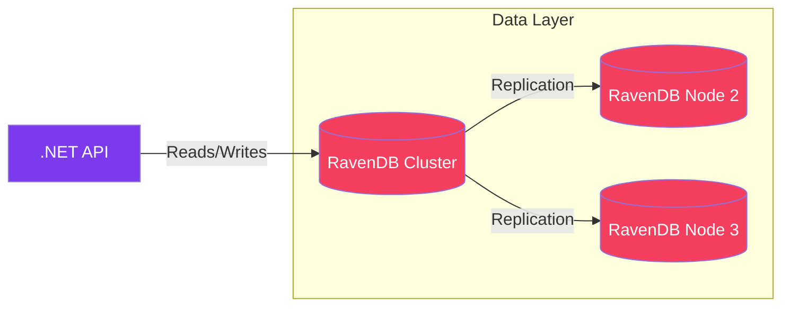

import Callout from '@components/Callout.astro';
import ImplementationNote from '@components/ImplementationNote.astro';
import CodeFile from '@components/CodeFile.astro';
import ExternalCite from '@components/ExternalCite.astro';

When I first proposed RavenDB to the team, the reaction was somewhere between skepticism and polite confusion. Everyone knew MongoDB, everyone trusted PostgreSQL, and here I was advocating for a database most of them had never heard of. I had stumbled upon it while looking for a .NET-native document store that did not require an ORM layer, and the more I read, the more convinced I became it was the right fit. Three years of production usage later, I can say with confidence that it was the right call -- but it was not without its share of painful lessons. This article is the honest retrospective I wish someone had written before I started.

## Introduction

In a world dominated by PostgreSQL and SQL Server, choosing a NoSQL document store as a primary database is a bold move. Choosing **RavenDB** specifically often raises eyebrows. "Why not MongoDB? Why not CosmosDB?"

In production, our data model is inherently hierarchical. Documents belong to Folders, which belong to Projects, which belong to Organizations. Force-fitting this into normalized SQL tables often leads to complex JOINs and ORM friction. RavenDB promised us a way to store data exactly as we use it in our code. 

Three years later, the verdict is in. We have some scars, but mostly, we have a highly performant system that developers love to work with.

<ExternalCite title="RavenDB Documentation" url="https://ravendb.net/docs/article-page/6.0/csharp" author="Hibernating Rhinos" date="2024" />

**Why RavenDB Matters:**

- **Productivity**: Storing POCOs (Plain Old CLR Objects) without mapping layers speeds up development.
- **Operations**: The built-in Studio is arguably the best database management UI in the industry.
- **ACID**: Unlike many NoSQL stores, RavenDB offers transaction guarantees that let us sleep at night.

<ExternalCite title="ACID Transactions in RavenDB" url="https://ravendb.net/docs/article-page/6.0/csharp/client-api/session/cluster-transaction/overview" author="Hibernating Rhinos" date="2024" />

### What We'll Cover

In this retrospective, we will share our honest experience running RavenDB in production. You will learn about:

1. **The Wins**: The Document Model, the Studio, and Indexes.
2. **The Challenges**: Hosting complexities, the learning curve of RQL, and ecosystem size.
3. **The Conclusion**: Is it worth it for your next .NET project?

## Architecture Overview

RavenDB acts as the "Source of Truth" for our unstructured metadata, sitting alongside Qdrant (Vector Search) and MinIO (Blob Storage).


```mermaid
flowchart LR
    Api[".NET API"] -->|Reads/Writes| Raven[("RavenDB Cluster")]
    Raven -->|Replication| Node2[("RavenDB Node 2")]
    Raven -->|Replication| Node3[("RavenDB Node 3")]
    
    subgraph Storage ["Data Layer"]
        Raven
        Node2
        Node3
    end

    classDef primary fill:#7c3aed,color:#fff
    classDef secondary fill:#06b6d4,color:#fff
    classDef db fill:#f43f5e,color:#fff
    classDef warning fill:#fbbf24,color:#000

    class Api primary
    class Raven,Node2,Node3 db
```

## The Benefits: Why We Stick With It

### The Document Model Wins

In C#, we work with objects. In SQL, we work with rows. The "Object-Relational Impedance Mismatch" is the source of endless accidental complexity.

With RavenDB, if you have a `User` class with a list of `Addresses`, you just store it.

<ExternalCite title="Object-Relational Impedance Mismatch" url="https://en.wikipedia.org/wiki/Object%E2%80%93relational_impedance_mismatch" author="Wikipedia" date="2024" />

```csharp
var user = new User 
{
    Name = "Victor",
    Addresses = new List<Address> { new Address { City = "Paris" } }
};

// No migrations. No mapping. Just save.
await session.StoreAsync(user);
await session.SaveChangesAsync();
```

This alignment with our domain model cut our feature development time by approx. 30%. We spend less time fighting Entity Framework and more time building value.

<ImplementationNote title="Migration From Entity Framework">
When I migrated our first microservice from Entity Framework + PostgreSQL to RavenDB, the most surprising challenge was not the data migration itself -- it was retraining my own thinking. I kept reaching for navigation properties and lazy loading patterns that simply do not exist in a document model. The turning point came when I stopped thinking about "tables with relationships" and started thinking about "self-contained documents." Once I restructured the User aggregate to embed its Addresses directly instead of referencing a separate Addresses collection, the code became dramatically simpler. The entire repository layer shrank by about 60%.
</ImplementationNote>

### The Studio (GUI)

The RavenDB Management Studio is a masterpiece. It's not just an admin tool; it's a development tool.
- You can visualize the replication graph.
- You can profile queries visually.
- You can edit documents as JSON with validation.

It makes the "black box" of the database transparent. When a query is slow, the Studio tells us exactly which index is lagging or why a scan is happening.

<ExternalCite title="RavenDB Management Studio" url="https://ravendb.net/docs/article-page/6.0/csharp/studio/overview" author="Hibernating Rhinos" date="2024" />

## The Challenges: It's Not All Sunshine

### The Ecosystem Size

This is the biggest drawback. If you have a problem with PostgreSQL, StackOverflow has 500,000 answers. If you have a problem with RavenDB, you might find 50.

The documentation is good, and the community forum is active (and the developers are very responsive!), but you don't have the vast ocean of third-party tools, integrations, and "google-ability" that major SQL engines have. You are relying on a smaller, tighter circle of expertise.

### Specialized Hosting

You can run RavenDB in a container, but for high availability, it prefers its own dedicated cluster or the specific RavenDB Cloud offering. It's not as simple as "spin up an RDS instance".

Managing certificates and secure communication between nodes in a custom Kubernetes deployment (stateful sets) took us significant effort to get right. It's not "plug and play" in the generic cloud ecosystem unless you pay for their managed service.

<ImplementationNote title="Kubernetes Certificate Nightmare">
I spent the better part of a week getting RavenDB's three-node cluster running in Kubernetes with proper TLS. The challenge was that RavenDB requires each node to have a certificate with a specific CN that matches its advertised URL, and in K8s, the internal DNS names include the StatefulSet pod name and the headless service. I ended up writing a custom init container that generated the correct certificates using our internal CA before the RavenDB container started. The documentation covered standalone deployments well, but K8s-specific guidance was sparse. Once it was running, though, the cluster has been rock-solid.
</ImplementationNote>

### RQL (Raven Query Language)

While similar to SQL, RQL requires a mindset shift.

- **Bad**: `Load<User>(id).Orders.Where(...)` (Client-side filtering)
- **Good**: `from Orders where Employee = 'users/1'`

Deep pagination and complex aggregations require understanding **Map-Reduce indexes**. Writing a Map-Reduce index in C# (LINQ) is powerful but has a steep learning curve compared to a `GROUP BY` statement.

<ExternalCite title="RavenDB Map-Reduce Indexes" url="https://ravendb.net/docs/article-page/6.0/csharp/indexes/map-reduce-indexes" author="Hibernating Rhinos" date="2024" />

<Callout type="warning" title="Gotcha">
    RavenDB is "Safe by Default". It limits the number of results returned to prevent you from accidentally pulling 1M rows. Coming from SQL, this "128 item limit" surprises every new developer on the team.
</Callout>

<ImplementationNote title="The 128-Item Limit Surprise">
I vividly remember the first bug report that came from this "Safe by Default" behavior. A junior developer had written a perfectly reasonable-looking query to load all documents in a folder, and it worked great in testing with 50 items. In production, a customer had 200 documents in a single folder, and the UI silently showed only 128. No error, no warning -- just missing data. It took us a while to realize RavenDB was capping the results. We now have a team convention: every query that does not use `.Take()` explicitly gets flagged in code review. We also wrote a thin wrapper around the session that logs a warning if a query returns exactly 128 results, since that is almost always a sign of an unbounded query hitting the default limit.
</ImplementationNote>

## Conclusion: A High-Performance Specialist

RavenDB is not a general-purpose choice for every team. If specific SQL reporting tools or massive ecosystem support are your priorities, stick with Postgres.

However, for a **.NET-centric team** building a complex domain-driven application, the synergy creates a "1+1=3" effect. The ability to model your data exactly as you think about it--without the friction of tables and joins--is a competitive advantage we aren't willing to give up.

Looking back on three years with RavenDB, I would make the same choice again without hesitation. The productivity gains in day-to-day development far outweigh the upfront cost of the learning curve and the hosting complexity. The Studio alone has saved us countless debugging hours, and the ACID guarantees mean we have never had a data corruption incident. My advice to anyone considering RavenDB: budget extra time for the initial infrastructure setup and invest in training your team on RQL and Map-Reduce indexes early. The payoff is a codebase where the data layer feels invisible -- and that is exactly how it should be.

### Next Steps

- Read the [Inside RavenDB Book](https://ravendb.net/learn/inside-ravendb-book/reader/4.0) to understand the internal architecture and make better design decisions.
- Experiment with **RavenDB subscriptions** for building reactive, event-driven features without polling.
- Evaluate **RavenDB Cloud** for new projects where you want to avoid the Kubernetes hosting overhead entirely.
- Build a **Map-Reduce index cookbook** for your team's most common aggregation patterns to flatten the learning curve.

### Further Reading

- [RavenDB Official Documentation](https://ravendb.net/docs) - Comprehensive reference for all features and APIs
- [Inside RavenDB Book](https://ravendb.net/learn/inside-ravendb-book/reader/4.0) - Free, in-depth guide to RavenDB internals
- [RavenDB Live Demo](https://demo.ravendb.net) - Interactive Studio demo and query playground
- [Document Modeling Best Practices](https://ravendb.net/docs/article-page/6.0/csharp/studio/database/documents/document-view) - Guidelines for effective document design
