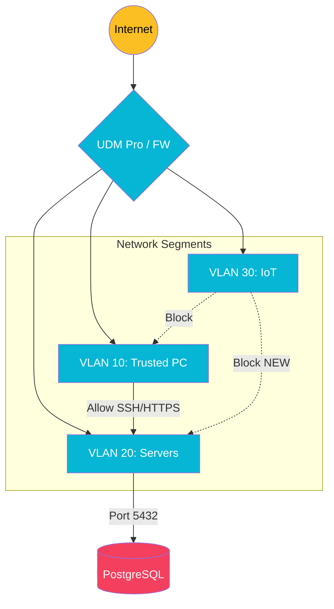

import Callout from '@components/Callout.astro';
import ImplementationNote from '@components/ImplementationNote.astro';
import CodeFile from '@components/CodeFile.astro';
import ExternalCite from '@components/ExternalCite.astro';

## Introduction

Running a homelab exposes you to the same threats as enterprise datacenters, potentially with even less monitoring. A single misconfigured IoT device or an open SSH port can compromise your entire network. This guide covers the essential layers of hardening your local infrastructure.

**Why Homelab Security Matters:**

- **Isolate Threats**: Ensure a compromise in a Smart Bulb doesn't leak into your NAS.
- **Reduce Attack Surface**: Limit the ways an attacker can interact with your servers.
- **Brute Force Protection**: Automated bots scan the internet constantly; don't be a low-hanging fruit.

### What We'll Build

In this guide, we will implement network and host-level security controls. You will learn how to:

1. **Segment Traffic**: Use VLANs to isolate trusted devices, servers, and untrusted IoT gadgets.
2. **Harden Host Access**: configure `ufw` firewalls and disable password login for SSH.
3. **Automate Defense**: Deploy Fail2Ban to automatically ban IPs showing malicious behavior.

## Architecture Overview

We divide our network into logic zones. The firewall acts as the gatekeeper between these zones.



## Section 1: Network Segmentation (VLANs)

The most effective security control is a flat-out denial of network connectivity. We trust our personal laptop, but we shouldn't trust a $10 Wi-Fi plug.

Using a Ubiquiti UDM or similar pro-sumer router, we create three core VLANs:

1.  **Trusted (VLAN 10)**: Laptops, Phones. Can access everything.
2.  **Servers (VLAN 20)**: Kubernetes Nodes, NAS. Can be accessed by Trusted. Can access Internet.
3.  **IoT (VLAN 30)**: Smart devices. Cannot access Trusted or Servers. Can only access Internet (if needed).

<Callout type="info" title="Firewall Rules">
    The default behavior of UniFi is "Allow All". You MUST manually create "Drop" rules blocking inter-VLAN traffic, placing them *after* your specific "Allow" rules (e.g., Trusted -> IoT established).
</Callout>

## Section 2: Host Hardening (SSH & UFW)

Even inside the Server VLAN, individual nodes should protect themselves.

### SSH Configuration

Passwords can be guessing. SSH Keys are mathematically secure. We disable password authentication entirely.

First, ensure your key is on the server:
```bash
ssh-copy-id user@192.168.20.10
```

Then edit `/etc/ssh/sshd_config`:
```bash
PasswordAuthentication no
PermitRootLogin no
ChallengeResponseAuthentication no
```

Restart SSH: `sudo systemctl restart ssh`.

### Uncomplicated Firewall (UFW)

Ubuntu's `ufw` is a great tool to ensure only necessary ports are open.

<ImplementationNote title="Don't Lock Yourself Out!">
    Always allow SSH (22) before enabling the firewall.
</ImplementationNote>

```bash
# Set defaults
sudo ufw default deny incoming
sudo ufw default allow outgoing

# Allow operational ports
sudo ufw allow 22/tcp        # SSH
sudo ufw allow 80/tcp        # HTTP
sudo ufw allow 443/tcp       # HTTPS
sudo ufw allow 6443/tcp      # K8s API (Limit to Trusted IP range ideally)

# Enable
sudo ufw enable
```

## Section 3: Fail2Ban

Fail2Ban scans log files (like `/var/log/auth.log`) and bans IPs that show malicious signs, such as too many password failures.

Install it:
```bash
sudo apt update && sudo apt install fail2ban -y
```

Create a local config `/etc/fail2ban/jail.local`:

```ini
[sshd]
enabled = true
port = ssh
filter = sshd
logpath = /var/log/auth.log
maxretry = 3
bantime = 3600 # 1 hour
```

Restart the service: `sudo systemctl restart fail2ban`. You can check the status with `sudo fail2ban-client status sshd`.

## Conclusion

By combining network segmentation (VLANs) with host-level hardening (UFW, SSH Keys) and active defense (Fail2Ban), we create a robust environment. Even if an attacker breaches the outer perimeter or compromises an IoT device, the blast radius is contained.

**Next Steps**:
- [Zero Trust Architecture: mTLS, Tokens, and Identity](/blog/zero-trust-architecture-mtls-tokens-identity)
- [Secure Service Exposure with Cloudflare Tunnel](/blog/cloudflare-tunnel-secure-service-exposure)
