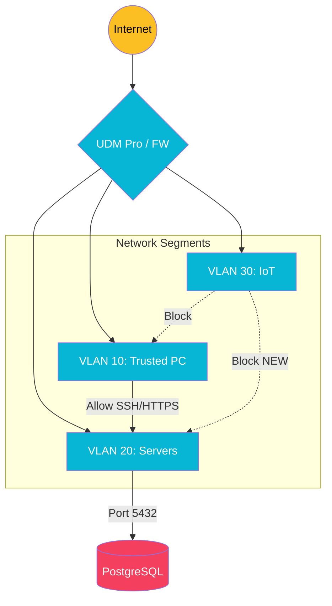

import Callout from '@components/Callout.astro';
import ImplementationNote from '@components/ImplementationNote.astro';
import CodeFile from '@components/CodeFile.astro';
import ExternalCite from '@components/ExternalCite.astro';

## Introduction

When I first set up my homelab, everything was on a flat network—my NAS, my Kubernetes nodes, and a cheap TP-Link smart plug all sharing the same subnet. One night I noticed the smart plug making DNS requests to a server in China. That was the wake-up call: a compromised IoT device on a flat network has line-of-sight to every service, including the PostgreSQL database holding personal documents. The next weekend was spent rebuilding the entire network with proper segmentation.

Running a homelab exposes you to the same threats as enterprise datacenters, potentially with even less monitoring. A single misconfigured IoT device or an open SSH port can compromise your entire network. This guide covers the essential layers of hardening your local infrastructure. <ExternalCite title="CIS Controls v8" url="https://www.cisecurity.org/controls" author="Center for Internet Security" date="2021" />

**Why Homelab Security Matters:**

- **Isolate Threats**: Ensure a compromise in a Smart Bulb doesn't leak into your NAS.
- **Reduce Attack Surface**: Limit the ways an attacker can interact with your servers.
- **Brute Force Protection**: Automated bots scan the internet constantly; don't be a low-hanging fruit.

### What We'll Build

In this guide, we will implement network and host-level security controls. You will learn how to:

1. **Segment Traffic**: Use VLANs to isolate trusted devices, servers, and untrusted IoT gadgets.
2. **Harden Host Access**: configure `ufw` firewalls and disable password login for SSH.
3. **Automate Defense**: Deploy Fail2Ban to automatically ban IPs showing malicious behavior.

## Architecture Overview

We divide our network into logical zones. The firewall acts as the gatekeeper between these zones. <ExternalCite title="NIST SP 800-125B: Secure Virtual Network Configuration" url="https://csrc.nist.gov/publications/detail/sp/800-125b/final" author="NIST" date="2019" />


```mermaid
flowchart TB
    %% Styles
    classDef primary fill:#7c3aed,color:#fff
    classDef secondary fill:#06b6d4,color:#fff
    classDef db fill:#f43f5e,color:#fff
    classDef warning fill:#fbbf24,color:#000

    Internet((Internet)) --> Firewall{UDM Pro / FW}
    
    subgraph VLANs ["Network Segments"]
        Trusted[VLAN 10: Trusted PC]
        Server[VLAN 20: Servers]
        IoT[VLAN 30: IoT]
    end

    Firewall --> Trusted
    Firewall --> Server
    Firewall --> IoT

    Trusted -->|Allow SSH/HTTPS| Server
    IoT -.->|Block NEW| Server
    IoT -.->|Block| Trusted
    
    Server -->|Port 5432| DB[(PostgreSQL)]

    class Firewall secondary
    class Trusted,Server,IoT secondary
    class Internet warning
    class DB db
```

## Section 1: Network Segmentation (VLANs)

The most effective security control is a flat-out denial of network connectivity. <ExternalCite title="IEEE 802.1Q - Virtual LANs" url="https://standards.ieee.org/ieee/802.1Q/10323/" author="IEEE" date="2022" /> We trust our personal laptop, but we shouldn't trust a $10 Wi-Fi plug.

Using a Ubiquiti UDM or similar pro-sumer router, we create three core VLANs:

1.  **Trusted (VLAN 10)**: Laptops, Phones. Can access everything.
2.  **Servers (VLAN 20)**: Kubernetes Nodes, NAS. Can be accessed by Trusted. Can access Internet.
3.  **IoT (VLAN 30)**: Smart devices. Cannot access Trusted or Servers. Can only access Internet (if needed).

<Callout type="info" title="Firewall Rules">
    The default behavior of UniFi is "Allow All". You MUST manually create "Drop" rules blocking inter-VLAN traffic, placing them *after* your specific "Allow" rules (e.g., Trusted -> IoT established).
</Callout>

<ImplementationNote>
    The order of UniFi firewall rules tripped me up for an entire evening. I created the "Drop IoT to Servers" rule first, but forgot that established connections still need to flow back. My IoT devices could initiate connections but never receive responses. The fix was adding an "Allow Established/Related" rule above the drop rule—a classic stateful firewall lesson I should have remembered from my networking courses.
</ImplementationNote>

## Section 2: Host Hardening (SSH & UFW)

Even inside the Server VLAN, individual nodes should protect themselves.

### SSH Configuration

Passwords can be guessed. SSH Keys are mathematically secure. <ExternalCite title="OpenSSH Manual Pages" url="https://www.openssh.com/manual.html" author="OpenSSH" date="2024" /> We disable password authentication entirely.

First, ensure your key is on the server:
```bash
ssh-copy-id user@192.168.20.10
```

Then edit `/etc/ssh/sshd_config`:
```bash
PasswordAuthentication no
PermitRootLogin no
ChallengeResponseAuthentication no
```

Restart SSH: `sudo systemctl restart ssh`.

<ImplementationNote>
    I locked myself out of a node exactly once by disabling password auth before copying my SSH key. The fix required plugging in a monitor and keyboard for console access. Now my deployment script always runs `ssh-copy-id` first, verifies key-based login works, and only then applies the sshd_config changes. Automation prevents embarrassment.
</ImplementationNote>

### Uncomplicated Firewall (UFW)

Ubuntu's `ufw` is a great tool to ensure only necessary ports are open.

<ImplementationNote title="Don't Lock Yourself Out!">
    Always allow SSH (22) before enabling the firewall.
</ImplementationNote>

```bash
# Set defaults
sudo ufw default deny incoming
sudo ufw default allow outgoing

# Allow operational ports
sudo ufw allow 22/tcp        # SSH
sudo ufw allow 80/tcp        # HTTP
sudo ufw allow 443/tcp       # HTTPS
sudo ufw allow 6443/tcp      # K8s API (Limit to Trusted IP range ideally)

# Enable
sudo ufw enable
```

<ExternalCite title="UFW - Uncomplicated Firewall" url="https://help.ubuntu.com/community/UFW" author="Ubuntu Community" date="2024" />

## Section 3: Fail2Ban

Fail2Ban scans log files (like `/var/log/auth.log`) and bans IPs that show malicious signs, such as too many password failures. <ExternalCite title="Fail2Ban Documentation" url="https://www.fail2ban.org/wiki/index.php/Main_Page" author="Fail2Ban Project" date="2024" />

Install it:
```bash
sudo apt update && sudo apt install fail2ban -y
```

Create a local config `/etc/fail2ban/jail.local`:

```ini
[sshd]
enabled = true
port = ssh
filter = sshd
logpath = /var/log/auth.log
maxretry = 3
bantime = 3600 # 1 hour
```

Restart the service: `sudo systemctl restart fail2ban`. You can check the status with `sudo fail2ban-client status sshd`.

<ImplementationNote>
    Fail2Ban's default regex patterns didn't catch all the brute-force attempts I was seeing in the logs. Some bots were using SSH protocol-level attacks that didn't trigger the standard sshd filter. I added a custom filter that also monitors for "Connection closed by authenticating user" patterns, which caught an additional 30% of malicious IPs that the default configuration missed.
</ImplementationNote>

## Conclusion

By combining network segmentation (VLANs) with host-level hardening (UFW, SSH Keys) and active defense (Fail2Ban), we create a robust environment. Even if an attacker breaches the outer perimeter or compromises an IoT device, the blast radius is contained.

After implementing these layers, my SSH auth logs went from hundreds of failed attempts per day to zero—Fail2Ban catches them before they can even complete a handshake. The VLAN segmentation means that even if a compromised IoT device scans the network, it only sees other IoT devices. The server VLAN is invisible to it. These are not theoretical benefits; they are measurable, observable improvements that take a single weekend to implement.

**Next Steps:**
- Understand the [Zero Trust Architecture](/zero-trust-architecture-mtls-tokens-identity) that builds on top of these network controls.
- Deploy [Authelia SSO](/authelia-sso-oidc-dotnet) to add identity-based access to your services.
- Expose services safely with [Cloudflare Tunnel](/cloudflare-tunnel-secure-service-exposure) instead of opening firewall ports.

### Further Reading

- <ExternalCite title="CIS Controls v8" url="https://www.cisecurity.org/controls" author="Center for Internet Security" date="2021" /> — The industry-standard framework for prioritizing cybersecurity actions, including network segmentation and access control.
- <ExternalCite title="NIST SP 800-123: Guide to General Server Security" url="https://csrc.nist.gov/publications/detail/sp/800-123/final" author="NIST" date="2008" /> — Foundational guidance on OS hardening, access control, and patch management for servers.
- <ExternalCite title="Fail2Ban Documentation" url="https://www.fail2ban.org/wiki/index.php/Main_Page" author="Fail2Ban Project" date="2024" /> — Official documentation covering filter configuration, jail setup, and custom action definitions.
