import Callout from '@components/Callout.astro';
import ImplementationNote from '@components/ImplementationNote.astro';
import ExternalCite from '@components/ExternalCite.astro';

AI agents go beyond simple question-answering by taking autonomous actions, using tools, and maintaining conversational memory. This guide covers building intelligent agents with Microsoft Semantic Kernel.

## Agent Architecture

```mermaid
flowchart TB
    subgraph System["🤖 Agent System"]
        User["💬 User Query"] --> Orch["🎯 Orchestrator\n(Semantic Kernel Agent Runtime)"]
        
        Orch --> SA["🔍 Search Agent"]
        Orch --> AA["📊 Analysis Agent"]
        Orch --> SuA["📝 Summary Agent"]
        
        SA --> |"SemanticSearch\nKeywordSearch\nFilterDocs"| Memory
        AA --> |"ReadDocument\nExtractEntities\nCompareContent"| Memory
        SuA --> |"GenerateText\nCreateReport\nSendEmail"| Memory
        
        Memory["🧠 Memory Store\n(Conversation + Semantic)"]
    end

    style System fill:#512bd4,color:#fff
```



## Semantic Kernel Setup

### Configuration

```csharp
// Infrastructure/DependencyInjection.cs
public static IServiceCollection AddSemanticKernel(
    this IServiceCollection services,
    IConfiguration configuration)
{
    services.AddSingleton(sp =>
    {
        var kernelBuilder = Kernel.CreateBuilder();
        
        // Configure Ollama for local inference
        var ollamaEndpoint = configuration["Ollama:Endpoint"] 
            ?? "http://ollama.ai.svc.cluster.local:11434";
        
        kernelBuilder.AddOllamaChatCompletion(
            modelId: "llama3.2",
            endpoint: new Uri(ollamaEndpoint));
        
        // Add OpenAI for complex reasoning (fallback)
        var openAiKey = configuration["OpenAI:ApiKey"];
        if (!string.IsNullOrEmpty(openAiKey))
        {
            kernelBuilder.AddOpenAIChatCompletion(
                modelId: "gpt-4o",
                apiKey: openAiKey,
                serviceId: "openai-complex");
        }
        
        // Register services
        kernelBuilder.Services.AddSingleton(sp.GetRequiredService<IVectorStore>());
        kernelBuilder.Services.AddSingleton(sp.GetRequiredService<IDocumentRepository>());
        kernelBuilder.Services.AddSingleton(sp.GetRequiredService<IEmbeddingService>());
        
        // Add plugins
        kernelBuilder.Plugins.AddFromType<SearchPlugin>("Search");
        kernelBuilder.Plugins.AddFromType<DocumentPlugin>("Document");
        kernelBuilder.Plugins.AddFromType<AnalysisPlugin>("Analysis");
        
        return kernelBuilder.Build();
    });
    
    services.AddScoped<IAgentService, SemanticKernelAgentService>();
    
    return services;
}
```

## Plugin Definitions

### Search Plugin

```csharp
// Application/Plugins/SearchPlugin.cs
public sealed class SearchPlugin
{
    private readonly IVectorStore _vectorStore;
    private readonly IEmbeddingService _embeddings;
    private readonly IUserContext _userContext;
    
    public SearchPlugin(
        IVectorStore vectorStore,
        IEmbeddingService embeddings,
        IUserContext userContext)
    {
        _vectorStore = vectorStore;
        _embeddings = embeddings;
        _userContext = userContext;
    }
    
    [KernelFunction("semantic_search")]
    [Description("Search documents by semantic meaning. Use when the user asks to find documents about a topic.")]
    public async Task<string> SemanticSearchAsync(
        [Description("The search query describing what to find")] string query,
        [Description("Maximum number of results (default 5)")] int limit = 5)
    {
        var ownerId = _userContext.BlueRobinId;
        var queryVector = await _embeddings.GenerateAsync(query);
        
        var results = await _vectorStore.SearchAsync(
            queryVector,
            ownerId,
            limit: limit,
            scoreThreshold: 0.6f);
        
        if (results.Count == 0)
        {
            return "No documents found matching your query.";
        }
        
        var sb = new StringBuilder();
        sb.AppendLine($"Found {results.Count} relevant passages:\n");
        
        foreach (var (result, index) in results.Select((r, i) => (r, i)))
        {
            sb.AppendLine($"**Result {index + 1}** (Score: {result.Score:F2})");
            sb.AppendLine($"Document: {result.DocumentId}");
            sb.AppendLine($"Content: {result.Content.Truncate(300)}...");
            sb.AppendLine();
        }
        
        return sb.ToString();
    }
    
    [KernelFunction("filter_documents")]
    [Description("Filter documents by tags or date range.")]
    public async Task<string> FilterDocumentsAsync(
        [Description("Comma-separated tags to filter by")] string? tags = null,
        [Description("ISO date for 'created after' filter")] string? createdAfter = null)
    {
        var ownerId = _userContext.BlueRobinId;
        
        var filters = new SearchFilters
        {
            Tags = tags?.Split(',', StringSplitOptions.TrimEntries).ToList(),
            CreatedAfter = createdAfter != null 
                ? DateTimeOffset.Parse(createdAfter) 
                : null
        };
        
        // Use a generic embedding to fetch filtered results
        var genericVector = await _embeddings.GenerateAsync("document content");
        var results = await _vectorStore.SearchAsync(
            genericVector,
            ownerId,
            limit: 20,
            scoreThreshold: 0.0f, // No semantic filtering
            filters: filters);
        
        var uniqueDocs = results
            .DistinctBy(r => r.DocumentId)
            .Take(10)
            .ToList();
        
        if (uniqueDocs.Count == 0)
        {
            return "No documents match the specified filters.";
        }
        
        return $"Found {uniqueDocs.Count} documents:\n" +
            string.Join("\n", uniqueDocs.Select(d => $"- {d.DocumentId}"));
    }
}
```

### Document Plugin

```csharp
// Application/Plugins/DocumentPlugin.cs
public sealed class DocumentPlugin
{
    private readonly IDocumentRepository _documents;
    private readonly IArchiveStorage _storage;
    private readonly IUserContext _userContext;
    
    public DocumentPlugin(
        IDocumentRepository documents,
        IArchiveStorage storage,
        IUserContext userContext)
    {
        _documents = documents;
        _storage = storage;
        _userContext = userContext;
    }
    
    [KernelFunction("read_document")]
    [Description("Read the full content of a specific document by its ID.")]
    public async Task<string> ReadDocumentAsync(
        [Description("The document ID (8-character BlueRobinId)")] string documentId)
    {
        var ownerId = _userContext.BlueRobinId;
        var docId = BlueRobinId.From(documentId);
        
        var document = await _documents.GetByIdAsync(docId);
        if (document == null || document.OwnerId != ownerId)
        {
            return $"Document '{documentId}' not found or access denied.";
        }
        
        // Read OCR content from storage
        var contentPath = $"processed/{documentId}/content.md";
        var content = await _storage.ReadTextAsync(contentPath);
        
        return $"""
            **Document: {document.Title}**
            - ID: {document.Id}
            - Status: {document.Status}
            - Created: {document.CreatedAt:yyyy-MM-dd}
            - Tags: {string.Join(", ", document.Tags)}
            
            **Content:**
            {content?.Truncate(2000) ?? "Content not available"}
            """;
    }
    
    [KernelFunction("list_documents")]
    [Description("List the user's documents with optional status filter.")]
    public async Task<string> ListDocumentsAsync(
        [Description("Filter by status: Pending, Processing, Ready, Failed")] string? status = null)
    {
        var ownerId = _userContext.BlueRobinId;
        
        DocumentStatus? statusFilter = status != null
            ? Enum.Parse<DocumentStatus>(status, ignoreCase: true)
            : null;
        
        var documents = await _documents.GetByOwnerAsync(ownerId, statusFilter);
        
        if (documents.Count == 0)
        {
            return status != null
                ? $"No documents with status '{status}' found."
                : "No documents found in your archive.";
        }
        
        var sb = new StringBuilder();
        sb.AppendLine($"Found {documents.Count} documents:\n");
        
        foreach (var doc in documents.Take(10))
        {
            sb.AppendLine($"- **{doc.Title}** ({doc.Id})");
            sb.AppendLine($"  Status: {doc.Status} | Created: {doc.CreatedAt:yyyy-MM-dd}");
        }
        
        if (documents.Count > 10)
        {
            sb.AppendLine($"\n...and {documents.Count - 10} more.");
        }
        
        return sb.ToString();
    }
    
    [KernelFunction("get_document_summary")]
    [Description("Get a brief summary of a document's metadata without reading full content.")]
    public async Task<string> GetDocumentSummaryAsync(
        [Description("The document ID")] string documentId)
    {
        var ownerId = _userContext.BlueRobinId;
        var docId = BlueRobinId.From(documentId);
        
        var document = await _documents.GetByIdAsync(docId);
        if (document == null || document.OwnerId != ownerId)
        {
            return $"Document '{documentId}' not found.";
        }
        
        return $"""
            **{document.Title}**
            - ID: {document.Id}
            - Type: {document.MimeType}
            - Size: {document.FileSize.ToHumanReadable()}
            - Status: {document.Status}
            - Tags: {string.Join(", ", document.Tags)}
            - Created: {document.CreatedAt:yyyy-MM-dd HH:mm}
            - Last Modified: {document.UpdatedAt:yyyy-MM-dd HH:mm}
            """;
    }
}
```

<ImplementationNote>
Each plugin function has a clear `[Description]` that helps the LLM decide when to use it. Be specific about when each tool should be used.
</ImplementationNote>

### Analysis Plugin

```csharp
// Application/Plugins/AnalysisPlugin.cs
public sealed class AnalysisPlugin
{
    private readonly IVectorStore _vectorStore;
    private readonly IEmbeddingService _embeddings;
    private readonly IUserContext _userContext;
    
    public AnalysisPlugin(
        IVectorStore vectorStore,
        IEmbeddingService embeddings,
        IUserContext userContext)
    {
        _vectorStore = vectorStore;
        _embeddings = embeddings;
        _userContext = userContext;
    }
    
    [KernelFunction("compare_documents")]
    [Description("Compare the content of two documents to find similarities and differences.")]
    public async Task<string> CompareDocumentsAsync(
        [Description("First document ID")] string documentId1,
        [Description("Second document ID")] string documentId2)
    {
        var ownerId = _userContext.BlueRobinId;
        
        // Get embeddings for both documents
        var doc1Vectors = await GetDocumentVectorsAsync(BlueRobinId.From(documentId1), ownerId);
        var doc2Vectors = await GetDocumentVectorsAsync(BlueRobinId.From(documentId2), ownerId);
        
        if (doc1Vectors.Count == 0 || doc2Vectors.Count == 0)
        {
            return "One or both documents not found or not indexed.";
        }
        
        // Calculate average similarity
        var similarities = new List<float>();
        foreach (var v1 in doc1Vectors)
        {
            foreach (var v2 in doc2Vectors)
            {
                similarities.Add(CosineSimilarity(v1, v2));
            }
        }
        
        var avgSimilarity = similarities.Average();
        var interpretation = avgSimilarity switch
        {
            > 0.9f => "nearly identical content",
            > 0.7f => "highly similar topics",
            > 0.5f => "moderately related",
            > 0.3f => "loosely related",
            _ => "different topics"
        };
        
        return $"""
            **Document Comparison**
            - Document 1: {documentId1} ({doc1Vectors.Count} chunks)
            - Document 2: {documentId2} ({doc2Vectors.Count} chunks)
            - Similarity Score: {avgSimilarity:P0}
            - Interpretation: {interpretation}
            """;
    }
    
    [KernelFunction("find_similar_documents")]
    [Description("Find documents similar to a given document.")]
    public async Task<string> FindSimilarDocumentsAsync(
        [Description("Source document ID")] string documentId,
        [Description("Number of similar documents to find")] int limit = 5)
    {
        var ownerId = _userContext.BlueRobinId;
        var docId = BlueRobinId.From(documentId);
        
        // Get first chunk vector as representative
        var results = await _vectorStore.SearchAsync(
            new float[384], // Placeholder, we need the actual vector
            ownerId,
            limit: 1,
            filters: new SearchFilters { DocumentIds = [docId] });
        
        if (results.Count == 0)
        {
            return $"Document '{documentId}' not indexed.";
        }
        
        // Search for similar but exclude the source
        var sourceVector = await GetFirstChunkVectorAsync(docId, ownerId);
        if (sourceVector == null)
        {
            return "Could not retrieve document embeddings.";
        }
        
        var similar = await _vectorStore.SearchAsync(
            sourceVector,
            ownerId,
            limit: limit + 10, // Get more to filter
            scoreThreshold: 0.5f);
        
        var filtered = similar
            .Where(r => r.DocumentId != docId)
            .DistinctBy(r => r.DocumentId)
            .Take(limit)
            .ToList();
        
        if (filtered.Count == 0)
        {
            return "No similar documents found.";
        }
        
        var sb = new StringBuilder();
        sb.AppendLine($"Documents similar to {documentId}:\n");
        
        foreach (var doc in filtered)
        {
            sb.AppendLine($"- {doc.DocumentId} (Similarity: {doc.Score:P0})");
        }
        
        return sb.ToString();
    }
    
    private async Task<IReadOnlyList<float[]>> GetDocumentVectorsAsync(
        BlueRobinId documentId, BlueRobinId ownerId)
    {
        // Implementation to retrieve stored vectors for a document
        // This would require extending the vector store interface
        return [];
    }
    
    private async Task<float[]?> GetFirstChunkVectorAsync(
        BlueRobinId documentId, BlueRobinId ownerId)
    {
        // Implementation to get first chunk embedding
        return null;
    }
    
    private static float CosineSimilarity(float[] a, float[] b)
    {
        var dotProduct = a.Zip(b, (x, y) => x * y).Sum();
        var magnitudeA = MathF.Sqrt(a.Sum(x => x * x));
        var magnitudeB = MathF.Sqrt(b.Sum(x => x * x));
        return dotProduct / (magnitudeA * magnitudeB);
    }
}
```

## Agent Service

### Implementation

```csharp
// Application/Services/SemanticKernelAgentService.cs
public sealed class SemanticKernelAgentService : IAgentService
{
    private readonly Kernel _kernel;
    private readonly ILogger<SemanticKernelAgentService> _logger;
    
    private const string SystemPrompt = """
        You are a helpful document assistant for BlueRobin, a personal knowledge management system.
        
        Your capabilities:
        1. Search documents using semantic search (Search.semantic_search)
        2. Read specific documents (Document.read_document)
        3. List and filter documents (Document.list_documents, Search.filter_documents)
        4. Compare and analyze documents (Analysis.compare_documents, Analysis.find_similar_documents)
        
        Guidelines:
        - Always search before claiming no information exists
        - Cite document IDs when referencing content
        - If a query is ambiguous, ask for clarification
        - Summarize results concisely
        - Respect user privacy - only access their documents
        
        Be helpful, accurate, and concise.
        """;
    
    public SemanticKernelAgentService(
        Kernel kernel,
        ILogger<SemanticKernelAgentService> logger)
    {
        _kernel = kernel;
        _logger = logger;
    }
    
    public async IAsyncEnumerable<string> ChatAsync(
        string userMessage,
        ConversationHistory history,
        [EnumeratorCancellation] CancellationToken ct = default)
    {
        var chatHistory = new ChatHistory(SystemPrompt);
        
        // Add conversation history
        foreach (var message in history.Messages)
        {
            chatHistory.Add(message.Role switch
            {
                ChatRole.User => new ChatMessageContent(AuthorRole.User, message.Content),
                ChatRole.Assistant => new ChatMessageContent(AuthorRole.Assistant, message.Content),
                _ => throw new ArgumentException($"Unknown role: {message.Role}")
            });
        }
        
        chatHistory.AddUserMessage(userMessage);
        
        var settings = new OpenAIPromptExecutionSettings
        {
            ToolCallBehavior = ToolCallBehavior.AutoInvokeKernelFunctions,
            Temperature = 0.3f,
            MaxTokens = 2000
        };
        
        var chatService = _kernel.GetRequiredService<IChatCompletionService>();
        
        await foreach (var chunk in chatService.GetStreamingChatMessageContentsAsync(
            chatHistory,
            settings,
            _kernel,
            ct))
        {
            if (chunk.Content != null)
            {
                yield return chunk.Content;
            }
            
            // Log tool calls
            if (chunk.Metadata?.TryGetValue("ToolCalls", out var toolCalls) == true)
            {
                _logger.LogDebug("Tool call: {ToolCalls}", toolCalls);
            }
        }
    }
    
    public async Task<AgentResponse> ProcessAsync(
        string userMessage,
        ConversationHistory history,
        CancellationToken ct = default)
    {
        var response = new StringBuilder();
        var toolsUsed = new List<string>();
        
        await foreach (var chunk in ChatAsync(userMessage, history, ct))
        {
            response.Append(chunk);
        }
        
        return new AgentResponse
        {
            Content = response.ToString(),
            ToolsUsed = toolsUsed
        };
    }
}

public sealed record AgentResponse
{
    public required string Content { get; init; }
    public required IReadOnlyList<string> ToolsUsed { get; init; }
}

public sealed class ConversationHistory
{
    private readonly List<ChatMessage> _messages = [];
    
    public IReadOnlyList<ChatMessage> Messages => _messages;
    
    public void AddUserMessage(string content)
    {
        _messages.Add(new ChatMessage(ChatRole.User, content));
    }
    
    public void AddAssistantMessage(string content)
    {
        _messages.Add(new ChatMessage(ChatRole.Assistant, content));
    }
    
    public void Clear() => _messages.Clear();
}

public sealed record ChatMessage(ChatRole Role, string Content);

public enum ChatRole { User, Assistant }
```

<Callout type="warning">
Tool calling with Ollama requires models that support function calling (like Llama 3.2). Verify your model supports this feature before deployment.
</Callout>

## API Endpoint

```csharp
// Api/Endpoints/Agent/ChatEndpoint.cs
public sealed class ChatEndpoint : Endpoint<ChatRequest, IAsyncEnumerable<string>>
{
    private readonly IAgentService _agent;
    private readonly IConversationStore _conversations;
    
    public ChatEndpoint(
        IAgentService agent,
        IConversationStore conversations)
    {
        _agent = agent;
        _conversations = conversations;
    }
    
    public override void Configure()
    {
        Post("/api/agent/chat");
        Description(d => d.WithTags("Agent"));
    }
    
    public override async Task HandleAsync(ChatRequest req, CancellationToken ct)
    {
        var history = await _conversations.GetOrCreateAsync(req.ConversationId, ct);
        
        HttpContext.Response.ContentType = "text/event-stream";
        
        await foreach (var chunk in _agent.ChatAsync(req.Message, history, ct))
        {
            await HttpContext.Response.WriteAsync($"data: {chunk}\n\n", ct);
            await HttpContext.Response.Body.FlushAsync(ct);
        }
        
        // Save message to history
        history.AddUserMessage(req.Message);
        await _conversations.SaveAsync(history, ct);
    }
}

public sealed record ChatRequest
{
    public required string Message { get; init; }
    public string? ConversationId { get; init; }
}
```

## Blazor Chat Component

```razor
@* Components/Agent/AgentChat.razor *@
@using Microsoft.AspNetCore.SignalR.Client
@inject IAgentService AgentService
@implements IAsyncDisposable

<div class="glass-card h-[600px] flex flex-col">
    <header class="p-4 border-b border-white/10">
        <h2 class="text-lg font-semibold">Document Assistant</h2>
    </header>
    
    <div class="flex-1 overflow-y-auto p-4 space-y-4" @ref="_scrollContainer">
        @foreach (var message in _messages)
        {
            <div class="@GetMessageClasses(message)">
                <div class="@GetBubbleClasses(message)">
                    @if (message.IsStreaming)
                    {
                        <span>@message.Content</span>
                        <span class="typing-indicator">▋</span>
                    }
                    else
                    {
                        @((MarkupString)Markdig.Markdown.ToHtml(message.Content))
                    }
                </div>
            </div>
        }
    </div>
    
    <form @onsubmit="SendMessageAsync" class="p-4 border-t border-white/10">
        <div class="flex gap-2">
            <input 
                @bind="_input"
                @bind:event="oninput"
                placeholder="Ask about your documents..."
                class="glass-input flex-1"
                disabled="@_isLoading" />
            <button 
                type="submit" 
                class="glass-button-primary"
                disabled="@(_isLoading || string.IsNullOrWhiteSpace(_input))">
                @if (_isLoading)
                {
                    <span class="loading-spinner" />
                }
                else
                {
                    <span>Send</span>
                }
            </button>
        </div>
    </form>
</div>

@code {
    private readonly List<ChatMessageDisplay> _messages = [];
    private readonly ConversationHistory _history = new();
    private ElementReference _scrollContainer;
    private string _input = "";
    private bool _isLoading;
    
    private async Task SendMessageAsync()
    {
        if (string.IsNullOrWhiteSpace(_input) || _isLoading) return;
        
        var userMessage = _input.Trim();
        _input = "";
        _isLoading = true;
        
        // Add user message
        _messages.Add(new ChatMessageDisplay 
        { 
            Role = ChatRole.User, 
            Content = userMessage 
        });
        
        // Add assistant placeholder
        var assistantMessage = new ChatMessageDisplay 
        { 
            Role = ChatRole.Assistant, 
            Content = "", 
            IsStreaming = true 
        };
        _messages.Add(assistantMessage);
        
        try
        {
            await foreach (var chunk in AgentService.ChatAsync(
                userMessage, _history))
            {
                assistantMessage.Content += chunk;
                StateHasChanged();
                await ScrollToBottomAsync();
            }
            
            assistantMessage.IsStreaming = false;
            _history.AddUserMessage(userMessage);
            _history.AddAssistantMessage(assistantMessage.Content);
        }
        catch (Exception ex)
        {
            assistantMessage.Content = $"Error: {ex.Message}";
            assistantMessage.IsStreaming = false;
        }
        finally
        {
            _isLoading = false;
            StateHasChanged();
        }
    }
    
    private async Task ScrollToBottomAsync()
    {
        await JS.InvokeVoidAsync("scrollToBottom", _scrollContainer);
    }
    
    private static string GetMessageClasses(ChatMessageDisplay message) =>
        message.Role == ChatRole.User
            ? "flex justify-end"
            : "flex justify-start";
    
    private static string GetBubbleClasses(ChatMessageDisplay message) =>
        message.Role == ChatRole.User
            ? "glass-bubble-user max-w-[80%] p-3 rounded-xl"
            : "glass-bubble-assistant max-w-[80%] p-3 rounded-xl prose prose-sm prose-invert";
    
    public ValueTask DisposeAsync() => ValueTask.CompletedTask;
    
    private sealed class ChatMessageDisplay
    {
        public ChatRole Role { get; init; }
        public string Content { get; set; } = "";
        public bool IsStreaming { get; set; }
    }
}
```

## Summary

Semantic Kernel agents provide:

| Feature | Benefit |
|---------|---------|
| Plugin System | Modular, testable tool definitions |
| Auto Tool Selection | LLM decides which tools to use |
| Streaming | Real-time response display |
| Memory | Conversation history management |

Combined with document search plugins, agents enable natural language interactions with your knowledge base.

<ExternalCite 
  title="Semantic Kernel Documentation" 
  url="https://learn.microsoft.com/en-us/semantic-kernel/"
  author="Microsoft"
/>
