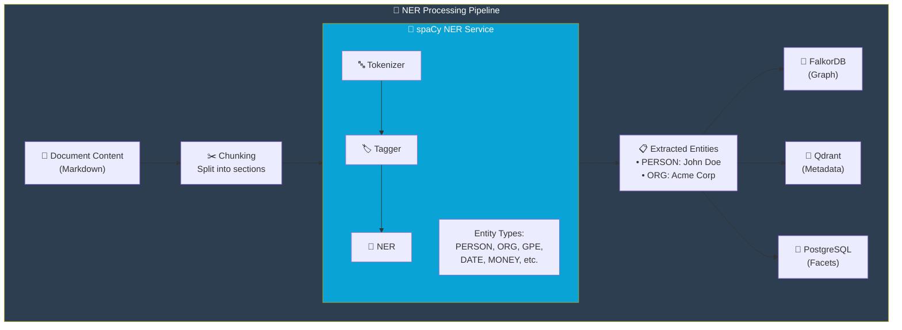

import Callout from '@components/Callout.astro';
import ImplementationNote from '@components/ImplementationNote.astro';
import ExternalCite from '@components/ExternalCite.astro';

## Introduction

Named Entity Recognition (NER) is a natural language processing technique that identifies and classifies named entities in text—people, organizations, locations, dates, and more. For a document management system, NER transforms unstructured text into structured, queryable data.

**Why NER matters for document analysis:**

- **Searchability**: Find all documents mentioning "Acme Corporation" without relying on exact text matches
- **Knowledge Graphs**: Automatically discover relationships between entities across documents
- **Faceted Search**: Filter search results by entity type (show only documents mentioning people)
- **Document Clustering**: Group related documents by shared entities

### What We'll Build

In this guide, we'll:

1. Deploy a spaCy NER service as a containerized microservice
2. Create a .NET client with retry policies and circuit breakers
3. Integrate NER into our document processing pipeline via NATS events
4. Store extracted entities for graph queries and search facets

## Architecture Overview

Before diving into code, let's understand how NER fits into the broader document processing pipeline:



**The flow**:
1. After OCR completes, document content is chunked into manageable sections
2. Each chunk is sent to the spaCy NER service for entity extraction
3. Extracted entities are stored in three places:
   - **FalkorDB**: Graph database for relationship queries ("Who works at Company X?")
   - **Qdrant**: Vector metadata for filtered semantic search
   - **PostgreSQL**: Facet counts for UI filtering

## Deploying the spaCy Service

We'll run spaCy as a dedicated microservice for several reasons: spaCy's transformer models require significant memory (2-4GB), Python's GIL limits concurrency, and isolating NER allows independent scaling.

### The Dockerfile

```dockerfile
# services/spacy-ner/Dockerfile
FROM python:3.11-slim

WORKDIR /app

# Install dependencies
COPY requirements.txt .
RUN pip install --no-cache-dir -r requirements.txt

# Download the transformer-based model (~500MB)
# This provides much better accuracy than the smaller models
RUN python -m spacy download en_core_web_trf

COPY app.py .

EXPOSE 8080

CMD ["uvicorn", "app:app", "--host", "0.0.0.0", "--port", "8080"]
```

We use `en_core_web_trf`—the transformer-based model—because accuracy matters more than speed for our use case. A misidentified entity pollutes the knowledge graph; a slower extraction is merely inconvenient.

### FastAPI Application

The service exposes a simple REST API for entity extraction:

```python
# services/spacy-ner/app.py
from fastapi import FastAPI, HTTPException
from pydantic import BaseModel
import spacy
from typing import List, Optional
import logging

logging.basicConfig(level=logging.INFO)
logger = logging.getLogger(__name__)

# Load transformer-based model for better accuracy
# This happens once at startup and is reused for all requests
nlp = spacy.load("en_core_web_trf")

app = FastAPI(title="spaCy NER Service")
```

The model is loaded once at startup—this takes several seconds but ensures subsequent requests are fast.

**Request and response models:**

```python
class NERRequest(BaseModel):
    text: str
    entity_types: Optional[List[str]] = None  # Filter to specific types
    min_confidence: float = 0.5               # Threshold for inclusion

class Entity(BaseModel):
    text: str           # The entity text ("John Doe")
    label: str          # spaCy label ("PERSON")
    start: int          # Character offset in original text
    end: int            # End character offset
    confidence: float   # Estimated confidence score

class NERResponse(BaseModel):
    entities: List[Entity]
    text_length: int
    processing_time_ms: float
```

**The extraction endpoint:**

```python
@app.post("/extract", response_model=NERResponse)
async def extract_entities(request: NERRequest):
    import time
    start_time = time.time()
    
    # Guard against excessive input
    if len(request.text) > 100000:
        raise HTTPException(
            status_code=400, 
            detail="Text too long. Maximum 100,000 characters."
        )
    
    # Run the spaCy pipeline
    doc = nlp(request.text)
    
    entities = []
    for ent in doc.ents:
        # Filter by entity type if specified
        if request.entity_types and ent.label_ not in request.entity_types:
            continue
        
        # spaCy doesn't provide confidence scores directly,
        # so we use a heuristic based on entity characteristics
        confidence = min(0.9, 0.6 + (len(ent.text) / 50))
        
        if confidence >= request.min_confidence:
            entities.append(Entity(
                text=ent.text,
                label=ent.label_,
                start=ent.start_char,
                end=ent.end_char,
                confidence=round(confidence, 2)
            ))
    
    processing_time = (time.time() - start_time) * 1000
    logger.info(f"Extracted {len(entities)} entities in {processing_time:.2f}ms")
    
    return NERResponse(
        entities=entities,
        text_length=len(request.text),
        processing_time_ms=round(processing_time, 2)
    )
```

**Supporting endpoints for health checks and entity type discovery:**

```python
@app.get("/health")
async def health():
    return {"status": "healthy", "model": "en_core_web_trf"}

@app.get("/entity-types")
async def entity_types():
    """Return all supported spaCy entity types with descriptions"""
    return {
        "types": [
            {"label": "PERSON", "description": "People, including fictional"},
            {"label": "ORG", "description": "Companies, agencies, institutions"},
            {"label": "GPE", "description": "Countries, cities, states"},
            {"label": "LOC", "description": "Non-GPE locations"},
            {"label": "DATE", "description": "Absolute or relative dates"},
            {"label": "TIME", "description": "Times smaller than a day"},
            {"label": "MONEY", "description": "Monetary values"},
            {"label": "PERCENT", "description": "Percentage values"},
            {"label": "EVENT", "description": "Named events"},
            {"label": "PRODUCT", "description": "Products"},
            {"label": "LAW", "description": "Laws and legal documents"},
            {"label": "WORK_OF_ART", "description": "Titles of creative works"}
        ]
    }
```

### Kubernetes Deployment

The NER service needs more resources than typical web services due to the transformer model:

```yaml
# apps/spacy-ner/deployment.yaml
apiVersion: apps/v1
kind: Deployment
metadata:
  name: spacy-ner
  namespace: ai
spec:
  replicas: 2  # Multiple replicas for availability
  selector:
    matchLabels:
      app: spacy-ner
  template:
    metadata:
      labels:
        app: spacy-ner
    spec:
      containers:
        - name: spacy-ner
          image: registry.bluerobin.local/spacy-ner:latest
          ports:
            - containerPort: 8080
          resources:
            requests:
              memory: "1Gi"   # Minimum for stable operation
              cpu: "500m"
            limits:
              memory: "4Gi"   # Transformer model needs headroom
              cpu: "2000m"
          readinessProbe:
            httpGet:
              path: /health
              port: 8080
            initialDelaySeconds: 30  # Model loading takes time
            periodSeconds: 10
          livenessProbe:
            httpGet:
              path: /health
              port: 8080
            initialDelaySeconds: 60  # Allow for model warmup
            periodSeconds: 30
```

<ImplementationNote>
The transformer model (`en_core_web_trf`) provides better accuracy than the default models but requires more memory. Allocate at least 2GB per replica. The longer `initialDelaySeconds` accounts for model loading time.
</ImplementationNote>

## .NET Client Integration

Now let's build the .NET client that calls our spaCy service. We'll add resilience patterns to handle transient failures gracefully.

### The NER Client

```csharp
// Infrastructure/Ai/SpacyNerClient.cs
public sealed class SpacyNerClient : INerService
{
    private readonly HttpClient _http;
    private readonly ILogger<SpacyNerClient> _logger;
    
    public SpacyNerClient(
        HttpClient http,
        ILogger<SpacyNerClient> logger)
    {
        _http = http;
        _logger = logger;
    }
    
    public async Task<IReadOnlyList<ExtractedEntity>> ExtractAsync(
        string text,
        NerOptions? options = null,
        CancellationToken ct = default)
    {
        options ??= NerOptions.Default;
        
        var request = new NerRequest
        {
            Text = text,
            EntityTypes = options.EntityTypes,
            MinConfidence = options.MinConfidence
        };
        
        var response = await _http.PostAsJsonAsync("/extract", request, ct);
        response.EnsureSuccessStatusCode();
        
        var result = await response.Content
            .ReadFromJsonAsync<NerResponse>(ct);
        
        if (result == null)
        {
            return [];
        }
        
        _logger.LogDebug(
            "Extracted {Count} entities in {Time}ms",
            result.Entities.Count,
            result.ProcessingTimeMs);
        
        // Map spaCy labels to our domain model
        return result.Entities.Select(e => new ExtractedEntity
        {
            Value = e.Text,
            Type = MapEntityType(e.Label),
            Confidence = e.Confidence,
            StartPosition = e.Start,
            EndPosition = e.End
        }).ToList();
    }
    
    /// <summary>
    /// Map spaCy's label strings to our strongly-typed EntityType enum.
    /// This insulates our domain model from spaCy's naming conventions.
    /// </summary>
    private static EntityType MapEntityType(string label) => label switch
    {
        "PERSON" => EntityType.Person,
        "ORG" => EntityType.Organization,
        "GPE" or "LOC" => EntityType.Location,  // Combine geo-political and location
        "DATE" or "TIME" => EntityType.Date,
        "MONEY" or "PERCENT" => EntityType.Numeric,
        "EVENT" => EntityType.Event,
        "PRODUCT" => EntityType.Product,
        "LAW" => EntityType.Legal,
        "WORK_OF_ART" => EntityType.CreativeWork,
        _ => EntityType.Other
    };
}
```

**Supporting types for the client:**

```csharp
public sealed record NerOptions
{
    public IReadOnlyList<string>? EntityTypes { get; init; }
    public float MinConfidence { get; init; } = 0.5f;
    
    public static NerOptions Default { get; } = new();
    
    // Preset for common use case
    public static NerOptions PeopleAndOrgs { get; } = new()
    {
        EntityTypes = ["PERSON", "ORG"]
    };
}

public sealed record ExtractedEntity
{
    public required string Value { get; init; }
    public required EntityType Type { get; init; }
    public required float Confidence { get; init; }
    public int StartPosition { get; init; }
    public int EndPosition { get; init; }
}

public enum EntityType
{
    Person,
    Organization,
    Location,
    Date,
    Numeric,
    Event,
    Product,
    Legal,
    CreativeWork,
    Other
}
```

### Dependency Injection with Resilience

We configure the HttpClient with Polly policies for retry and circuit breaking:

```csharp
// Infrastructure/DependencyInjection.cs
public static IServiceCollection AddNerServices(
    this IServiceCollection services,
    IConfiguration configuration)
{
    services.AddHttpClient<INerService, SpacyNerClient>(client =>
    {
        client.BaseAddress = new Uri(
            configuration["SpacyNer:Endpoint"] 
            ?? "http://spacy-ner.ai.svc.cluster.local:8080");
        client.Timeout = TimeSpan.FromSeconds(30);
    })
    .AddPolicyHandler(GetRetryPolicy())
    .AddPolicyHandler(GetCircuitBreakerPolicy());
    
    return services;
}

/// <summary>
/// Exponential backoff retry: wait 2s, 4s, 8s between attempts.
/// Handles transient HTTP errors and 5xx responses.
/// </summary>
private static IAsyncPolicy<HttpResponseMessage> GetRetryPolicy()
{
    return HttpPolicyExtensions
        .HandleTransientHttpError()
        .WaitAndRetryAsync(3, retryAttempt => 
            TimeSpan.FromSeconds(Math.Pow(2, retryAttempt)));
}

/// <summary>
/// Circuit breaker: after 5 failures, stop calling for 30 seconds.
/// Prevents cascade failures when the NER service is down.
/// </summary>
private static IAsyncPolicy<HttpResponseMessage> GetCircuitBreakerPolicy()
{
    return HttpPolicyExtensions
        .HandleTransientHttpError()
        .CircuitBreakerAsync(5, TimeSpan.FromSeconds(30));
}
```

## Document Processing Integration

The final piece: a background worker that listens for document analysis events and triggers entity extraction.

```csharp
// Workers/EntityExtractionWorker.cs
public sealed class EntityExtractionWorker : BackgroundService
{
    private readonly INatsConnection _nats;
    private readonly INerService _ner;
    private readonly IEntityRelationshipService _relationships;
    private readonly IDocumentRepository _documents;
    private readonly IConfiguration _config;
    private readonly ILogger<EntityExtractionWorker> _logger;
    
    protected override async Task ExecuteAsync(CancellationToken ct)
    {
        // Subscribe to the environment-prefixed subject
        var env = _config["Environment"] ?? "dev";
        var subject = $"{env}.archives.documents.analysis.completed";
        
        await foreach (var msg in _nats.SubscribeAsync<AnalysisCompletedEvent>(
            subject, cancellationToken: ct))
        {
            try
            {
                await ProcessAsync(msg.Data!, ct);
                await msg.AckAsync(cancellationToken: ct);
            }
            catch (Exception ex)
            {
                _logger.LogError(ex, 
                    "Failed to extract entities for {DocumentId}",
                    msg.Data?.DocumentId);
                // NAK will trigger redelivery after delay
                await msg.NakAsync(cancellationToken: ct);
            }
        }
    }
    
    private async Task ProcessAsync(
        AnalysisCompletedEvent evt, 
        CancellationToken ct)
    {
        var document = await _documents.GetByIdAsync(
            BlueRobinId.From(evt.DocumentId), ct);
        
        if (document == null) return;
        
        // Extract entities from the full document content
        var entities = await _ner.ExtractAsync(
            evt.Content,
            NerOptions.Default,
            ct);
        
        _logger.LogInformation(
            "Extracted {Count} entities from document {DocumentId}",
            entities.Count,
            evt.DocumentId);
        
        // Store entities in the graph database for relationship queries
        await _relationships.AddDocumentEntitiesAsync(
            document.Id,
            document.OwnerId,
            entities,
            ct);
        
        // Update document with aggregated entity counts for faceted search
        document.UpdateEntityCounts(
            entities.Count(e => e.Type == EntityType.Person),
            entities.Count(e => e.Type == EntityType.Organization),
            entities.Count(e => e.Type == EntityType.Location));
        
        await _documents.UpdateAsync(document, ct);
    }
}
```

<Callout type="tip">
Process entities after OCR and before embedding generation. This ensures entity metadata is available for vector search filtering—users can search semantically while filtering to "only documents mentioning Company X."
</Callout>

## Conclusion

We've built a complete NER pipeline that transforms unstructured document text into structured, queryable entity data:

| Component | Purpose |
|-----------|---------|
| **spaCy Service** | Transformer-based NER with 12+ entity types |
| **.NET Client** | Resilient HTTP client with retry and circuit breaker |
| **Worker** | Event-driven integration via NATS |
| **Storage** | Graph (relationships), vector (metadata), relational (facets) |

**Key takeaways:**

- **Isolate NLP services**: Python NLP models have different resource needs than .NET APIs
- **Use transformer models**: The accuracy improvement is worth the memory cost
- **Build resilience**: NER failures shouldn't crash your document pipeline
- **Store strategically**: Different storage backends serve different query patterns

With entities extracted and stored in FalkorDB, you can now build powerful features like "find all documents where Person A and Company B are mentioned together" or "show the relationship network for this person across all my documents."

<ExternalCite 
  title="spaCy NER Documentation" 
  url="https://spacy.io/usage/linguistic-features#named-entities"
  author="Explosion AI"
/>
