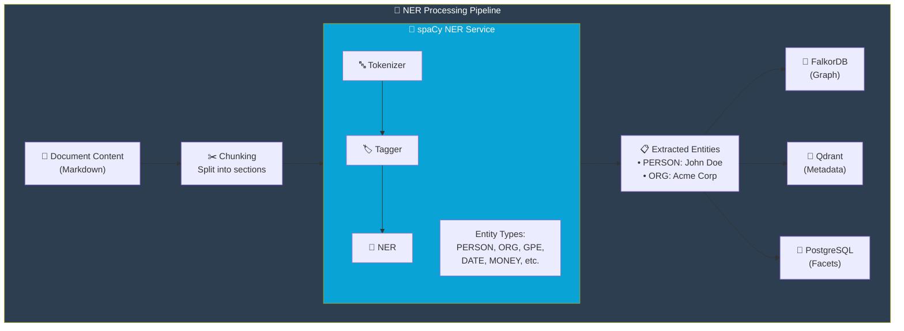

import Callout from '@components/Callout.astro';
import ImplementationNote from '@components/ImplementationNote.astro';
import ExternalCite from '@components/ExternalCite.astro';

Named Entity Recognition (NER) extracts structured information from unstructured text, identifying people, organizations, locations, and more. This guide covers deploying a spaCy NER service and integrating it with .NET applications.

## Architecture



## spaCy Service Deployment

### Dockerfile

```dockerfile
# services/spacy-ner/Dockerfile
FROM python:3.11-slim

WORKDIR /app

# Install dependencies
COPY requirements.txt .
RUN pip install --no-cache-dir -r requirements.txt

# Download spaCy model
RUN python -m spacy download en_core_web_trf

COPY app.py .

EXPOSE 8080

CMD ["uvicorn", "app:app", "--host", "0.0.0.0", "--port", "8080"]
```

### FastAPI Application

```python
# services/spacy-ner/app.py
from fastapi import FastAPI, HTTPException
from pydantic import BaseModel
import spacy
from typing import List, Optional
import logging

logging.basicConfig(level=logging.INFO)
logger = logging.getLogger(__name__)

# Load transformer-based model for better accuracy
nlp = spacy.load("en_core_web_trf")

app = FastAPI(title="spaCy NER Service")

class NERRequest(BaseModel):
    text: str
    entity_types: Optional[List[str]] = None
    min_confidence: float = 0.5

class Entity(BaseModel):
    text: str
    label: str
    start: int
    end: int
    confidence: float

class NERResponse(BaseModel):
    entities: List[Entity]
    text_length: int
    processing_time_ms: float

@app.post("/extract", response_model=NERResponse)
async def extract_entities(request: NERRequest):
    import time
    start_time = time.time()
    
    if len(request.text) > 100000:
        raise HTTPException(
            status_code=400, 
            detail="Text too long. Maximum 100,000 characters."
        )
    
    doc = nlp(request.text)
    
    entities = []
    for ent in doc.ents:
        # Filter by entity type if specified
        if request.entity_types and ent.label_ not in request.entity_types:
            continue
        
        # spaCy doesn't provide confidence scores directly
        # Use a heuristic based on entity length and context
        confidence = min(0.9, 0.6 + (len(ent.text) / 50))
        
        if confidence >= request.min_confidence:
            entities.append(Entity(
                text=ent.text,
                label=ent.label_,
                start=ent.start_char,
                end=ent.end_char,
                confidence=round(confidence, 2)
            ))
    
    processing_time = (time.time() - start_time) * 1000
    
    logger.info(f"Extracted {len(entities)} entities in {processing_time:.2f}ms")
    
    return NERResponse(
        entities=entities,
        text_length=len(request.text),
        processing_time_ms=round(processing_time, 2)
    )

@app.get("/health")
async def health():
    return {"status": "healthy", "model": "en_core_web_trf"}

@app.get("/entity-types")
async def entity_types():
    """Return supported entity types"""
    return {
        "types": [
            {"label": "PERSON", "description": "People, including fictional"},
            {"label": "ORG", "description": "Companies, agencies, institutions"},
            {"label": "GPE", "description": "Countries, cities, states"},
            {"label": "LOC", "description": "Non-GPE locations"},
            {"label": "DATE", "description": "Absolute or relative dates"},
            {"label": "TIME", "description": "Times smaller than a day"},
            {"label": "MONEY", "description": "Monetary values"},
            {"label": "PERCENT", "description": "Percentage values"},
            {"label": "EVENT", "description": "Named events"},
            {"label": "PRODUCT", "description": "Products"},
            {"label": "LAW", "description": "Laws and legal documents"},
            {"label": "WORK_OF_ART", "description": "Titles of creative works"}
        ]
    }
```

### Kubernetes Deployment

```yaml
# apps/spacy-ner/deployment.yaml
apiVersion: apps/v1
kind: Deployment
metadata:
  name: spacy-ner
  namespace: ai
spec:
  replicas: 2
  selector:
    matchLabels:
      app: spacy-ner
  template:
    metadata:
      labels:
        app: spacy-ner
    spec:
      containers:
        - name: spacy-ner
          image: registry.bluerobin.local/spacy-ner:latest
          ports:
            - containerPort: 8080
          resources:
            requests:
              memory: "1Gi"
              cpu: "500m"
            limits:
              memory: "4Gi"
              cpu: "2000m"
          readinessProbe:
            httpGet:
              path: /health
              port: 8080
            initialDelaySeconds: 30
            periodSeconds: 10
          livenessProbe:
            httpGet:
              path: /health
              port: 8080
            initialDelaySeconds: 60
            periodSeconds: 30
```

<ImplementationNote>
The transformer model (`en_core_web_trf`) provides better accuracy than the default models but requires more memory. Allocate at least 2GB per replica.
</ImplementationNote>

## .NET Integration

### NER Client

```csharp
// Infrastructure/Ai/SpacyNerClient.cs
public sealed class SpacyNerClient : INerService
{
    private readonly HttpClient _http;
    private readonly ILogger<SpacyNerClient> _logger;
    
    public SpacyNerClient(
        HttpClient http,
        ILogger<SpacyNerClient> logger)
    {
        _http = http;
        _logger = logger;
    }
    
    public async Task<IReadOnlyList<ExtractedEntity>> ExtractAsync(
        string text,
        NerOptions? options = null,
        CancellationToken ct = default)
    {
        options ??= NerOptions.Default;
        
        var request = new NerRequest
        {
            Text = text,
            EntityTypes = options.EntityTypes,
            MinConfidence = options.MinConfidence
        };
        
        var response = await _http.PostAsJsonAsync("/extract", request, ct);
        response.EnsureSuccessStatusCode();
        
        var result = await response.Content
            .ReadFromJsonAsync<NerResponse>(ct);
        
        if (result == null)
        {
            return [];
        }
        
        _logger.LogDebug(
            "Extracted {Count} entities in {Time}ms",
            result.Entities.Count,
            result.ProcessingTimeMs);
        
        return result.Entities.Select(e => new ExtractedEntity
        {
            Value = e.Text,
            Type = MapEntityType(e.Label),
            Confidence = e.Confidence,
            StartPosition = e.Start,
            EndPosition = e.End
        }).ToList();
    }
    
    private static EntityType MapEntityType(string label) => label switch
    {
        "PERSON" => EntityType.Person,
        "ORG" => EntityType.Organization,
        "GPE" or "LOC" => EntityType.Location,
        "DATE" or "TIME" => EntityType.Date,
        "MONEY" or "PERCENT" => EntityType.Numeric,
        "EVENT" => EntityType.Event,
        "PRODUCT" => EntityType.Product,
        "LAW" => EntityType.Legal,
        "WORK_OF_ART" => EntityType.CreativeWork,
        _ => EntityType.Other
    };
}

public sealed record NerOptions
{
    public IReadOnlyList<string>? EntityTypes { get; init; }
    public float MinConfidence { get; init; } = 0.5f;
    
    public static NerOptions Default { get; } = new();
    
    public static NerOptions PeopleAndOrgs { get; } = new()
    {
        EntityTypes = ["PERSON", "ORG"]
    };
}

public sealed record ExtractedEntity
{
    public required string Value { get; init; }
    public required EntityType Type { get; init; }
    public required float Confidence { get; init; }
    public int StartPosition { get; init; }
    public int EndPosition { get; init; }
}

public enum EntityType
{
    Person,
    Organization,
    Location,
    Date,
    Numeric,
    Event,
    Product,
    Legal,
    CreativeWork,
    Other
}
```

### Dependency Injection

```csharp
// Infrastructure/DependencyInjection.cs
public static IServiceCollection AddNerServices(
    this IServiceCollection services,
    IConfiguration configuration)
{
    services.AddHttpClient<INerService, SpacyNerClient>(client =>
    {
        client.BaseAddress = new Uri(
            configuration["SpacyNer:Endpoint"] 
            ?? "http://spacy-ner.ai.svc.cluster.local:8080");
        client.Timeout = TimeSpan.FromSeconds(30);
    })
    .AddPolicyHandler(GetRetryPolicy())
    .AddPolicyHandler(GetCircuitBreakerPolicy());
    
    return services;
}

private static IAsyncPolicy<HttpResponseMessage> GetRetryPolicy()
{
    return HttpPolicyExtensions
        .HandleTransientHttpError()
        .WaitAndRetryAsync(3, retryAttempt => 
            TimeSpan.FromSeconds(Math.Pow(2, retryAttempt)));
}

private static IAsyncPolicy<HttpResponseMessage> GetCircuitBreakerPolicy()
{
    return HttpPolicyExtensions
        .HandleTransientHttpError()
        .CircuitBreakerAsync(5, TimeSpan.FromSeconds(30));
}
```

## Document Processing Integration

### Entity Extraction Worker

```csharp
// Workers/EntityExtractionWorker.cs
public sealed class EntityExtractionWorker : BackgroundService
{
    private readonly INatsConnection _nats;
    private readonly INerService _ner;
    private readonly IEntityRelationshipService _relationships;
    private readonly IDocumentRepository _documents;
    private readonly IConfiguration _config;
    private readonly ILogger<EntityExtractionWorker> _logger;
    
    protected override async Task ExecuteAsync(CancellationToken ct)
    {
        var env = _config["Environment"] ?? "dev";
        var subject = $"{env}.archives.documents.analysis.completed";
        
        await foreach (var msg in _nats.SubscribeAsync<AnalysisCompletedEvent>(
            subject, cancellationToken: ct))
        {
            try
            {
                await ProcessAsync(msg.Data!, ct);
                await msg.AckAsync(cancellationToken: ct);
            }
            catch (Exception ex)
            {
                _logger.LogError(ex, 
                    "Failed to extract entities for {DocumentId}",
                    msg.Data?.DocumentId);
                await msg.NakAsync(cancellationToken: ct);
            }
        }
    }
    
    private async Task ProcessAsync(
        AnalysisCompletedEvent evt, 
        CancellationToken ct)
    {
        var document = await _documents.GetByIdAsync(
            BlueRobinId.From(evt.DocumentId), ct);
        
        if (document == null) return;
        
        // Extract entities from document content
        var entities = await _ner.ExtractAsync(
            evt.Content,
            NerOptions.Default,
            ct);
        
        _logger.LogInformation(
            "Extracted {Count} entities from document {DocumentId}",
            entities.Count,
            evt.DocumentId);
        
        // Store in graph database
        await _relationships.AddDocumentEntitiesAsync(
            document.Id,
            document.OwnerId,
            entities,
            ct);
        
        // Update document with entity counts
        document.UpdateEntityCounts(
            entities.Count(e => e.Type == EntityType.Person),
            entities.Count(e => e.Type == EntityType.Organization),
            entities.Count(e => e.Type == EntityType.Location));
        
        await _documents.UpdateAsync(document, ct);
    }
}
```

<Callout type="tip">
Process entities after OCR and before embedding generation to ensure entity metadata is available for vector search filtering.
</Callout>

## Summary

spaCy NER enables:

| Feature | Benefit |
|---------|---------|
| 12+ Entity Types | Rich semantic extraction |
| Transformer Model | High accuracy recognition |
| Fast Processing | Sub-second for typical documents |
| Graph Integration | Build knowledge graphs from entities |
| Search Enhancement | Filter by entity mentions |

Combined with FalkorDB, extracted entities form a queryable knowledge graph across all documents.

<ExternalCite 
  title="spaCy NER Documentation" 
  url="https://spacy.io/usage/linguistic-features#named-entities"
  author="Explosion AI"
/>
