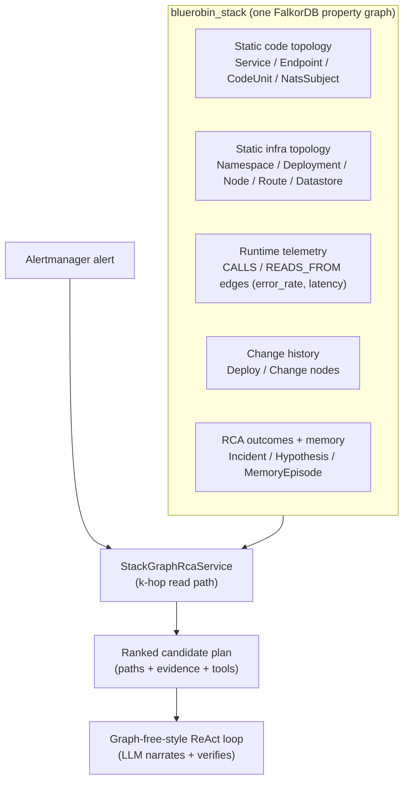

## Abstract

We describe the StackGraph, a single persistent property graph that fuses five disparate layers of a self-hosted microservice platform — static code topology, static infrastructure topology, runtime telemetry service-graph, change/deploy history, and accumulated root-cause-analysis (RCA) outcomes including a bi-temporal incident memory — into one world-model stored as a second graph key inside an existing FalkorDB instance. The StackGraph is consulted by an otherwise graph-free, ReAct-style large-language-model (LLM) agent that performs advisory RCA on production incidents in the BlueRobin homelab. The design occupies a deliberate neuro-symbolic middle ground: deterministic graph traversal proposes ranked candidate root causes, and the LLM narrates and verifies them against real tool evidence; it never grades its own homework. Every node and edge carries a first-class provenance bundle (source, status, confidence) so that any ranked candidate is traceable to the telemetry, code, or change that produced it. We report the schema, the k-hop neighbourhood read path, the parameterised-Cypher security posture, and the engineering discipline that keeps the entire stack — graph, vector index, and temporal memory — inside a ~50 EUR/month budget with no GraphRAG community indexing and no new always-on workload. This is a systems and experience report, not an empirical breakthrough: the system is advisory and human-in-the-loop by construction, and the internal evaluation is an admittedly oversimplified self-seeded benchmark (companion paper). The contribution is the architecture and the cost discipline.

## 1. Introduction

Automated root-cause analysis for microservice and Kubernetes systems is hard, and recent independent benchmarks make the difficulty concrete rather than rhetorical. The best agent on OpenRCA reaches roughly 11.3% exact-match (Xu et al., 2025; arXiv via OpenReview [M4qNIzQYpd](https://openreview.net/pdf?id=M4qNIzQYpd)), and the best frontier model on IBM's ITBench-AA reaches roughly 47% precision-at-full-recall ([Artificial Analysis x IBM, 2026](https://huggingface.co/blog/ibm-research/itbench-aa)). These ceilings are the honest baseline against which any homelab system must be read: fully autonomous RCA is not a solved problem, and an advisory, human-in-the-loop posture is the state of the art, not a concession.

A naive response is to hand a frontier LLM the alert text and a pile of tools and let it reason. This fails in well-documented ways. The MAST failure taxonomy ([Cemri et al., 2025](https://huggingface.co/blog/ibm-research/itbenchandmast)), derived from 310 ITBench traces, attributes roughly 94% of multi-agent failures to a handful of modes — incorrect self-verification, premature termination, memory loss, and reasoning-action mismatch. An LLM asked to localise a fault from symptoms alone tends to hallucinate a plausible-sounding cause, declare victory, and terminate. The RCA survey literature reaches the same conclusion structurally: LLM-only RCA "lacks structural grounding and risks hallucinated or unsafe suggestions" (Zhang et al., 2024; [arXiv:2408.00803](https://arxiv.org/abs/2408.00803)). The fix the literature converges on is grounding the agent in an explicit topology or causal graph.

But graph grounding has a cost profile that does not fit a hobbyist budget. Microsoft GraphRAG (Edge et al., 2024; [arXiv:2404.16130](https://arxiv.org/abs/2404.16130)) delivers strong global sensemaking but is dominated by LLM indexing calls — entity, edge, and claim extraction plus community summarisation — at roughly 20–40 USD per million tokens, re-run whenever the corpus changes. A persistent agent-memory graph such as Zep/Graphiti (Rasmussen et al., 2025; [arXiv:2501.13956](https://arxiv.org/abs/2501.13956)) is the right pattern but ships as a Python/TypeScript sidecar. Neither fits a single memory-saturated node running a .NET service under a hard 20 EUR/month LLM ceiling.

The StackGraph is our answer: a persistent, graph-grounded world-model built and queried entirely deterministically, with the LLM demoted to a narrator and verifier over graph-proposed candidates. Its contributions are:

- **A five-layer fused world-model in one property graph.** Code topology, infra topology, runtime telemetry, change history, and RCA outcomes (including bi-temporal memory) live in a single FalkorDB graph keyed `bluerobin_stack`, not five siloed stores.
- **A neuro-symbolic read path.** Deterministic k-hop traversal and personalised-PageRank blame-propagation propose ranked candidates that seed a graph-free-style ReAct loop; the LLM confirms leads against hard tool evidence and never validates a hypothesis on its own inference.
- **First-class provenance on every edge.** A `(source, status, confidence)` bundle (ADR-021) makes every candidate auditable back to the telemetry, code unit, or deploy that produced it.
- **A homelab cost envelope.** A second graph key in the already-deployed FalkorDB, local Ollama embeddings that bypass the paid edge, no GraphRAG community indexing, and no new always-on workload — the whole world-model is cost-neutral within ~50 EUR/month.
- **A fail-open advisory contract.** An empty, stale, or unreachable graph degrades to an empty plan and the agent proceeds on its tool floor (NFR-SG-2); the graph is never a hard dependency of incident response.

## 2. Related Work

**Two architectural camps.** Contemporary RCA systems split into graph-grounded "system-model" builders and graph-free live investigators. The grounded camp includes Dynatrace Davis (deterministic causal traversal of the Smartscape graph), Causely (a Bayesian causal DAG plus codebook), Traversal (a learned causal dependency map), Resolve.ai (a 50k-node dynamic knowledge graph with PR citations), Deductive AI (a Neo4j code-to-telemetry graph with reinforcement learning), and Cleric (a hierarchical knowledge graph driving massively parallel multi-hypothesis search). The graph-free camp — HolmesGPT (Robusta and Microsoft, CNCF Sandbox), K8sGPT, Datadog Bits AI SRE, Grafana Assistant, Parity, and NeuBird Hawkeye — correlates at investigation time with no persistent model. The StackGraph deliberately occupies the middle ground identified in the survey framing: graph traversal proposes candidates and the LLM narrates and verifies, rather than the LLM being either the sole reasoner or a thin shell over a symbolic engine.

**GraphRAG and temporal knowledge graphs.** Microsoft GraphRAG (Edge et al., 2024; [arXiv:2404.16130](https://arxiv.org/abs/2404.16130)) introduced hierarchical Leiden community detection with LLM-generated community summaries for global sensemaking, at an indexing cost dominated by LLM calls. Zep/Graphiti (Rasmussen et al., 2025; [arXiv:2501.13956](https://arxiv.org/abs/2501.13956)) is the pattern we follow for memory: bi-temporal edges carrying both valid time and ingestion time, with hybrid retrieval combining semantic cosine similarity, BM25, and breadth-first graph traversal and crucially no LLM at retrieval (Graphiti reports P95 around 300 ms). We adopt the bi-temporal schema and the no-LLM-at-retrieval discipline but hand-roll them in .NET on FalkorDB rather than deploying the Python `graphiti-core` library. For RCA specifically, SynergyRCA (Liu et al., 2025; [arXiv:2506.02490](https://arxiv.org/abs/2506.02490)) pairs a spatio-temporal StateGraph with a MetaGraph in Neo4j/Cypher, retrieval-augmented to an LLM, reaching roughly 0.90 precision in around two minutes on two production clusters — the strongest credible academic KG-plus-LLM RCA result, and a useful upper reference for what graph grounding buys. The serialization of graph context for the LLM follows "Simple Is Effective" (Li et al., 2024; [arXiv:2410.20724](https://arxiv.org/abs/2410.20724)), which shows that rendering triples as template natural-language sentences ("the relation of head is tail") improves LLM comprehension over raw triples.

**Grounding versus hallucination.** The RCA survey of Zhang et al. (2024; [arXiv:2408.00803](https://arxiv.org/abs/2408.00803)) and the MAST taxonomy ([Cemri et al., 2025](https://huggingface.co/blog/ibm-research/itbenchandmast)) together motivate the verification discipline: never let the LLM grade its own homework, require hard tool evidence before a confident exit, and enforce termination via a finite-state machine outside the model. The StackGraph supplies the symbolic substrate those disciplines run against; the verification gate and hypothesis machinery that consume it are detailed in the companion papers in this series.

## 3. Method: The StackGraph World-Model

### 3.1 What the StackGraph is

The StackGraph is not a stack-trace graph or a function-level call graph. It is a persistent topology-and-outcome world-model of the entire platform, keyed `bluerobin_stack` in FalkorDB (FR-SG-1), that fuses five layers:

1. **Static code topology** — services, FastEndpoints endpoints, NATS subjects, and structure-defining source files.
2. **Static infra topology** — namespaces, deployments, nodes, Traefik routes, datastores, and external APIs.
3. **Runtime telemetry** — the Tempo service-graph projected as `CALLS` and `READS_FROM` edges carrying error-rate and latency.
4. **Change history** — `Deploy` and `Change` nodes derived from Flux reconciliations and Git commits.
5. **RCA outcomes** — `Incident`, `Alert`, `Hypothesis` nodes, evidence and root-cause edges, plus a bi-temporal incident-memory subgraph.



### 3.2 Schema and provenance

Every node and edge carries an ADR-021 provenance bundle as first-class metadata, expressed by three enums:

```csharp
public enum EdgeSource { StaticCode, StaticInfra, Tempo, Loki, Prometheus, Synthetic, LlmInferred, Git }
public enum EdgeStatus { Active, Stale, Candidate, Deprecated }
public enum RiskClass  { Metadata, Structural }
```

Standard properties seen across builders are `source`, `status`, `confidence_score`, `first_seen` (set `ON CREATE`), `last_seen`, and `last_scan`. The node labels and their natural keys:

| Label | Natural key | Notes |
|---|---|---|
| `Service` | `name` | criticality, kind (infra/worker), namespace, repo |
| `Endpoint` | `service\|method\|route` | FastEndpoints route |
| `NatsSubject` | `subject` | event-bus subject |
| `CodeUnit` | `repo\|path` | `embedding_ref` = Qdrant point id, `github_url`, `language` |
| `Datastore` | `name` | `db_system` |
| `ExternalApi` | `name` | GitHub / R2 / CF AI Gateway peers |
| `Deployment` | `name` | namespace, image, replicas |
| `Node` | `name` | cluster node, role |
| `Namespace` | `name` | environment |
| `Route` | `host` | Traefik |
| `Alert` | `fingerprint` | Alertmanager fingerprint |
| `Incident` | `fingerprint` | RCA write-back; `evidence_chain_json` |
| `Deploy` | `service\|image_digest\|deployed_at` | from Flux |
| `Change` | `repo\|commit_sha` | from Git; `pr_number`, `summary` |
| `Hypothesis` | `incident_fingerprint\|suspect_ref` | `state`, `rank` |
| `MemoryEpisode` | `incident_fingerprint` | bi-temporal memory |
| `MemoryEntity` | `entity_type\|entity_ref` | deduped fact entity |

Edge types span the five layers: `EXPOSES`, `PUBLISHES_TO`/`CONSUMES_FROM`/`DECLARES_SUBJECT` (NATS), `CALLS` (carrying `trace_count`/`error_rate`/`latency_p95_ms`), `READS_FROM`, `IMPLEMENTS`, `DEFINED_IN`, `DEPLOYED_AS`/`RUNS_ON`/`IN_NAMESPACE`/`ROUTES_TO`, `DEPLOYED`/`CHANGED`, `FIRED_ON`/`AFFECTS`, `EVALUATED_AS`, `EVIDENCED_BY` (carrying `tool`/`verdict`/`result_summary`), `ROOT_CAUSED_BY` (written only when a hypothesis is validated and confidence ≥ 0.40), `CITES` (Hypothesis to Change/Deploy), and the bi-temporal memory edges `MENTIONS`/`RESOLVED_BY`/`SUPERSEDES` carrying `t_valid`/`t_invalid`/`ingested_at`.

The design principle behind the bundle is auditability: because `source` distinguishes `StaticInfra` from `Tempo` from `LlmInferred`, a ranked candidate can always be traced to the evidence class that produced it, and LLM-inferred structure can be structurally barred from validating an outcome.

### 3.3 How the graph is built: a single writer

The graph has exactly one writer, `GraphIngestor`, implemented as a partial class split across ingest lanes. Its contract is idempotent MERGE-on-natural-key, which makes every rebuild-from-source deterministic and re-runnable. The lanes are:

- **Static code lane** clones each mapped repo and parses FastEndpoints routes and NATS publish/subscribe symbols. Only structure-defining files become `:CodeUnit` nodes (not every `.cs` file) so the graph stays readable, linking `CodeUnit-[:IMPLEMENTS]->Service`, `Endpoint-[:DEFINED_IN]->CodeUnit`, and `CodeUnit-[:DECLARES_SUBJECT]->NatsSubject` (FR-SG-2).
- **Static infra lane** reads Kubernetes and Traefik CRDs into Namespace/Deployment/Node/Route/Datastore nodes.
- **Telemetry lane** projects the Tempo service-graph metrics into `CALLS`/`READS_FROM` edges with the runtime bundle, and flips an edge to `status = Stale` once its metric ages past a freshness threshold (FR-SG-3, ≤ 15 min).
- **Change lane** writes `Deploy` nodes from Flux and `Change` nodes from Git.
- **RCA write-back** records the concluded `Incident`, an `AFFECTS` edge to the symptom service always, and a `ROOT_CAUSED_BY` edge to the cause only at confidence ≥ 0.40 (FR-SG-7).

The single-writer-many-readers model (ADR-021) avoids write contention and keeps the rebuild path a pure function of its sources.

### 3.4 The k-hop read path

RCA reads the graph through `StackGraphRcaService.InvestigateAsync` (FR-SG-6). Given an alerting service it pulls the k-hop neighbourhood (parameterised, SEC-SG-4), turns each candidate into a topology/telemetry/history scoring signal, and returns a ranked top-N investigation plan of paths, evidence, and suggested tools. The simplest collection step is a one-hop Cypher query over the runtime call edges:

```cypher
MATCH (s:Service {name: $name})-[e:CALLS]->(n:Service)
RETURN n.name, n.criticality, e.error_rate, e.status
```

Each neighbour becomes a `ScoringSignal` whose topology weight tracks criticality, whose telemetry weight tracks error-rate (halved when the edge is `Stale`), and whose history weight comes from a root-cause-history prior, together with a `Path` and a set of `SuggestedTools`. A richer bounded multi-hop traversal exists for alert-anchored search:

```cypher
MATCH (a:Alert {fingerprint: $fingerprint})-[:AFFECTS]->(svc:Service)
MATCH path = (svc)-[*1..4]->(candidate:Service)
RETURN candidate, path LIMIT $bounded
```

The hop count is clamped at four. Candidates are ranked by a deterministic blame-propagation scorer — personalised PageRank seeded at the symptom over the error-weighted dependency subgraph — and a multi-term blend, both detailed in the companion ranking paper. The output is strictly advisory: an empty, stale, or unreachable graph yields an empty plan (NFR-SG-2), and the agent proceeds on its tool floor.

### 3.5 The neuro-symbolic contract

The candidates from the read path are not conclusions; they are leads. They seed the LLM prompt verbatim under a header that frames them as "likely root causes (graph blame-propagation, before tools) — prioritised leads to confirm, not conclusions." The LLM then runs a classic ReAct tool loop over real observability tools (Tempo, Loki, Prometheus, Kubernetes, Flux, NATS, GitHub, and a `query_stack_graph` tool), and a hypothesis's state is derived from the tool evidence it accumulates, never asserted by the model. Evidence whose provenance `source` is `LlmInferred` is rejected at the sink — the system never grades its own homework. This is the operational meaning of the neuro-symbolic middle ground: symbolic traversal narrows the search space cheaply and deterministically; the neural component narrates, investigates, and verifies, but cannot self-certify. The serialization of a candidate path into template natural-language sentences for the LLM follows "Simple Is Effective" (Li et al., 2024; [arXiv:2410.20724](https://arxiv.org/abs/2410.20724)) and is exposed, A/B-gated, through the `query_stack_graph` tool.

## 4. Implementation

### 4.1 Storage and query

The StackGraph lives in FalkorDB (`falkordb/falkordb:v4.4.1`, 2 GiB limit, Redis wire protocol on port 6379) as a second graph key alongside the application's existing graph (ADR-021, FR-SG-1, NFR-SG-1). The .NET client drives it over the RedisGraph wire protocol via `GRAPH.QUERY` using `StackExchange.Redis`:

```csharp
return db.Execute("GRAPH.QUERY", graphKey, composed, "--compact");
```

All queries are constant parameterised Cypher templates. Parameters bind through FalkorDB's `CYPHER name=value` preamble — never string interpolation — which is the FalkorDB analogue of parameterised SQL (SEC-SG-4). Values are emitted as escaped Cypher literals so that an injection payload becomes the literal data of a single string parameter, and the relationship types and labels that Cypher forbids parameterising are always selected from fixed code-supplied allow-lists (for example, suspect labels collapse to a seven-label set) rather than from caller text. This closes both the Cypher-injection and the open-redirect/SSRF surfaces that a caller-influenced graph query would otherwise open.

### 4.2 Embeddings and the code-to-graph join

The vector store is a separate Qdrant instance reached over gRPC (port 6334, cosine distance). Embeddings are generated against an in-cluster Ollama OpenAI-compatible `/v1/embeddings` endpoint, which is direct and free and never transits the paid Cloudflare edge (ADR-020). Two pipelines coexist: code retrieval uses `qwen3-embedding:8b` (4096-d) into a `code-embeddings` collection, and incident memory uses `bge-m3` (1024-d) into a dedicated collection (ADR-047). The static code lane embeds each `:CodeUnit` and persists the returned Qdrant point id onto `CodeUnit.embedding_ref` (FR-SG-48), enabling bidirectional traversal: graph-to-code returns the embedding refs for a service's code units, and code-to-graph maps a semantic code hit back to its owning `:Service`. Chunking is Roslyn-based, by method, constructor, class, record, interface, enum, and computed property.

### 4.3 The ~50 EUR/month cost envelope

The cost discipline is the load-bearing engineering claim, and it is enforced by what the design refuses to do. The platform runs to a hard total ceiling of 50 EUR/month: a single Hetzner CX43 worker at roughly 17.5 EUR, Cloudflare R2 and Tunnel on free tiers, and a hard 20 EUR/month LLM token ceiling (COST-7) with a 50/80/100% alert ladder that fail-closes new analyses at 100%. The hosting node is memory-saturated (around 96% of memory requests committed), which is the binding reason the StackGraph must live as a second key inside the existing 2 GiB FalkorDB rather than as a new pod (NFR-SG-1). The architecture consequently rejects, on cost grounds, four otherwise-attractive options: GraphRAG community indexing (its 20–40 USD per million indexing tokens would breach the LLM ceiling on its own), a Python `graphiti-core` sidecar (a new always-on workload the node cannot host), foundation-model anomaly detection (10–50x slower and no accuracy win), and any second time-series database (the graph indexes over the existing LGTM stack rather than re-storing telemetry). The result is a graph-grounded, temporally-aware RCA world-model whose marginal monthly cost is effectively zero — it adds a graph key, a Qdrant collection, and a periodic CronJob ingest (NFR-SG-3), and nothing that runs continuously.

### 4.4 Operational posture

The read path is health-gated and fail-open (NFR-SG-2): the agentic loop has an eleven-tool floor and a five-minute run budget, and the StackGraph is one input among them, never a precondition. Ingest runs as a cost-neutral CronJob (NFR-SG-3). The write-back of incident outcomes and bi-temporal memory episodes is best-effort and shadow-first, so the whole world-model can be populated and observed in production before any of its rankings are allowed to govern a decision. All of this is governed by FEAT-027 (Stack-Graph RCA), with the graph model and LLM-refinement safety captured in ADR-021 and ADR-022 respectively.

## 5. Evaluation

This paper's contribution is architectural; the quantitative evaluation belongs to the companion eval paper, and we summarise it here only with its caveats stated plainly, because honest framing matters more than a headline number.

The internal harness replays a self-seeded set of nine labelled incidents through the real RCA read path and emits a deterministic scorecard. On that set the system reports accuracy-at-1 (AC@1, the fraction of incidents whose top-ranked candidate is the labelled cause) of 1.0, and mean-time-to-resolution (MTTR) figures in the sub-second range.

| Metric | Value | What it actually is |
|---|---|---|
| AC@1 (self-seeded set) | 1.0 | Top-ranked candidate matches the label on 9 hand-labelled incidents |
| Incident count | 9 | Authors' own set; described internally as "oversimplified" |
| MTTR proxy | sub-second | Replay-clock wall time, not production incident MTTR |
| External reference: OpenRCA best agent | ~11.3% | Exact-match, 335 cases ([Xu et al., 2025](https://openreview.net/pdf?id=M4qNIzQYpd)) |
| External reference: ITBench-AA best model | ~47% | Precision@full-recall, 59 tasks (2026) |

These numbers must not be read as a capability claim. AC@1 = 1.0 on nine self-labelled incidents is a regression sentinel, not evidence of general RCA accuracy; the authors themselves characterise the set as an oversimplified benchmark. The MTTR figures are replay-clock proxies measured against synthetic telemetry, not production mean-time-to-resolution. The honest comparison points are the external ceilings in the table: against OpenRCA's ~11% and ITBench-AA's ~47%, an advisory homelab system is matching the posture of the field, not exceeding it. A distractor-injection arm of the harness (candidates with higher topology criticality but lower error-rate) exists precisely so that AC@1 below 1.0 is achievable and the gate can catch real regressions rather than rubber-stamping a trivially separable set. The defensible claim is narrow and architectural: the StackGraph read path produces a ranked, provenance-tagged plan deterministically and cheaply, and it does so without ever letting the LLM certify its own conclusion.

## 6. Limitations and Threats to Validity

**Construct validity.** The evaluation set is self-seeded and small (nine incidents), authored by the same people who built the system, and acknowledged internally as oversimplified. AC@1 = 1.0 on it says little about real incident diversity. The MTTR figures are replay-clock proxies, not production MTTR, and should never be quoted as operational latency.

**Internal validity.** Because ingest is deterministic and self-seeded, the labelled incidents and the graph that ranks them share provenance; a separable-by-construction set inflates AC@1. The distractor arm mitigates but does not eliminate this. The system is advisory and human-in-the-loop by design — a human always merges — so end-to-end "resolution" is never autonomous and the harness measures localisation, not repair.

**External validity.** The platform is a single-node homelab with a small service count; the k-hop neighbourhood is small and the four-hop clamp has never been stressed at scale. Findings may not transfer to large multi-cluster estates where graph size, community structure, and fan-out dominate — exactly the regime where GraphRAG-style indexing earns its cost.

**Known engineering caveats.** Two are worth flagging. First, the create-on-demand path for the incident-memory Qdrant collection can inherit the code-index embedding dimension (4096-d) while the documented memory model is `bge-m3` at 1024-d, a latent mismatch unless the declarative collection-init job wins the race; the dimensions must be pinned (the intent of ADR-047). Second, the graph is only as fresh as its ingest CronJob and its staleness thresholds; a stale `CALLS` edge is down-weighted, not removed, so a candidate can persist on topology weight after its telemetry has gone cold. These are mitigations, not guarantees, and are stated so that the world-model is not over-trusted.

## 7. Conclusion

The StackGraph shows that graph-grounded agentic RCA does not require a graph-indexing budget. By fusing five topology and outcome layers into a single FalkorDB property graph keyed `bluerobin_stack`, carrying a provenance bundle on every edge, and consulting it through a deterministic k-hop read path that seeds a graph-free-style ReAct loop, the system gets the structural grounding the literature calls for while demoting the LLM to a narrator and verifier that cannot grade its own homework. The whole world-model — graph, vector join, and bi-temporal memory — fits inside an existing FalkorDB instance on a memory-saturated single node under a 50 EUR/month ceiling, with no community indexing, no Python sidecar, and no new always-on workload. The honest scope is equally important: the system is advisory by construction and its internal evaluation is a small self-seeded sentinel, not a capability proof. The neuro-symbolic middle ground it occupies — symbolic traversal proposes, neural reasoning verifies — is, we argue, the right shape for RCA at the autonomous ceiling the field actually sits at today. Subsequent papers in this series detail the correlation-first ranking blend, the externalised verification gate and hypothesis tree, the eval-first methodology, and the bi-temporal incident memory that the StackGraph makes possible.

## 8. References

1. Edge, D., Trinh, H., Cheng, N., et al. (2024). [*From Local to Global: A Graph RAG Approach to Query-Focused Summarization.*](https://arxiv.org/abs/2404.16130) arXiv:2404.16130.
2. Rasmussen, P., et al. (2025). [*Zep: A Temporal Knowledge Graph Architecture for Agent Memory.*](https://arxiv.org/abs/2501.13956) arXiv:2501.13956.
3. Liu, et al. (2025). [*SynergyRCA: Synergizing State and Meta Graphs for LLM-based Root Cause Analysis.*](https://arxiv.org/abs/2506.02490) arXiv:2506.02490.
4. Zhang, et al. (2024). [*A Comprehensive Survey on Root Cause Analysis in (Micro)Services.*](https://arxiv.org/abs/2408.00803) arXiv:2408.00803.
5. Li, et al. (2024). [*Simple Is Effective: The Roles of Graphs and Large Language Models in Knowledge-Graph-Based Retrieval-Augmented Generation.*](https://arxiv.org/abs/2410.20724) arXiv:2410.20724.
6. Cemri, M., et al. (2025). [*Why Do Multi-Agent LLM Systems Fail? (MAST Failure Taxonomy).*](https://huggingface.co/blog/ibm-research/itbenchandmast) IBM Research / UC Berkeley.
7. Pham, L., et al. (2024). [*BARO: Robust Root Cause Analysis with Multivariate Bayesian Online Change-Point Detection.*](https://arxiv.org/abs/2405.09330) arXiv:2405.09330.
8. Xu, J., et al. (2025). [*OpenRCA: Can Large Language Models Locate the Root Cause of Software Failures?*](https://openreview.net/pdf?id=M4qNIzQYpd) ICLR 2025.
9. Yao, S., et al. (2022). [*ReAct: Synergizing Reasoning and Acting in Language Models.*](https://arxiv.org/abs/2210.03629) arXiv:2210.03629.
10. Kim, et al. (2025). [*RCAEval: A Benchmark for Root Cause Analysis of Microservice Systems.*](https://arxiv.org/abs/2412.17015) arXiv:2412.17015.
11. Artificial Analysis x IBM Research (2026). [*ITBench-AA: Agentic Application SRE Root-Cause Analysis Benchmark.*](https://huggingface.co/blog/ibm-research/itbench-aa)
