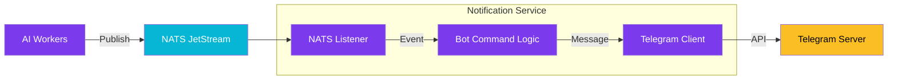

import Callout from '@components/Callout.astro';
import ImplementationNote from '@components/ImplementationNote.astro';
import CodeFile from '@components/CodeFile.astro';
import ExternalCite from '@components/ExternalCite.astro';

## Introduction

While n8n is great for simple flows, sometimes you need a robust, code-first approach for system notifications. We needed a bot that could not only send alerts but also respond to commands (like `/status` or `/restart`). For this, we leveraged .NET's `BackgroundService` and the NATS messaging system.

**Why a Custom Bot?**

- **Two-way Communication**: Receive commands from admins to query system state.
- **Performance**: High-throughput processing of system events directly from the message bus.
- **Integration**: Deep integration with our C# domain models and dependency injection container.

### What We'll Build

In this guide, we will implement `TelegramBotService`, a hosted service that connects to the Telegram Bot API and subscribes to `alerts.>` subjects on NATS.

## Architecture Overview

The bot acts as a bridge between the event bus and the chat application.



## Section 1: The Telegram Client

We use the `Telegram.Bot` NuGet package. It facilitates typed access to the API.

<Callout type="info" title="Secret Management">
    Never store your Bot Token in `appsettings.json`. We load it via environment variables provided by Infisical at runtime.
</Callout>

```csharp
public class TelegramNotifier : ITelegramNotifier
{
    private readonly ITelegramBotClient _botClient;

    public TelegramNotifier(IOptions<TelegramOptions> options)
    {
        _botClient = new TelegramBotClient(options.Value.BotToken);
    }

    public async Task SendAlertAsync(string message)
    {
        await _botClient.SendTextMessageAsync(
            chatId: _chatId,
            text: message,
            parseMode: ParseMode.Markdown
        );
    }
}
```

## Section 2: Listening to NATS

The core of the service is the `BackgroundService` that maintains a subscription to NATS. We use the `NATS.Client.Core` library for modern, async-first usage.

```csharp
public class NatsAlertListener : BackgroundService
{
    private readonly INatsConnection _nats;
    private readonly ITelegramNotifier _notifier;

    // We listen to all alerts in the staging environment
    private const string Subject = "staging.archives.alerts.>";

    protected override async Task ExecuteAsync(CancellationToken stoppingToken)
    {
        await foreach (var msg in _nats.SubscribeAsync<AlertEvent>(Subject, cancellationToken: stoppingToken))
        {
            var alert = msg.Data;
            var formattedMessage = $"🚨 *{alert.Severity}*: {alert.Message}";
            
            await _notifier.SendAlertAsync(formattedMessage);
        }
    }
}
```

## Section 3: Handling Commands

To make the bot interactive, we implement a polling loop (or webhook) to listen for user messages.

We implemented a simple `/health` command that checks the specialized health endpoints of our API and reports back to the chat. This allows us to check system status from our phones without logging into the VPN or opening a dashboard.

## Section 4: API-Based Data Access

<Callout type="info" title="Security Pattern">
The bot does not connect directly to databases or storage. All data operations go through the API with service-to-service authentication.
</Callout>

Instead of giving the bot direct database access, we created internal API endpoints and use a service token for authentication:

```csharp
public class BlueRobinApiClient : IBlueRobinApiClient
{
    private readonly HttpClient _httpClient;
    private readonly TelegramBotOptions _options;

    public BlueRobinApiClient(
        IHttpClientFactory httpClientFactory,
        IOptions<TelegramBotOptions> options)
    {
        _httpClient = httpClientFactory.CreateClient("BlueRobinApi");
        _options = options.Value;

        // Add service authentication headers
        _httpClient.DefaultRequestHeaders.Add("X-Service-Token", _options.ServiceToken);
        _httpClient.DefaultRequestHeaders.Add("X-Service-Name", "telegram-bot");
    }

    public async Task<UserLookupResponse?> GetUserByTelegramChatIdAsync(long chatId, CancellationToken ct)
    {
        var response = await _httpClient.GetAsync($"/internal/users/by-telegram/{chatId}", ct);
        if (!response.IsSuccessStatusCode) return null;
        return await response.Content.ReadFromJsonAsync<UserLookupResponse>(ct);
    }

    public async Task<RagQueryResponse> AskAsync(string userId, string question, CancellationToken ct)
    {
        // Include user ID header for authorization
        var request = new HttpRequestMessage(HttpMethod.Post, "/api/rag/ask");
        request.Headers.Add("X-BlueRobin-UserId", userId);
        request.Content = JsonContent.Create(new { question, maxChunks = 5 });
        
        var response = await _httpClient.SendAsync(request, ct);
        return await response.Content.ReadFromJsonAsync<RagQueryResponse>(ct);
    }
}
```

The API validates the service token and enforces permissions:

```csharp
// In API AuthenticationServiceExtensions
serviceTokens[telegramBotToken] = new ServiceTokenConfig
{
    ExpectedServiceName = "telegram-bot",
    Role = "service",
    Permissions = ["users:read", "telegram:link", "documents:upload", "rag:query"]
};
```

**Benefits of this pattern:**
1. **Single source of truth** - All authorization logic in the API
2. **Audit trail** - Every operation logged through API middleware
3. **Simpler bot** - Only needs an HTTP client, not database drivers
4. **Better security** - Bot can't bypass business rules

## Conclusion

Combining .NET's robust hosting model with NATS and Telegram creates a powerful ChatOps experience. We receive critical information where we already are (in our chat app) and can take basic actions immediately.

**Next Steps**:
- See how we [configure the infrastructure](/blog/homelab-setup-truenas-server-guide) supporting this bot.
- Learn about the [observability stack](/blog/observability-lessons-why-we-dropped-signoz) that generates the alerts.
