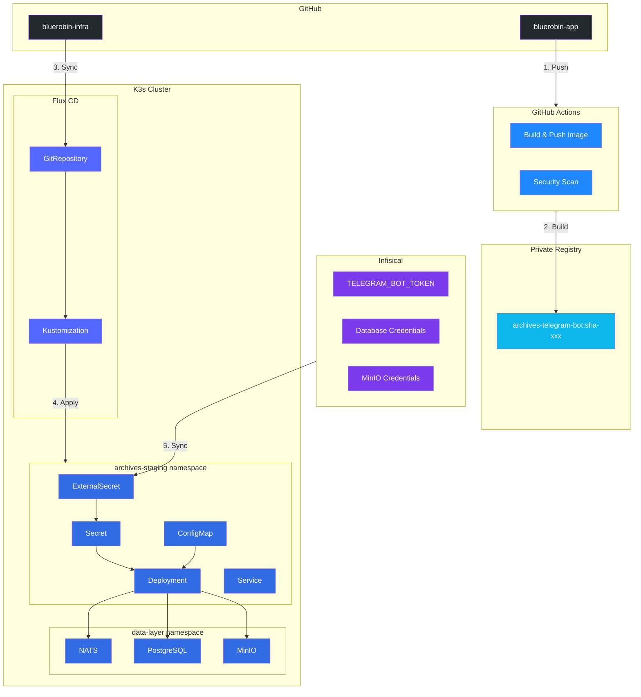

import Callout from '@components/Callout.astro';
import ImplementationNote from '@components/ImplementationNote.astro';
import CodeFile from '@components/CodeFile.astro';
import ExternalCite from '@components/ExternalCite.astro';

## Introduction

After building the [Telegram Bot service](/articles/telegram-bot-integration-dotnet-guide) and [notification pipeline](/articles/telegram-nats-notification-flow), we need to deploy it to our Kubernetes cluster. This article covers the complete deployment stack:

- **Docker**: Multi-stage build with chiseled base images
- **Kustomize**: Base + overlay pattern for staging/production
- **Infisical**: Secrets management via ExternalSecrets
- **Flux CD**: GitOps-driven deployment

## Deployment Architecture



## The Dockerfile

We use a multi-stage build with Microsoft's chiseled base images for security:

<CodeFile path="Archives.TelegramBot/Dockerfile" language="dockerfile">
```dockerfile
# =============================================================================
# Stage 1: Build
# =============================================================================
FROM mcr.microsoft.com/dotnet/sdk:10.0 AS build
ARG BUILD_COMMIT=unknown
ARG BUILD_TIME=unknown

WORKDIR /src

# Copy solution and project files for layer caching
COPY ["BlueRobin.sln", "./"]
COPY ["Directory.Build.props", "./"]
COPY ["src/SharedKernel/SharedKernel.csproj", "src/SharedKernel/"]
COPY ["src/Archives.Core/Archives.Core.csproj", "src/Archives.Core/"]
COPY ["src/Archives.Application/Archives.Application.csproj", "src/Archives.Application/"]
COPY ["src/Archives.Infrastructure/Archives.Infrastructure.csproj", "src/Archives.Infrastructure/"]
COPY ["src/Archives.TelegramBot/Archives.TelegramBot.csproj", "src/Archives.TelegramBot/"]

# Restore dependencies
RUN dotnet restore "src/Archives.TelegramBot/Archives.TelegramBot.csproj"

# Copy source code
COPY ["src/", "src/"]

# Build and publish
WORKDIR "/src/src/Archives.TelegramBot"
RUN dotnet publish "Archives.TelegramBot.csproj" \
    -c Release \
    -o /app/publish \
    --no-restore \
    /p:UseAppHost=false

# =============================================================================
# Stage 2: Runtime
# =============================================================================
FROM mcr.microsoft.com/dotnet/aspnet:10.0-noble-chiseled-extra AS final

# Build metadata labels
ARG BUILD_COMMIT=unknown
ARG BUILD_TIME=unknown
LABEL org.opencontainers.image.revision=$BUILD_COMMIT
LABEL org.opencontainers.image.created=$BUILD_TIME
LABEL org.opencontainers.image.title="BlueRobin Telegram Bot"
LABEL org.opencontainers.image.description="Telegram bot for BlueRobin document management"

# Required for ICU/globalization support
ENV DOTNET_SYSTEM_GLOBALIZATION_INVARIANT=false

WORKDIR /app
COPY --from=build /app/publish .

# Run as non-root user (chiseled images use uid 1654)
USER $APP_UID

EXPOSE 8080

ENTRYPOINT ["dotnet", "BlueRobin.Archives.TelegramBot.dll"]
```
</CodeFile>

<ImplementationNote title="Why Chiseled Images?">
Chiseled images are Microsoft's distroless-like containers:
- **No shell** - Reduces attack surface
- **No package manager** - Nothing to exploit
- **Smaller size** - ~100MB vs ~200MB for regular images
- **Non-root by default** - UID 1654

The trade-off: No `curl` for health checks, so we rely on Kubernetes probes instead.
</ImplementationNote>

## Kustomize Structure

We use a base + overlays pattern:

```
apps/archives-telegram-bot/
├── base/
│   ├── kustomization.yaml
│   ├── deployment.yaml
│   ├── service.yaml
│   └── configmap.yaml
├── overlays/
│   ├── staging/
│   │   └── kustomization.yaml
│   └── prod/
│       └── kustomization.yaml
├── externalsecret.yaml
└── kustomization.yaml
```

### Base Resources

<CodeFile path="bluerobin-infra/apps/archives-telegram-bot/base/deployment.yaml" language="yaml">
```yaml
apiVersion: apps/v1
kind: Deployment
metadata:
  name: archives-telegram-bot
  labels:
    app: archives-telegram-bot
    component: telegram
spec:
  replicas: 1
  selector:
    matchLabels:
      app: archives-telegram-bot
  template:
    metadata:
      labels:
        app: archives-telegram-bot
        component: telegram
      annotations:
        linkerd.io/inject: enabled
        config.linkerd.io/skip-outbound-ports: "4222"  # NATS uses its own mTLS
        signoz.io/scrape: "true"
        signoz.io/port: "8080"
        signoz.io/path: "/metrics"
    spec:
      securityContext:
        runAsNonRoot: true
        runAsUser: 1000
        fsGroup: 1000
        seccompProfile:
          type: RuntimeDefault
      imagePullSecrets:
        - name: registry-pull-secret
      containers:
        - name: telegram-bot
          image: 192.168.0.5:5005/bluerobin/archives-telegram-bot:latest
          imagePullPolicy: Always
          securityContext:
            allowPrivilegeEscalation: false
            readOnlyRootFilesystem: false
            runAsNonRoot: true
            capabilities:
              drop:
                - ALL
          ports:
            - containerPort: 8080
              name: http
          livenessProbe:
            httpGet:
              path: /health/live
              port: 8080
            initialDelaySeconds: 30
            periodSeconds: 30
            timeoutSeconds: 5
            failureThreshold: 3
          readinessProbe:
            httpGet:
              path: /health/ready
              port: 8080
            initialDelaySeconds: 10
            periodSeconds: 10
            timeoutSeconds: 3
          resources:
            requests:
              memory: "128Mi"
              cpu: "50m"
            limits:
              memory: "256Mi"
              cpu: "200m"
          envFrom:
            - configMapRef:
                name: archives-telegram-bot-config
            - secretRef:
                name: archives-telegram-bot-secret
          env:
            - name: ASPNETCORE_ENVIRONMENT
              value: "Production"
            - name: ConnectionStrings__DefaultConnection
              value: "Host=$(ARCHIVES_DB_HOST);Port=$(ARCHIVES_DB_PORT);Database=$(ARCHIVES_DB_NAME);Username=$(ARCHIVES_DB_USER);Password=$(ARCHIVES_DB_PASSWORD)"
            - name: Telegram__BotToken
              valueFrom:
                secretKeyRef:
                  name: archives-telegram-bot-secret
                  key: TELEGRAM_BOT_TOKEN
            - name: OTEL_EXPORTER_OTLP_ENDPOINT
              value: "http://signoz-otel-collector.platform.svc.cluster.local:4317"
            - name: OTEL_SERVICE_NAME
              value: "archives-telegram-bot"
```
</CodeFile>

### ConfigMap

<CodeFile path="bluerobin-infra/apps/archives-telegram-bot/base/configmap.yaml" language="yaml">
```yaml
apiVersion: v1
kind: ConfigMap
metadata:
  name: archives-telegram-bot-config
data:
  # NATS connection (shared data-layer)
  NATS__Url: "nats://nats.data-layer.svc.cluster.local:4222"
  
  # MinIO storage (shared data-layer)
  Minio__Endpoint: "minio.data-layer.svc.cluster.local:9000"
  Minio__UseSSL: "false"
  
  # Database host (resolved via secrets)
  ARCHIVES_DB_HOST: "postgres-rw.data-layer.svc.cluster.local"
  ARCHIVES_DB_PORT: "5432"
  
  # Qdrant vector store
  Qdrant__Endpoint: "http://qdrant.data-layer.svc.cluster.local:6334"
  Qdrant__CollectionName: "staging-documents"
  
  # RAG configuration
  Rag__OllamaBaseUrl: "http://ollama.ai.svc.cluster.local:11434"
  Rag__ChatModelId: "llama3.3:8b"
  Rag__MaxChunks: "5"
  
  # Telegram bot settings (non-sensitive)
  Telegram__BotUsername: "BlueRobinBot"
  Telegram__MaxUploadSizeBytes: "52428800"  # 50MB
  
  # Environment prefix for NATS subjects
  Environment__Prefix: "staging"
```
</CodeFile>

### Staging Overlay

<CodeFile path="bluerobin-infra/apps/archives-telegram-bot/overlays/staging/kustomization.yaml" language="yaml">
```yaml
apiVersion: kustomize.config.k8s.io/v1beta1
kind: Kustomization

namespace: archives-staging

resources:
  - ../../base

patches:
  - target:
      kind: ConfigMap
      name: archives-telegram-bot-config
    patch: |-
      - op: replace
        path: /data/Environment__Prefix
        value: "staging"
      - op: replace
        path: /data/ARCHIVES_DB_NAME
        value: "archives_staging"
      - op: replace
        path: /data/Qdrant__CollectionName
        value: "staging-documents"
      - op: add
        path: /data/Telegram__MiniAppUrl
        value: "https://web-staging.bluerobin.local/telegram/setup-passkey"
```
</CodeFile>

### Production Overlay

<CodeFile path="bluerobin-infra/apps/archives-telegram-bot/overlays/prod/kustomization.yaml" language="yaml">
```yaml
apiVersion: kustomize.config.k8s.io/v1beta1
kind: Kustomization

namespace: archives-prod

resources:
  - ../../base

patches:
  - target:
      kind: ConfigMap
      name: archives-telegram-bot-config
    patch: |-
      - op: replace
        path: /data/Environment__Prefix
        value: ""
      - op: replace
        path: /data/ARCHIVES_DB_NAME
        value: "archives_prod"
      - op: replace
        path: /data/Qdrant__CollectionName
        value: "prod-documents"
      - op: add
        path: /data/Telegram__MiniAppUrl
        value: "https://web.bluerobin.local/telegram/setup-passkey"

  - target:
      kind: Deployment
      name: archives-telegram-bot
    patch: |-
      - op: replace
        path: /spec/template/spec/containers/0/resources/requests/memory
        value: "256Mi"
      - op: replace
        path: /spec/template/spec/containers/0/resources/limits/memory
        value: "512Mi"
```
</CodeFile>

## Secrets Management with Infisical

We use ExternalSecrets to sync secrets from Infisical:

<CodeFile path="bluerobin-infra/apps/archives-telegram-bot/externalsecret.yaml" language="yaml">
```yaml
apiVersion: external-secrets.io/v1beta1
kind: ExternalSecret
metadata:
  name: archives-telegram-bot-secret
spec:
  refreshInterval: 1h
  secretStoreRef:
    kind: ClusterSecretStore
    name: infisical-secret-store
  target:
    name: archives-telegram-bot-secret
    creationPolicy: Owner
  data:
    # Telegram Bot Token
    - secretKey: TELEGRAM_BOT_TOKEN
      remoteRef:
        key: TELEGRAM_BOT_TOKEN
        
    # Database credentials
    - secretKey: ARCHIVES_DB_USER
      remoteRef:
        key: ARCHIVES_DB_USER
    - secretKey: ARCHIVES_DB_PASSWORD
      remoteRef:
        key: ARCHIVES_DB_PASSWORD
        
    # MinIO credentials
    - secretKey: MINIO_ACCESS_KEY
      remoteRef:
        key: MINIO_ACCESS_KEY
    - secretKey: MINIO_SECRET_KEY
      remoteRef:
        key: MINIO_SECRET_KEY
```
</CodeFile>

<Callout type="warning" title="Create the Telegram Token First!">
Before deploying, add `TELEGRAM_BOT_TOKEN` to Infisical:

1. Create a bot via [@BotFather](https://t.me/BotFather) in Telegram
2. Copy the API token
3. Add to Infisical: `infisical secrets set TELEGRAM_BOT_TOKEN=<your-token> --env=staging`
</Callout>

## Flux Kustomization

The Flux Kustomization resource tells Flux how to deploy the app:

<CodeFile path="bluerobin-infra/clusters/bluerobin/apps/archives-telegram-bot.yaml" language="yaml">
```yaml
apiVersion: kustomize.toolkit.fluxcd.io/v1
kind: Kustomization
metadata:
  name: archives-telegram-bot-staging
  namespace: flux-system
spec:
  interval: 5m
  path: ./apps/archives-telegram-bot/overlays/staging
  prune: true
  sourceRef:
    kind: GitRepository
    name: bluerobin-infra
  healthChecks:
    - apiVersion: apps/v1
      kind: Deployment
      name: archives-telegram-bot
      namespace: archives-staging
  timeout: 3m
---
apiVersion: kustomize.toolkit.fluxcd.io/v1
kind: Kustomization
metadata:
  name: archives-telegram-bot-prod
  namespace: flux-system
spec:
  interval: 5m
  path: ./apps/archives-telegram-bot/overlays/prod
  prune: true
  sourceRef:
    kind: GitRepository
    name: bluerobin-infra
  healthChecks:
    - apiVersion: apps/v1
      kind: Deployment
      name: archives-telegram-bot
      namespace: archives-prod
  dependsOn:
    - name: archives-telegram-bot-staging  # Deploy staging first
  timeout: 3m
```
</CodeFile>

## Image Automation with Flux

To automatically deploy new images, we configure Flux's image automation:

<CodeFile path="bluerobin-infra/apps/archives-telegram-bot/image-automation.yaml" language="yaml">
```yaml
apiVersion: image.toolkit.fluxcd.io/v1beta2
kind: ImageRepository
metadata:
  name: archives-telegram-bot
  namespace: flux-system
spec:
  image: 192.168.0.5:5005/bluerobin/archives-telegram-bot
  interval: 5m
  insecure: true  # Private registry without TLS
---
apiVersion: image.toolkit.fluxcd.io/v1beta2
kind: ImagePolicy
metadata:
  name: archives-telegram-bot
  namespace: flux-system
spec:
  imageRepositoryRef:
    name: archives-telegram-bot
  filterTags:
    pattern: '^sha-[a-f0-9]{7}$'  # Match sha-abc1234 tags
  policy:
    alphabetical:
      order: desc
---
apiVersion: image.toolkit.fluxcd.io/v1beta1
kind: ImageUpdateAutomation
metadata:
  name: archives-telegram-bot
  namespace: flux-system
spec:
  interval: 5m
  sourceRef:
    kind: GitRepository
    name: bluerobin-infra
  git:
    checkout:
      ref:
        branch: main
    commit:
      author:
        email: flux@bluerobin.local
        name: Flux Bot
      messageTemplate: 'chore: update archives-telegram-bot to {{.NewTag}}'
    push:
      branch: main
  update:
    path: ./apps/archives-telegram-bot
    strategy: Setters
```
</CodeFile>

In the deployment, add the image marker:

```yaml
image: 192.168.0.5:5005/bluerobin/archives-telegram-bot:latest # {"$imagepolicy": "flux-system:archives-telegram-bot"}
```

## GitHub Actions CI

<CodeFile path="bluerobin-app/.github/workflows/telegram-bot.yml" language="yaml">
```yaml
name: Build Telegram Bot

on:
  push:
    branches: [main]
    paths:
      - 'src/Archives.TelegramBot/**'
      - 'src/SharedKernel/**'
      - 'src/Archives.Core/**'
      - 'src/Archives.Application/**'
      - 'src/Archives.Infrastructure/**'
  workflow_dispatch:

jobs:
  build:
    runs-on: self-hosted  # Uses ARC runner on cluster
    steps:
      - uses: actions/checkout@v4
      
      - name: Set up Docker Buildx
        uses: docker/setup-buildx-action@v3
        
      - name: Login to Registry
        uses: docker/login-action@v3
        with:
          registry: 192.168.0.5:5005
          username: ${{ secrets.REGISTRY_USERNAME }}
          password: ${{ secrets.REGISTRY_PASSWORD }}
          
      - name: Build and Push
        uses: docker/build-push-action@v5
        with:
          context: .
          file: ./src/Archives.TelegramBot/Dockerfile
          push: true
          tags: |
            192.168.0.5:5005/bluerobin/archives-telegram-bot:latest
            192.168.0.5:5005/bluerobin/archives-telegram-bot:sha-${{ github.sha }}
          build-args: |
            BUILD_COMMIT=${{ github.sha }}
            BUILD_TIME=${{ github.event.head_commit.timestamp }}
          cache-from: type=registry,ref=192.168.0.5:5005/bluerobin/archives-telegram-bot:buildcache
          cache-to: type=registry,ref=192.168.0.5:5005/bluerobin/archives-telegram-bot:buildcache,mode=max
```
</CodeFile>

<ImplementationNote title="Self-Hosted Runner">
We build on a self-hosted runner (Action Runner Controller) for:
- **Architecture match**: Cluster runs AMD64, local dev is ARM64
- **Network access**: Can push to private registry
- **Speed**: No image transfer over internet
</ImplementationNote>

## Verification Steps

After deployment, verify everything is working:

### 1. Check Deployment Status

```bash
kubectl get deployments -n archives-staging -l app=archives-telegram-bot
kubectl describe deployment archives-telegram-bot -n archives-staging
```

### 2. Check Logs

```bash
kubectl logs -n archives-staging deployment/archives-telegram-bot -f
```

Expected output:
```
info: BlueRobin.Archives.TelegramBot[0]
      Telegram bot started: @BlueRobinBot (ID: 123456789)
info: BlueRobin.Archives.TelegramBot[0]
      Telegram notification worker starting, subscribing to staging.notifications.telegram
```

### 3. Test Bot Connection

Send `/start` to your bot in Telegram. You should get the welcome message.

### 4. Test Notification Flow

Upload a document via the API or web interface, then check if you receive a Telegram notification when processing completes.

## Troubleshooting

| Issue | Cause | Solution |
|-------|-------|----------|
| Bot doesn't respond | Token incorrect | Check `TELEGRAM_BOT_TOKEN` in Infisical |
| No notifications | Wrong NATS subject | Verify `Environment__Prefix` matches API |
| Crash loop | Missing DB connection | Check ExternalSecret sync status |
| Image pull error | Registry auth | Verify `registry-pull-secret` exists |

## Conclusion

We've deployed a production-ready Telegram bot with:

- **Secure images** using chiseled containers
- **Environment isolation** via Kustomize overlays
- **GitOps deployment** with Flux CD
- **Secrets management** through Infisical + ExternalSecrets
- **Automatic updates** via image automation

The entire deployment is infrastructure-as-code, version controlled, and follows our zero-touch deployment philosophy.

**Complete Telegram Integration Series:**

1. [Building a Telegram Bot for System Notifications](/articles/telegram-bot-integration-dotnet-guide)
2. [Building a Telegram Mini App with Blazor Server](/articles/telegram-miniapp-blazor-integration)
3. [NATS-Powered Telegram Notification System](/articles/telegram-nats-notification-flow)
4. **Deploying a Telegram Bot to Kubernetes with Flux** (this article)
