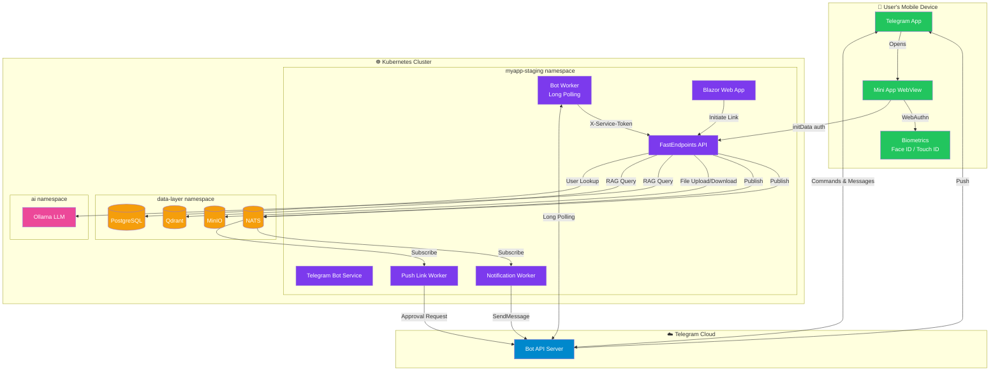
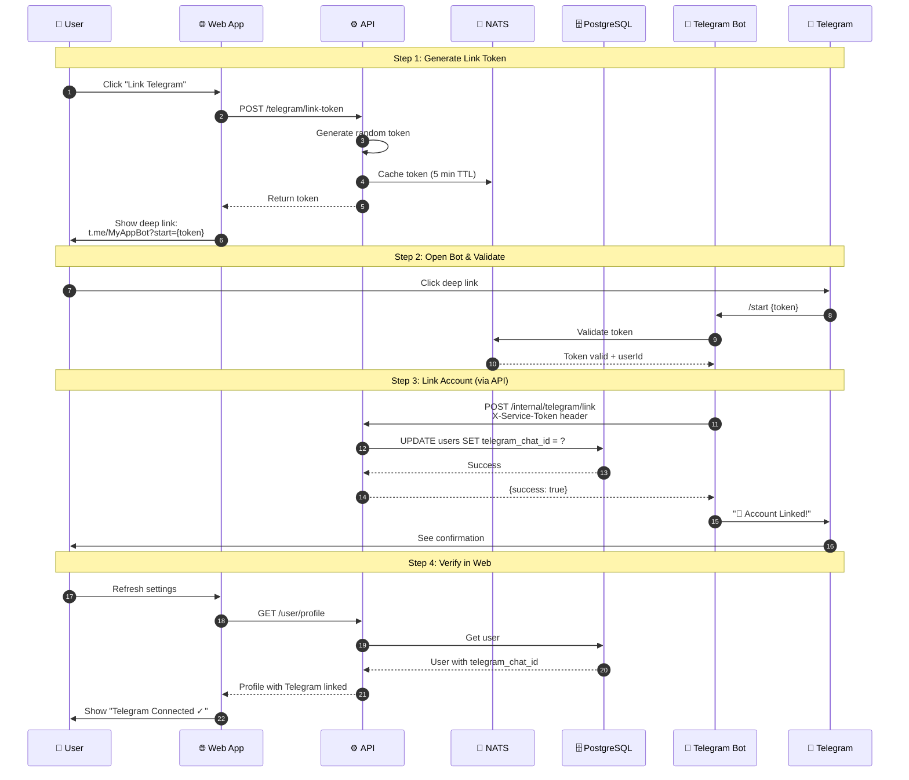
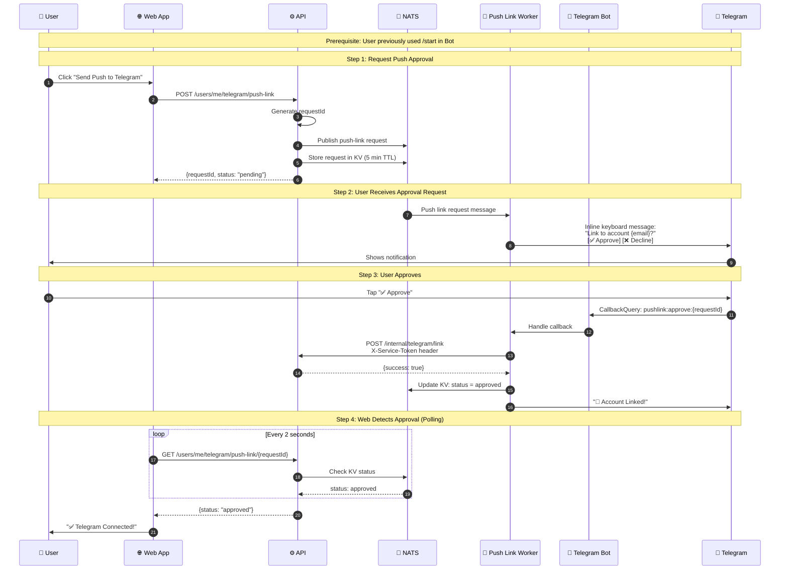
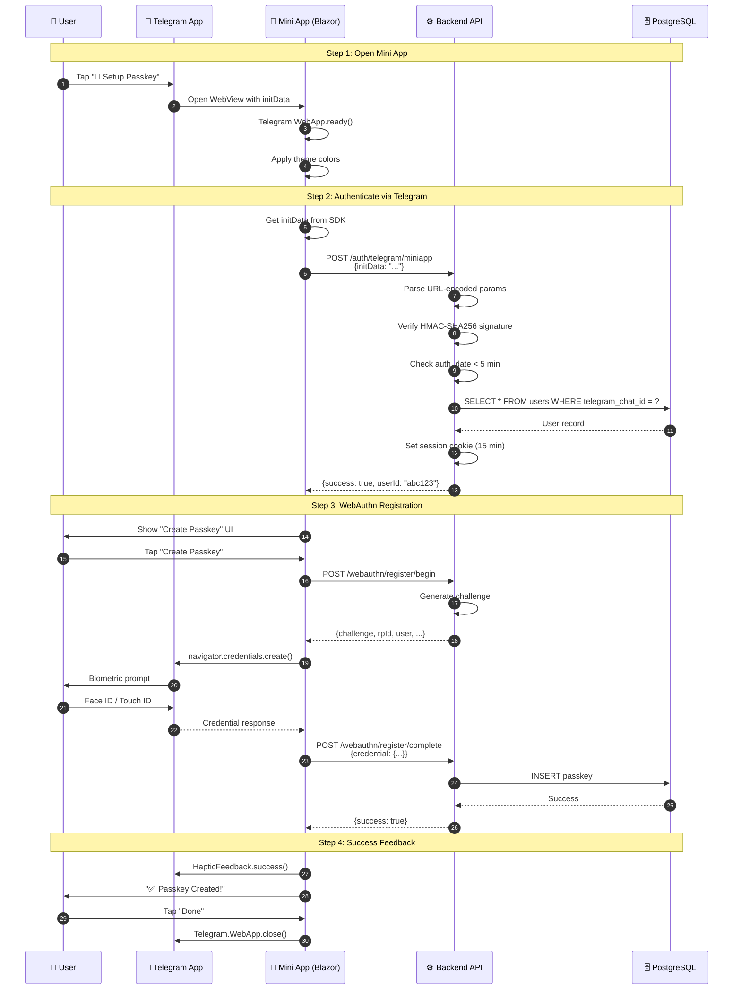
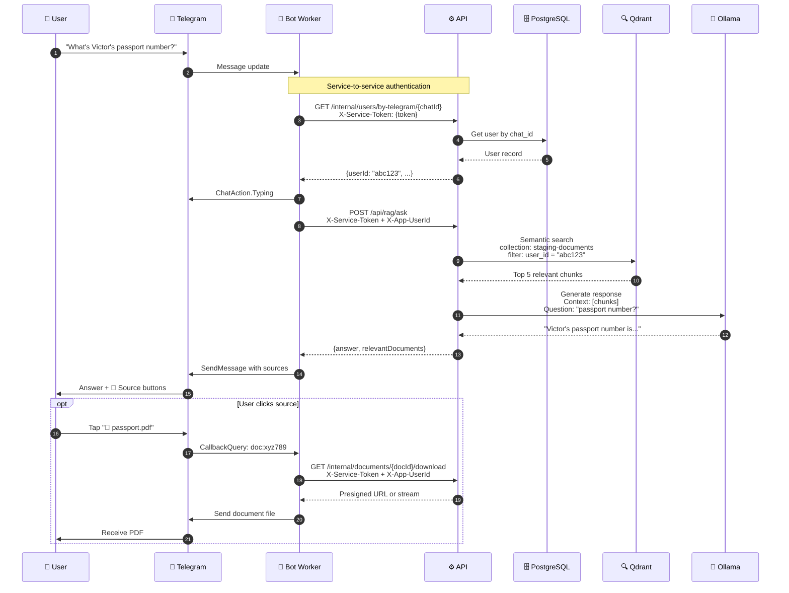
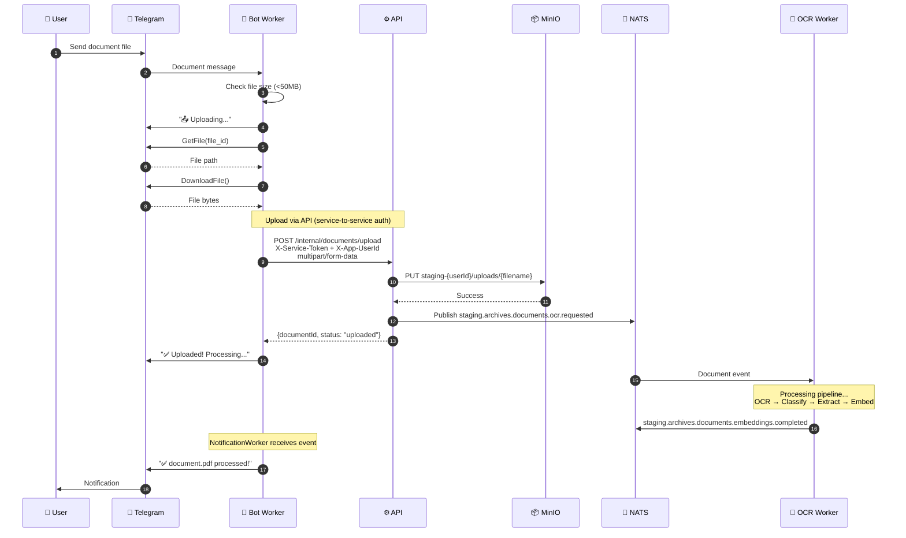
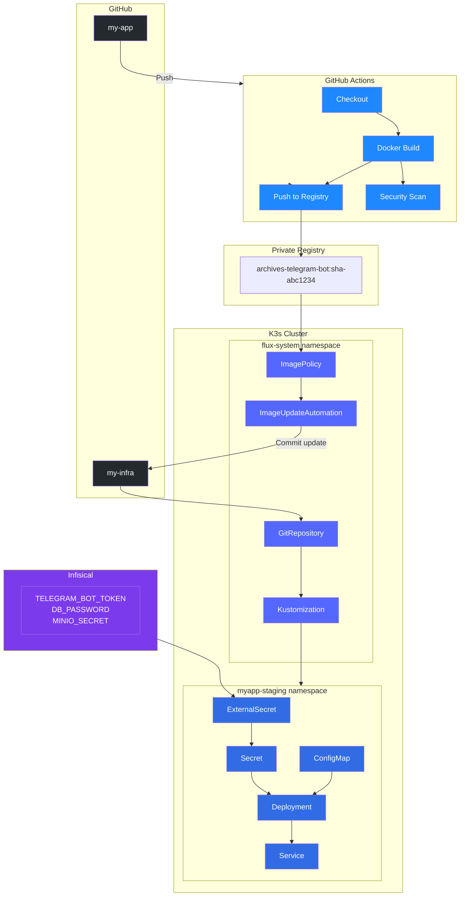

import Callout from '@components/Callout.astro';
import ImplementationNote from '@components/ImplementationNote.astro';
import ExternalCite from '@components/ExternalCite.astro';

When I first sat down to diagram the full Telegram integration architecture, I realized how many moving parts had quietly accumulated over months of development. What started as a simple bot sending notifications had grown into a system spanning long-polling workers, NATS-driven event pipelines, Mini App authentication, and service-to-service API calls. Drawing it all out forced me to confront coupling I had not noticed and gaps in my mental model. This article is the result of that exercise -- a visual reference I wish I had on day one, covering every flow from account linking to document upload to RAG queries.

## Overview

This article provides visual architecture diagrams for our Telegram integration. Use these as reference when implementing or troubleshooting the system.

## Complete System Architecture

This diagram shows all components involved in the Telegram integration:


```mermaid
flowchart TB
    subgraph Mobile["📱 User's Mobile Device"]
        TelegramApp[Telegram App]
        MiniApp[Mini App WebView]
        Biometric[Biometrics<br/>Face ID / Touch ID]
    end
    
    subgraph TelegramCloud["☁️ Telegram Cloud"]
        BotAPI[Bot API Server]
    end
    
    subgraph K8s["☸️ Kubernetes Cluster"]
        subgraph Staging["myapp-staging namespace"]
            BotSvc[Telegram Bot Service]
            NotifyWorker[Notification Worker]
            BotWorker[Bot Worker<br/>Long Polling]
            PushLinkWorker[Push Link Worker]
            WebApp[Blazor Web App]
            API[FastEndpoints API]
        end
        
        subgraph DataLayer["data-layer namespace"]
            NATS[(NATS)]
            PostgreSQL[(PostgreSQL)]
            MinIO[(MinIO)]
            Qdrant[(Qdrant)]
        end
        
        subgraph AI["ai namespace"]
            Ollama[Ollama LLM]
        end
    end
    
    %% User interactions
    TelegramApp <-->|Commands & Messages| BotAPI
    TelegramApp -->|Opens| MiniApp
    MiniApp -->|initData auth| API
    MiniApp -->|WebAuthn| Biometric
    
    %% Bot polling
    BotWorker <-->|Long Polling| BotAPI
    
    %% NEW: Bot uses API for all data access (service-to-service auth)
    BotWorker -->|X-Service-Token| API
    API -->|User Lookup| PostgreSQL
    API -->|RAG Query| Qdrant
    API -->|RAG Query| Ollama
    API -->|File Upload/Download| MinIO
    
    %% Push link flow
    WebApp -->|Initiate Link| API
    API -->|Publish| NATS
    NATS -->|Subscribe| PushLinkWorker
    PushLinkWorker -->|Approval Request| BotAPI
    
    %% Notification flow
    API -->|Publish| NATS
    NATS -->|Subscribe| NotifyWorker
    NotifyWorker -->|SendMessage| BotAPI
    BotAPI -->|Push| TelegramApp
    
    classDef mobile fill:#22c55e,color:#fff
    classDef telegram fill:#0088cc,color:#fff
    classDef service fill:#7c3aed,color:#fff
    classDef data fill:#f59e0b,color:#fff
    classDef ai fill:#ec4899,color:#fff
    
    class TelegramApp,MiniApp,Biometric mobile
    class BotAPI telegram
    class BotSvc,NotifyWorker,BotWorker,PushLinkWorker,WebApp,API service
    class NATS,PostgreSQL,MinIO,Qdrant data
    class Ollama ai
```

<ExternalCite title="Telegram Bot API Reference" url="https://core.telegram.org/bots/api" author="Telegram" date="2024-12-20" />

<ImplementationNote title="Discovering Hidden Coupling in the Architecture">
When I first drew this diagram, I realized the Bot Worker had quietly accumulated direct database connections for user lookups, bypassing the API entirely. This made the bot a second source of truth for authorization logic. Migrating to the API-first pattern (Bot -> API -> DB) took a full sprint, but eliminated an entire class of permission drift bugs that had been silently accumulating. The diagram was what made the problem visible.
</ImplementationNote>

## Account Linking Flow (Deep Link)

How a user links their Telegram account to our platform using the traditional deep link method:

<ExternalCite title="Telegram Deep Linking" url="https://core.telegram.org/api/links#bot-links" author="Telegram" date="2024-11-15" />


```mermaid
sequenceDiagram
    autonumber
    participant U as 👤 User
    participant Web as 🌐 Web App
    participant API as ⚙️ API
    participant NATS as 📨 NATS
    participant DB as 🗄️ PostgreSQL
    participant Bot as 🤖 Telegram Bot
    participant TG as 📱 Telegram
    
    Note over U,TG: Step 1: Generate Link Token
    U->>Web: Click "Link Telegram"
    Web->>API: POST /telegram/link-token
    API->>API: Generate random token
    API->>NATS: Cache token (5 min TTL)
    API-->>Web: Return token
    Web->>U: Show deep link:<br/>t.me/MyAppBot?start={token}
    
    Note over U,TG: Step 2: Open Bot & Validate
    U->>TG: Click deep link
    TG->>Bot: /start {token}
    Bot->>NATS: Validate token
    NATS-->>Bot: Token valid + userId
    
    Note over U,TG: Step 3: Link Account (via API)
    Bot->>API: POST /internal/telegram/link<br/>X-Service-Token header
    API->>DB: UPDATE users SET telegram_chat_id = ?
    DB-->>API: Success
    API-->>Bot: {success: true}
    Bot->>TG: "🎉 Account Linked!"
    TG->>U: See confirmation
    
    Note over U,TG: Step 4: Verify in Web
    U->>Web: Refresh settings
    Web->>API: GET /user/profile
    API->>DB: Get user
    DB-->>API: User with telegram_chat_id
    API-->>Web: Profile with Telegram linked
    Web->>U: Show "Telegram Connected ✓"
```

## Account Linking Flow (Push Approval)

A more streamlined linking method where users already chatting with the bot can approve linking from within Telegram:


```mermaid
sequenceDiagram
    autonumber
    participant U as 👤 User
    participant Web as 🌐 Web App
    participant API as ⚙️ API
    participant NATS as 📨 NATS
    participant PLW as 🔔 Push Link Worker
    participant Bot as 🤖 Telegram Bot
    participant TG as 📱 Telegram
    
    Note over U,TG: Prerequisite: User previously used /start in Bot
    
    Note over U,TG: Step 1: Request Push Approval
    U->>Web: Click "Send Push to Telegram"
    Web->>API: POST /users/me/telegram/push-link
    API->>API: Generate requestId
    API->>NATS: Publish push-link request
    API->>NATS: Store request in KV (5 min TTL)
    API-->>Web: {requestId, status: "pending"}
    
    Note over U,TG: Step 2: User Receives Approval Request
    NATS->>PLW: Push link request message
    PLW->>TG: Inline keyboard message:<br/>"Link to account {email}?"<br/>[✅ Approve] [❌ Decline]
    TG->>U: Shows notification
    
    Note over U,TG: Step 3: User Approves
    U->>TG: Tap "✅ Approve"
    TG->>Bot: CallbackQuery: pushlink:approve:{requestId}
    Bot->>PLW: Handle callback
    PLW->>API: POST /internal/telegram/link<br/>X-Service-Token header
    API-->>PLW: {success: true}
    PLW->>NATS: Update KV: status = approved
    PLW->>TG: "🎉 Account Linked!"
    
    Note over U,TG: Step 4: Web Detects Approval (Polling)
    loop Every 2 seconds
        Web->>API: GET /users/me/telegram/push-link/{requestId}
        API->>NATS: Check KV status
        NATS-->>API: status: approved
    end
    API-->>Web: {status: "approved"}
    Web->>U: "✅ Telegram Connected!"
```

## Passkey Registration via Mini App

The flow when a user registers a passkey from within Telegram:


```mermaid
sequenceDiagram
    autonumber
    participant U as 👤 User
    participant TG as 📱 Telegram App
    participant MA as 🔲 Mini App (Blazor)
    participant API as ⚙️ Backend API
    participant DB as 🗄️ PostgreSQL
    
    Note over U,DB: Step 1: Open Mini App
    U->>TG: Tap "🔐 Setup Passkey"
    TG->>MA: Open WebView with initData
    MA->>MA: Telegram.WebApp.ready()
    MA->>MA: Apply theme colors
    
    Note over U,DB: Step 2: Authenticate via Telegram
    MA->>MA: Get initData from SDK
    MA->>API: POST /auth/telegram/miniapp<br/>{initData: "..."}
    API->>API: Parse URL-encoded params
    API->>API: Verify HMAC-SHA256 signature
    API->>API: Check auth_date < 5 min
    API->>DB: SELECT * FROM users WHERE telegram_chat_id = ?
    DB-->>API: User record
    API->>API: Set session cookie (15 min)
    API-->>MA: {success: true, userId: "abc123"}
    
    Note over U,DB: Step 3: WebAuthn Registration
    MA->>U: Show "Create Passkey" UI
    U->>MA: Tap "Create Passkey"
    MA->>API: POST /webauthn/register/begin
    API->>API: Generate challenge
    API-->>MA: {challenge, rpId, user, ...}
    MA->>TG: navigator.credentials.create()
    TG->>U: Biometric prompt
    U->>TG: Face ID / Touch ID
    TG-->>MA: Credential response
    MA->>API: POST /webauthn/register/complete<br/>{credential: {...}}
    API->>DB: INSERT passkey
    DB-->>API: Success
    API-->>MA: {success: true}
    
    Note over U,DB: Step 4: Success Feedback
    MA->>TG: HapticFeedback.success()
    MA->>U: "✅ Passkey Created!"
    U->>MA: Tap "Done"
    MA->>TG: Telegram.WebApp.close()
```

<ExternalCite title="Web Authentication: An API for accessing Public Key Credentials" url="https://www.w3.org/TR/webauthn-3/" author="W3C" date="2024-04-08" />

## Notification Pipeline

How a document processing completion triggers a Telegram notification:


```mermaid
flowchart LR
    subgraph Workers["AI Workers"]
        OCR[OCR Worker]
        Embed[Embedding Worker]
    end
    
    subgraph API["API Service"]
        Handler[Event Handler]
        NotifySvc[TelegramNotificationService]
        Subjects[IEventSubjectProvider]
    end
    
    subgraph NATS["NATS (data-layer)"]
        DocSubject["staging.archives.documents.embeddings.completed"]
        NotifySubject["staging.notifications.telegram"]
    end
    
    subgraph Bot["Telegram Bot"]
        NotifyWorker[NotificationWorker]
        TGClient[TelegramBotClient]
    end
    
    subgraph Telegram["Telegram"]
        BotAPI[Bot API]
        App[📱 User's Telegram]
    end
    
    OCR -->|Process| Embed
    Embed -->|Publish| DocSubject
    DocSubject -->|Consume| Handler
    Handler -->|Check Prefs| DB[(PostgreSQL)]
    Handler -->|Get Subject| Subjects
    Subjects -->|"staging.notifications.telegram"| NotifySvc
    NotifySvc -->|Publish| NotifySubject
    NotifySubject -->|Subscribe| NotifyWorker
    NotifyWorker -->|SendMessage| TGClient
    TGClient -->|API Call| BotAPI
    BotAPI -->|Push| App
    
    classDef worker fill:#06b6d4,color:#fff
    classDef api fill:#7c3aed,color:#fff
    classDef nats fill:#22c55e,color:#fff
    classDef bot fill:#f59e0b,color:#fff
    classDef telegram fill:#0088cc,color:#fff
    
    class OCR,Embed worker
    class Handler,NotifySvc,Subjects api
    class DocSubject,NotifySubject nats
    class NotifyWorker,TGClient bot
    class BotAPI,App telegram
```

<ExternalCite title="NATS Documentation - Core Publish-Subscribe" url="https://docs.nats.io/nats-concepts/core-nats/pubsub" author="Synadia" date="2024-10-01" />

## RAG Query Flow

When a user asks a question in Telegram, the bot uses the internal API for all data operations:


```mermaid
sequenceDiagram
    autonumber
    participant U as 👤 User
    participant TG as 📱 Telegram
    participant Bot as 🤖 Bot Worker
    participant API as ⚙️ API
    participant DB as 🗄️ PostgreSQL
    participant Qdrant as 🔍 Qdrant
    participant LLM as 🧠 Ollama
    
    U->>TG: "What's Victor's passport number?"
    TG->>Bot: Message update
    
    Note over Bot,API: Service-to-service authentication
    Bot->>API: GET /internal/users/by-telegram/{chatId}<br/>X-Service-Token: {token}
    API->>DB: Get user by chat_id
    DB-->>API: User record
    API-->>Bot: {userId: "abc123", ...}
    
    Bot->>TG: ChatAction.Typing
    
    Bot->>API: POST /api/rag/ask<br/>X-Service-Token + X-App-UserId
    API->>Qdrant: Semantic search<br/>collection: staging-documents<br/>filter: user_id = "abc123"
    Qdrant-->>API: Top 5 relevant chunks
    API->>LLM: Generate response<br/>Context: [chunks]<br/>Question: "passport number?"
    LLM-->>API: "Victor's passport number is..."
    API-->>Bot: {answer, relevantDocuments}
    
    Bot->>TG: SendMessage with sources
    TG->>U: Answer + 📄 Source buttons
    
    opt User clicks source
        U->>TG: Tap "📄 passport.pdf"
        TG->>Bot: CallbackQuery: doc:xyz789
        Bot->>API: GET /internal/documents/{docId}/download<br/>X-Service-Token + X-App-UserId
        API-->>Bot: Presigned URL or stream
        Bot->>TG: Send document file
        TG->>U: Receive PDF
    end
```

## Document Upload via Telegram


```mermaid
sequenceDiagram
    autonumber
    participant U as 👤 User
    participant TG as 📱 Telegram
    participant Bot as 🤖 Bot Worker
    participant API as ⚙️ API
    participant MinIO as 📦 MinIO
    participant NATS as 📨 NATS
    participant OCR as 🔬 OCR Worker
    
    U->>TG: Send document file
    TG->>Bot: Document message
    
    Bot->>Bot: Check file size (<50MB)
    Bot->>TG: "📤 Uploading..."
    
    Bot->>TG: GetFile(file_id)
    TG-->>Bot: File path
    Bot->>TG: DownloadFile()
    TG-->>Bot: File bytes
    
    Note over Bot,API: Upload via API (service-to-service auth)
    Bot->>API: POST /internal/documents/upload<br/>X-Service-Token + X-App-UserId<br/>multipart/form-data
    API->>MinIO: PUT staging-{userId}/uploads/{filename}
    MinIO-->>API: Success
    API->>NATS: Publish staging.archives.documents.ocr.requested
    API-->>Bot: {documentId, status: "uploaded"}
    
    Bot->>TG: "✅ Uploaded! Processing..."
    
    NATS->>OCR: Document event
    
    Note over OCR: Processing pipeline...<br/>OCR → Classify → Extract → Embed
    
    OCR->>NATS: staging.archives.documents.embeddings.completed
    
    Note over Bot: NotificationWorker receives event
    
    Bot->>TG: "✅ document.pdf processed!"
    TG->>U: Notification
```

## Deployment Architecture


```mermaid
flowchart TB
    subgraph GitHub["GitHub"]
        AppRepo[my-app]
        InfraRepo[my-infra]
    end
    
    subgraph CI["GitHub Actions"]
        direction TB
        Checkout[Checkout]
        Build[Docker Build]
        Push[Push to Registry]
        Scan[Security Scan]
        
        Checkout --> Build --> Push
        Build --> Scan
    end
    
    subgraph Registry["Private Registry<br/>192.168.0.5:5005"]
        Image["archives-telegram-bot:sha-abc1234"]
    end
    
    subgraph Infisical["Infisical"]
        Secrets["TELEGRAM_BOT_TOKEN<br/>DB_PASSWORD<br/>MINIO_SECRET"]
    end
    
    subgraph Cluster["K3s Cluster"]
        subgraph FluxSystem["flux-system namespace"]
            GitRepo[GitRepository]
            Kustomization[Kustomization]
            ImagePolicy[ImagePolicy]
            ImageUpdate[ImageUpdateAutomation]
        end
        
        subgraph Staging["myapp-staging namespace"]
            ExtSecret[ExternalSecret]
            Secret[Secret]
            ConfigMap[ConfigMap]
            Deployment[Deployment]
            Service[Service]
            
            ExtSecret --> Secret
            ConfigMap --> Deployment
            Secret --> Deployment
            Deployment --> Service
        end
    end
    
    AppRepo -->|Push| CI
    CI --> Push --> Image
    
    InfraRepo --> GitRepo
    GitRepo --> Kustomization
    Kustomization --> Staging
    
    Image --> ImagePolicy
    ImagePolicy --> ImageUpdate
    ImageUpdate -->|Commit update| InfraRepo
    
    Infisical --> ExtSecret
    
    classDef github fill:#24292e,color:#fff
    classDef ci fill:#2088ff,color:#fff
    classDef flux fill:#5468ff,color:#fff
    classDef k8s fill:#326ce5,color:#fff
    classDef secrets fill:#7c3aed,color:#fff
    
    class AppRepo,InfraRepo github
    class Checkout,Build,Push,Scan ci
    class GitRepo,Kustomization,ImagePolicy,ImageUpdate flux
    class ExtSecret,Secret,ConfigMap,Deployment,Service k8s
    class Infisical,Secrets secrets
```

## Key Design Decisions

<Callout type="info" title="Environment Isolation">
All NATS subjects are prefixed with the environment (`staging.`, `dev.`, or empty for prod). This allows running multiple environments on shared infrastructure without message leakage.
</Callout>

### API-First Architecture for the Bot

The Telegram bot **does not** directly connect to PostgreSQL, MinIO, or Qdrant. Instead, it uses internal API endpoints with service-to-service authentication:

| Direct Access (Old) | API-Based (New) |
|---------------------|-----------------|
| Bot → PostgreSQL | Bot → API → PostgreSQL |
| Bot → MinIO | Bot → API → MinIO |
| Bot → Qdrant | Bot → API → Qdrant |

**Benefits:**
1. **Security** - Single authentication point; bot has limited permissions
2. **Consistency** - All authorization logic in one place (API)
3. **Simplicity** - Bot only needs HTTP client, not DB drivers
4. **Auditability** - All operations logged through API middleware
5. **Scalability** - API can be scaled independently

```csharp
// Service token configuration in API
serviceTokens[telegramBotToken] = new ServiceTokenConfig
{
    ExpectedServiceName = "telegram-bot",
    Role = "service",
    Permissions = ["users:read", "telegram:link", "documents:upload", "rag:query"]
};
```

### Why Long Polling vs Webhooks?

<ExternalCite title="Telegram Bot API - Getting Updates" url="https://core.telegram.org/bots/api#getting-updates" author="Telegram" date="2024-12-20" />

| Aspect | Long Polling | Webhooks |
|--------|-------------|----------|
| **Setup** | Simple, no public endpoint | Requires TLS + public URL |
| **Reliability** | Bot controls reconnection | Depends on webhook delivery |
| **Debugging** | Logs on bot side | Need webhook logs |
| **Latency** | ~1-3 seconds | ~100ms |

We chose **long polling** because:
1. Our homelab doesn't expose webhook endpoints
2. Simpler operational model
3. Acceptable latency for our use case

<ImplementationNote title="Webhook Reliability on a Homelab">
I originally tried webhooks using a Cloudflare Tunnel to expose the endpoint, but ran into frustrating intermittent failures. Telegram would retry delivery, leading to duplicate message processing that was hard to debug. Switching to long polling simplified everything -- the bot controls the connection lifecycle, and there is no need for a publicly routable endpoint. The 1-3 second latency tradeoff was well worth the operational simplicity.
</ImplementationNote>

### Why Core NATS for Notifications?

<ExternalCite title="NATS Documentation - Core NATS vs JetStream" url="https://docs.nats.io/nats-concepts/overview" author="Synadia" date="2024-10-01" />

Notifications use Core NATS (not JetStream) because:
1. **Ephemeral** - Old notifications aren't useful
2. **Low latency** - Users expect instant delivery
3. **Simple** - No consumer state to manage

Document events use JetStream for guaranteed delivery.

## Conclusion

Creating these architecture diagrams was as much a design review exercise as it was documentation. Seeing every flow laid out -- from account linking to RAG queries to document uploads -- revealed assumptions I had made without realizing it. The API-first refactor came directly from staring at the system architecture diagram and noticing the bot's direct database connections. The long polling decision, the Core NATS vs JetStream split, and the environment-prefixed subjects all look obvious in hindsight, but each emerged from a concrete problem I hit during development.

If you are building a similar integration, I strongly recommend diagramming your architecture early and revisiting it often. The diagrams are not just documentation -- they are a thinking tool.

## Next Steps

- **Add webhook support as an optional mode** for environments with stable public endpoints
- **Introduce a notification preferences UI** in the Mini App so users can toggle notification types directly from Telegram
- **Extend the RAG flow** with streaming responses for long answers, using Telegram's edit-message API for progressive updates
- **Build a monitoring dashboard** that visualizes NATS subject traffic across environments in real time

### Further Reading


<ExternalCite title="Telegram Bot API Documentation" url="https://core.telegram.org/bots/api" author="Telegram" date="2024" />

<ExternalCite title="NATS by Example" url="https://natsbyexample.com/" author="Example" date="2024" />

<ExternalCite title="WebAuthn Guide by MDN" url="https://developer.mozilla.org/en-US/docs/Web/API/Web_Authentication_API" author="MDN" date="2024" />

<ExternalCite title="Telegram Mini Apps Documentation" url="https://core.telegram.org/bots/webapps" author="Telegram" date="2024" />

<ExternalCite title="FluxCD Documentation" url="https://fluxcd.io/docs/" author="CNCF Flux Project" date="2024" />
## Related Articles

This diagram article is part of the **Telegram Integration Series**:

1. [Building a Telegram Bot for System Notifications](/articles/telegram-bot-integration-dotnet-guide)
2. [Building a Telegram Mini App with Blazor Server](/articles/telegram-miniapp-blazor-integration)
3. [NATS-Powered Telegram Notification System](/articles/telegram-nats-notification-flow)
4. [Deploying a Telegram Bot to Kubernetes with Flux](/articles/telegram-bot-kubernetes-deployment)
5. **Telegram Integration Architecture** (this article)
