import Callout from '@components/Callout.astro';

## Overview

This article provides visual architecture diagrams for the BlueRobin Telegram integration. Use these as reference when implementing or troubleshooting the system.

## Complete System Architecture

This diagram shows all components involved in the Telegram integration:


## Account Linking Flow (Deep Link)

How a user links their Telegram account to BlueRobin using the traditional deep link method:

```mermaid
sequenceDiagram
    autonumber
    participant U as 👤 User
    participant Web as 🌐 BlueRobin Web
    participant API as ⚙️ API
    participant NATS as 📨 NATS
    participant DB as 🗄️ PostgreSQL
    participant Bot as 🤖 Telegram Bot
    participant TG as 📱 Telegram
    
    Note over U,TG: Step 1: Generate Link Token
    U->>Web: Click "Link Telegram"
    Web->>API: POST /telegram/link-token
    API->>API: Generate random token
    API->>NATS: Cache token (5 min TTL)
    API-->>Web: Return token
    Web->>U: Show deep link:<br/>t.me/BlueRobinBot?start={token}
    
    Note over U,TG: Step 2: Open Bot & Validate
    U->>TG: Click deep link
    TG->>Bot: /start {token}
    Bot->>NATS: Validate token
    NATS-->>Bot: Token valid + userId
    
    Note over U,TG: Step 3: Link Account (via API)
    Bot->>API: POST /internal/telegram/link<br/>X-Service-Token header
    API->>DB: UPDATE users SET telegram_chat_id = ?
    DB-->>API: Success
    API-->>Bot: {success: true}
    Bot->>TG: "🎉 Account Linked!"
    TG->>U: See confirmation
    
    Note over U,TG: Step 4: Verify in Web
    U->>Web: Refresh settings
    Web->>API: GET /user/profile
    API->>DB: Get user
    DB-->>API: User with telegram_chat_id
    API-->>Web: Profile with Telegram linked
    Web->>U: Show "Telegram Connected ✓"
```



## Account Linking Flow (Push Approval)

A more streamlined linking method where users already chatting with the bot can approve linking from within Telegram:

```mermaid
sequenceDiagram
    autonumber
    participant U as 👤 User
    participant Web as 🌐 BlueRobin Web
    participant API as ⚙️ API
    participant NATS as 📨 NATS
    participant PLW as 🔔 Push Link Worker
    participant Bot as 🤖 Telegram Bot
    participant TG as 📱 Telegram
    
    Note over U,TG: Prerequisite: User previously used /start in Bot
    
    Note over U,TG: Step 1: Request Push Approval
    U->>Web: Click "Send Push to Telegram"
    Web->>API: POST /users/me/telegram/push-link
    API->>API: Generate requestId
    API->>NATS: Publish push-link request
    API->>NATS: Store request in KV (5 min TTL)
    API-->>Web: {requestId, status: "pending"}
    
    Note over U,TG: Step 2: User Receives Approval Request
    NATS->>PLW: Push link request message
    PLW->>TG: Inline keyboard message:<br/>"Link to account {email}?"<br/>[✅ Approve] [❌ Decline]
    TG->>U: Shows notification
    
    Note over U,TG: Step 3: User Approves
    U->>TG: Tap "✅ Approve"
    TG->>Bot: CallbackQuery: pushlink:approve:{requestId}
    Bot->>PLW: Handle callback
    PLW->>API: POST /internal/telegram/link<br/>X-Service-Token header
    API-->>PLW: {success: true}
    PLW->>NATS: Update KV: status = approved
    PLW->>TG: "🎉 Account Linked!"
    
    Note over U,TG: Step 4: Web Detects Approval (Polling)
    loop Every 2 seconds
        Web->>API: GET /users/me/telegram/push-link/{requestId}
        API->>NATS: Check KV status
        NATS-->>API: status: approved
    end
    API-->>Web: {status: "approved"}
    Web->>U: "✅ Telegram Connected!"
```



## Passkey Registration via Mini App

The flow when a user registers a passkey from within Telegram:

```mermaid
sequenceDiagram
    autonumber
    participant U as 👤 User
    participant TG as 📱 Telegram App
    participant MA as 🔲 Mini App (Blazor)
    participant API as ⚙️ BlueRobin API
    participant DB as 🗄️ PostgreSQL
    
    Note over U,DB: Step 1: Open Mini App
    U->>TG: Tap "🔐 Setup Passkey"
    TG->>MA: Open WebView with initData
    MA->>MA: Telegram.WebApp.ready()
    MA->>MA: Apply theme colors
    
    Note over U,DB: Step 2: Authenticate via Telegram
    MA->>MA: Get initData from SDK
    MA->>API: POST /auth/telegram/miniapp<br/>{initData: "..."}
    API->>API: Parse URL-encoded params
    API->>API: Verify HMAC-SHA256 signature
    API->>API: Check auth_date < 5 min
    API->>DB: SELECT * FROM users WHERE telegram_chat_id = ?
    DB-->>API: User record
    API->>API: Set session cookie (15 min)
    API-->>MA: {success: true, userId: "abc123"}
    
    Note over U,DB: Step 3: WebAuthn Registration
    MA->>U: Show "Create Passkey" UI
    U->>MA: Tap "Create Passkey"
    MA->>API: POST /webauthn/register/begin
    API->>API: Generate challenge
    API-->>MA: {challenge, rpId, user, ...}
    MA->>TG: navigator.credentials.create()
    TG->>U: Biometric prompt
    U->>TG: Face ID / Touch ID
    TG-->>MA: Credential response
    MA->>API: POST /webauthn/register/complete<br/>{credential: {...}}
    API->>DB: INSERT passkey
    DB-->>API: Success
    API-->>MA: {success: true}
    
    Note over U,DB: Step 4: Success Feedback
    MA->>TG: HapticFeedback.success()
    MA->>U: "✅ Passkey Created!"
    U->>MA: Tap "Done"
    MA->>TG: Telegram.WebApp.close()
```



## Notification Pipeline

How a document processing completion triggers a Telegram notification:


## RAG Query Flow

When a user asks a question in Telegram, the bot uses the internal API for all data operations:

```mermaid
sequenceDiagram
    autonumber
    participant U as 👤 User
    participant TG as 📱 Telegram
    participant Bot as 🤖 Bot Worker
    participant API as ⚙️ API
    participant DB as 🗄️ PostgreSQL
    participant Qdrant as 🔍 Qdrant
    participant LLM as 🧠 Ollama
    
    U->>TG: "What's Victor's passport number?"
    TG->>Bot: Message update
    
    Note over Bot,API: Service-to-service authentication
    Bot->>API: GET /internal/users/by-telegram/{chatId}<br/>X-Service-Token: {token}
    API->>DB: Get user by chat_id
    DB-->>API: User record
    API-->>Bot: {userId: "abc123", ...}
    
    Bot->>TG: ChatAction.Typing
    
    Bot->>API: POST /api/rag/ask<br/>X-Service-Token + X-BlueRobin-UserId
    API->>Qdrant: Semantic search<br/>collection: staging-documents<br/>filter: user_id = "abc123"
    Qdrant-->>API: Top 5 relevant chunks
    API->>LLM: Generate response<br/>Context: [chunks]<br/>Question: "passport number?"
    LLM-->>API: "Victor's passport number is..."
    API-->>Bot: {answer, relevantDocuments}
    
    Bot->>TG: SendMessage with sources
    TG->>U: Answer + 📄 Source buttons
    
    opt User clicks source
        U->>TG: Tap "📄 passport.pdf"
        TG->>Bot: CallbackQuery: doc:xyz789
        Bot->>API: GET /internal/documents/{docId}/download<br/>X-Service-Token + X-BlueRobin-UserId
        API-->>Bot: Presigned URL or stream
        Bot->>TG: Send document file
        TG->>U: Receive PDF
    end
```



## Document Upload via Telegram

```mermaid
sequenceDiagram
    autonumber
    participant U as 👤 User
    participant TG as 📱 Telegram
    participant Bot as 🤖 Bot Worker
    participant API as ⚙️ API
    participant MinIO as 📦 MinIO
    participant NATS as 📨 NATS
    participant OCR as 🔬 OCR Worker
    
    U->>TG: Send document file
    TG->>Bot: Document message
    
    Bot->>Bot: Check file size (<50MB)
    Bot->>TG: "📤 Uploading..."
    
    Bot->>TG: GetFile(file_id)
    TG-->>Bot: File path
    Bot->>TG: DownloadFile()
    TG-->>Bot: File bytes
    
    Note over Bot,API: Upload via API (service-to-service auth)
    Bot->>API: POST /internal/documents/upload<br/>X-Service-Token + X-BlueRobin-UserId<br/>multipart/form-data
    API->>MinIO: PUT staging-{userId}/uploads/{filename}
    MinIO-->>API: Success
    API->>NATS: Publish staging.archives.documents.uploaded
    API-->>Bot: {documentId, status: "uploaded"}
    
    Bot->>TG: "✅ Uploaded! Processing..."
    
    NATS->>OCR: Document event
    
    Note over OCR: Processing pipeline...<br/>OCR → Classify → Extract → Embed
    
    OCR->>NATS: staging.archives.documents.embeddings.completed
    
    Note over Bot: NotificationWorker receives event
    
    Bot->>TG: "✅ document.pdf processed!"
    TG->>U: Notification
```



## Deployment Architecture


## Key Design Decisions

<Callout type="info" title="Environment Isolation">
All NATS subjects are prefixed with the environment (`staging.`, `dev.`, or empty for prod). This allows running multiple environments on shared infrastructure without message leakage.
</Callout>

### API-First Architecture for the Bot

The Telegram bot **does not** directly connect to PostgreSQL, MinIO, or Qdrant. Instead, it uses internal API endpoints with service-to-service authentication:

| Direct Access (Old) | API-Based (New) |
|---------------------|-----------------|
| Bot → PostgreSQL | Bot → API → PostgreSQL |
| Bot → MinIO | Bot → API → MinIO |
| Bot → Qdrant | Bot → API → Qdrant |

**Benefits:**
1. **Security** - Single authentication point; bot has limited permissions
2. **Consistency** - All authorization logic in one place (API)
3. **Simplicity** - Bot only needs HTTP client, not DB drivers
4. **Auditability** - All operations logged through API middleware
5. **Scalability** - API can be scaled independently

```csharp
// Service token configuration in API
serviceTokens[telegramBotToken] = new ServiceTokenConfig
{
    ExpectedServiceName = "telegram-bot",
    Role = "service",
    Permissions = ["users:read", "telegram:link", "documents:upload", "rag:query"]
};
```

### Why Long Polling vs Webhooks?

| Aspect | Long Polling | Webhooks |
|--------|-------------|----------|
| **Setup** | Simple, no public endpoint | Requires TLS + public URL |
| **Reliability** | Bot controls reconnection | Depends on webhook delivery |
| **Debugging** | Logs on bot side | Need webhook logs |
| **Latency** | ~1-3 seconds | ~100ms |

We chose **long polling** because:
1. Our homelab doesn't expose webhook endpoints
2. Simpler operational model
3. Acceptable latency for our use case

### Why Core NATS for Notifications?

Notifications use Core NATS (not JetStream) because:
1. **Ephemeral** - Old notifications aren't useful
2. **Low latency** - Users expect instant delivery
3. **Simple** - No consumer state to manage

Document events use JetStream for guaranteed delivery.

## Related Articles

This diagram article is part of the **Telegram Integration Series**:

1. [Building a Telegram Bot for System Notifications](/articles/telegram-bot-integration-dotnet-guide)
2. [Building a Telegram Mini App with Blazor Server](/articles/telegram-miniapp-blazor-integration)
3. [NATS-Powered Telegram Notification System](/articles/telegram-nats-notification-flow)
4. [Deploying a Telegram Bot to Kubernetes with Flux](/articles/telegram-bot-kubernetes-deployment)
5. **BlueRobin Telegram Integration Architecture** (this article)
