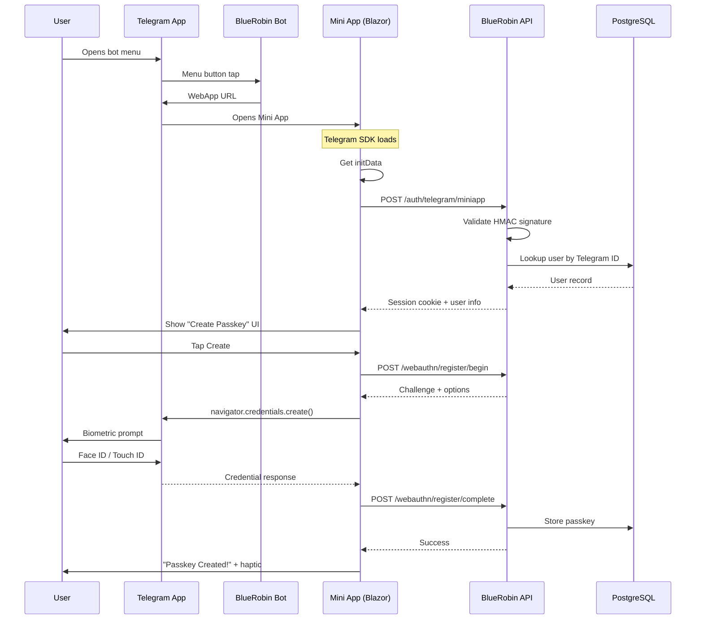

import Callout from '@components/Callout.astro';
import ImplementationNote from '@components/ImplementationNote.astro';
import CodeFile from '@components/CodeFile.astro';
import ExternalCite from '@components/ExternalCite.astro';

## Introduction

Following our [Telegram Bot integration](/articles/telegram-bot-integration-dotnet-guide), we wanted to go further: allow users to **register passkeys directly from Telegram**. This eliminates the friction of opening a separate browser and provides a native-feeling experience within the Telegram app itself.

Telegram Mini Apps (formerly Web Apps) let you embed web content inside Telegram's chat interface. Combined with **Blazor Server** and **WebAuthn**, we built a seamless passkey registration flow that:

- **Authenticates via Telegram** using `initData` validation
- **Registers device passkeys** (Face ID, Touch ID, fingerprint)
- **Adapts to Telegram's theme** (light/dark mode)
- **Provides haptic feedback** for native feel

## Architecture Overview



## The Mini App Layout

Telegram Mini Apps need a specialized layout that:

1. Loads the Telegram WebApp SDK
2. Applies Telegram's dynamic theme colors
3. Exposes JS interop functions for Blazor
4. Disables normal navigation (no header/sidebar)

<CodeFile path="Archives.Web/Components/Layout/TelegramMiniappLayout.razor" language="razor">
```razor
@inherits LayoutComponentBase

@* 
    Telegram Mini App Layout
    
    A minimal layout designed for Telegram WebApp context.
    Features:
    - No sidebar or header navigation
    - Telegram theme integration via CSS variables
    - Full viewport height
    - Dark mode support matching Telegram's scheme
*@

<!DOCTYPE html>
<html lang="en" class="telegram-miniapp">
<head>
    <meta charset="utf-8" />
    <meta name="viewport" content="width=device-width, initial-scale=1.0, maximum-scale=1.0, user-scalable=no" />
    <base href="/" />
    <HeadOutlet />
</head>
<body class="miniapp-body">
    <div id="miniapp-root" class="miniapp-container">
        @Body
    </div>

    <script src="_framework/blazor.web.js"></script>
    <script src="js/webauthn.js"></script>
    <script src="https://telegram.org/js/telegram-web-app.js"></script>
    
    <script>
        // Initialize Telegram WebApp
        window.Telegram.WebApp.ready();
        window.Telegram.WebApp.expand();
        
        // Apply Telegram theme colors as CSS variables
        const tg = window.Telegram.WebApp;
        const root = document.documentElement;
        
        if (tg.themeParams) {
            root.style.setProperty('--tg-bg-color', tg.themeParams.bg_color || '#ffffff');
            root.style.setProperty('--tg-text-color', tg.themeParams.text_color || '#000000');
            root.style.setProperty('--tg-hint-color', tg.themeParams.hint_color || '#999999');
            root.style.setProperty('--tg-link-color', tg.themeParams.link_color || '#2481cc');
            root.style.setProperty('--tg-button-color', tg.themeParams.button_color || '#2481cc');
            root.style.setProperty('--tg-button-text-color', tg.themeParams.button_text_color || '#ffffff');
            root.style.setProperty('--tg-secondary-bg-color', tg.themeParams.secondary_bg_color || '#f0f0f0');
        }
        
        // Set dark mode class if Telegram is in dark mode
        if (tg.colorScheme === 'dark') {
            document.documentElement.classList.add('dark');
        }
        
        // Expose interop functions for Blazor
        window.getTelegramInitData = () => window.Telegram.WebApp.initData;
        window.getTelegramUser = () => window.Telegram.WebApp.initDataUnsafe?.user;
        window.closeTelegramWebApp = () => window.Telegram.WebApp.close();
        window.showTelegramAlert = (msg) => window.Telegram.WebApp.showAlert(msg);
        
        window.hapticFeedback = function(type) {
            if (window.Telegram.WebApp.HapticFeedback) {
                switch(type) {
                    case 'success':
                        window.Telegram.WebApp.HapticFeedback.notificationOccurred('success');
                        break;
                    case 'error':
                        window.Telegram.WebApp.HapticFeedback.notificationOccurred('error');
                        break;
                    case 'impact':
                        window.Telegram.WebApp.HapticFeedback.impactOccurred('medium');
                        break;
                }
            }
        };
    </script>
</body>
</html>
```
</CodeFile>

<Callout type="info" title="Why a separate layout?">
Telegram Mini Apps run in a WebView with specific constraints. Using the main app layout would show navigation that doesn't make sense in a modal context. The Mini App layout is clean, focused, and theme-aware.
</Callout>

## Telegram Theme Integration

One of Telegram's best features is automatic theme adaptation. Users expect apps to match their Telegram color scheme. We achieve this with CSS custom properties:

<CodeFile path="Archives.Web/Styles/input.css" language="css">
```css
/* Telegram Mini App Theme Variables */
.telegram-miniapp {
    --tg-bg-color: #ffffff;
    --tg-text-color: #000000;
    --tg-hint-color: #999999;
    --tg-link-color: #2481cc;
    --tg-button-color: #2481cc;
    --tg-button-text-color: #ffffff;
    --tg-secondary-bg-color: #f0f0f0;
}

.telegram-miniapp.dark {
    --tg-bg-color: #18222d;
    --tg-text-color: #ffffff;
    --tg-hint-color: #708499;
    --tg-link-color: #6ab2f2;
    --tg-button-color: #2481cc;
    --tg-button-text-color: #ffffff;
    --tg-secondary-bg-color: #232e3c;
}

.miniapp-body {
    margin: 0;
    padding: 0;
    min-height: 100vh;
    min-height: 100dvh;  /* Dynamic viewport height for mobile */
    background-color: var(--tg-bg-color);
    color: var(--tg-text-color);
    font-family: -apple-system, BlinkMacSystemFont, 'Segoe UI', Roboto, sans-serif;
    -webkit-font-smoothing: antialiased;
}

/* Telegram-style button */
.tg-button {
    display: flex;
    align-items: center;
    justify-content: center;
    width: 100%;
    padding: 0.875rem 1.5rem;
    background-color: var(--tg-button-color);
    color: var(--tg-button-text-color);
    border: none;
    border-radius: 10px;
    font-size: 1rem;
    font-weight: 600;
    cursor: pointer;
    transition: opacity 0.2s ease, transform 0.1s ease;
    -webkit-tap-highlight-color: transparent;
}

.tg-button:active {
    transform: scale(0.98);
    opacity: 0.9;
}

.tg-button:disabled {
    opacity: 0.5;
    cursor: not-allowed;
}
```
</CodeFile>

The JavaScript in the layout reads `themeParams` from Telegram's SDK and applies them as CSS variables. This means our styles automatically adapt when users switch between light and dark mode.

## Authenticating via initData

Telegram Mini Apps receive `initData` - a URL-encoded string containing user information **signed by Telegram**. We must validate this signature server-side before trusting the user identity.

<ExternalCite 
    title="Telegram Bot API - Validating Mini App Data"
    url="https://core.telegram.org/bots/webapps#validating-data-received-via-the-mini-app"
    source="Telegram Documentation"
/>

<CodeFile path="Archives.Api/Endpoints/Auth/TelegramMiniAppLoginEndpoint.cs" language="csharp">
```csharp
/// <summary>
/// Validates Telegram Mini App initData according to Telegram's specification.
/// </summary>
private TelegramValidationResult ValidateTelegramInitData(string initData, string botToken)
{
    try
    {
        // Parse the initData as URL-encoded params
        var pairs = initData.Split('&')
            .Select(p => p.Split('=', 2))
            .Where(p => p.Length == 2)
            .ToDictionary(
                p => Uri.UnescapeDataString(p[0]),
                p => Uri.UnescapeDataString(p[1]));

        if (!pairs.TryGetValue("hash", out var receivedHash))
            return new TelegramValidationResult { IsValid = false, Error = "Missing hash" };

        // Check auth_date freshness (5 minute window)
        if (!pairs.TryGetValue("auth_date", out var authDateStr) ||
            !long.TryParse(authDateStr, out var authDate))
            return new TelegramValidationResult { IsValid = false, Error = "Invalid auth_date" };

        var authTime = DateTimeOffset.FromUnixTimeSeconds(authDate);
        if (DateTimeOffset.UtcNow - authTime > TimeSpan.FromMinutes(5))
            return new TelegramValidationResult { IsValid = false, Error = "Data expired" };

        // Build data-check-string (sorted alphabetically, excluding hash)
        var dataCheckString = string.Join("\n",
            pairs
                .Where(p => p.Key != "hash")
                .OrderBy(p => p.Key)
                .Select(p => $"{p.Key}={p.Value}"));

        // Calculate secret key: HMAC-SHA256(botToken, "WebAppData")
        using var hmacForSecret = new HMACSHA256(Encoding.UTF8.GetBytes("WebAppData"));
        var secretKey = hmacForSecret.ComputeHash(Encoding.UTF8.GetBytes(botToken));

        // Calculate hash: HMAC-SHA256(dataCheckString, secretKey)
        using var hmacForHash = new HMACSHA256(secretKey);
        var calculatedHash = Convert.ToHexString(
            hmacForHash.ComputeHash(Encoding.UTF8.GetBytes(dataCheckString))).ToLower();

        if (calculatedHash != receivedHash)
            return new TelegramValidationResult { IsValid = false, Error = "Invalid signature" };

        // Extract user ID from the user JSON
        if (pairs.TryGetValue("user", out var userJson))
        {
            var userData = JsonSerializer.Deserialize<TelegramUser>(userJson);
            return new TelegramValidationResult 
            { 
                IsValid = true, 
                TelegramUserId = userData?.Id ?? 0 
            };
        }

        return new TelegramValidationResult { IsValid = false, Error = "Missing user data" };
    }
    catch (Exception ex)
    {
        return new TelegramValidationResult { IsValid = false, Error = ex.Message };
    }
}
```
</CodeFile>

<Callout type="warning" title="Security Critical">
The 5-minute expiry window is crucial. Without it, an attacker could replay captured `initData` indefinitely. Always validate both the signature AND the timestamp.
</Callout>

## The Passkey Setup Page

With authentication handled, we can build the passkey registration UI. This page uses the special layout and communicates with our WebAuthn endpoints:

<CodeFile path="Archives.Web/Components/Pages/Telegram/SetupPasskey.razor" language="razor">
```razor
@page "/telegram/setup-passkey"
@layout TelegramMiniappLayout

@inject IJSRuntime JS
@inject HttpClient Http

<PageTitle>Setup Passkey - BlueRobin</PageTitle>

<div class="miniapp-container">
    @switch (_state)
    {
        case PageState.Loading:
            <div class="miniapp-loading">
                <div class="miniapp-spinner"></div>
                <p class="tg-text-hint">Connecting to BlueRobin...</p>
            </div>
            break;

        case PageState.Ready:
            <div class="passkey-icon">
                <svg xmlns="http://www.w3.org/2000/svg" viewBox="0 0 24 24">
                    <path d="M21 2l-2 2m-7.61 7.61a5.5 5.5 0 1 1-7.778 7.778 5.5 5.5 0 0 1 7.777-7.777zm0 0L15.5 7.5m0 0l3 3L22 7l-3-3m-3.5 3.5L19 4"/>
                </svg>
            </div>

            <h1 class="passkey-title">Setup Passkey</h1>
            <p class="passkey-description">
                Create a passkey to sign in to BlueRobin securely without a password.
            </p>

            <ul class="passkey-features">
                <li><span class="icon">🔐</span><span>Uses your device's biometrics</span></li>
                <li><span class="icon">⚡</span><span>Faster than typing passwords</span></li>
                <li><span class="icon">🛡️</span><span>Phishing-resistant authentication</span></li>
                <li><span class="icon">📱</span><span>Works across your devices</span></li>
            </ul>

            <button class="tg-button" @onclick="CreatePasskey" disabled="@_isCreating">
                @(_isCreating ? "Creating Passkey..." : "Create Passkey")
            </button>
            break;

        case PageState.Success:
            <div class="miniapp-status">
                <div class="miniapp-status-icon success">✓</div>
                <h2 class="miniapp-status-title">Passkey Created!</h2>
                <p class="miniapp-status-message">
                    You can now use this passkey to sign in to BlueRobin on any device.
                </p>
                <button class="tg-button" @onclick="CloseApp">Done</button>
            </div>
            break;
    }
</div>

@code {
    private enum PageState { Loading, NotLinked, Ready, Success, Error }
    
    private PageState _state = PageState.Loading;
    private bool _isCreating;

    protected override async Task OnAfterRenderAsync(bool firstRender)
    {
        if (firstRender)
        {
            await AuthenticateWithTelegram();
        }
    }

    private async Task AuthenticateWithTelegram()
    {
        var initData = await JS.InvokeAsync<string>("getTelegramInitData");
        
        if (string.IsNullOrEmpty(initData))
        {
            _state = PageState.Error;
            StateHasChanged();
            return;
        }

        // Authenticate with our API
        var response = await Http.PostAsJsonAsync("/auth/telegram/miniapp", new { InitData = initData });
        
        if (response.IsSuccessStatusCode)
        {
            _state = PageState.Ready;
        }
        else
        {
            _state = PageState.NotLinked;
        }
        
        StateHasChanged();
    }

    private async Task CreatePasskey()
    {
        _isCreating = true;
        StateHasChanged();

        try
        {
            // Call WebAuthn registration flow
            var success = await JS.InvokeAsync<bool>("webauthnRegister");
            
            if (success)
            {
                await JS.InvokeVoidAsync("hapticFeedback", "success");
                _state = PageState.Success;
            }
        }
        finally
        {
            _isCreating = false;
            StateHasChanged();
        }
    }

    private async Task CloseApp()
    {
        await JS.InvokeVoidAsync("closeTelegramWebApp");
    }
}
```
</CodeFile>

## Configuring the Bot Menu

The Telegram bot configures its menu button to open our Mini App:

```csharp
private async Task SetupBotMenuAsync(CancellationToken cancellationToken)
{
    var menuButton = new MenuButtonWebApp
    {
        Text = "🔐 Setup Passkey",
        WebApp = new WebAppInfo { Url = _options.MiniAppUrl }
    };

    await _botClient.SetChatMenuButton(menuButton: menuButton, cancellationToken: cancellationToken);
}
```

Users can also access it via the `/passkey` command or inline buttons after linking their account.

## Deployment Considerations

<ImplementationNote title="Cross-Origin Cookies">
The Mini App runs on a different origin than Telegram. To share the session cookie for WebAuthn:

```csharp
HttpContext.Response.Cookies.Append("BlueRobin-TelegramSession", user.Id.Value, new CookieOptions
{
    HttpOnly = true,
    Secure = true,
    SameSite = SameSiteMode.None,  // Required for cross-origin
    Expires = DateTimeOffset.UtcNow.AddMinutes(15),
    Path = "/webauthn"  // Scope to WebAuthn endpoints only
});
```
</ImplementationNote>

The Mini App URL must be HTTPS and publicly accessible. In our staging environment, we use `https://web-staging.bluerobin.local/telegram/setup-passkey`.

## User Experience Flow

1. User opens BlueRobin bot in Telegram
2. Taps the "🔐 Setup Passkey" menu button
3. Mini App opens within Telegram
4. Automatic authentication via `initData`
5. User sees passkey benefits and taps "Create Passkey"
6. Device prompts for biometric (Face ID/Touch ID)
7. Success! Haptic feedback confirms registration
8. User closes Mini App and returns to chat

The entire flow happens without leaving Telegram, taking only seconds.

## Conclusion

Telegram Mini Apps provide a powerful way to extend your bot's capabilities with rich web interfaces. Combined with Blazor Server's component model and WebAuthn's passwordless authentication, we created a seamless passkey registration experience.

**Key Takeaways:**

- Use Telegram's `initData` for secure, automatic authentication
- Apply theme variables for native look and feel
- Provide haptic feedback for mobile interactions
- Scope session cookies carefully for cross-origin scenarios
- Keep the Mini App focused—it's a modal, not a full app

**Next in Series:** [NATS-Powered Notification System](/articles/telegram-nats-notification-flow) - How we built the real-time notification pipeline from document processing to Telegram.
