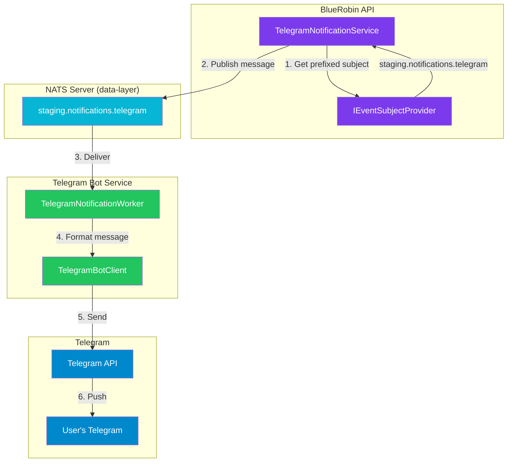
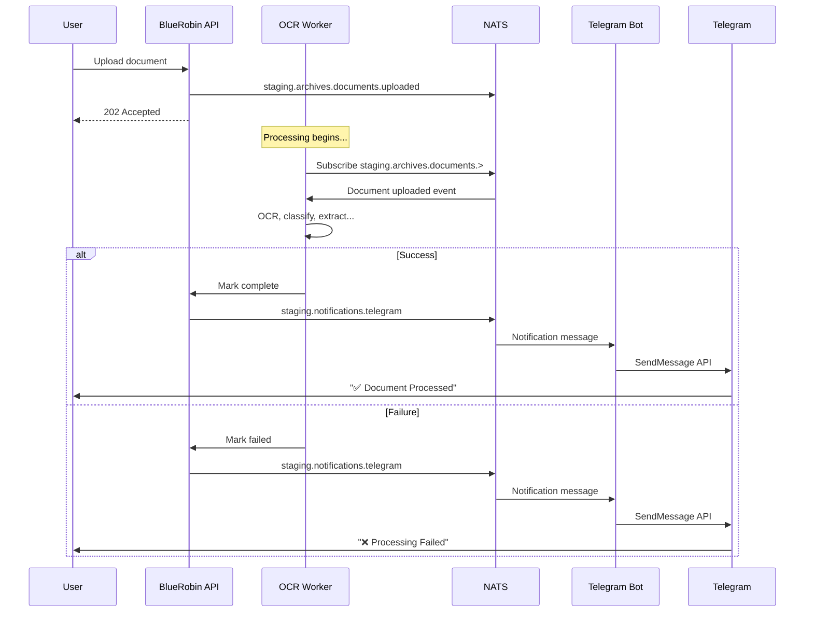

import Callout from '@components/Callout.astro';
import ImplementationNote from '@components/ImplementationNote.astro';
import CodeFile from '@components/CodeFile.astro';
import ExternalCite from '@components/ExternalCite.astro';

## Introduction

When a user uploads a document to BlueRobin, it goes through OCR, classification, entity extraction, chunking, and embedding generation. This can take anywhere from 30 seconds to several minutes. Users shouldn't have to refresh the page to know when processing completes—they should get a notification directly in Telegram.

This article covers how we built the **notification pipeline** using NATS messaging:

```
API → NATS Subject → Telegram Bot → Telegram API → User
```

## Architecture Overview



## Environment-Prefixed Subjects

A critical design decision: **all NATS subjects are environment-prefixed**. This enables:

- Running staging and production on the same NATS cluster
- Preventing cross-environment message leakage
- Supporting local development against shared infrastructure

<CodeFile path="Archives.Application/Services/EventSubjectProvider.cs" language="csharp">
```csharp
public interface IEventSubjectProvider
{
    string EnvironmentPrefix { get; }
    
    // Document lifecycle subjects
    string DocumentUploaded { get; }
    string OcrCompleted { get; }
    string EmbeddingsCompleted { get; }
    
    // Notification subjects
    string NotificationTelegram { get; }
    string NotificationEmail { get; }
    string NotificationWebhook { get; }
    
    // Telegram link subjects (NEW)
    string TelegramLinkTokenValidate { get; }
    string TelegramPushLinkRequest { get; }
    
    string ApplyPrefix(string subject);
}

public class EventSubjectProvider : IEventSubjectProvider
{
    private readonly EnvironmentOptions _options;

    public EventSubjectProvider(IOptions<EnvironmentOptions> options)
    {
        _options = options.Value;

        // Pre-compute all static subjects for performance
        DocumentUploaded = _options.ApplySubjectPrefix("archives.documents.uploaded");
        OcrCompleted = _options.ApplySubjectPrefix("archives.documents.ocr.completed");
        EmbeddingsCompleted = _options.ApplySubjectPrefix("archives.documents.embeddings.completed");
        
        // Notification subjects
        NotificationTelegram = _options.ApplySubjectPrefix("notifications.telegram");
        NotificationEmail = _options.ApplySubjectPrefix("notifications.email");
        NotificationWebhook = _options.ApplySubjectPrefix("notifications.webhook");
        
        // Telegram link subjects
        TelegramLinkTokenValidate = _options.ApplySubjectPrefix("telegram.link-token.validate");
        TelegramPushLinkRequest = _options.ApplySubjectPrefix("telegram.push-link.request");
    }

    public string EnvironmentPrefix => _options.Prefix;
    
    public string ApplyPrefix(string subject) => _options.ApplySubjectPrefix(subject);
    
    // Cached properties...
    public string DocumentUploaded { get; }
    public string NotificationTelegram { get; }
    public string TelegramLinkTokenValidate { get; }
    public string TelegramPushLinkRequest { get; }
    // etc.
}
```
</CodeFile>

The `EnvironmentOptions.ApplySubjectPrefix` method handles the prefixing logic:

```csharp
public class EnvironmentOptions
{
    public const string SectionName = "Environment";
    
    /// <summary>
    /// Environment prefix for NATS subjects and MinIO buckets.
    /// Empty string for production, "staging" or "dev" for other environments.
    /// </summary>
    public string Prefix { get; set; } = "";

    public string ApplySubjectPrefix(string subject)
    {
        return string.IsNullOrEmpty(Prefix) ? subject : $"{Prefix}.{subject}";
    }
}
```

**Result:**
- Production: `notifications.telegram`, `telegram.push-link.request`
- Staging: `staging.notifications.telegram`, `staging.telegram.push-link.request`
- Dev: `dev.notifications.telegram`, `dev.telegram.push-link.request`

<Callout type="warning" title="Critical Alignment">
Both the **publisher** (API) and **subscriber** (Telegram Bot) MUST use the same `IEventSubjectProvider`. If one applies the prefix and the other doesn't, messages will never be received.
</Callout>

## The Publisher: TelegramNotificationService

The API uses `TelegramNotificationService` to publish notifications. This service is injected wherever notifications need to be sent:

<CodeFile path="Archives.Infrastructure/Notifications/TelegramNotificationService.cs" language="csharp">
```csharp
public class TelegramNotificationService : INotificationService
{
    private readonly IMessagingConnection _messaging;
    private readonly IUserRepository _userRepository;
    private readonly IEventSubjectProvider _subjects;
    private readonly ILogger<TelegramNotificationService> _logger;

    public TelegramNotificationService(
        IUserRepository userRepository,
        IMessagingConnection messaging,
        IEventSubjectProvider subjects,
        ILogger<TelegramNotificationService> logger)
    {
        _userRepository = userRepository;
        _messaging = messaging;
        _subjects = subjects;
        _logger = logger;
    }

    public async Task NotifyDocumentProcessedAsync(
        BlueRobinId userId,
        BlueRobinId documentId,
        string documentName,
        bool success,
        string? errorMessage = null,
        CancellationToken cancellationToken = default)
    {
        var user = await _userRepository.GetByIdAsync(userId, cancellationToken);
        if (user == null) return;

        // Check notification preferences
        if (success && user.Preferences?.NotifyOnDocumentProcessed != true) return;
        if (!success && user.Preferences?.NotifyOnDocumentFailed != true) return;

        var chatId = user.GetTelegramChatId();
        if (!chatId.HasValue) return;

        var notification = new DocumentProcessedNotification
        {
            MessageId = Guid.NewGuid().ToString("N"),
            ChatId = chatId.Value,
            Title = success ? "✅ Document Processed" : "❌ Processing Failed",
            Body = success
                ? $"Your document *{documentName}* has been processed successfully."
                : $"Failed to process *{documentName}*.\n\nError: {errorMessage ?? "Unknown"}",
            UserId = userId.Value,
            DocumentId = documentId.Value,
            DocumentName = documentName,
            Success = success,
            Priority = success ? NotificationPriority.Normal : NotificationPriority.High,
            ParseMarkdown = true
        };

        await PublishTelegramNotificationAsync(notification, cancellationToken);
    }

    private async Task PublishTelegramNotificationAsync(
        TelegramNotificationMessage notification,
        CancellationToken cancellationToken)
    {
        try
        {
            // Use the environment-prefixed subject
            await _messaging.PublishAsync(
                _subjects.NotificationTelegram, 
                notification, 
                cancellationToken);
                
            _logger.LogDebug(
                "Published notification {MessageId} to {Subject} for chat {ChatId}",
                notification.MessageId, 
                _subjects.NotificationTelegram, 
                notification.ChatId);
        }
        catch (Exception ex)
        {
            _logger.LogError(ex, "Failed to publish notification {MessageId}", notification.MessageId);
            throw;
        }
    }
}
```
</CodeFile>

<ImplementationNote title="Why IMessagingConnection?">
`IMessagingConnection` is our abstraction over NATS that enables:
- **Testing**: Mock the connection in unit tests
- **Tracing**: Inject OpenTelemetry headers
- **Lifecycle**: Proper disposal and reconnection handling

It wraps `INatsConnection` from the NATS.Net library.
</ImplementationNote>

## The Subscriber: TelegramNotificationWorker

The Telegram Bot service runs a `BackgroundService` that subscribes to the notification subject and sends messages via the Telegram Bot API:

<CodeFile path="Archives.TelegramBot/Services/TelegramNotificationWorker.cs" language="csharp">
```csharp
/// <summary>
/// Background service that listens to NATS Core for outbound Telegram notifications
/// and sends them via the Telegram Bot API.
/// 
/// Uses Core NATS subscription to match the publisher (TelegramNotificationService)
/// which publishes via IMessagingConnection.PublishAsync().
/// Uses IEventSubjectProvider for environment-prefixed subjects.
/// </summary>
public class TelegramNotificationWorker : BackgroundService
{
    private readonly INatsConnection _natsConnection;
    private readonly TelegramBotOptions _options;
    private readonly IEventSubjectProvider _subjects;
    private readonly ILogger<TelegramNotificationWorker> _logger;
    private TelegramBotClient? _botClient;

    public TelegramNotificationWorker(
        INatsConnection natsConnection,
        IOptions<TelegramBotOptions> options,
        IEventSubjectProvider subjects,
        ILogger<TelegramNotificationWorker> logger)
    {
        _natsConnection = natsConnection;
        _options = options.Value;
        _subjects = subjects;
        _logger = logger;
    }

    protected override async Task ExecuteAsync(CancellationToken stoppingToken)
    {
        if (string.IsNullOrWhiteSpace(_options.BotToken))
        {
            _logger.LogError("Telegram bot token not configured");
            return;
        }

        _botClient = new TelegramBotClient(_options.BotToken);

        // Use environment-prefixed notification subject
        var subject = _subjects.NotificationTelegram;
        
        _logger.LogInformation(
            "Telegram notification worker starting, subscribing to {Subject}", 
            subject);

        try
        {
            // Subscribe using Core NATS (matching publisher pattern)
            await foreach (var msg in _natsConnection.SubscribeAsync<TelegramNotificationMessage>(
                subject, cancellationToken: stoppingToken))
            {
                try
                {
                    if (msg.Data != null)
                    {
                        await ProcessNotificationAsync(msg.Data, stoppingToken);
                    }
                }
                catch (Exception ex)
                {
                    _logger.LogError(ex, "Error processing notification");
                    // Continue processing other messages
                }
            }
        }
        catch (OperationCanceledException) when (stoppingToken.IsCancellationRequested)
        {
            _logger.LogInformation("Notification worker stopping...");
        }
    }

    private async Task ProcessNotificationAsync(
        TelegramNotificationMessage notification, 
        CancellationToken cancellationToken)
    {
        if (_botClient == null) return;

        _logger.LogDebug(
            "Sending notification to chat {ChatId}: {Title}",
            notification.ChatId, notification.Title);

        var message = string.IsNullOrEmpty(notification.Title)
            ? notification.Body
            : $"*{notification.Title}*\n\n{notification.Body}";

        await _botClient.SendMessage(
            chatId: notification.ChatId,
            text: message,
            parseMode: notification.ParseMarkdown ? ParseMode.Markdown : ParseMode.None,
            cancellationToken: cancellationToken);

        _logger.LogInformation(
            "Sent notification {MessageId} to chat {ChatId}",
            notification.MessageId, notification.ChatId);
    }
}
```
</CodeFile>

## Why Core NATS, Not JetStream?

You might wonder why we use Core NATS instead of JetStream for notifications. The key considerations:

| Feature | Core NATS | JetStream |
|---------|-----------|-----------|
| **Delivery** | At-most-once | At-least-once |
| **Persistence** | No | Yes |
| **Replay** | No | Yes |
| **Latency** | Lower | Higher |
| **Complexity** | Simple | More complex |

For **notifications**, we chose Core NATS because:

1. **Notifications are ephemeral** - If the bot is down, users would rather get the notification late (next document) than get duplicate old notifications
2. **Latency matters** - Users expect near-instant notification
3. **Idempotency is hard** - De-duplicating "Document X processed" notifications adds complexity
4. **Simple debugging** - No consumer state to troubleshoot

For **document processing events** (OCR, embeddings), we use JetStream because guaranteed delivery is critical.

<Callout type="info" title="Mixed Messaging Pattern">
It's perfectly valid to use both Core NATS and JetStream in the same application. Match the messaging pattern to the use case:
- **Fire-and-forget notifications** → Core NATS
- **Critical workflow events** → JetStream with consumers
</Callout>

## Message Schema

The notification message is a simple DTO:

```csharp
public record TelegramNotificationMessage
{
    public required string MessageId { get; init; }
    public required long ChatId { get; init; }
    public string Title { get; init; } = "";
    public required string Body { get; init; }
    public string? UserId { get; init; }
    public NotificationPriority Priority { get; init; } = NotificationPriority.Normal;
    public bool ParseMarkdown { get; init; } = true;
}

public record DocumentProcessedNotification : TelegramNotificationMessage
{
    public required string DocumentId { get; init; }
    public required string DocumentName { get; init; }
    public required bool Success { get; init; }
    public string? ErrorMessage { get; init; }
    public string NotificationType { get; init; } = "document_processed";
}
```

## Deployment Configuration

Both services need matching environment configuration:

<CodeFile path="bluerobin-infra/apps/archives-telegram-bot/overlays/staging/kustomization.yaml" language="yaml">
```yaml
apiVersion: kustomize.config.k8s.io/v1beta1
kind: Kustomization

namespace: archives-staging

resources:
  - ../../base

patches:
  - target:
      kind: ConfigMap
      name: archives-telegram-bot-config
    patch: |-
      - op: replace
        path: /data/Environment__Prefix
        value: "staging"
      - op: replace
        path: /data/Telegram__MiniAppUrl
        value: "https://web-staging.bluerobin.local/telegram/setup-passkey"
```
</CodeFile>

For production, `Environment__Prefix` is empty (or absent), resulting in unprefixed subjects.

## End-to-End Flow

Let's trace a notification from document upload to Telegram:



## Testing the Pipeline

To verify notifications are flowing:

1. **Check NATS subscription:**
```bash
nats sub "staging.notifications.telegram" --server nats://nats.data-layer:4222
```

2. **Publish a test message:**
```bash
nats pub "staging.notifications.telegram" '{"MessageId":"test","ChatId":123456789,"Body":"Test notification"}' --server nats://nats.data-layer:4222
```

3. **Check bot logs:**
```bash
kubectl logs -n archives-staging deployment/archives-telegram-bot -f
```

## Conclusion

The NATS-powered notification system provides:

- **Real-time delivery** - Sub-second latency from event to Telegram
- **Environment isolation** - Safe multi-tenant infrastructure
- **Loose coupling** - API and Bot deploy independently
- **Observable** - Full tracing through OpenTelemetry

**Key Patterns:**

1. Use `IEventSubjectProvider` for all NATS subjects
2. Match publisher and subscriber messaging patterns (Core vs JetStream)
3. Pre-compute subjects at startup for performance
4. Check user preferences before sending notifications

**Next in Series:** [Complete Telegram Bot Deployment Guide](/articles/telegram-bot-kubernetes-deployment) - Kubernetes manifests, secrets management, and Flux GitOps configuration.
