```mermaid
flowchart TB
    subgraph Strategies["✂️ Chunking Strategies"]
        Fixed["📏 Fixed-Size\n|──512──|──512──|\nSimple but breaks mid-sentence"]
        Sentence["💬 Sentence\n|sent1|sent2|sent3|\nPreserves sentences, variable size"]
        Paragraph["📄 Paragraph\n|paragraph 1|para 2|\nNatural boundaries, very variable"]
        Semantic["🧠 Semantic\n|topic 1|topic 2|\nBest quality but complex"]
        Sliding["🔄 Sliding Window\nwith overlap\nCaptures cross-boundary context"]
    end

    style Strategies fill:#6c5ce7,color:#fff
```

import Callout from '@components/Callout.astro';
import ImplementationNote from '@components/ImplementationNote.astro';
import ExternalCite from '@components/ExternalCite.astro';

## Introduction

When building a Retrieval-Augmented Generation (RAG) pipeline, one of the most impactful decisions you'll make is how to split your documents into chunks. Poor chunking leads to poor retrieval, which leads to poor answers—regardless of how powerful your LLM is.

**The core problem**: Embedding models have limited context windows (typically 512 tokens), and semantic similarity works best on focused, coherent text segments. If you chunk at arbitrary boundaries, you'll break sentences mid-thought, separate related concepts, and lose the context needed for accurate retrieval.

### What You'll Learn

In this guide, we'll implement five different chunking strategies in C#:

1. **Fixed-Size Chunking** — Simple but naive approach
2. **Sentence-Based Chunking** — Respects sentence boundaries
3. **Paragraph-Based Chunking** — Uses natural document structure
4. **Semantic Chunking** — Preserves markdown headings and document hierarchy
5. **Sliding Window Chunking** — Overlapping chunks for better context preservation

By the end, you'll have a complete `ChunkingService` that can intelligently split documents based on their structure and your retrieval requirements.

## Chunking Strategies Overview

Before diving into code, let's visualize the fundamental differences between chunking approaches. Each strategy makes different tradeoffs between simplicity, consistency, and semantic coherence:



**Fixed-size** chunks are predictable but can cut thoughts in half. **Sentence-based** chunking respects linguistic boundaries but produces variable sizes. **Semantic chunking** is the gold standard for structured documents—it keeps related content together by following the document's inherent organization.

## The Chunking Service Architecture

Our `ChunkingService` implements the strategy pattern, allowing callers to choose their chunking approach at runtime. This is useful when different document types benefit from different strategies—for example, structured markdown docs work best with semantic chunking, while plain text might need sentence-based chunking.

```csharp
// Application/Services/ChunkingService.cs
public sealed class ChunkingService : IChunkingService
{
    private readonly ChunkingOptions _options;
    private readonly ILogger<ChunkingService> _logger;
    
    public ChunkingService(
        IOptions<ChunkingOptions> options,
        ILogger<ChunkingService> logger)
    {
        _options = options.Value;
        _logger = logger;
    }
    
    public IReadOnlyList<TextChunk> ChunkDocument(
        string content,
        ChunkingStrategy strategy = ChunkingStrategy.Semantic)
    {
        return strategy switch
        {
            ChunkingStrategy.FixedSize => ChunkFixedSize(content),
            ChunkingStrategy.Sentence => ChunkBySentence(content),
            ChunkingStrategy.Paragraph => ChunkByParagraph(content),
            ChunkingStrategy.Semantic => ChunkSemantic(content),
            ChunkingStrategy.Sliding => ChunkSliding(content),
            _ => throw new ArgumentOutOfRangeException(nameof(strategy))
        };
    }
```

The service defaults to `Semantic` chunking since most of our documents are markdown with headers. The `ChunkingOptions` (defined later) controls chunk size limits and overlap amounts.

## Fixed-Size Chunking

The simplest approach: split text into equal-sized pieces. While naive, this works surprisingly well for homogeneous content where you need predictable chunk sizes.

**When to use**: Consistent-density text, when chunk size predictability matters, or as a baseline.

**Tradeoffs**: Will definitely break sentences and paragraphs mid-thought.

```csharp
    private IReadOnlyList<TextChunk> ChunkFixedSize(string content)
    {
        var chunks = new List<TextChunk>();
        var charIndex = 0;
        var chunkIndex = 0;
        
        while (charIndex < content.Length)
        {
            var chunkLength = Math.Min(_options.MaxChunkSize, content.Length - charIndex);
            var chunkText = content.Substring(charIndex, chunkLength);
            
            chunks.Add(new TextChunk
            {
                Index = chunkIndex++,
                Content = chunkText.Trim(),
                StartPosition = charIndex,
                EndPosition = charIndex + chunkLength,
                TokenEstimate = EstimateTokens(chunkText)
            });
            
            // Move forward, but overlap with previous chunk
            charIndex += chunkLength - _options.Overlap;
        }
        
        return chunks;
    }
```

Notice we apply overlap even in fixed-size chunking. This creates redundancy but ensures that concepts split at chunk boundaries still appear completely in at least one chunk.

## Sentence-Based Chunking

A significant improvement: respect sentence boundaries. This ensures each chunk contains complete thoughts, making embeddings more semantically meaningful.

**When to use**: Narrative text, articles, or any content where sentence integrity matters.

**Tradeoffs**: Variable chunk sizes—some may be much smaller or larger than target.

```csharp
    private IReadOnlyList<TextChunk> ChunkBySentence(string content)
    {
        var sentences = SplitIntoSentences(content);
        var chunks = new List<TextChunk>();
        var currentChunk = new StringBuilder();
        var chunkIndex = 0;
        var startPos = 0;
        var currentPos = 0;
        
        foreach (var sentence in sentences)
        {
            // Check if adding this sentence would exceed our limit
            if (currentChunk.Length + sentence.Length > _options.MaxChunkSize && 
                currentChunk.Length > 0)
            {
                // Finalize current chunk and start a new one
                chunks.Add(new TextChunk
                {
                    Index = chunkIndex++,
                    Content = currentChunk.ToString().Trim(),
                    StartPosition = startPos,
                    EndPosition = currentPos,
                    TokenEstimate = EstimateTokens(currentChunk.ToString())
                });
                
                currentChunk.Clear();
                startPos = currentPos;
            }
            
            currentChunk.Append(sentence).Append(' ');
            currentPos += sentence.Length + 1;
        }
        
        // Don't forget the last chunk!
        if (currentChunk.Length > 0)
        {
            chunks.Add(new TextChunk
            {
                Index = chunkIndex,
                Content = currentChunk.ToString().Trim(),
                StartPosition = startPos,
                EndPosition = currentPos,
                TokenEstimate = EstimateTokens(currentChunk.ToString())
            });
        }
        
        return chunks;
    }
```

The algorithm greedily accumulates sentences until adding another would exceed the max size, then starts a new chunk. This produces chunks that are at most `MaxChunkSize` but may be smaller.

## Paragraph-Based Chunking

Documents with clear paragraph structure (double newlines) can leverage those natural boundaries. This often aligns with topic shifts better than sentence-level chunking.

**When to use**: Well-structured documents with clear paragraph breaks.

**Tradeoffs**: Paragraphs vary widely in size—some may need further splitting.

```csharp
    private IReadOnlyList<TextChunk> ChunkByParagraph(string content)
    {
        var paragraphs = content.Split(
            new[] { "\n\n", "\r\n\r\n" }, 
            StringSplitOptions.RemoveEmptyEntries);
        
        var chunks = new List<TextChunk>();
        var currentChunk = new StringBuilder();
        var chunkIndex = 0;
        var position = 0;
        var startPos = 0;
        
        foreach (var paragraph in paragraphs)
        {
            var trimmed = paragraph.Trim();
            if (string.IsNullOrEmpty(trimmed)) continue;
            
            // Handle oversized paragraphs by falling back to sentence chunking
            if (trimmed.Length > _options.MaxChunkSize)
            {
                // Flush current buffer first
                if (currentChunk.Length > 0)
                {
                    chunks.Add(CreateChunk(currentChunk.ToString(), chunkIndex++, startPos, position));
                    currentChunk.Clear();
                    startPos = position;
                }
                
                // Split the large paragraph using sentence chunking
                var subChunks = ChunkBySentence(trimmed);
                foreach (var sub in subChunks)
                {
                    sub.Index = chunkIndex++;
                    sub.StartPosition += position;
                    sub.EndPosition += position;
                    chunks.Add(sub);
                }
                
                position += trimmed.Length + 2;
                startPos = position;
                continue;
            }
            
            // Normal case: accumulate paragraphs
            if (currentChunk.Length + trimmed.Length + 2 > _options.MaxChunkSize && 
                currentChunk.Length > 0)
            {
                chunks.Add(CreateChunk(currentChunk.ToString(), chunkIndex++, startPos, position));
                currentChunk.Clear();
                startPos = position;
            }
            
            currentChunk.AppendLine(trimmed);
            currentChunk.AppendLine();
            position += trimmed.Length + 2;
        }
        
        if (currentChunk.Length > 0)
        {
            chunks.Add(CreateChunk(currentChunk.ToString(), chunkIndex, startPos, position));
        }
        
        return chunks;
    }
```

Notice the fallback to sentence chunking for oversized paragraphs. This hierarchical approach ensures we never produce chunks larger than the configured maximum.

## Semantic Chunking (Recommended)

This is our most sophisticated strategy. It parses markdown structure and uses headers to create semantically coherent chunks. Each chunk retains its heading context, dramatically improving retrieval relevance.

**When to use**: Markdown documents, technical documentation, any content with headers.

**Tradeoffs**: More complex, assumes markdown structure.

```csharp
    private IReadOnlyList<TextChunk> ChunkSemantic(string content)
    {
        // Parse the document's markdown structure
        var sections = ParseMarkdownSections(content);
        
        if (sections.Count == 0)
        {
            // No headers found - fall back to paragraph chunking
            return ChunkByParagraph(content);
        }
        
        var chunks = new List<TextChunk>();
        var chunkIndex = 0;
        
        foreach (var section in sections)
        {
            var sectionContent = section.Content;
            
            // Small sections become single chunks
            if (sectionContent.Length <= _options.MaxChunkSize)
            {
                chunks.Add(new TextChunk
                {
                    Index = chunkIndex++,
                    Content = sectionContent.Trim(),
                    StartPosition = section.StartPosition,
                    EndPosition = section.EndPosition,
                    TokenEstimate = EstimateTokens(sectionContent),
                    Metadata = new ChunkMetadata
                    {
                        Heading = section.Heading,
                        HeadingLevel = section.Level
                    }
                });
            }
            else
            {
                // Large sections: split by paragraph but preserve heading context
                var subChunks = ChunkByParagraph(sectionContent);
                foreach (var sub in subChunks)
                {
                    // Prepend the section heading to each sub-chunk
                    // This ensures retrieval knows the context
                    var contextualContent = section.Heading != null
                        ? $"## {section.Heading}\n\n{sub.Content}"
                        : sub.Content;
                    
                    chunks.Add(new TextChunk
                    {
                        Index = chunkIndex++,
                        Content = contextualContent,
                        StartPosition = section.StartPosition + sub.StartPosition,
                        EndPosition = section.StartPosition + sub.EndPosition,
                        TokenEstimate = EstimateTokens(contextualContent),
                        Metadata = new ChunkMetadata
                        {
                            Heading = section.Heading,
                            HeadingLevel = section.Level
                        }
                    });
                }
            }
        }
        
        return chunks;
    }
```

The key insight: when a section must be split, we prepend the heading to each sub-chunk. This way, when a user asks "How do I configure authentication?", chunks from the "Authentication" section will have higher similarity even if the word "authentication" doesn't appear in that specific paragraph.

<ImplementationNote>
Semantic chunking preserves document structure by respecting markdown headings. Each chunk includes the parent heading as context, improving retrieval relevance.
</ImplementationNote>

## Sliding Window Chunking

For dense technical content where context spans multiple paragraphs, overlapping chunks ensure no information falls through the cracks.

**When to use**: Technical documentation, code explanations, any content where adjacent sections are highly related.

**Tradeoffs**: Produces more chunks (more storage), but better recall.

```csharp
    private IReadOnlyList<TextChunk> ChunkSliding(string content)
    {
        var chunks = new List<TextChunk>();
        var sentences = SplitIntoSentences(content);
        var windowStart = 0;
        var chunkIndex = 0;
        var sentencePositions = CalculateSentencePositions(sentences);
        
        while (windowStart < sentences.Count)
        {
            var currentChunk = new StringBuilder();
            var windowEnd = windowStart;
            
            // Accumulate sentences until max size
            while (windowEnd < sentences.Count && 
                   currentChunk.Length + sentences[windowEnd].Length < _options.MaxChunkSize)
            {
                currentChunk.Append(sentences[windowEnd]).Append(' ');
                windowEnd++;
            }
            
            if (currentChunk.Length > 0)
            {
                chunks.Add(new TextChunk
                {
                    Index = chunkIndex++,
                    Content = currentChunk.ToString().Trim(),
                    StartPosition = sentencePositions[windowStart],
                    EndPosition = sentencePositions[Math.Min(windowEnd, sentences.Count - 1)],
                    TokenEstimate = EstimateTokens(currentChunk.ToString())
                });
            }
            
            // Slide window - keep some overlap
            var sentencesToSkip = Math.Max(1, 
                (windowEnd - windowStart) * (1 - _options.Overlap / _options.MaxChunkSize));
            windowStart += (int)sentencesToSkip;
        }
        
        return chunks;
    }
```

The overlap is controlled by `_options.Overlap`. A 20% overlap means each chunk shares about 20% of its content with the previous chunk, creating redundancy that improves recall at the cost of storage.

## Helper Methods

These utilities support the chunking strategies:

```csharp
    private static IReadOnlyList<string> SplitIntoSentences(string text)
    {
        // Pattern: split after sentence-ending punctuation followed by whitespace and capital letter
        var pattern = @"(?<=[.!?])\s+(?=[A-Z])";
        return Regex.Split(text, pattern)
            .Where(s => !string.IsNullOrWhiteSpace(s))
            .ToList();
    }
    
    private static IReadOnlyList<MarkdownSection> ParseMarkdownSections(string content)
    {
        var sections = new List<MarkdownSection>();
        var headingPattern = @"^(#{1,6})\s+(.+)$";
        var lines = content.Split('\n');
        
        MarkdownSection? current = null;
        var contentBuilder = new StringBuilder();
        var position = 0;
        var startPosition = 0;
        
        foreach (var line in lines)
        {
            var match = Regex.Match(line, headingPattern);
            
            if (match.Success)
            {
                // Save previous section
                if (current != null)
                {
                    current.Content = contentBuilder.ToString();
                    current.EndPosition = position;
                    sections.Add(current);
                }
                
                // Start new section
                contentBuilder.Clear();
                startPosition = position;
                current = new MarkdownSection
                {
                    Heading = match.Groups[2].Value,
                    Level = match.Groups[1].Value.Length,
                    StartPosition = startPosition
                };
            }
            
            contentBuilder.AppendLine(line);
            position += line.Length + 1;
        }
        
        // Don't forget the final section
        if (current != null)
        {
            current.Content = contentBuilder.ToString();
            current.EndPosition = position;
            sections.Add(current);
        }
        else if (contentBuilder.Length > 0)
        {
            // No headings found - treat entire content as one section
            sections.Add(new MarkdownSection
            {
                Content = contentBuilder.ToString(),
                StartPosition = 0,
                EndPosition = position
            });
        }
        
        return sections;
    }
    
    // Quick token estimation: ~4 characters per token on average
    private static int EstimateTokens(string text) => text.Length / 4;
    
    private static TextChunk CreateChunk(string content, int index, int start, int end) =>
        new()
        {
            Index = index,
            Content = content.Trim(),
            StartPosition = start,
            EndPosition = end,
            TokenEstimate = EstimateTokens(content)
        };
    
    private static int[] CalculateSentencePositions(IReadOnlyList<string> sentences)
    {
        var positions = new int[sentences.Count];
        var pos = 0;
        for (int i = 0; i < sentences.Count; i++)
        {
            positions[i] = pos;
            pos += sentences[i].Length + 1;
        }
        return positions;
    }
}
```

## Data Types

Finally, here are the supporting types used throughout the service:

```csharp
public sealed record TextChunk
{
    public int Index { get; set; }
    public required string Content { get; init; }
    public int StartPosition { get; set; }
    public int EndPosition { get; set; }
    public int TokenEstimate { get; init; }
    public ChunkMetadata? Metadata { get; init; }
}

public sealed record ChunkMetadata
{
    public string? Heading { get; init; }
    public int HeadingLevel { get; init; }
}

public sealed record ChunkingOptions
{
    public int MaxChunkSize { get; init; } = 512;  // Characters, not tokens
    public int Overlap { get; init; } = 50;        // Overlap in characters
    public int MinChunkSize { get; init; } = 100;  // Avoid tiny chunks
}

public enum ChunkingStrategy
{
    FixedSize,
    Sentence,
    Paragraph,
    Semantic,
    Sliding
}
```

## Choosing the Right Strategy

| Strategy | Best For | Chunk Size | Considerations |
|----------|----------|------------|----------------|
| **Fixed-Size** | Simple text, consistent density | Predictable | May break mid-thought |
| **Sentence** | Narrative text, articles | Variable | Respects linguistic units |
| **Paragraph** | Well-structured documents | Very variable | Needs good paragraph structure |
| **Semantic** | Markdown/technical docs | Variable | Best quality for structured content |
| **Sliding** | Dense technical content | Overlapping | More storage, better recall |

<Callout type="tip">
Start with semantic chunking for markdown documents. Fall back to sliding window (256-token overlap) for dense technical content where context preservation is critical.
</Callout>

## Conclusion

Effective chunking is the foundation of a performant RAG system. The key principles:

- **Semantic coherence**: Keep related content together using document structure
- **Size consistency**: Fit within embedding model context windows (typically 512 tokens)
- **Context preservation**: Include headers and use overlap to prevent information loss
- **Retrieval quality**: Smaller, focused chunks produce more precise similarity matches

Start with semantic chunking for structured documents, then tune based on your retrieval metrics. Monitor which chunks get retrieved for your test queries—if they're missing critical context, increase overlap or adjust your chunking strategy.

The `ChunkingService` we built supports all five strategies through a simple interface, making it easy to experiment and find what works best for your document corpus.

<ExternalCite 
  title="Chunking Strategies for LLM Applications" 
  url="https://www.pinecone.io/learn/chunking-strategies/"
  author="Pinecone"
/>
