import Callout from '@components/Callout.astro';
import ImplementationNote from '@components/ImplementationNote.astro';
import ExternalCite from '@components/ExternalCite.astro';

Effective chunking is critical for RAG performance. This guide covers strategies for splitting documents while preserving semantic coherence and context.

## Chunking Strategies Comparison

```mermaid
flowchart TB
    subgraph Strategies["✂️ Chunking Strategies"]
        Fixed["📏 Fixed-Size\n|──512──|──512──|\nSimple but breaks mid-sentence"]
        Sentence["💬 Sentence\n|sent1|sent2|sent3|\nPreserves sentences, variable size"]
        Paragraph["📄 Paragraph\n|paragraph 1|para 2|\nNatural boundaries, very variable"]
        Semantic["🧠 Semantic\n|topic 1|topic 2|\nBest quality but complex"]
        Sliding["🔄 Sliding Window\nwith overlap\nCaptures cross-boundary context"]
    end

    style Strategies fill:#6c5ce7,color:#fff
```



## Chunk Service Implementation

```csharp
// Application/Services/ChunkingService.cs
public sealed class ChunkingService : IChunkingService
{
    private readonly ChunkingOptions _options;
    private readonly ILogger<ChunkingService> _logger;
    
    public ChunkingService(
        IOptions<ChunkingOptions> options,
        ILogger<ChunkingService> logger)
    {
        _options = options.Value;
        _logger = logger;
    }
    
    public IReadOnlyList<TextChunk> ChunkDocument(
        string content,
        ChunkingStrategy strategy = ChunkingStrategy.Semantic)
    {
        return strategy switch
        {
            ChunkingStrategy.FixedSize => ChunkFixedSize(content),
            ChunkingStrategy.Sentence => ChunkBySentence(content),
            ChunkingStrategy.Paragraph => ChunkByParagraph(content),
            ChunkingStrategy.Semantic => ChunkSemantic(content),
            ChunkingStrategy.Sliding => ChunkSliding(content),
            _ => throw new ArgumentOutOfRangeException(nameof(strategy))
        };
    }
    
    private IReadOnlyList<TextChunk> ChunkFixedSize(string content)
    {
        var chunks = new List<TextChunk>();
        var charIndex = 0;
        var chunkIndex = 0;
        
        while (charIndex < content.Length)
        {
            var chunkLength = Math.Min(_options.MaxChunkSize, content.Length - charIndex);
            var chunkText = content.Substring(charIndex, chunkLength);
            
            chunks.Add(new TextChunk
            {
                Index = chunkIndex++,
                Content = chunkText.Trim(),
                StartPosition = charIndex,
                EndPosition = charIndex + chunkLength,
                TokenEstimate = EstimateTokens(chunkText)
            });
            
            charIndex += chunkLength - _options.Overlap;
        }
        
        return chunks;
    }
    
    private IReadOnlyList<TextChunk> ChunkBySentence(string content)
    {
        var sentences = SplitIntoSentences(content);
        var chunks = new List<TextChunk>();
        var currentChunk = new StringBuilder();
        var chunkIndex = 0;
        var startPos = 0;
        var currentPos = 0;
        
        foreach (var sentence in sentences)
        {
            if (currentChunk.Length + sentence.Length > _options.MaxChunkSize && 
                currentChunk.Length > 0)
            {
                chunks.Add(new TextChunk
                {
                    Index = chunkIndex++,
                    Content = currentChunk.ToString().Trim(),
                    StartPosition = startPos,
                    EndPosition = currentPos,
                    TokenEstimate = EstimateTokens(currentChunk.ToString())
                });
                
                currentChunk.Clear();
                startPos = currentPos;
            }
            
            currentChunk.Append(sentence).Append(' ');
            currentPos += sentence.Length + 1;
        }
        
        if (currentChunk.Length > 0)
        {
            chunks.Add(new TextChunk
            {
                Index = chunkIndex,
                Content = currentChunk.ToString().Trim(),
                StartPosition = startPos,
                EndPosition = currentPos,
                TokenEstimate = EstimateTokens(currentChunk.ToString())
            });
        }
        
        return chunks;
    }
    
    private IReadOnlyList<TextChunk> ChunkByParagraph(string content)
    {
        var paragraphs = content.Split(
            new[] { "\n\n", "\r\n\r\n" }, 
            StringSplitOptions.RemoveEmptyEntries);
        
        var chunks = new List<TextChunk>();
        var currentChunk = new StringBuilder();
        var chunkIndex = 0;
        var position = 0;
        var startPos = 0;
        
        foreach (var paragraph in paragraphs)
        {
            var trimmed = paragraph.Trim();
            if (string.IsNullOrEmpty(trimmed)) continue;
            
            // If single paragraph exceeds max, split it
            if (trimmed.Length > _options.MaxChunkSize)
            {
                if (currentChunk.Length > 0)
                {
                    chunks.Add(CreateChunk(currentChunk.ToString(), chunkIndex++, startPos, position));
                    currentChunk.Clear();
                    startPos = position;
                }
                
                // Split large paragraph by sentences
                var subChunks = ChunkBySentence(trimmed);
                foreach (var sub in subChunks)
                {
                    sub.Index = chunkIndex++;
                    sub.StartPosition += position;
                    sub.EndPosition += position;
                    chunks.Add(sub);
                }
                
                position += trimmed.Length + 2;
                startPos = position;
                continue;
            }
            
            if (currentChunk.Length + trimmed.Length + 2 > _options.MaxChunkSize && 
                currentChunk.Length > 0)
            {
                chunks.Add(CreateChunk(currentChunk.ToString(), chunkIndex++, startPos, position));
                currentChunk.Clear();
                startPos = position;
            }
            
            currentChunk.AppendLine(trimmed);
            currentChunk.AppendLine();
            position += trimmed.Length + 2;
        }
        
        if (currentChunk.Length > 0)
        {
            chunks.Add(CreateChunk(currentChunk.ToString(), chunkIndex, startPos, position));
        }
        
        return chunks;
    }
    
    private IReadOnlyList<TextChunk> ChunkSemantic(string content)
    {
        // Parse markdown structure if present
        var sections = ParseMarkdownSections(content);
        
        if (sections.Count == 0)
        {
            // Fallback to paragraph chunking
            return ChunkByParagraph(content);
        }
        
        var chunks = new List<TextChunk>();
        var chunkIndex = 0;
        
        foreach (var section in sections)
        {
            var sectionContent = section.Content;
            
            // If section is small enough, keep as single chunk
            if (sectionContent.Length <= _options.MaxChunkSize)
            {
                chunks.Add(new TextChunk
                {
                    Index = chunkIndex++,
                    Content = sectionContent.Trim(),
                    StartPosition = section.StartPosition,
                    EndPosition = section.EndPosition,
                    TokenEstimate = EstimateTokens(sectionContent),
                    Metadata = new ChunkMetadata
                    {
                        Heading = section.Heading,
                        HeadingLevel = section.Level
                    }
                });
            }
            else
            {
                // Split large sections by paragraph, preserving heading
                var subChunks = ChunkByParagraph(sectionContent);
                foreach (var sub in subChunks)
                {
                    // Prepend heading context to each sub-chunk
                    var contextualContent = section.Heading != null
                        ? $"## {section.Heading}\n\n{sub.Content}"
                        : sub.Content;
                    
                    chunks.Add(new TextChunk
                    {
                        Index = chunkIndex++,
                        Content = contextualContent,
                        StartPosition = section.StartPosition + sub.StartPosition,
                        EndPosition = section.StartPosition + sub.EndPosition,
                        TokenEstimate = EstimateTokens(contextualContent),
                        Metadata = new ChunkMetadata
                        {
                            Heading = section.Heading,
                            HeadingLevel = section.Level
                        }
                    });
                }
            }
        }
        
        return chunks;
    }
    
    private IReadOnlyList<TextChunk> ChunkSliding(string content)
    {
        var chunks = new List<TextChunk>();
        var sentences = SplitIntoSentences(content);
        var windowStart = 0;
        var chunkIndex = 0;
        var charPosition = 0;
        var sentencePositions = CalculateSentencePositions(sentences);
        
        while (windowStart < sentences.Count)
        {
            var currentChunk = new StringBuilder();
            var windowEnd = windowStart;
            
            // Build chunk up to max size
            while (windowEnd < sentences.Count && 
                   currentChunk.Length + sentences[windowEnd].Length < _options.MaxChunkSize)
            {
                currentChunk.Append(sentences[windowEnd]).Append(' ');
                windowEnd++;
            }
            
            if (currentChunk.Length > 0)
            {
                chunks.Add(new TextChunk
                {
                    Index = chunkIndex++,
                    Content = currentChunk.ToString().Trim(),
                    StartPosition = sentencePositions[windowStart],
                    EndPosition = sentencePositions[Math.Min(windowEnd, sentences.Count - 1)],
                    TokenEstimate = EstimateTokens(currentChunk.ToString())
                });
            }
            
            // Slide window by overlap amount (in sentences)
            var sentencesToSkip = Math.Max(1, 
                (windowEnd - windowStart) * (1 - _options.Overlap / _options.MaxChunkSize));
            windowStart += (int)sentencesToSkip;
        }
        
        return chunks;
    }
    
    private static IReadOnlyList<string> SplitIntoSentences(string text)
    {
        // Simple sentence splitting - could use ML for better accuracy
        var pattern = @"(?<=[.!?])\s+(?=[A-Z])";
        return Regex.Split(text, pattern)
            .Where(s => !string.IsNullOrWhiteSpace(s))
            .ToList();
    }
    
    private static IReadOnlyList<MarkdownSection> ParseMarkdownSections(string content)
    {
        var sections = new List<MarkdownSection>();
        var headingPattern = @"^(#{1,6})\s+(.+)$";
        var lines = content.Split('\n');
        
        MarkdownSection? current = null;
        var contentBuilder = new StringBuilder();
        var position = 0;
        var startPosition = 0;
        
        foreach (var line in lines)
        {
            var match = Regex.Match(line, headingPattern);
            
            if (match.Success)
            {
                // Save previous section
                if (current != null)
                {
                    current.Content = contentBuilder.ToString();
                    current.EndPosition = position;
                    sections.Add(current);
                }
                
                // Start new section
                contentBuilder.Clear();
                startPosition = position;
                current = new MarkdownSection
                {
                    Heading = match.Groups[2].Value,
                    Level = match.Groups[1].Value.Length,
                    StartPosition = startPosition
                };
            }
            
            contentBuilder.AppendLine(line);
            position += line.Length + 1;
        }
        
        // Add final section
        if (current != null)
        {
            current.Content = contentBuilder.ToString();
            current.EndPosition = position;
            sections.Add(current);
        }
        else if (contentBuilder.Length > 0)
        {
            // No headings found, treat entire content as one section
            sections.Add(new MarkdownSection
            {
                Content = contentBuilder.ToString(),
                StartPosition = 0,
                EndPosition = position
            });
        }
        
        return sections;
    }
    
    private static int EstimateTokens(string text) => text.Length / 4;
    
    private static TextChunk CreateChunk(string content, int index, int start, int end) =>
        new()
        {
            Index = index,
            Content = content.Trim(),
            StartPosition = start,
            EndPosition = end,
            TokenEstimate = EstimateTokens(content)
        };
    
    private static int[] CalculateSentencePositions(IReadOnlyList<string> sentences)
    {
        var positions = new int[sentences.Count];
        var pos = 0;
        for (int i = 0; i < sentences.Count; i++)
        {
            positions[i] = pos;
            pos += sentences[i].Length + 1;
        }
        return positions;
    }
}

public sealed record TextChunk
{
    public int Index { get; set; }
    public required string Content { get; init; }
    public int StartPosition { get; set; }
    public int EndPosition { get; set; }
    public int TokenEstimate { get; init; }
    public ChunkMetadata? Metadata { get; init; }
}

public sealed record ChunkMetadata
{
    public string? Heading { get; init; }
    public int HeadingLevel { get; init; }
}

public sealed record ChunkingOptions
{
    public int MaxChunkSize { get; init; } = 512;
    public int Overlap { get; init; } = 50;
    public int MinChunkSize { get; init; } = 100;
}

public enum ChunkingStrategy
{
    FixedSize,
    Sentence,
    Paragraph,
    Semantic,
    Sliding
}
```

<ImplementationNote>
Semantic chunking preserves document structure by respecting markdown headings. Each chunk includes the parent heading as context, improving retrieval relevance.
</ImplementationNote>

## Strategy Selection

| Strategy | Best For | Considerations |
|----------|----------|----------------|
| FixedSize | Simple text, consistent density | May break mid-thought |
| Sentence | Narrative text | Variable chunk sizes |
| Paragraph | Well-structured documents | Very variable sizes |
| Semantic | Markdown/structured docs | Requires structure parsing |
| Sliding | Dense technical content | More storage, better recall |

<Callout type="tip">
Start with semantic chunking for markdown documents. Fall back to sliding window (256-token overlap) for dense technical content where context preservation is critical.
</Callout>

## Summary

Effective chunking balances:

- **Semantic coherence**: Keep related content together
- **Size consistency**: Fit embedding model context windows
- **Context preservation**: Include headers and overlap
- **Retrieval quality**: Smaller chunks = more precise matches

Combined with proper embedding models, good chunking significantly improves RAG accuracy.

<ExternalCite 
  title="Chunking Strategies for LLM Applications" 
  url="https://www.pinecone.io/learn/chunking-strategies/"
  author="Pinecone"
/>
