import Callout from '@components/Callout.astro';
import ImplementationNote from '@components/ImplementationNote.astro';
import ExternalCite from '@components/ExternalCite.astro';

## Introduction

Your Kubernetes cluster runs dozens of services, but they're all hidden behind internal IPs. How do users reach them? The answer is an **Ingress Controller**—the traffic cop that routes external requests to the right service based on hostnames and paths.

**Why Traefik for Ingress:**

- **Dynamic Configuration**: Automatically discovers services as they're deployed—no reload required
- **Modern Protocol Support**: HTTP/2, gRPC, WebSockets, and TCP/UDP routing out-of-the-box
- **Middleware Ecosystem**: Authentication, rate limiting, compression as composable building blocks
- **Dashboard**: Real-time visibility into routes, services, and middleware chains

For BlueRobin, Traefik is the front door to everything—our Blazor web app, REST API, and internal tools. Its CRD-based configuration (IngressRoute) gives us more power than standard Kubernetes Ingress, while the middleware system handles cross-cutting concerns like auth forwarding and security headers.

Traefik is a modern HTTP reverse proxy and load balancer that makes deploying microservices easy. In the Kubernetes ecosystem, it serves as an **Ingress Controller**, managing access to your services from the outside world.

**Why Traefik Matters:**

-   **Kubernetes Native (CRDs)**: While it supports standard Ingress, its custom `IngressRoute` resource offers advanced features like TCP routing and distinct entry points.
-   **Middleware Chains**: Reusable pipelines for logic like "Compress -> RateLimit -> Authenticate" can be applied declaratively.
-   **Observability**: Built-in metrics and a realtime dashboard make debugging routing issues significantly easier than with Nginx.

### What We'll Build

In this guide, we will configure the "Front Door" of our cluster. You will learn how to:

1.  **Deploy Traefik**: Install via Helm with MetalLB integration.
2.  **Secure Traffic**: Force HTTPS redirection and apply TLS certificates.
3.  **Configure Middleware**: Implement generic security headers and compression.
4.  **Route Services**: efficient routing for the Blazor Web App vs the API.

## Architecture Overview

```mermaid
flowchart TB
    Traffic["🌐 External Traffic"] --> VIP["⚖️ MetalLB VIP\n192.168.0.50"]
    
    subgraph Traefik["🔀 Traefik Ingress"]
        VIP --> Web["🌍 EntryPoint\nweb :80"]
        VIP --> Secure["🔒 EntryPoint\nwebsecure :443"]
        VIP --> Metrics["📊 EntryPoint\nmetrics :9100"]
        
        Web --> MW["⚙️ Middleware Chain"]
        Secure --> MW
        MW --> |"redirect → compress →\nratelimit → auth"| Routes
    end
    
    Routes --> API["🔌 API Service"]
    Routes --> WebSvc["🖥️ Web Service"]
    Routes --> Workers["⚙️ Workers\n(Internal)"]

    classDef primary fill:#7c3aed,color:#fff
    classDef secondary fill:#06b6d4,color:#fff
    classDef db fill:#f43f5e,color:#fff
    classDef warning fill:#fbbf24,color:#000

    class Traefik secondary
```



## Traefik Installation

### Helm Values

```yaml
# platform/traefik/values.yaml
globalArguments:
  - "--global.checknewversion=false"
  - "--global.sendanonymoususage=false"

additionalArguments:
  - "--api.insecure=false"
  - "--api.dashboard=true"
  - "--log.level=INFO"
  - "--accesslog=true"
  - "--accesslog.format=json"
  - "--providers.kubernetesingress.ingressclass=traefik"
  - "--providers.kubernetescrd.allowCrossNamespace=true"
  - "--entrypoints.web.address=:80"
  - "--entrypoints.websecure.address=:443"
  - "--entrypoints.metrics.address=:9100"
  - "--metrics.prometheus=true"
  - "--metrics.prometheus.entryPoint=metrics"
  - "--ping=true"
  - "--ping.entryPoint=traefik"

ports:
  web:
    port: 80
    exposedPort: 80
    protocol: TCP
  websecure:
    port: 443
    exposedPort: 443
    protocol: TCP
    tls:
      enabled: true
  metrics:
    port: 9100
    exposedPort: 9100
    protocol: TCP

service:
  type: LoadBalancer
  spec:
    loadBalancerIP: 192.168.0.50

deployment:
  replicas: 2

resources:
  requests:
    cpu: "100m"
    memory: "128Mi"
  limits:
    cpu: "500m"
    memory: "512Mi"

ingressRoute:
  dashboard:
    enabled: true
    matchRule: Host(`traefik.bluerobin.local`)
    middlewares:
      - name: auth-forward

providers:
  kubernetesCRD:
    enabled: true
    allowCrossNamespace: true
  kubernetesIngress:
    enabled: true
    ingressClass: traefik
```

### HelmRelease

```yaml
# platform/traefik/helmrelease.yaml
apiVersion: helm.toolkit.fluxcd.io/v2
kind: HelmRelease
metadata:
  name: traefik
  namespace: kube-system
spec:
  interval: 30m
  chart:
    spec:
      chart: traefik
      version: ">=26.0.0 <27.0.0"
      sourceRef:
        kind: HelmRepository
        name: traefik
        namespace: flux-system
  valuesFrom:
    - kind: ConfigMap
      name: traefik-values
  postRenderers:
    - kustomize:
        patches:
          - target:
              kind: Deployment
              name: traefik
            patch: |
              - op: add
                path: /spec/template/spec/tolerations
                value:
                  - key: "node-role.kubernetes.io/control-plane"
                    operator: "Exists"
                    effect: "NoSchedule"
```

## Middleware Configuration

### Common Middleware

```yaml
# platform/traefik/middleware/common.yaml
apiVersion: traefik.io/v1alpha1
kind: Middleware
metadata:
  name: https-redirect
  namespace: kube-system
spec:
  redirectScheme:
    scheme: https
    permanent: true
---
apiVersion: traefik.io/v1alpha1
kind: Middleware
metadata:
  name: compress
  namespace: kube-system
spec:
  compress:
    excludedContentTypes:
      - text/event-stream
---
apiVersion: traefik.io/v1alpha1
kind: Middleware
metadata:
  name: security-headers
  namespace: kube-system
spec:
  headers:
    browserXssFilter: true
    contentTypeNosniff: true
    frameDeny: true
    sslRedirect: true
    stsIncludeSubdomains: true
    stsPreload: true
    stsSeconds: 31536000
    customFrameOptionsValue: "SAMEORIGIN"
    referrerPolicy: "strict-origin-when-cross-origin"
---
apiVersion: traefik.io/v1alpha1
kind: Middleware
metadata:
  name: rate-limit
  namespace: kube-system
spec:
  rateLimit:
    average: 100
    burst: 200
    period: 1s
```

### Authelia Forward Auth

```yaml
# platform/traefik/middleware/auth-forward.yaml
apiVersion: traefik.io/v1alpha1
kind: Middleware
metadata:
  name: auth-forward
  namespace: kube-system
spec:
  forwardAuth:
    address: http://authelia.authelia.svc.cluster.local:9091/api/authz/forward-auth
    trustForwardHeader: true
    authResponseHeaders:
      - Remote-User
      - Remote-Name
      - Remote-Email
      - Remote-Groups
```

<ImplementationNote>
The `authResponseHeaders` forward Authelia user information to backend services, enabling user context without re-authentication.
</ImplementationNote>

### Middleware Chain

```yaml
# platform/traefik/middleware/chains.yaml
apiVersion: traefik.io/v1alpha1
kind: Middleware
metadata:
  name: chain-secure
  namespace: kube-system
spec:
  chain:
    middlewares:
      - name: security-headers
      - name: compress
      - name: rate-limit
---
apiVersion: traefik.io/v1alpha1
kind: Middleware
metadata:
  name: chain-secure-auth
  namespace: kube-system
spec:
  chain:
    middlewares:
      - name: auth-forward
      - name: security-headers
      - name: compress
      - name: rate-limit
```

## IngressRoutes

### API IngressRoute

```yaml
# apps/archives-api/ingressroute.yaml
apiVersion: traefik.io/v1alpha1
kind: IngressRoute
metadata:
  name: archives-api
  namespace: archives-staging
  annotations:
    kubernetes.io/ingress.class: traefik
spec:
  entryPoints:
    - websecure
  routes:
    - match: Host(`api-staging.bluerobin.local`)
      kind: Rule
      middlewares:
        - name: chain-secure
          namespace: kube-system
      services:
        - name: archives-api
          port: 80
    - match: Host(`api-staging.bluerobin.local`) && PathPrefix(`/api/health`)
      kind: Rule
      services:
        - name: archives-api
          port: 80
      priority: 100  # Higher priority, skip auth
  tls:
    secretName: bluerobin-tls
```

### Web IngressRoute

```yaml
# apps/bluerobin-web/ingressroute.yaml
apiVersion: traefik.io/v1alpha1
kind: IngressRoute
metadata:
  name: bluerobin-web
  namespace: archives-staging
spec:
  entryPoints:
    - websecure
  routes:
    - match: Host(`web-staging.bluerobin.local`)
      kind: Rule
      middlewares:
        - name: chain-secure-auth
          namespace: kube-system
      services:
        - name: bluerobin-web
          port: 80
  tls:
    secretName: bluerobin-tls
```

<Callout type="tip">
Use route priority to ensure health check endpoints bypass authentication while the main application routes remain protected.
</Callout>

## TLS Configuration

### cert-manager Certificate

```yaml
# platform/cert-manager/certificates/wildcard.yaml
apiVersion: cert-manager.io/v1
kind: Certificate
metadata:
  name: bluerobin-wildcard
  namespace: cert-manager
spec:
  secretName: bluerobin-tls
  issuerRef:
    name: letsencrypt-prod
    kind: ClusterIssuer
  dnsNames:
    - "*.bluerobin.local"
    - "bluerobin.local"
  secretTemplate:
    annotations:
      reflector.v1.k8s.emberstack.com/reflection-allowed: "true"
      reflector.v1.k8s.emberstack.com/reflection-allowed-namespaces: >-
        archives-staging,archives-prod,authelia
      reflector.v1.k8s.emberstack.com/reflection-auto-enabled: "true"
```

### TLS Store Default

```yaml
# platform/traefik/tlsstore.yaml
apiVersion: traefik.io/v1alpha1
kind: TLSStore
metadata:
  name: default
  namespace: kube-system
spec:
  defaultCertificate:
    secretName: bluerobin-tls
```

## Load Balancing

### Sticky Sessions

```yaml
# apps/bluerobin-web/ingressroute.yaml (with sticky sessions)
apiVersion: traefik.io/v1alpha1
kind: IngressRoute
metadata:
  name: bluerobin-web
  namespace: archives-staging
spec:
  entryPoints:
    - websecure
  routes:
    - match: Host(`web-staging.bluerobin.local`)
      kind: Rule
      middlewares:
        - name: chain-secure-auth
          namespace: kube-system
      services:
        - name: bluerobin-web
          port: 80
          sticky:
            cookie:
              name: server_id
              secure: true
              httpOnly: true
  tls:
    secretName: bluerobin-tls
```

<ImplementationNote>
Blazor Server requires sticky sessions to maintain SignalR connections to the same pod. Configure `sticky.cookie` for WebSocket affinity.
</ImplementationNote>

### Weighted Routing (Canary)

```yaml
# apps/bluerobin-web/canary-route.yaml
apiVersion: traefik.io/v1alpha1
kind: TraefikService
metadata:
  name: bluerobin-web-canary
  namespace: archives-staging
spec:
  weighted:
    services:
      - name: bluerobin-web
        port: 80
        weight: 90
      - name: bluerobin-web-canary
        port: 80
        weight: 10
```

## Monitoring

### ServiceMonitor

```yaml
# platform/traefik/servicemonitor.yaml
apiVersion: monitoring.coreos.com/v1
kind: ServiceMonitor
metadata:
  name: traefik
  namespace: kube-system
spec:
  selector:
    matchLabels:
      app.kubernetes.io/name: traefik
  endpoints:
    - port: metrics
      path: /metrics
      interval: 30s
```

### Dashboard Access

```yaml
# platform/traefik/dashboard-route.yaml
apiVersion: traefik.io/v1alpha1
kind: IngressRoute
metadata:
  name: traefik-dashboard
  namespace: kube-system
spec:
  entryPoints:
    - websecure
  routes:
    - match: Host(`traefik.bluerobin.local`)
      kind: Rule
      middlewares:
        - name: auth-forward
      services:
        - name: api@internal
          kind: TraefikService
  tls:
    secretName: bluerobin-tls
```

## Local Development DNS

For local development, add DNS entries to `/etc/hosts` or use dnsmasq:

```bash
# /etc/hosts
192.168.0.50  api-staging.bluerobin.local
192.168.0.50  web-staging.bluerobin.local
192.168.0.50  auth.bluerobin.local
192.168.0.50  traefik.bluerobin.local
```

## Summary

Traefik provides comprehensive ingress management:

| Feature | Configuration |
|---------|---------------|
| TLS Termination | cert-manager + TLSStore default |
| Authentication | ForwardAuth to Authelia |
| Rate Limiting | rateLimit middleware |
| Security Headers | HSTS, XSS filter, frame options |
| Load Balancing | Weighted routing, sticky sessions |

Combined with Flux CD for GitOps deployment, Traefik enables secure, scalable traffic management for BlueRobin services.

<ExternalCite 
  title="Traefik Documentation" 
  url="https://doc.traefik.io/traefik/"
  author="Traefik Labs"
/>
