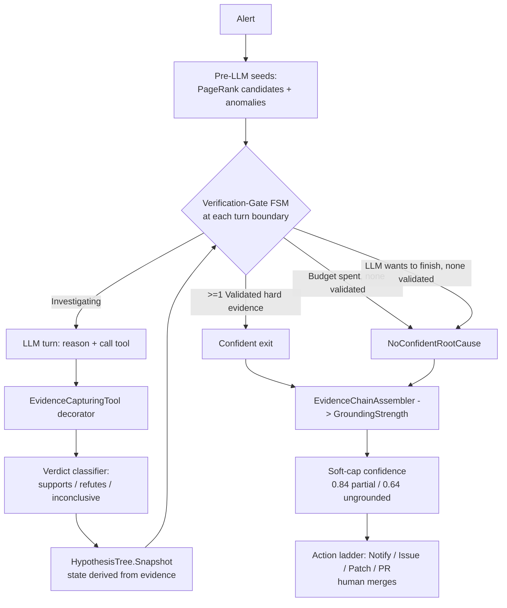
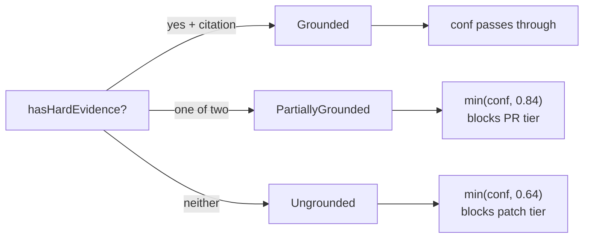

## Abstract

Large-language-model (LLM) agents that perform root-cause analysis (RCA) on production incidents fail in characteristic, well-documented ways: they self-validate conclusions that no tool ever supported, they terminate prematurely on an "I'm done" assertion, and they report high confidence in ungrounded hypotheses. This paper describes the reasoning-safety core of the BlueRobin Debug Agent — a .NET, human-in-the-loop RCA agent operating against a self-hosted homelab at a ~50 EUR/month budget — and how its design is driven directly by the MAST agentic-failure taxonomy (Cemri et al., 2025). We contribute three interlocking mechanisms. First, an *externalized deterministic verification-gate finite-state machine* (`VerificationGate`) that lives outside the model and governs loop termination, replacing `MaxTurns` as the sole stop; a "confident" exit *requires* hard tool evidence, and "no confident root cause" is a first-class outcome. Second, *evidence-derived hypothesis state with provenance* (`HypothesisModel`), in which each candidate's state in `{Validated, Invalidated, Inconclusive}` is computed from real-tool evidence whose source is never `llm-inferred`, captured through an `EvidenceCapturingTool` decorator and a negation-aware, structured-signal-first verdict classifier. Third, an *evidence-chain assembler* with a *grounding-based confidence soft-cap* (`CapPartial = 0.84`, `CapUngrounded = 0.64`) that bounds the LLM's self-rated confidence below the action tiers (issue 0.40 / patch 0.65 / PR 0.85), so an ungrounded conclusion can never reach the pull-request tier. Nothing auto-remediates. We position this work honestly: it is a systems and engineering-discipline contribution, not an empirical breakthrough, and we discuss its threats to validity at length.

## Introduction

A root-cause-analysis agent receives an alert ("Authelia OIDC returning 500s after an LLDAP schema change") and must localize the failing component, explain why, and propose a fix. The naive approach — hand the alert text to a frontier model and ask for the root cause — fails for a structural reason: the model has no access to the live system, so it pattern-matches the alert against its training distribution and emits a plausible-sounding hypothesis with no grounding in the actual incident. The agentic correction is to give the model tools (query traces, tail logs, read deploy history) and let it reason-act-observe in a loop (ReAct; Yao et al., 2022; arXiv:2210.03629). But the agentic loop introduces its *own* failure modes.

The MAST taxonomy (Multi-Agent System Failure Taxonomy; Cemri et al., 2025), derived by IBM and Berkeley from 310 ITBench traces, quantifies them: the dominant failures are **incorrect self-verification, premature termination, memory loss, and reasoning-action mismatch**, together accounting for roughly 94% of observed failures. Translated into design rules: *never let the LLM grade its own homework*; *require hard tool evidence before exit*; *enforce termination via a finite-state machine outside the model*; and *make ambiguity a first-class branch*. These are not abstractions for us — they are the literal contract comments in the BlueRobin Debug Agent source.

The honest ceiling for autonomous RCA is low. The best agent on OpenRCA (Xu et al., ICLR 2025) reaches ~11.3% exact-match; the best frontier model on IBM ITBench-AA (2026) reaches ~47% precision-at-full-recall. An advisory, human-in-the-loop posture is therefore *the state of the art*, not a concession. A human always merges in BlueRobin; the agent's job is to produce a well-grounded, auditable hypothesis and let the operator decide.

This paper's contributions are:

- **An externalized verification-gate FSM** (`VerificationGate.Evaluate`) wired into the agentic loop's stop-criteria seam, with a four-clause precedence that makes a "confident" exit conditional on validated hard evidence and makes "no confident root cause" a deliberate, surfaced outcome.
- **Evidence-derived hypothesis state with provenance**, in which `HypothesisState` is *computed* from a list of `ToolEvidence` records — never asserted by the model — with `llm-inferred` evidence structurally barred from validating any hypothesis, captured via an `EvidenceCapturingTool` decorator and a negation-aware verdict classifier that prevents a healthy result from ever falsely "supporting" a fault hypothesis.
- **A grounding-based confidence soft-cap**, in which a pure, no-LLM evidence-chain assembler derives a `GroundingStrength` and a cap function bounds the LLM's self-rated confidence below the action tiers when grounding is thin — an eval-gated guardrail against agentic over-confidence.
- **A demonstration that all of this runs within a ~50 EUR/month homelab budget**, with model egress through a single Cloudflare AI Gateway and no GPU, no causal-discovery dependency, and no managed RCA service.

All three mechanisms are required by the BlueRobin requirements framework under **FEAT-027** (the Stack-Graph RCA methodology) and its increment-2 / increment-5 / increment-7 requirement IDs, cited in the Method and Implementation sections.

## Related Work

**Agent reasoning patterns.** ReAct (Yao et al., 2022; arXiv:2210.03629) established the interleaved reason-act-observe tool loop that underpins HolmesGPT, Datadog Bits AI SRE, Grafana Assistant, and the BlueRobin loop. Reflexion (Shinn et al., 2023; arXiv:2303.11366) adds verbal self-reflection into a buffer to turn a closed episode into a durable lesson. Generative Agents (Park et al., UIST 2023) introduced the recency + importance + relevance memory-retrieval triple. Crucially for this paper, none of these patterns *constrain* termination or self-verification: Reflexion's self-reflection is still produced by the model, and a vanilla ReAct loop stops when the model says it is done or when `MaxTurns` is hit. That gap is exactly what MAST identifies as catastrophic.

**The MAST taxonomy and hypothesis trees.** MAST (Cemri et al., 2025; IBM + Berkeley) is the load-bearing prior work here. Its §7 lessons — externalize termination, require hard tool evidence, never self-grade, make ambiguity first-class — are implemented one-to-one by the three mechanisms below. Hypothesis-tree state machines with `validated / invalidated / inconclusive` labels are the production pattern at Datadog (Bits AI SRE) and the parallel multi-hypothesis approach at Cleric; Resolve.ai and Datadog both cite the *causing PR* as part of the evidence. BlueRobin adopts the hypothesis-tree state vocabulary but makes a stronger claim about *provenance*: state transitions are a pure function of real-tool evidence, structurally excluding model self-assertion.

**LLM agentic RCA systems.** RCACopilot (Chen et al., Microsoft, 2023; arXiv:2305.15778) is retrieval-augmented root-cause-*category* prediction, reporting accuracy up to 0.766 and >4 years in production across >30 teams — the strongest "this pattern deploys" evidence in the literature. A 2026 cautionary study (arXiv:2601.22208) documents LLM "stalled / biased / confused" reasoning failures in cloud RCA, motivating exactly the kind of deterministic guardrails we describe. Surveys (arXiv:2408.00803) conclude that LLM-only RCA "lacks structural grounding [and] risks hallucinated / unsafe suggestions."

**Benchmarks.** OpenRCA (ICLR 2025) — 335 cases over three enterprise systems, exact time+component+reason match — yields the most honest "how bad are LLMs at RCA" number at ~11.3%. IBM ITBench (Jha et al., 2025; arXiv:2502.05352) reports 13.8% SRE-resolve with GPT-4o + CrewAI over a live Kubernetes Astronomy deployment and a localization MTTR of 282s; ITBench-AA (2026) reports all frontier models below 50% precision-at-full-recall. A 2025 critique (arXiv:2510.04711) argues current RCA benchmarks are *oversimplified* and that published scores overstate real capability — a caveat we apply unsparingly to our own evaluation. These numbers are why BlueRobin is advisory by design, and why the contributions here are about *reasoning safety and auditability*, not about beating a benchmark.

## Method / Architecture

The reasoning-safety core sits inside a bounded ReAct loop (`AgenticChatLoop` in the reusable `Archives.Agents.Kernel`) that calls an Anthropic model over the Cloudflare AI Gateway, dispatches in-process tools (Tempo traces, Loki logs, Prometheus, Kubernetes/Flux state, NATS, GitHub commits, code search, and a `query_stack_graph` tool), and truncates and PHI-redacts every tool result before it re-enters the context. The three mechanisms below bolt onto that loop through three seams: a `StopCriteria` callback, an `EvidenceCapturingTool` decorator around every tool, and a post-conclusion evidence-chain projection.



### 1. The externalized verification-gate FSM

The gate is a pure, dependency-free static function — `VerificationGate.Evaluate` — that the loop consults at every turn boundary and at the voluntary-final boundary. Its file header is explicit about lineage and intent: *"a DETERMINISTIC code FSM, OUTSIDE the LLM, that governs loop exit — replacing MaxTurns=10 as the SOLE stop (MAST §7: 'enforce termination via an FSM outside the model')."* It cites `FEAT-027, FR-SG-31, NFR-SG-8, NFR-SG-2, ADR-037`.

The FSM has four states — `Investigating`, `EvidenceSufficient`, `BudgetExhausted`, `NoConfidentRootCause` — and emits one of three exit classifications — `None`, `Confident`, `NoConfidentRootCause`. The decision precedence is fixed (no degrees of freedom):

```csharp
public static GateDecision Evaluate(
    HypothesisTree? tree, bool llmWantsToFinish, int turnsUsed, TimeSpan elapsed, GateBudget budget)
{
    var validatedCount = tree?.Validated.Count ?? 0;   // fail-open: null tree => 0 (NFR-SG-2)

    if (validatedCount > 0)
        // >=1 hard-evidence hypothesis => Confident, EVEN at budget end.
        return new(GateState.EvidenceSufficient, GateExit.Confident, validatedCount, tree!.RootCauseRef, false);

    if (turnsUsed >= budget.MaxTurns || elapsed >= budget.WallClock)
        // budget spent, none validated => no-confident (MAST: terminate outside the model).
        return new(GateState.BudgetExhausted, GateExit.NoConfidentRootCause, 0, null, false);

    if (llmWantsToFinish)
        // the LLM "I'm done" with nothing validated => NOT confident (the core MAST guardrail).
        return new(GateState.NoConfidentRootCause, GateExit.NoConfidentRootCause, 0, null, false);

    return new(GateState.Investigating, GateExit.None, 0, null, false);
}
```

Three properties matter. **(a)** A "confident" exit requires `validatedCount > 0`, i.e. at least one hypothesis validated by hard tool evidence; the model cannot self-terminate "confident" on an assertion alone (clause 3). **(b)** Validated evidence wins *even at budget exhaustion* (clause 1 precedes clause 2): the structural budget is a stop bound, not a suppressor of real evidence — a `RISK-1` safety property asserted in the change-induced eval incidents. **(c)** The gate is *fail-open and advisory* (`NFR-SG-2`): a null or empty hypothesis tree degrades to `NoConfidentRootCause`, never throws, and never blocks an investigation. The `AutoRemediates` field of every `GateDecision` is hard-wired `false` (`ADR-030`) — the gate concludes and notifies; it never acts.

The structural budget is `GateBudget(MaxTurns, WallClock)`, in production `MaxTurns = 10` and `WallClock = 4 min`, nested inside the overall 5-minute RCA run budget (`FEAT-008 FR-AG-2`). The gate is wired into the loop through `RcaVerificationGateBinding` against the kernel's `StopCriteria` seam, and is rolled out **shadow-first**: in shadow mode it computes and logs its decision without governing the loop; in active mode (`RcaLiveActivation.Mode = active`) it governs exit. The shadow/active flip is one of the controlled ablations in the evaluation.

### 2. Evidence-derived hypothesis state with provenance

The hypothesis tree is the agent's working set of candidate root causes, but its defining property is that *the LLM never sets a hypothesis's state*. `HypothesisModel.cs` (FEAT-027 `FR-SG-28`, `FR-SG-29`, `SEC-SG-4`, `ADR-037 D1/D2`) defines a `Hypothesis` whose `State` is *computed* from its evidence list by a private `DeriveState`:

```csharp
private static HypothesisState DeriveState(IReadOnlyList<ToolEvidence> evidence)
{
    var hasHardSupport = false;
    var hasRefute = false;
    foreach (var e in evidence)
    {
        if (e.Verdict == EvidenceVerdict.Supports && e.IsHardToolEvidence) hasHardSupport = true;
        else if (e.Verdict == EvidenceVerdict.Refutes) hasRefute = true;
    }
    if (hasHardSupport) return HypothesisState.Validated;     // HARD tool evidence decides (D3)
    if (hasRefute)      return HypothesisState.Invalidated;   // refuted, no validating support
    return HypothesisState.Inconclusive;                      // llm-only / inconclusive / none
}
```

The provenance test is a one-liner with enormous weight:

```csharp
public bool IsHardToolEvidence => Source != EdgeSource.LlmInferred;
```

A `ToolEvidence` record carries `(Tool, ResultSummary, Verdict, Source, EvaluatedAtEpoch)`, where `Source` is an `EdgeSource` enum drawn from the real telemetry lanes — `Tempo`, `Loki`, `Prometheus`, `StaticInfra`, `Git`, `Synthetic` — *or* `LlmInferred`. Only a `Supports` verdict whose source is *not* `LlmInferred` can move a hypothesis to `Validated`. In the contract comment's words: *"the model 'grading its own homework' (source = llm-inferred) is NOT hard evidence."* This is the structural enforcement of the MAST "never self-verify" rule: it is impossible for the model to validate its own hypothesis by talking, because validation reads only the provenance-tagged evidence list.

Evidence enters the list through the **`EvidenceCapturingTool` decorator** (`HypothesisEvidenceCapture.cs`), which wraps every `IAgentTool`. On each tool call it runs the raw result through a classifier (`ToolHypothesisEvidenceClassifier`), determines which seeded suspect the result bears on, assigns a verdict, tags the provenance source as the real tool (never `llm-inferred`), recon-strips the summary to a bounded single line (≤280 chars, `SEC-SG-4` / `RISK-3` — never raw log lines or pod names), and records it into a `HypothesisEvidenceSink`. The sink explicitly rejects model self-assertion at the door: `if (evidence.Source == EdgeSource.LlmInferred) return;`. Each `Snapshot()` rebuilds an immutable `HypothesisTree` whose `Conclusion` is `Validated` iff at least one hypothesis cleared the hard-evidence bar, else the first-class `NoConfidentRootCause`.

The **verdict classifier** is *negation-aware and structured-signal-first* (`ToolEvidenceVerdict`, FEAT-027 increment-7 `FR-SG-61`). This closes a specific MAST false-positive class: a *healthy* tool result (`error_rate: 0.00`, "no errors", "0 timeouts") must never be classified as `Supports` for a fault hypothesis. The classifier reads structured numeric signals first and is aware of negations in free text, so a clean health check can only ever `Refute` or be `Inconclusive`, never falsely validate. The first-class `NoConfidentRootCause` outcome maps, in `RcaOutcomeMapper.Map`, into the sub-0.40 `Notify` tier — a *deliberate* surfaced result distinct from a generic low-confidence fallback, writing no `ROOT_CAUSED_BY` edge and forcing no hypothesis.

### 3. Evidence-chain assembly and grounding-based confidence soft-cap

The model still emits a self-rated confidence scalar in `[0,1]`. Left unbounded, that scalar drives an action ladder — issue at 0.40, code patches at 0.65, an opened pull request at 0.85 — so an over-confident, thinly-grounded conclusion could escalate to a PR. The third mechanism (FEAT-027 increment-5, `FR-SG-41`, `FR-SG-43`, `ADR-041`) prevents that.

At conclusion, `EvidenceChainAssembler.Assemble` runs a **pure, no-LLM projection** over all prior signals and builds an auditable chain comprising: the graph path to the winning suspect; the *validating hard tool evidence* (`IsHardToolEvidence && Verdict == Supports` only); the onset-window Deploy/Change *citation* (the causing PR — `commit_sha` or `pr_number`, nearest-to-onset, "no guessing" if none); and the ranking sub-scores. From two booleans — *does a validating hard evidence item exist?* and *does a change citation exist?* — it derives a `GroundingStrength`:

```csharp
private static GroundingStrength DeriveGrounding(bool hasHardEvidence, bool hasCitation) =>
    (hasHardEvidence, hasCitation) switch
    {
        (true, true)             => GroundingStrength.Grounded,
        (true, false) or (false, true) => GroundingStrength.PartiallyGrounded,
        _                        => GroundingStrength.Ungrounded,
    };
```

The **soft-cap** (`RcaEvidenceCap`) then bounds the LLM's confidence as a function of grounding:

```csharp
public const double CapPartial    = 0.84;   // just under the 0.85 PR tier
public const double CapUngrounded = 0.64;   // just under the 0.65 patch tier

public static double Effective(double llmConfidence, GroundingStrength g) => g switch
{
    GroundingStrength.Grounded          => llmConfidence,
    GroundingStrength.PartiallyGrounded => Math.Min(llmConfidence, CapPartial),
    GroundingStrength.Ungrounded        => Math.Min(llmConfidence, CapUngrounded),
};
```

The cap is a *soft* one — it only ever lowers the score, never raises it, and `Grounded` conclusions pass through uncapped. But the thresholds are chosen to bite exactly at the action tiers: an `Ungrounded` conclusion is capped at 0.64, immovably below the 0.65 patch tier, so it can never propose code; a `PartiallyGrounded` one is capped at 0.84, immovably below the 0.85 PR tier, so it can never open a pull request. The action-tier thresholds themselves (0.40 / 0.65 / 0.85) are *unchanged* across increments (`RcaOutcomeMapper`, `ADR-037 D4`); the cap operates on the input to the ladder, not the ladder. Like the gate, the cap rolls out shadow-first and is an evaluation ablation.



Together the three mechanisms enforce a single invariant: *the agent escalates only as far as its grounding warrants, and the model's word is never the grounding.*

## Implementation

The agent is a .NET 10 FastEndpoints service. The reasoning-safety types described above are pure and dependency-free — `VerificationGate`, `HypothesisModel`, `EvidenceChainAssembler`, and `RcaEvidenceCap` have no I/O — which makes them exhaustively unit-testable and keeps the MAST guardrails out of the model's reach by construction. They are governed by **FEAT-027** and specifically by `FR-SG-28` / `FR-SG-29` (hypothesis tree + first-class "no confident root cause"), `FR-SG-31` (externalized verification-gate FSM), `FR-SG-41` / `FR-SG-43` (evidence chain + confidence derivation), `FR-SG-61` (negation-aware verdict classifier), `NFR-SG-8` (gate latency budget), `SEC-SG-7` (the PHI-egress guard that redacts every prompt and tool result before model egress), and the design ADRs `ADR-037` and `ADR-041`.

**Graph and vector substrate.** The hypothesis tree is persisted to a `bluerobin_stack` graph in FalkorDB (Redis wire protocol) as `Hypothesis` nodes with `EVIDENCED_BY` edges carrying the tool, verdict, and one-line summary; a validated hypothesis writes the single `ROOT_CAUSED_BY` edge. Code retrieval and incident-memory recall use Qdrant via gRPC; embeddings are produced locally by in-cluster Ollama, so embedding traffic never transits the paid edge. The stack-graph also seeds the loop before any model call — a personalized-PageRank blame-propagation pass over the error-weighted runtime dependency graph proposes ranked candidates, which become the *seeds* the hypothesis tree is built around (the subject of the second paper in this series).

**Model egress and cost.** All LLM calls go through a single Cloudflare AI Gateway (OpenAI-compatible, BYOK), which meters per-service spend and fails over on 402/429; a CI guardrail (`egress-guardrail.yml`) forbids direct provider FQDNs so egress stays Cloudflare-only. The cost angle is the headline systems claim: the entire stack — graph world-model, the three reasoning-safety mechanisms, temporal incident memory, and the eval harness — runs within a **~50 EUR/month** platform ceiling, of which the **LLM budget is a hard 20 EUR/month** (`COST-7`). A single Hetzner CX43 (~17.5 EUR/month), Cloudflare's free tiers (R2, Tunnel, WAF), and local Ollama embeddings carry the rest. At 100% of the LLM budget the agent fail-closes rather than overspend. There is no GPU, no managed RCA service, and — deliberately — no causal-discovery dependency (PC/FCI/Granger are rejected on both cost and accuracy grounds), so the reasoning-safety machinery is the *only* moving part standing between an alert and an over-confident PR.

**Telemetry.** The gate emits an `OBS-SG-4` gate-outcome metric (`confident` / `no_confident`) and a verification-gate span per evaluation; token usage is metered per turn into `debug_agent.llm_tokens_total{role,model}` and priced into a per-RCA euro cost, so the budget constraint is observable, not merely aspirational.

## Evaluation

The agent ships with a deterministic .NET eval harness (`RcaEvalHarness`) that replays a labelled ground-truth incident set through the *real* RCA path and emits an AC@1 (accuracy-at-1, top-1 localization) and MTTR scorecard. **We state the limitations of this benchmark before its results, because they are severe and the authors themselves flag the set as an "oversimplified benchmark."**

The dataset is **9 self-seeded labelled incidents** (`ground-truth-incidents.json`), drawn from the existing synthetic-test family and past replayed incidents — *not* injected with ChaosMesh — spanning three fault classes (auth/login, data/datastore, deploy/config). Two are change-induced (a bad deploy to `archives-api`, a bad commit to `bluerobin-web`). AC@1 is an exact-string oracle: the produced top-1 candidate natural key versus the labelled expected root cause. MTTR here is a **replay-clock proxy** — the wall-clock from onset-replay-start to the pipeline returning its conclusion — measured in *sub-second* values, and is explicitly *not* production MTTR.

The harness has two arms. The *scorer-only* arm plants the labelled cause as an unambiguous top-1, so AC@1 = 1.0 by construction — it is a **regression sentinel, not an accuracy measurement**. The *live-path* arm (`ReplayLivePathAsync`) injects distractor candidates (higher topology criticality, lower error rate — a deliberate topology trap) so that AC@1 < 1.0 is *achievable*; this is the honest production-path arm.

| Arm | What it measures | AC@1 | MTTR (replay-clock proxy) | Notes |
|---|---|---|---|---|
| Scorer-only (`scorecard-baseline.json`) | Regression sentinel | 1.0 (by construction) | ~0.0017 s aggregate | Not an accuracy figure |
| Live-path (`scorecard-live-path-baseline.json`) | Honest production-path localization | 1.0 (all 9, with distractors) | ~0.0032 s aggregate | Distractors injected; AC@1 < 1.0 is achievable but not observed on this small set |
| Per-commit regression gate | No-regression tolerance | drop ≤ 0.02 | increase ≤ 30 s | Fails any candidate below AC@1 0.98 or +30 s MTTR |

The reasoning-safety mechanisms are evaluated as **shadow-vs-active ablations**, each proving *no regression* against the committed baseline when the mechanism is activated, and *byte-for-byte collapse* to baseline when it is shadowed (the "feature off" control):

| Ablation | Mechanism flipped | Flag | Result |
|---|---|---|---|
| Verification gate + BARO | `VerificationGate` governs exit | `RcaLiveActivation.Mode` | No AC@1 regression; onset true-positives (GT-03, GT-07) preserved |
| Confidence soft-cap | `RcaEvidenceCap` bounds confidence | `RcaEvidenceCap.Mode` | No AC@1 regression; shadow collapses to baseline |
| Incident-memory recall | Recall fed into the LLM frame | `RcaMemory.Mode` | No AC@1 regression; shadow collapses to baseline |

The honest reading: on this 9-incident set the localization arm is saturated at AC@1 = 1.0, which tells us only that the ranking path and the reasoning-safety overlay *do not regress* a benchmark that is too easy to discriminate them. The benchmark's value is as a **per-commit safety net** — it provably prevents a change from silently degrading localization or from suppressing a known change-induced true positive — not as a measure of real-world accuracy. The verification gate and confidence cap are, properly speaking, *not measured by AC@1 at all*: their function is to bound over-confidence and termination behavior, which AC@1 does not score. Their correctness is established by exhaustive unit assertions over the pure FSM and cap functions (e.g. "a clean `error_rate: 0.00` result can never validate a hypothesis"; "an ungrounded conclusion is capped below 0.65"), not by a localization number.

## Limitations & Threats to Validity

We are deliberately explicit here.

- **The benchmark is oversimplified and self-seeded.** Nine labelled incidents, hand-seeded from existing faults, with the labelled cause planted as a strong top-1 (scorer arm) or top-1 among injected distractors (live arm). AC@1 = 1.0 is *not* a real-world accuracy claim; it is a saturated regression sentinel. This matches the broader critique that current RCA benchmarks overstate capability (arXiv:2510.04711).
- **MTTR figures are replay-clock proxies, sub-second, and not production MTTR.** They measure pipeline compute latency on a seeded graph, not human-observed time-to-recovery. Real lifecycle KPIs (MTTD/MTTA/MTTR p50/p95) are computed from live incident data by a separate endpoint, but no production values are committed in the repository, and the corresponding SLO targets are deliberately left unset pending real data.
- **The reasoning-safety mechanisms are not scored by the localization benchmark.** The verification gate, the evidence-provenance rule, and the confidence cap are validated by unit assertions over pure functions, not by an end-to-end accuracy metric. We have strong evidence that they behave *as specified*, and no large-scale evidence that they improve *real RCA outcomes*. A proper evaluation would require a fault-injection corpus with confidence and termination labels, which we do not have.
- **The verdict classifier is heuristic.** The negation-aware, structured-signal-first classifier closes a specific MAST false-positive class on the tool outputs we have seen, but it is not a learned model and could mis-classify novel tool-output formats. Its conservatism (default to `Inconclusive`) is a safety bias, not a guarantee.
- **The system is advisory by design, and we present that as a strength.** A human always merges; the agent never auto-remediates (`AutoRemediates` is hard-`false`). Given autonomous ceilings of ~11% (OpenRCA) and ~47% (ITBench-AA), this is the state of the art rather than a compromise — but it does mean the contributions here are about *making the human's decision well-grounded and auditable*, not about autonomy.
- **Scale.** This is a homelab platform of roughly a dozen services. The mechanisms are designed to be substrate-agnostic, but we have not validated them on a large microservice estate, and the personalized-PageRank seeding that feeds the hypothesis tree is small-graph-friendly.

## Conclusion

The failure modes that wreck LLM RCA agents are not subtle — incorrect self-verification, premature termination, ungrounded over-confidence — and they have been catalogued (MAST) and re-confirmed in cautionary studies. The BlueRobin Debug Agent's response is to take those modes off the table *deterministically and outside the model*: an externalized verification-gate FSM that makes "confident" conditional on hard tool evidence and makes "no confident root cause" first-class; hypothesis state derived purely from provenance-tagged real-tool evidence, with the model structurally barred from grading its own homework; and a grounding-based soft-cap that pins an ungrounded or thinly-grounded conclusion below the action tiers that would let it propose code or open a PR. None of this is an empirical breakthrough — the localization benchmark is admittedly oversimplified and the system is advisory by design — but it is a coherent, auditable, and *reproducible* engineering discipline for building a reasoning-safe RCA agent, and it runs in its entirety inside a ~50 EUR/month homelab budget. The contribution is the architecture and the discipline: in agentic RCA, the safe move is to assume the model will, given the chance, grade its own homework — and to build the grader somewhere it can't reach.

## References

1. Cemri, M., et al. (2025). *Why Do Multi-Agent LLM Systems Fail?* (MAST: Multi-Agent System Failure Taxonomy; IBM + Berkeley, 310 ITBench traces). https://huggingface.co/blog/ibm-research/itbenchandmast
2. Yao, S., et al. (2022). *ReAct: Synergizing Reasoning and Acting in Language Models.* arXiv:2210.03629. https://arxiv.org/abs/2210.03629
3. Shinn, N., et al. (2023). *Reflexion: Language Agents with Verbal Reinforcement Learning.* NeurIPS 2023. arXiv:2303.11366. https://arxiv.org/abs/2303.11366
4. Park, J. S., et al. (2023). *Generative Agents: Interactive Simulacra of Human Behavior.* UIST 2023. arXiv:2304.03442. https://arxiv.org/abs/2304.03442
5. Chen, Y., et al. (2023). *Automatic Root Cause Analysis via Large Language Models for Cloud Incidents* (RCACopilot). arXiv:2305.15778. https://arxiv.org/abs/2305.15778
6. Anonymous (2026). *Cautionary study of LLM "stalled / biased / confused" reasoning failures in cloud RCA.* arXiv:2601.22208. https://arxiv.org/abs/2601.22208
7. Xu, J., et al. (2025). *OpenRCA: Can Large Language Models Locate the Root Cause of Software Failures?* ICLR 2025. https://openreview.net/pdf?id=M4qNIzQYpd · https://github.com/microsoft/OpenRCA
8. Jha, S., et al. (2025). *ITBench: A Benchmark for Evaluating AI Agents on SRE, FinOps, and CISO Tasks.* arXiv:2502.05352. https://arxiv.org/abs/2502.05352 · https://github.com/itbench-hub/ITBench
9. Artificial Analysis × IBM (2026). *ITBench-AA: SRE Root-Cause-Analysis leaderboard (precision-at-full-recall).* https://huggingface.co/blog/ibm-research/itbench-aa
10. Pham, L., et al. (2024). *BARO: Robust Root Cause Analysis of Microservices via Multivariate Bayesian Online Change-Point Detection.* FSE 2024. arXiv:2405.09330. https://arxiv.org/abs/2405.09330
11. Pham, L., et al. (2024). *RCAEval: A Benchmark for Root Cause Analysis of Microservice Systems.* arXiv:2412.17015. https://arxiv.org/abs/2412.17015
12. *Comprehensive Survey on Root Cause Analysis in (Micro)Service Systems.* arXiv:2408.00803. https://arxiv.org/abs/2408.00803
13. *Rethinking the Evaluation of Root Cause Analysis: A Fault-Propagation-Aware Benchmark.* (2025). arXiv:2510.04711. https://arxiv.org/abs/2510.04711
14. *Simple Is Effective: The Roles of Graphs and Large Language Models in Knowledge-Graph-Based RAG* (template triple-to-NL serialization). arXiv:2410.20724. https://arxiv.org/abs/2410.20724
