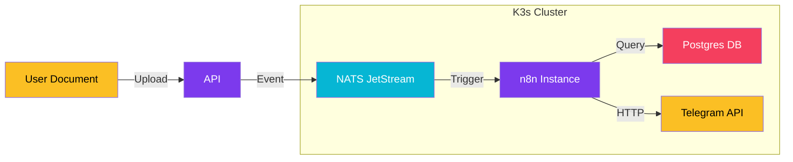

import Callout from '@components/Callout.astro';
import ImplementationNote from '@components/ImplementationNote.astro';
import CodeFile from '@components/CodeFile.astro';
import ExternalCite from '@components/ExternalCite.astro';

## Introduction

In any complex system, there are always "glue" tasks—simple logic that connects two distinct services. Writing dedicated C# microservices for every simple integration (like "send an email when X happens") is overkill. It adds boilerplate, build time, and maintenance overhead. This is where **n8n**, a workflow automation tool, fits perfectly into our Kubernetes stack.

**Why Automation Matters:**

- **Velocity**: Create integrations in minutes, not hours.
- **Visibility**: Visual workflows make business logic easy to understand for non-developers.
- **Maintenance**: No compilation pipelines for simple script-like tasks.

### What We'll Build

In this guide, we will explore how we host n8n on Kubernetes and use it to build a real-world workflow: **Sending a Telegram notification when a new document is uploaded to BlueRobin.**

1. **Deploy n8n**: Hosting it self-hosted on K3s with Helm.
2. **Connect Data**: Integrating with our internal Postgres and NATS.
3. **Build the Flow**: A visual guide to the automation.

## Architecture Overview

n8n sits inside our cluster, accessing internal services via ClusterIP, while exposing its UI securely via Traefik.



## Section 1: Deploying n8n on Kubernetes

We deploy n8n using its official Helm chart, managed via Flux CD. The critical part is ensuring persistence for the workflow data and securing the webhook endpoints.

<Callout type="info" title="Environment Variables">
    We inject secrets (like DB credentials and encryption keys) using `ExternalSecrets`, mapping them from Infisical directly into the n8n container as environment variables.
</Callout>

```yaml
# Simplified Helm Release
apiVersion: helm.toolkit.fluxcd.io/v2beta1
kind: HelmRelease
metadata:
  name: n8n
  namespace: automation
spec:
  values:
    persistence:
      enabled: true
      storageClass: "truenas-iscsi" # Reliable storage for SQLite/config
    env:
      DB_TYPE: postgresdb
      DB_POSTGRESDB_HOST: postgres-rw.data-layer.svc.cluster.local
      N8N_ENCRYPTION_KEY: "..."
```

## Section 2: The "Document Uploaded" Workflow

Our primary use case is notifying the admin team when a new PDF is ingested.

1.  **Trigger**: While n8n has a NATS trigger, we sometimes use a simpler Webhook approach or check the database. For real-time updates, we are experimenting with the NATS trigger node.
2.  **Filter**: We check metadata from the update. Is the document valuable? Is it from a priority source?
3.  **Action**: We use the Telegram node to dispatch a message.

### Accessing Internal Data
Because n8n runs inside the cluster, it can talk directly to `postgres-rw.data-layer.svc.cluster.local`. This allows us to run SQL queries in the workflow to enrich notifications with data that isn't in the event payload (e.g., getting the user's full name based on the UserID).

## Section 3: Customizing with Function Nodes

When the drag-and-drop nodes aren't enough, n8n's "Code" node allows us to write JavaScript. We use this to format complex Telegram messages.

```javascript
// Example: Creating a clickable link for the message
const docId = items[0].json.documentId;
const title = items[0].json.title;
return {
  json: {
    message: `📄 *New Document Processed*\n\nTitle: ${title}\n[View in BlueRobin](https://app.bluerobin.local/documents/${docId})`
  }
};
```

## Conclusion

n8n has become an indispensable utility knife in our DevOps toolkit. By self-hosting it on Kubernetes, we get the power of tools like Zapier without the cost or data privacy concerns. It bridges the gap between our rigid backend services and the flexible, changing needs of our operations.

**Next Steps**:
- Learn how we built a [dedicated Telegram Bot](/blog/telegram-bot-integration-dotnet-guide) for more complex interactions.
- Review our [Homelab Infrastructure](/blog/architecture-decision-cloud-to-homelab).
