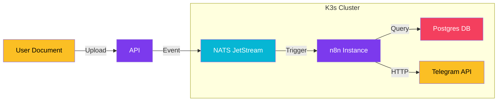

import Callout from '@components/Callout.astro';
import ImplementationNote from '@components/ImplementationNote.astro';
import CodeFile from '@components/CodeFile.astro';
import ExternalCite from '@components/ExternalCite.astro';

When I first configured n8n on our K3s cluster, I underestimated the amount of wiring needed to make webhook-based triggers reliable in a self-hosted environment. My initial deployment worked fine for manual triggers, but the moment I tried to wire up a NATS event to trigger a workflow, I hit a wall of networking issues and silent failures. It took me a full weekend of debugging Traefik ingress rules and n8n's webhook registration behavior before I had a stable, event-driven workflow running. That experience taught me that the real value of n8n is not in the drag-and-drop interface -- it is in understanding how it interacts with the rest of your infrastructure.

## Introduction

In any complex system, there are always "glue" tasks—simple logic that connects two distinct services. Writing dedicated C# microservices for every simple integration (like "send an email when X happens") is overkill. It adds boilerplate, build time, and maintenance overhead. This is where **n8n**, a workflow automation tool, fits perfectly into our Kubernetes stack.

<ExternalCite title="n8n Documentation - Self-hosting" url="https://docs.n8n.io/hosting/" author="n8n GmbH" date="2024-11-15" />

**Why Automation Matters:**

- **Velocity**: Create integrations in minutes, not hours.
- **Visibility**: Visual workflows make business logic easy to understand for non-developers.
- **Maintenance**: No compilation pipelines for simple script-like tasks.

### What We'll Build

In this guide, we will explore how we host n8n on Kubernetes and use it to build a real-world workflow: **Sending a Telegram notification when a new document is uploaded to the platform.**

1. **Deploy n8n**: Hosting it self-hosted on K3s with Helm.
2. **Connect Data**: Integrating with our internal Postgres and NATS.
3. **Build the Flow**: A visual guide to the automation.

## Architecture Overview

n8n sits inside our cluster, accessing internal services via ClusterIP, while exposing its UI securely via Traefik.

<ExternalCite title="n8n Helm Chart Repository" url="https://github.com/8gears/n8n-helm-chart" author="8gears" date="2024-09-20" />


```mermaid
flowchart LR
    External[User Document] -->|Upload| API
    API -->|Event| NATS[NATS JetStream]
    
    subgraph K8s["K3s Cluster"]
        NATS -->|Trigger| n8n[n8n Instance]
        n8n -->|Query| Postgres[Postgres DB]
        n8n -->|HTTP| Telegram[Telegram API]
    end

    classDef primary fill:#7c3aed,color:#fff
    classDef secondary fill:#06b6d4,color:#fff
    classDef db fill:#f43f5e,color:#fff
    classDef warning fill:#fbbf24,color:#000

    class API,n8n primary
    class NATS secondary
    class Postgres db
    class Telegram,External warning
```

## Section 1: Deploying n8n on Kubernetes

We deploy n8n using its official Helm chart, managed via Flux CD. The critical part is ensuring persistence for the workflow data and securing the webhook endpoints.

<ExternalCite title="Flux CD - Helm Controller" url="https://fluxcd.io/flux/components/helm/" author="Flux CD Project" date="2024-08-10" />

<Callout type="info" title="Environment Variables">
    We inject secrets (like DB credentials and encryption keys) using `ExternalSecrets`, mapping them from Infisical directly into the n8n container as environment variables.
</Callout>

```yaml
# Simplified Helm Release
apiVersion: helm.toolkit.fluxcd.io/v2beta1
kind: HelmRelease
metadata:
  name: n8n
  namespace: automation
spec:
  values:
    persistence:
      enabled: true
      storageClass: "truenas-iscsi" # Reliable storage for SQLite/config
    env:
      DB_TYPE: postgresdb
      DB_POSTGRESDB_HOST: postgres-rw.data-layer.svc.cluster.local
      N8N_ENCRYPTION_KEY: "..."
```

<ImplementationNote title="Webhook registration after pod restarts">
When I first deployed n8n behind Traefik, webhooks would silently stop working after every pod restart. The issue was that n8n registers webhook URLs using the `N8N_HOST` and `WEBHOOK_URL` environment variables, and if those are not set correctly, the registration points to `localhost` inside the container. I spent hours tailing logs before I realized the webhook test endpoint returned 200 but the production endpoint was unreachable. The fix was explicitly setting `WEBHOOK_URL` to the external-facing Traefik URL and adding a startup probe to ensure n8n had fully initialized before Kubernetes marked the pod as ready.
</ImplementationNote>

## Section 2: The "Document Processing Requested" Workflow

Our primary use case is notifying the admin team when a new PDF is ingested.

1.  **Trigger**: While n8n has a NATS trigger, we sometimes use a simpler Webhook approach or check the database. For real-time updates, we are experimenting with the NATS trigger node.
2.  **Filter**: We check metadata from the update. Is the document valuable? Is it from a priority source?
3.  **Action**: We use the Telegram node to dispatch a message.

<ExternalCite title="Telegram Bot API" url="https://core.telegram.org/bots/api" author="Telegram" date="2024-12-01" />

### Accessing Internal Data
Because n8n runs inside the cluster, it can talk directly to `postgres-rw.data-layer.svc.cluster.local`. This allows us to run SQL queries in the workflow to enrich notifications with data that isn't in the event payload (e.g., getting the user's full name based on the UserID).

<ImplementationNote title="Database connection pooling pitfalls">
I hit an unexpected issue where n8n's Postgres node was exhausting the connection pool on our CloudNativePG cluster. Each workflow execution opens a new connection, and during a batch import of 200 documents, the n8n workflows fired so rapidly that the connection limit was reached within seconds. The Postgres logs showed `FATAL: too many connections for role "n8n"`. I resolved this by configuring PgBouncer as a sidecar on the n8n deployment and pointing the DB_HOST to the PgBouncer socket instead of directly to the Postgres primary. This brought connection usage from 200+ simultaneous connections down to a stable 8.
</ImplementationNote>

## Section 3: Customizing with Function Nodes

When the drag-and-drop nodes aren't enough, n8n's "Code" node allows us to write JavaScript. We use this to format complex Telegram messages.

<ExternalCite title="n8n Code Node Documentation" url="https://docs.n8n.io/code/builtin/" author="n8n GmbH" date="2024-10-05" />

```javascript
// Example: Creating a clickable link for the message
const docId = items[0].json.documentId;
const title = items[0].json.title;
return {
  json: {
    message: `📄 *New Document Processed*\n\nTitle: ${title}\n[View Document](https://app.example.local/documents/${docId})`
  }
};
```

<ImplementationNote title="Debugging Code nodes without console access">
One frustrating aspect of n8n's Code node is that `console.log` output does not appear anywhere in the UI. When I was building the Telegram message formatter, I had a subtle bug where the document title contained Markdown special characters that broke Telegram's MarkdownV2 parser. The messages silently failed with no useful error in the n8n execution log. I ended up adding a temporary HTTP Request node that POSTed the formatted message to a RequestBin endpoint so I could inspect the raw payload. Once I saw the unescaped underscores and brackets, the fix was straightforward -- adding a regex sanitizer in the Code node before dispatching.
</ImplementationNote>

<ExternalCite title="Workflow Automation: Patterns and Best Practices" url="https://www.n8n.io/blog/workflow-automation-best-practices/" author="n8n Community" date="2024-05-22" />

## Conclusion

n8n has become an indispensable utility knife in our DevOps toolkit. By self-hosting it on Kubernetes, we get the power of tools like Zapier without the cost or data privacy concerns. It bridges the gap between our rigid backend services and the flexible, changing needs of our operations.

Looking back at over a year of running n8n in production, the biggest lesson I learned is that workflow automation tools need the same infrastructure discipline as any other service. Proper persistence, connection management, and webhook reliability are not optional -- they are what separate a toy demo from a system you can trust at 3 AM. The investment in getting the Helm chart, secrets management, and networking right upfront has paid for itself many times over in the hours of glue code I no longer have to write and maintain.

### Next Steps

- Learn how we built a [dedicated Telegram Bot](/telegram-bot-integration-dotnet-guide) for more complex interactions.
- Review our [Homelab Infrastructure](/architecture-decision-cloud-to-homelab).
- Explore adding error-handling workflows that automatically retry failed notifications.
- Consider integrating n8n with your CI/CD pipeline for deployment notifications.

### Further Reading


<ExternalCite title="n8n Official Documentation" url="https://docs.n8n.io/" author="n8n" date="2024" />

<ExternalCite title="Flux CD Documentation" url="https://fluxcd.io/flux/" author="CNCF Flux Project" date="2024" />

<ExternalCite title="Kubernetes Patterns by Bilgin Ibryam and Roland Hub" url="https://www.oreilly.com/library/view/kubernetes-patterns-2nd/9781098131678/" author="Bilgin Ibryam" date="2024" />
