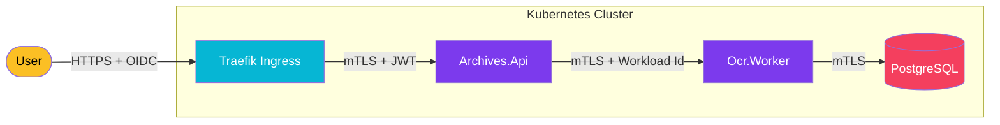

import Callout from '@components/Callout.astro';
import ImplementationNote from '@components/ImplementationNote.astro';
import CodeFile from '@components/CodeFile.astro';
import ExternalCite from '@components/ExternalCite.astro';

## Introduction

In traditional perimeter-based security, once a service is inside the cluster, it's often trusted by default. This "hard shell, soft center" approach is insufficient for modern distributed systems. **Zero Trust** flips this model: "Never Trust, Always Verify." Every request, whether from outside or inside the cluster, must be authenticated, authorized, and encrypted.

**Why Zero Trust Matters:**

- **Defense in Depth**: Prevents lateral movement if a single container is compromised.
- **Identity-Aware**: Access is based on *who* needs access (service or user), not network location (IP address).
- **Compliance**: Meets strict regulatory requirements for encryption in transit and access auditing.

### What We'll Build

In this guide, we will implement a comprehensive Zero Trust architecture for BlueRobin. You will learn how to:

1. **Enforce mTLS**: Use Linkerd Service Mesh to transparently encrypt all traffic between microservices.
2. **Propagate Identity**: Pass OIDC tokens from the Gateway (Traefik/Authelia) down to deep internal services.
3. **Workload Identity**: Map Kubernetes ServiceAccounts to identities to restrict which services can talk to each other.

## Architecture Overview

We utilize a multi-layered security model. Linkerd handles the transport security (mTLS), while our application logic handles user identity via JWTs.



## Section 1: Mutual TLS (mTLS) with Linkerd

The foundation of our Zero Trust architecture is encryption in transit. Managing certificates manually for every microservice is operationally impossible. We use **Linkerd**, a lightweight service mesh, to handle this automatically.

<Callout type="info" title="Why Linkerd?">
    We chose Linkerd over Istio for its simplicity and performance ("sidecar-less" options or ultra-light sidecars). It rotates certificates every 24 hours automatically.
</Callout>

### Installation & meshing

First, we ensure Linkerd is installed and verify the trust anchor.

```bash
linkerd check --pre
linkerd install | kubectl apply -f -
linkerd check
```

To enable mTLS for our `archives-api`, we simply add the annotation to our Deployment or Namespace. Evey pod then gets a proxy sidecar injected.

```yaml
# deployment.yaml
apiVersion: apps/v1
kind: Deployment
metadata:
  name: archives-api
  namespace: data-layer
  annotations:
    linkerd.io/inject: enabled
spec:
  # ... standard spec
```

Once applied, `linkerd tap` reveals that traffic is effectively `tls=true`.

## Section 2: Identity Propagation (OIDC)

Encryption secures the *channel*, but who is the *caller*? We need to propagate the User's Identity (from Authelia) through the entire call chain.

When a request hits `Archives.Api`, it contains an `Authorization: Bearer <token>` header. If `Archives.Api` needs to call `Qdrant` or another internal service on behalf of that user, it must forward this context.

### .NET Implementation

We use a custom `DelegatingHandler` in our HTTP clients to forward the token automatically.

<ImplementationNote title="Token Forwarding">
    Never blindly forward headers. Ensure you only forward tokens to trusted internal downstream services to avoid leaking credentials.
</ImplementationNote>

```csharp
// TokenPropagationHandler.cs
public class TokenPropagationHandler : DelegatingHandler
{
    private readonly IHttpContextAccessor _contextAccessor;

    public TokenPropagationHandler(IHttpContextAccessor contextAccessor)
    {
        _contextAccessor = contextAccessor;
    }

    protected override async Task<HttpResponseMessage> SendAsync(
        HttpRequestMessage request, CancellationToken cancellationToken)
    {
        var context = _contextAccessor.HttpContext;
        if (context != null)
        {
            var token = await context.GetTokenAsync("access_token");
            if (!string.IsNullOrEmpty(token))
            {
                request.Headers.Authorization = 
                    new AuthenticationHeaderValue("Bearer", token);
            }
        }
        return await base.SendAsync(request, cancellationToken);
    }
}
```

## Section 3: Workload Identity & Policies

Finally, we restrict *which* services can talk to each other. Just because they are encrypted doesn't mean the `Ocr.Worker` should be allowed to call the `Billing.Service`.

We use Kubernetes `NetworkPolicy` for coarse-grained control and Linkerd `ServerAuthorization` for fine-grained identity control.

```yaml
apiVersion: policy.linkerd.io/v1beta1
kind: ServerAuthorization
metadata:
  name: api-can-call-worker
  namespace: data-layer
spec:
  server:
    name: ocr-worker
  client:
    meshTLS:
      serviceAccounts:
        - name: archives-api
```

This policy explicitly states: "Only the `archives-api` ServiceAccount is allowed to communicate with the `ocr-worker`. All other connection attempts are rejected."

## Conclusion

By layering **Linkerd** for transport security, **OIDC** for user identity, and **ServerAuthorization** for service restriction, we have achieved a robust Zero Trust environment. We no longer rely on the network perimeter; security is intrinsic to the application infrastructure.

**Next Steps**:
- [Securing the Homelab: VLANS, Firewalls, and Hardening](/blog/securing-homelab-subnetting-firewall-hardening)
- [Secure Service Exposure with Cloudflare Tunnel](/blog/cloudflare-tunnel-secure-service-exposure)
