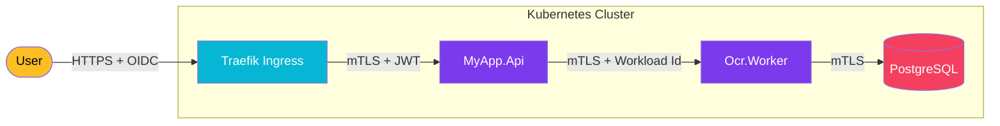

import Callout from '@components/Callout.astro';
import ImplementationNote from '@components/ImplementationNote.astro';
import CodeFile from '@components/CodeFile.astro';
import ExternalCite from '@components/ExternalCite.astro';

## Introduction

When I first set up my homelab Kubernetes cluster, every service could talk to every other service freely. A compromised pod could reach the database, the secret store, anything. That realization kept me up at night. Zero Trust was the answer—but implementing it in a homelab context, without a dedicated security team or enterprise tooling, required some creative problem-solving.

In traditional perimeter-based security, once a service is inside the cluster, it's often trusted by default. This "hard shell, soft center" approach is insufficient for modern distributed systems. **Zero Trust** flips this model: "Never Trust, Always Verify." Every request, whether from outside or inside the cluster, must be authenticated, authorized, and encrypted. <ExternalCite title="NIST SP 800-207: Zero Trust Architecture" url="https://csrc.nist.gov/pubs/sp/800/207/final" author="NIST" date="2020" />

**Why Zero Trust Matters:**

- **Defense in Depth**: Prevents lateral movement if a single container is compromised.
- **Identity-Aware**: Access is based on *who* needs access (service or user), not network location (IP address).
- **Compliance**: Meets strict regulatory requirements for encryption in transit and access auditing.

### What We'll Build

In this guide, we will implement a comprehensive Zero Trust architecture for our platform. You will learn how to:

1. **Enforce mTLS**: Use Linkerd Service Mesh to transparently encrypt all traffic between microservices.
2. **Propagate Identity**: Pass OIDC tokens from the Gateway (Traefik/Authelia) down to deep internal services.
3. **Workload Identity**: Map Kubernetes ServiceAccounts to identities to restrict which services can talk to each other.

## Architecture Overview

We utilize a multi-layered security model. Linkerd handles the transport security (mTLS), while our application logic handles user identity via JWTs.


```mermaid
flowchart LR
    %% Styles
    classDef primary fill:#7c3aed,color:#fff
    classDef secondary fill:#06b6d4,color:#fff
    classDef db fill:#f43f5e,color:#fff
    classDef warning fill:#fbbf24,color:#000

    User([User]) -->|HTTPS + OIDC| Ingress[Traefik Ingress]
    Ingress -->|mTLS + JWT| API[MyApp.Api]
    
    subgraph Cluster [Kubernetes Cluster]
        direction TB
        Ingress
        API
        Worker[Ocr.Worker]
        DB[(PostgreSQL)]
        
        API -->|mTLS + Workload Id| Worker
        Worker -->|mTLS| DB
    end

    class API,Worker primary
    class Ingress secondary
    class User warning
    class DB db
```

## Section 1: Mutual TLS (mTLS) with Linkerd

The foundation of our Zero Trust architecture is encryption in transit. Managing certificates manually for every microservice is operationally impossible. We use **Linkerd**, a lightweight service mesh, to handle this automatically. <ExternalCite title="Linkerd Documentation - Automatic mTLS" url="https://linkerd.io/2/features/automatic-mtls/" author="Buoyant, Inc." date="2024" />

<Callout type="info" title="Why Linkerd?">
    We chose Linkerd over Istio for its simplicity and performance ("sidecar-less" options or ultra-light sidecars). It rotates certificates every 24 hours automatically.
</Callout>

### Installation & meshing

First, we ensure Linkerd is installed and verify the trust anchor.

```bash
linkerd check --pre
linkerd install | kubectl apply -f -
linkerd check
```

To enable mTLS for our `myapp-api`, we simply add the annotation to our Deployment or Namespace. Evey pod then gets a proxy sidecar injected.

```yaml
# deployment.yaml
apiVersion: apps/v1
kind: Deployment
metadata:
  name: myapp-api
  namespace: data-layer
  annotations:
    linkerd.io/inject: enabled
spec:
  # ... standard spec
```

Once applied, `linkerd tap` reveals that traffic is effectively `tls=true`.

<ImplementationNote>
The trickiest part of enabling Linkerd's automatic mTLS was the health probe exception. Kubernetes liveness and readiness probes come from the kubelet, which doesn't participate in the mesh—so they can't use mTLS. I had to add explicit `ServerAuthorization` policies that allow unauthenticated traffic only on the health check paths (`/healthz`, `/ready`). Getting this wrong meant pods would fail health checks and enter CrashLoopBackOff, which was a confusing debugging experience the first time it happened.
</ImplementationNote>

## Section 2: Identity Propagation (OIDC)

Encryption secures the *channel*, but who is the *caller*? We need to propagate the User's Identity (from Authelia) through the entire call chain. <ExternalCite title="OpenID Connect Core 1.0 Specification" url="https://openid.net/specs/openid-connect-core-1_0.html" author="OpenID Foundation" date="2014" />

When a request hits `MyApp.Api`, it contains an `Authorization: Bearer <token>` header. If `MyApp.Api` needs to call `Qdrant` or another internal service on behalf of that user, it must forward this context.

### .NET Implementation

We use a custom `DelegatingHandler` in our HTTP clients to forward the token automatically.

<ImplementationNote title="Token Forwarding">
    Never blindly forward headers. Ensure you only forward tokens to trusted internal downstream services to avoid leaking credentials.
</ImplementationNote>

```csharp
// TokenPropagationHandler.cs
public class TokenPropagationHandler : DelegatingHandler
{
    private readonly IHttpContextAccessor _contextAccessor;

    public TokenPropagationHandler(IHttpContextAccessor contextAccessor)
    {
        _contextAccessor = contextAccessor;
    }

    protected override async Task<HttpResponseMessage> SendAsync(
        HttpRequestMessage request, CancellationToken cancellationToken)
    {
        var context = _contextAccessor.HttpContext;
        if (context != null)
        {
            var token = await context.GetTokenAsync("access_token");
            if (!string.IsNullOrEmpty(token))
            {
                request.Headers.Authorization = 
                    new AuthenticationHeaderValue("Bearer", token);
            }
        }
        return await base.SendAsync(request, cancellationToken);
    }
}
```

<ImplementationNote>
When I first implemented token forwarding between services, I made the mistake of passing the user's access token directly from the API to the Workers via NATS event payloads. This seemed convenient until tokens started expiring mid-pipeline—a document that took 30 seconds to process would fail at the embedding stage because the token was only valid for 15 minutes. The fix was to embed the BlueRobinId (our immutable internal identity) in event payloads instead, and have each service authenticate with its own service account credentials.
</ImplementationNote>

## Section 3: Workload Identity & Policies

Finally, we restrict *which* services can talk to each other. Just because they are encrypted doesn't mean the `Ocr.Worker` should be allowed to call the `Billing.Service`.

We use Kubernetes `NetworkPolicy` for coarse-grained control and Linkerd `ServerAuthorization` for fine-grained identity control. <ExternalCite title="Kubernetes Network Policies Documentation" url="https://kubernetes.io/docs/concepts/services-networking/network-policies/" author="The Kubernetes Authors" date="2024" /> <ExternalCite title="OWASP API Security Top 10" url="https://owasp.org/www-project-api-security/" author="OWASP Foundation" date="2023" />

```yaml
apiVersion: policy.linkerd.io/v1beta1
kind: ServerAuthorization
metadata:
  name: api-can-call-worker
  namespace: data-layer
spec:
  server:
    name: ocr-worker
  client:
    meshTLS:
      serviceAccounts:
        - name: myapp-api
```

This policy explicitly states: "Only the `myapp-api` ServiceAccount is allowed to communicate with the `ocr-worker`. All other connection attempts are rejected." <ExternalCite title="BeyondCorp: A New Approach to Enterprise Security" url="https://research.google/pubs/beyondcorp-a-new-approach-to-enterprise-security/" author="Google" date="2014" />

## Conclusion

By layering **Linkerd** for transport security, **OIDC** for user identity, and **ServerAuthorization** for service restriction, we have achieved a robust Zero Trust environment. We no longer rely on the network perimeter; security is intrinsic to the application infrastructure.

Looking back, the biggest lesson was that Zero Trust is not a product you install—it is a mindset you adopt incrementally. Each layer we added (mTLS, identity propagation, workload policies) caught classes of issues the previous layer did not address. The homelab context forced us to keep things simple and well-understood, which turned out to be an advantage: every policy exists because we wrote it, debugged it, and can explain exactly what it does.

### Next Steps
- [Securing the Homelab: VLANS, Firewalls, and Hardening](/securing-homelab-subnetting-firewall-hardening)
- [Secure Service Exposure with Cloudflare Tunnel](/cloudflare-tunnel-secure-service-exposure)

## Further Reading

<ExternalCite title="The Security Design Principles of Linkerd" url="https://linkerd.io/2020/12/03/the-security-principles-of-linkerd/" author="William Morgan" date="2020" />

<ExternalCite title="RFC 6749 - The OAuth 2.0 Authorization Framework" url="https://datatracker.ietf.org/doc/html/rfc6749" author="IETF" date="2012" />
