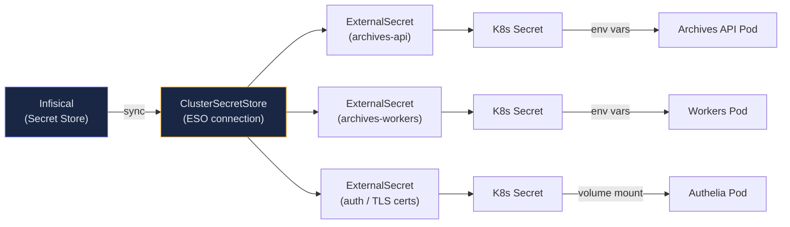

import Callout from '@components/Callout.astro';
import ImplementationNote from '@components/ImplementationNote.astro';
import ExternalCite from '@components/ExternalCite.astro';

**Infisical** is an open-source secret management platform that provides a central location for storing, syncing, and managing secrets across your infrastructure. This recipe shows how to integrate Infisical with Kubernetes using External Secrets Operator.

<Callout type="info">
This recipe keeps a `dev` / `staging` / `prod` layout as a generic teaching example—a multi-environment split is a perfectly valid pattern to learn. BlueRobin itself now runs **prod-only in-cluster with development on a laptop** (ADR-034), so its real Infisical project no longer has a `staging` environment.
</Callout>



## Prerequisites

- Infisical account (cloud or self-hosted)
- Kubernetes cluster with External Secrets Operator installed
- kubectl access to your cluster

## Step 1: Create an Infisical Project

1. Log into Infisical (https://app.infisical.com)
2. Create a new project named `my-project`
3. Note the **Project ID** from Settings → Project ID

## Step 2: Configure Environments

Create environments matching your deployment stages:

1. Navigate to **Settings → Environments**
2. Create:
   - `dev` — Development environment
   - `staging` — Staging environment  
   - `prod` — Production environment

## Step 3: Add Secrets

Add your application secrets to each environment:

```
APP_DB_PASSWORD=your-secure-password
NATS_PASSWORD=another-secure-password
MINIO_ACCESS_KEY=minio-access-key
MINIO_SECRET_KEY=minio-secret-key
OIDC_CLIENT_SECRET=authelia-client-secret
ENCRYPTION_KEY=32-byte-base64-encoded-key
```

<Callout type="warning">
Never commit secrets to Git. Use Infisical CLI or MCP tools to manage secrets.
</Callout>

## Step 4: Create Machine Identity

For Kubernetes integration, create a machine identity:

<ExternalCite title="Infisical Universal Auth" url="https://infisical.com/docs/documentation/platform/identities/universal-auth" author="Infisical" date="2024" />

1. Navigate to **Access Control → Machine Identities**
2. Click **Create Machine Identity**
3. Name it `k8s-external-secrets`
4. Select **Universal Auth** method
5. Generate credentials and save:
   - **Client ID**
   - **Client Secret**

Grant access to your project:

1. Go to **Project Settings → Access Control**
2. Add the machine identity
3. Grant **Read** access to all environments

## Step 5: Install External Secrets Operator

<ExternalCite title="External Secrets Operator" url="https://external-secrets.io/latest/" author="External Secrets" date="2024" />

If not already installed:

```bash
helm repo add external-secrets https://charts.external-secrets.io
helm repo update

helm install external-secrets external-secrets/external-secrets \
  -n external-secrets \
  --create-namespace \
  --set installCRDs=true
```

## Step 6: Create Kubernetes Credentials Secret

Store the machine identity credentials in your cluster:

```yaml
# infrastructure/secrets/infisical-credentials.yaml
apiVersion: v1
kind: Secret
metadata:
  name: infisical-credentials
  namespace: external-secrets
type: Opaque
stringData:
  clientId: "your-client-id"
  clientSecret: "your-client-secret"
```

<ImplementationNote>
In production, bootstrap this secret manually or via sealed-secrets to avoid storing credentials in Git.
</ImplementationNote>

Apply with:

```bash
kubectl apply -f infrastructure/secrets/infisical-credentials.yaml
```

## Step 7: Configure ClusterSecretStore

Create a cluster-wide secret store for Infisical:

```yaml
# infrastructure/secrets/infisical-store.yaml
apiVersion: external-secrets.io/v1beta1
kind: ClusterSecretStore
metadata:
  name: infisical-store
spec:
  provider:
    infisical:
      host: https://app.infisical.com
      auth:
        universalAuth:
          credentialsRef:
            clientId:
              key: clientId
              name: infisical-credentials
              namespace: external-secrets
            clientSecret:
              key: clientSecret
              name: infisical-credentials
              namespace: external-secrets
```

Apply:

```bash
kubectl apply -f infrastructure/secrets/infisical-store.yaml
```

Verify:

```bash
kubectl get clustersecretstore infisical-store
# Should show: STATUS: Valid
```

## Step 8: Create ExternalSecrets

Define which secrets to sync from Infisical:

```yaml
# apps/myapp-api/staging/external-secret.yaml
apiVersion: external-secrets.io/v1beta1
kind: ExternalSecret
metadata:
  name: archives-secrets
  namespace: myapp-staging
spec:
  refreshInterval: 5m
  secretStoreRef:
    kind: ClusterSecretStore
    name: infisical-store
  target:
    name: archives-secrets
    creationPolicy: Owner
  data:
    # Map Infisical secrets to Kubernetes secret keys
    - secretKey: DATABASE_PASSWORD
      remoteRef:
        key: APP_DB_PASSWORD
        property: value
        conversionStrategy: Default
        decodingStrategy: None
        metadataPolicy: None
      sourceRef:
        storeRef:
          kind: ClusterSecretStore
          name: infisical-store
        generatorRef: null
    
    - secretKey: NATS_PASSWORD
      remoteRef:
        key: NATS_PASSWORD
        property: value
    
    - secretKey: MINIO_ACCESS_KEY
      remoteRef:
        key: MINIO_ACCESS_KEY
        property: value
    
    - secretKey: MINIO_SECRET_KEY
      remoteRef:
        key: MINIO_SECRET_KEY
        property: value
    
    - secretKey: OIDC_CLIENT_SECRET
      remoteRef:
        key: WEB_STAGING_OIDC_SECRET
        property: value

  # Specify Infisical project and environment
  dataFrom: []
```

<ImplementationNote>
The `remoteRef.key` is the secret name in Infisical. The `secretKey` is the key name in the resulting Kubernetes secret.
</ImplementationNote>

### Environment-Specific Configuration

For different environments, create separate ExternalSecrets pointing to different Infisical environments:

```yaml
# apps/myapp-api/production/external-secret.yaml
apiVersion: external-secrets.io/v1beta1
kind: ExternalSecret
metadata:
  name: archives-secrets
  namespace: myapp-prod
spec:
  refreshInterval: 10m  # Less frequent in production
  secretStoreRef:
    kind: ClusterSecretStore
    name: infisical-store
  target:
    name: archives-secrets
  data:
    - secretKey: DATABASE_PASSWORD
      remoteRef:
        key: APP_DB_PASSWORD
        property: value
    # ... other secrets
```

## Step 9: Use Secrets in Deployments

Reference the synced secret in your deployment:

```yaml
# apps/myapp-api/base/deployment.yaml
apiVersion: apps/v1
kind: Deployment
metadata:
  name: myapp-api
spec:
  template:
    spec:
      containers:
        - name: api
          envFrom:
            - secretRef:
                name: archives-secrets
          env:
            # Or reference individual keys
            - name: ConnectionStrings__AppDb
              value: "Host=postgres.data-layer;Port=5432;Database=myapp_staging;Username=myapp_staging;Password=$(DATABASE_PASSWORD)"
```

## Step 10: Verify Sync

Check that secrets are syncing correctly:

```bash
# Check ExternalSecret status
kubectl get externalsecret -n myapp-staging
# NAME              STORE            REFRESH INTERVAL   STATUS
# archives-secrets  infisical-store  5m                 SecretSynced

# Verify the Kubernetes secret was created
kubectl get secret archives-secrets -n myapp-staging -o yaml

# Check for sync errors
kubectl describe externalsecret archives-secrets -n myapp-staging
```

## Local Development Setup

For local development, use the Infisical CLI:

### Install CLI

```bash
# macOS
brew install infisical/get-cli/infisical

# Or via npm
npm install -g @infisical/cli
```

### Authenticate

```bash
infisical login
```

### Run with Secrets

```bash
# Run a command with secrets injected as environment variables
infisical run --env=dev -- dotnet run --project src/MyApp.Api

# Or generate a .env file
infisical export --env=dev > .env.local
```

### Development Script

Create a helper script:

```bash
#!/bin/bash
# scripts/generate-env.sh

set -e

echo "🔐 Generating .env.local from Infisical (dev environment)..."

# Export secrets to .env format
infisical export --env=dev --format=dotenv > .env.local

# Add local-specific overrides
cat >> .env.local << EOF

# Local Development Overrides
DATABASE_HOST=192.168.0.6
DATABASE_PORT=30432
NATS_URL=nats://192.168.0.6:30422
MINIO_ENDPOINT=192.168.0.6:30900
EOF

echo "✅ .env.local generated successfully"
```

## Rotating Secrets

To rotate a secret:

1. Update the value in Infisical
2. Wait for refresh interval (or force sync)
3. Restart pods to pick up new values

Force immediate sync:

```bash
# Annotate to trigger refresh
kubectl annotate externalsecret archives-secrets \
  -n myapp-staging \
  force-sync=$(date +%s) --overwrite
```

Restart pods:

```bash
kubectl rollout restart deployment/myapp-api -n myapp-staging
```

## Troubleshooting

### Secret Not Syncing

```bash
# Check ExternalSecret events
kubectl describe externalsecret archives-secrets -n myapp-staging

# Check External Secrets Operator logs
kubectl logs -n external-secrets deploy/external-secrets -f
```

### Authentication Errors

```bash
# Verify credentials secret exists
kubectl get secret infisical-credentials -n external-secrets

# Check ClusterSecretStore status
kubectl describe clustersecretstore infisical-store
```

### Common Issues

| Issue | Solution |
|-------|----------|
| `SecretSyncedError` | Check Infisical permissions for machine identity |
| `InvalidProviderConfig` | Verify ClusterSecretStore YAML syntax |
| Secret key mismatch | Ensure `remoteRef.key` matches Infisical secret name exactly |
| Rate limiting | Increase `refreshInterval` to reduce API calls |

## Security Best Practices

1. **Least privilege**: Grant machine identities only the permissions they need
2. **Rotate credentials**: Rotate machine identity credentials periodically
3. **Audit access**: Review Infisical audit logs regularly
4. **Encrypt at rest**: Enable Infisical's encryption features
5. **Network policies**: Restrict which pods can access the secrets

```yaml
# Example NetworkPolicy for secrets access
apiVersion: networking.k8s.io/v1
kind: NetworkPolicy
metadata:
  name: allow-secrets-access
  namespace: myapp-staging
spec:
  podSelector:
    matchLabels:
      app: myapp-api
  policyTypes:
    - Egress
  egress:
    - to:
        - namespaceSelector:
            matchLabels:
              name: external-secrets
```

## Summary

You now have:

✅ Infisical project with multi-environment secrets  
✅ Machine identity for Kubernetes authentication  
✅ ClusterSecretStore connecting to Infisical  
✅ ExternalSecrets syncing to Kubernetes Secrets  
✅ Applications consuming secrets via environment variables  
✅ Local development setup with Infisical CLI

This approach keeps secrets out of Git while providing a central, auditable location for secret management.

The biggest lesson from integrating Infisical into our cluster was that secret rotation is the hard part, not initial deployment. Setting up the ClusterSecretStore took an afternoon; building confidence in automated rotation took weeks of testing. Start with long-lived secrets and add rotation gradually once your ExternalSecret sync is bulletproof.

### Next Steps

- **[External Secrets with Infisical in Kubernetes](/blog/external-secrets-infisical-kubernetes)** -- advanced patterns for multi-namespace secret distribution.
- **[GitOps with Flux CD](/blog/gitops-flux-cd-introduction)** -- how secrets fit into the broader GitOps deployment model.
- **[Zero Trust Architecture](/blog/zero-trust-architecture-mtls-tokens-identity)** -- the security model that makes secret management critical.

### Further Reading

<ExternalCite
  title="Infisical Documentation"
  url="https://infisical.com/docs"
  author="Infisical"
  date="2024"
/>

<ExternalCite
  title="External Secrets Operator Documentation"
  url="https://external-secrets.io/latest/"
  author="External Secrets Community"
  date="2024"
/>

<ExternalCite
  title="Kubernetes Secrets Best Practices"
  url="https://kubernetes.io/docs/concepts/configuration/secret/#best-practices"
  author="Kubernetes Authors"
  date="2024"
/>
