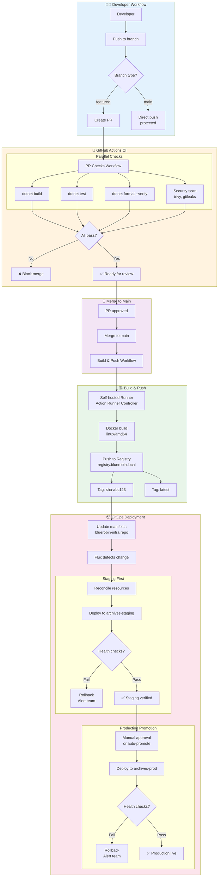
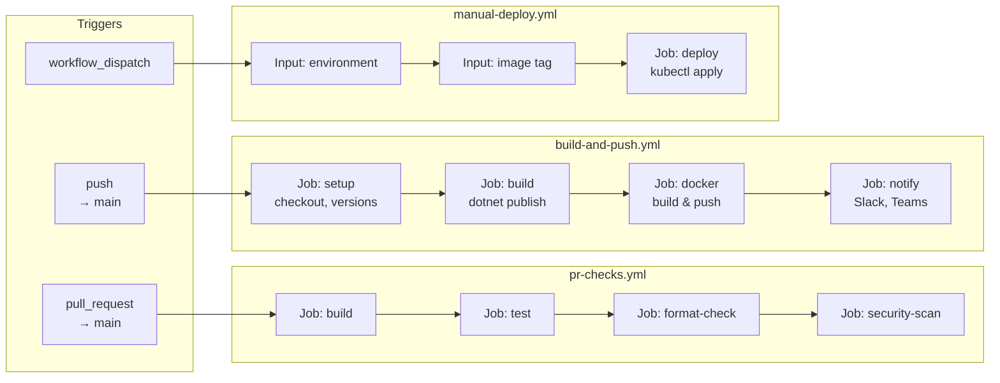
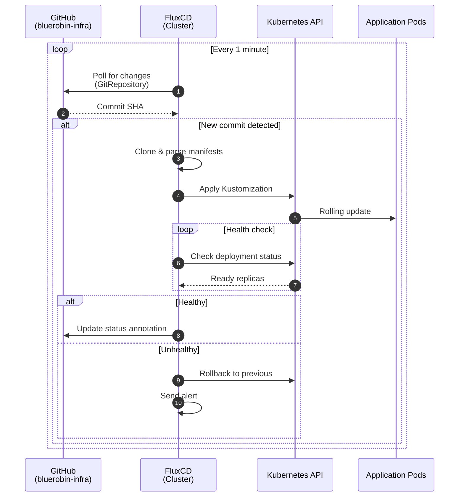
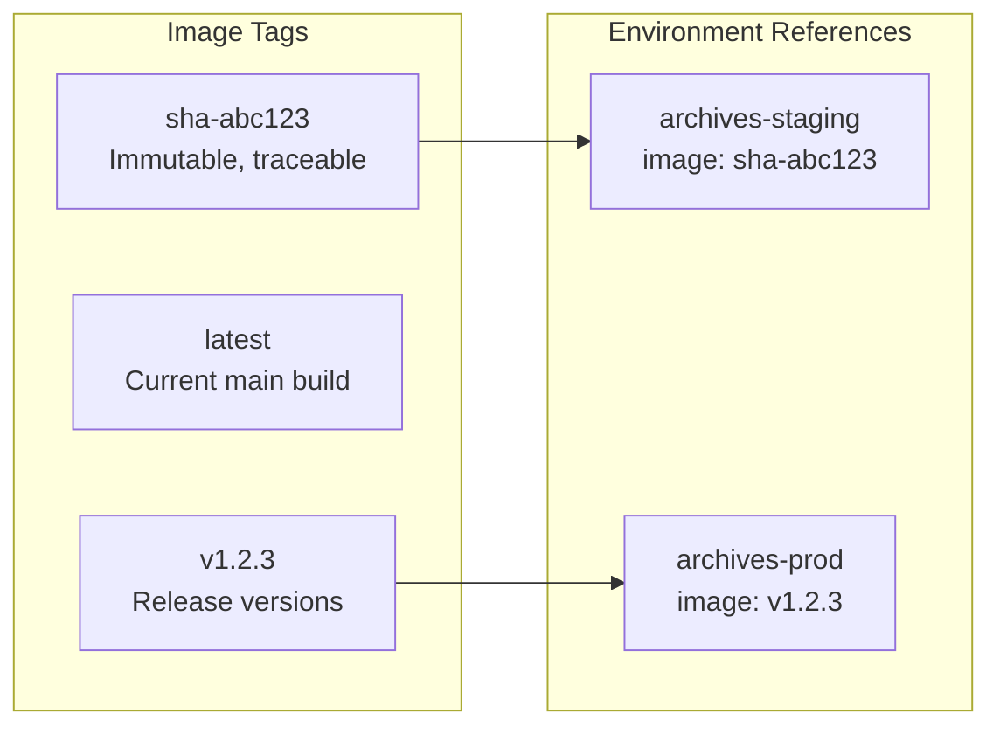
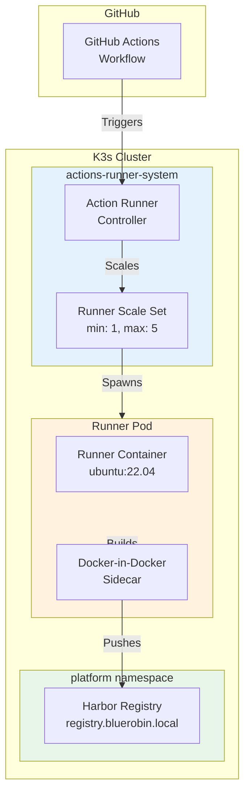

# CI/CD Pipeline

This diagram illustrates the GitOps-based CI/CD pipeline in BlueRobin, using GitHub Actions for CI and FluxCD for continuous deployment.

## Pipeline Overview



## GitHub Actions Workflow Detail



## FluxCD Reconciliation



## Image Tag Strategy



## Self-Hosted Runner Architecture



## Deployment Manifest Structure

```
bluerobin-infra/
├── apps/
│   ├── archives-api/
│   │   ├── base/
│   │   │   ├── deployment.yaml
│   │   │   ├── service.yaml
│   │   │   └── kustomization.yaml
│   │   └── overlays/
│   │       ├── staging/
│   │       │   └── kustomization.yaml  # image: sha-xxx
│   │       └── production/
│   │           └── kustomization.yaml  # image: v1.x.x
│   ├── archives-web/
│   └── archives-workers/
├── clusters/
│   └── bluerobin/
│       ├── flux-system/        # Flux bootstrap
│       └── apps.yaml           # Kustomization refs
└── infrastructure/
    └── data-layer/             # Shared infra
```

## Pipeline Metrics

| Metric | Target | Current |
|--------|--------|---------|
| PR Check Time | < 5 min | ~3 min |
| Build Time | < 10 min | ~7 min |
| Deploy to Staging | < 2 min | ~1 min |
| Rollback Time | < 1 min | ~30 sec |
| MTTR (Mean Time to Recovery) | < 15 min | ~10 min |
