# CI/CD Pipeline

This diagram illustrates the GitOps-based CI/CD pipeline in BlueRobin, using GitHub Actions for CI and FluxCD for continuous deployment.

## Pipeline Overview

```mermaid
flowchart TB
    subgraph Developer["👨‍💻 Developer Workflow"]
        A[Developer] --> B[Push to branch]
        B --> C{Branch type?}
        C -->|feature/*| D[Create PR]
        C -->|main| E[Direct push<br/>protected]
    end

    subgraph CI["🔄 GitHub Actions CI"]
        D --> F[PR Checks Workflow]
        
        subgraph Checks["Parallel Checks"]
            F --> G[dotnet build]
            F --> H[dotnet test]
            F --> I[dotnet format --verify]
            F --> J[Security scan<br/>trivy, gitleaks]
        end
        
        G & H & I & J --> K{All pass?}
        K -->|No| L[❌ Block merge]
        K -->|Yes| M[✅ Ready for review]
    end

    subgraph Merge["🔀 Merge to Main"]
        M --> N[PR approved]
        N --> O[Merge to main]
        O --> P[Build & Push Workflow]
    end

    subgraph Build["🏗️ Build & Push"]
        P --> Q[Self-hosted Runner<br/>Action Runner Controller]
        Q --> R[Docker build<br/>linux/amd64]
        R --> S[Push to Registry<br/>registry.bluerobin.local]
        S --> T[Tag: sha-abc123]
        S --> U[Tag: latest]
    end

    subgraph GitOps["📦 GitOps Deployment"]
        T --> V[Update manifests<br/>bluerobin-infra repo]
        V --> W[Flux detects change]
        W --> X[Reconcile resources]
        
        subgraph Staging["Staging First"]
            X --> Y[Deploy to archives-staging]
            Y --> Z{Health checks?}
            Z -->|Fail| AA[Rollback<br/>Alert team]
            Z -->|Pass| AB[✅ Staging verified]
        end
        
        subgraph Production["Production Promotion"]
            AB --> AC[Manual approval<br/>or auto-promote]
            AC --> AD[Deploy to archives-prod]
            AD --> AE{Health checks?}
            AE -->|Fail| AF[Rollback<br/>Alert team]
            AE -->|Pass| AG[✅ Production live]
        end
    end

    style Developer fill:#e3f2fd
    style CI fill:#fff3e0
    style Merge fill:#f3e5f5
    style Build fill:#e8f5e9
    style GitOps fill:#fce4ec
```



## GitHub Actions Workflow Detail

```mermaid
flowchart LR
    subgraph Trigger["Triggers"]
        PR["pull_request<br/>→ main"]
        Push["push<br/>→ main"]
        Manual["workflow_dispatch"]
    end

    subgraph PRWorkflow["pr-checks.yml"]
        direction TB
        PR --> Build1["Job: build"]
        Build1 --> Test1["Job: test"]
        Test1 --> Format1["Job: format-check"]
        Format1 --> Security1["Job: security-scan"]
    end

    subgraph BuildWorkflow["build-and-push.yml"]
        direction TB
        Push --> Setup["Job: setup<br/>checkout, versions"]
        Setup --> BuildApp["Job: build<br/>dotnet publish"]
        BuildApp --> Docker["Job: docker<br/>build & push"]
        Docker --> Notify["Job: notify<br/>Slack, Teams"]
    end

    subgraph ManualWorkflow["manual-deploy.yml"]
        direction TB
        Manual --> SelectEnv["Input: environment"]
        SelectEnv --> SelectTag["Input: image tag"]
        SelectTag --> Deploy["Job: deploy<br/>kubectl apply"]
    end
```



## FluxCD Reconciliation


## Image Tag Strategy


## Self-Hosted Runner Architecture


## Deployment Manifest Structure

```
bluerobin-infra/
├── apps/
│   ├── archives-api/
│   │   ├── base/
│   │   │   ├── deployment.yaml
│   │   │   ├── service.yaml
│   │   │   └── kustomization.yaml
│   │   └── overlays/
│   │       ├── staging/
│   │       │   └── kustomization.yaml  # image: sha-xxx
│   │       └── production/
│   │           └── kustomization.yaml  # image: v1.x.x
│   ├── archives-web/
│   └── archives-workers/
├── clusters/
│   └── bluerobin/
│       ├── flux-system/        # Flux bootstrap
│       └── apps.yaml           # Kustomization refs
└── infrastructure/
    └── data-layer/             # Shared infra
```

## Pipeline Metrics

| Metric | Target | Current |
|--------|--------|---------|
| PR Check Time | < 5 min | ~3 min |
| Build Time | < 10 min | ~7 min |
| Deploy to Staging | < 2 min | ~1 min |
| Rollback Time | < 1 min | ~30 sec |
| MTTR (Mean Time to Recovery) | < 15 min | ~10 min |
