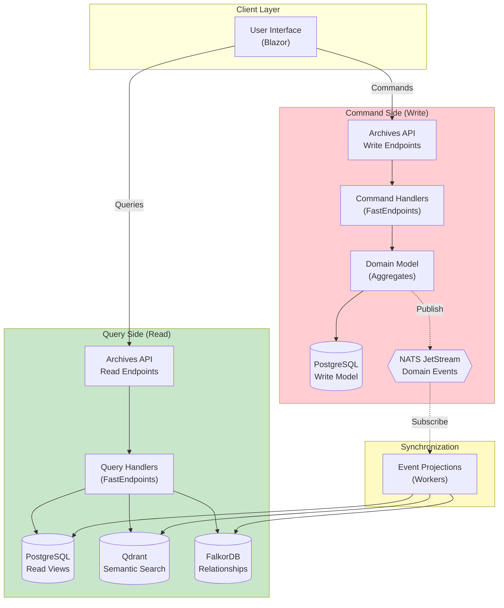
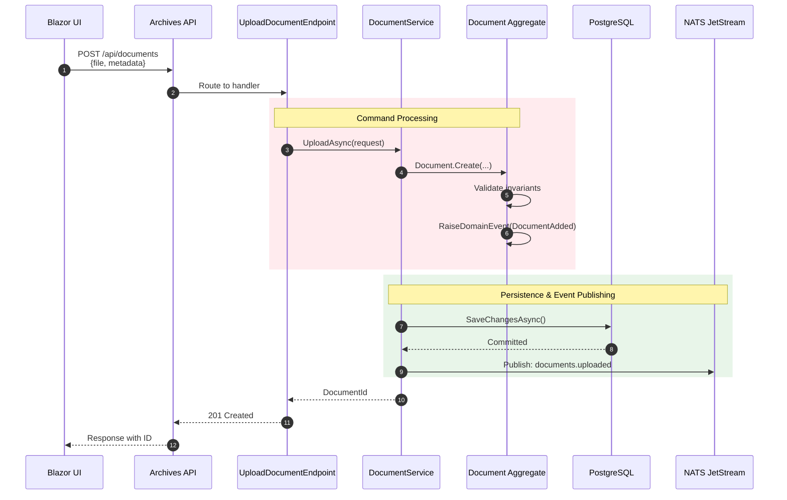
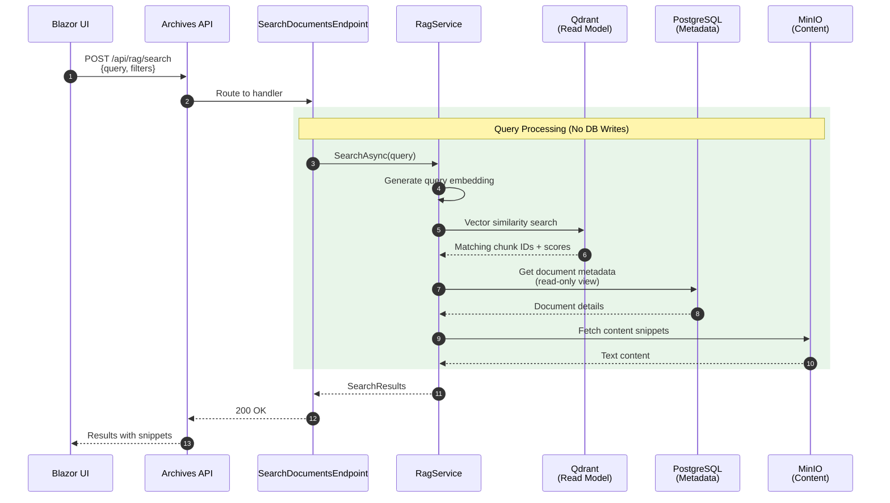
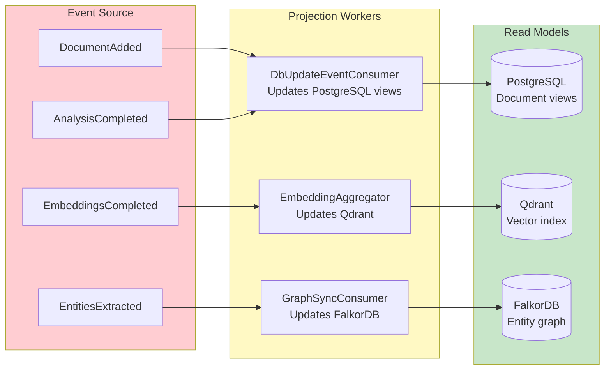
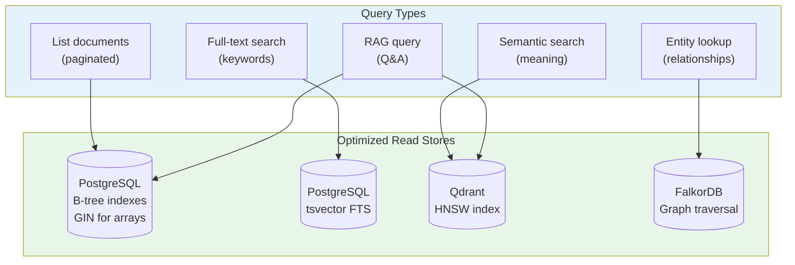

# CQRS Pattern Implementation

This diagram shows how BlueRobin implements the CQRS (Command Query Responsibility Segregation) pattern, separating write operations from read-optimized queries.

## CQRS Overview



## Command Flow Detail



## Query Flow Detail



## Event Projection Pipeline



## Read Model Optimization



## CQRS Benefits in BlueRobin

| Benefit | Implementation | Impact |
|---------|---------------|--------|
| **Scalability** | Separate read/write DBs | Scale reads independently |
| **Performance** | Denormalized views | Fast queries, no joins |
| **Flexibility** | Multiple read models | Qdrant + FalkorDB + PG |
| **Consistency** | Eventual via events | Acceptable for search |
| **Auditability** | Event log in NATS | Full history available |

## Commands vs Queries

```mermaid
mindmap
  root((CQRS))
    Commands
      POST /api/documents
        Upload file
        Create metadata
        Publish event
      PUT /api/documents/{id}
        Update analysis
        Update status
      DELETE /api/documents/{id}
        Mark deleted
        Publish event
    Queries
      GET /api/documents
        List with filters
        Paginated results
      POST /api/rag/search
        Vector similarity
        Score ranking
      POST /api/rag/ask
        Context retrieval
        LLM generation
      GET /api/graph/entities
        Graph traversal
        Relationship lookup
```

## Consistency Model

| Operation | Consistency | Latency | Use Case |
|-----------|-------------|---------|----------|
| **Create document** | Strong | ~100ms | Write to PG |
| **Update metadata** | Strong | ~50ms | Write to PG |
| **Search by keyword** | Eventual | ~200ms | PG FTS index |
| **Semantic search** | Eventual | ~500ms | Qdrant after embedding |
| **Graph query** | Eventual | ~300ms | FalkorDB after sync |
| **RAG response** | Eventual | ~2s | Full pipeline |
